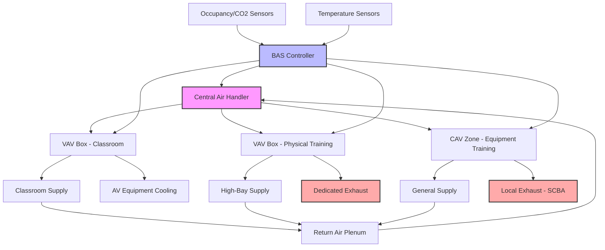

Учебные помещения пожарных станций требуют специализированных систем HVAC, обеспечивающих разнообразные виды деятельности — от аудиторного обучения до интенсивной физической подготовки. Эти помещения должны обеспечивать надлежащие условия окружающей среды для каждого типа обучения при эффективной интеграции с общей системой вентиляции и кондиционирования пожарной станции.

## Требования к кондиционированию учебных классов

Учебные классы в пожарных станциях требуют условий окружающей среды, поддерживающих обучение и концентрацию внимания во время продолжительных учебных периодов. Расчетная охлаждающая нагрузка обычно составляет 88-133 кДж/ч на одного человека, учитывая теплогенерацию от аудиовизуального оборудования, освещения и высокой плотности присутствия.

Регулирование температуры должно поддерживать 20-22°C в отопительный сезон и 23-24°C в охлаждающий сезон с возможностью регулировки уставок для учета предпочтений преподавателя. Относительная влажность должна оставаться в диапазоне 30-50% для обеспечения комфорта и сохранения учебных материалов, книг и электронного оборудования.

Скорость вентиляции соответствует требованиям ASHRAE Standard 62.1 для образовательных учреждений с расчетом наружного воздуха:

$$V_{ot} = R_p \times P_z + R_a \times A_z$$

где $V_{ot}$ — общий расход наружного воздуха (м³/ч), $R_p$ — норма наружного воздуха на человека (1,4 м³/ч на человека для классов), $P_z$ — численность людей в зоне, $R_a$ — норма наружного воздуха на площадь (0,65 м³/(ч·м²)), $A_z$ — площадь пола в зоне.

Зональное регулирование температуры позволяет преподавателям регулировать условия независимо от других учебных зон. Отдельные термостаты с расписанием занятости/незанятости максимизируют энергоэффективность при закрытых классах.

## Вентиляция залов физической подготовки

Залы физической подготовки генерируют значительное количество тепла и влаги при проведении кардиотренировок, силовых упражнений и упражнений на выносливость. Эти помещения требуют мощных систем вентиляции, способных управлять скрытой и явной нагрузками, которые могут превышать 441 кДж/ч на одного человека в период пиковой активности.

Методика проектирования приоритизирует высокие скорости воздухообмена, обычно 8-12 воздухообменов в час при занятости, с возможностью снижения до 2-4 воздухообменов в час при отсутствии людей. Распределение приточного воздуха должно избегать прямого попадания на занимающихся физическими упражнениями при обеспечении эффективного перемешивания по всему помещению.

Вытяжная вентиляция должна устранять запахи и влагу. Отдельные вытяжные вентиляторы, работающие постоянно с минимальными расходами, предотвращают миграцию запахов в соседние помещения. Вентиляция с переменным расходом, использующая датчики CO₂ или присутствия, модулирует расход воздуха в зависимости от фактического использования:

$$V_{dcv} = V_{min} + (V_{max} - V_{min}) \times \frac{C_{measured} - C_{setpoint}}{C_{occupied} - C_{setpoint}}$$

где $V_{dcv}$ — расход воздуха при вентиляции с переменным расходом, $V_{min}$ и $V_{max}$ — минимальный и максимальный расчетные расходы, $C$ представляет концентрацию CO₂.

Уставки температуры в залах физической подготовки обычно ниже, чем в классах, поддерживаясь на уровне 18-20°C для компенсации теплогенерации при интенсивных упражнениях. Распределение воздуха с потолка или верхней части стены предотвращает помехи оборудованию и максимизирует полезную площадь пола.

## Требования для учебных зон оборудования

Учебные зоны оборудования, где пожарные практикуют работу с СИЗ, дыхательными аппаратами, инструментами и компонентами аппаратуры, требуют особых экологических соображений. Эти помещения часто имеют переменную занятость и теплогенерацию оборудования от зарядных станций, компрессоров и демонстрационного оборудования.

Проектирование вентиляции должно учитывать потенциальное выделение газов резиновыми компонентами, системами зарядки батарей и растворителями. Местная вытяжная вентиляция на станциях заполнения дыхательных аппаратов и в зонах технического обслуживания оборудования захватывает загрязнения в источнике. Общая разбавляющая вентиляция обеспечивает минимум 6-8 воздухообменов в час для поддержания приемлемого качества внутреннего воздуха.

Регулирование температуры и влажности сохраняет целостность оборудования и обеспечивает реалистичные условия обучения. Поддержание 15-27°C и 40-60% относительной влажности предотвращает деградацию резиновых прокладок, электронных компонентов и тканевых материалов хранящегося оборудования.

## Охлаждение аудиовизуального оборудования

Современные учебные центры пожарных станций включают обширные AV-системы с проекторами, дисплеями большого формата, оборудованием записи и компьютерными системами. Эти электронные устройства генерируют концентрированные тепловые нагрузки, требующие выделенных стратегий охлаждения.

Стойки оборудования и серверные комнаты получают преимущество от дополнительных систем охлаждения, независимых от кондиционирования помещения. Небольшие сплит-системы или отдельные агрегаты обработки воздуха поддерживают температуру в серверных комнатах на уровне 18-21°C независимо от условий в соседних помещениях. Минимальный расход воздуха в периоды отсутствия людей предотвращает перегрев оборудования.

Охлаждение проекторов и дисплеев интегрируется с проектированием HVAC помещения. Потолочные проекторы требуют достаточного зазора от приточных диффузоров для предотвращения накопления тепла и помех с шумом. Некоторые установки используют локальное охлаждение или отдельные вытяжные системы для высокомощного проекционного оборудования.

## Рассмотрение гибких многофункциональных помещений

Многие пожарные станции проектируют многофункциональные учебные зоны, служащие различным целям в течение недели. Одно помещение может служить местом проведения аудиторного обучения утром, физической подготовки днем и общественных встреч вечером.

Системы HVAC, обслуживающие гибкие помещения, должны обеспечивать быстрый тепловой переход между типами использования. Системы с переменным расходом воздуха и зональным управлением обеспечивают реактивность, требуемую для изменения схем занятости и уровней активности. Программируемые термостаты с несколькими вариантами расписания позволяют персоналу пожарной станции предварительно кондиционировать помещения перед переходом к другому использованию.

Мощность системы HVAC должна рассчитываться на наиболее высокие ожидаемые условия нагрузки при обеспечении эффективной работы при более легких нагрузках. Обычно это означает проектирование на сценарии физической подготовки с высокой плотностью при включении возможностей снижения производительности для конфигурации классов или встреч.

## Интеграция с системами вентиляции пожарной станции

Система HVAC учебного помещения интегрируется с более широкой системой управления микроклиматом станции при сохранении эксплуатационной независимости. Отдельные агрегаты обработки воздуха, обслуживающие учебные зоны, позволяют изолировать систему при техническом обслуживании или отказах оборудования без влияния на критические зоны хранения техники или жилые помещения.

Центральные системы автоматизации зданий координируют работу учебных зон с графиком работы всей станции, оптимизируя потребление энергии в периоды низкой активности при обеспечении готовности к запланированным учебным занятиям. Возможности ручного переопределения позволяют регулировать систему при внеплановых учебных мероприятиях, выходящих за рамки установленного расписания.

Стратегии зонирования отделяют зоны высокой вентиляции от административных и жилых помещений, предотвращая ненужное кондиционирование незанятых зон. Отдельные зональные регуляторы обеспечивают детальное управление температурой при централизованном оборудовании для масштабирования экономики в производстве тепла и холода.

## Схема потока систем вентиляции учебных зон

## Критерии проектирования по типам учебных помещений

| Тип помещения | Температура (°C) | Скорость вентиляции | Воздухообмен в час | Управление влажностью | Специальные требования |
|------------|-----------------|------------------|------------------|------------------|---------------------|
| Учебный класс | 20-23 | 1,4 м³/(ч·чел) + 0,65 м³/(ч·м²) | 4-6 воздухообменов/ч | 30-50% ОВ | Зональное управление, низкий шум (NC-30) |
| Физическая подготовка | 18-20 | минимум 5,7 м³/(ч·чел) | 8-12 воздухообменов/ч | 40-60% ОВ | Высокая вентиляция, управление по требованию |
| Учебная зона оборудования | 15-24 | минимум 6-8 воздухообменов/ч | 6-8 воздухообменов/ч | 40-60% ОВ | Локальная вытяжка на станциях заполнения |
| Многофункциональное помещение | 20-22 | Переменная в зависимости от использования | 6-10 воздухообменов/ч | 35-50% ОВ | Программируемое управление, быстрый отклик |
| Серверная/помещение AV | 18-21 | Удаление теплоты оборудования | 10-15 воздухообменов/ч | 40-55% ОВ | Независимое охлаждение, избыточность |
| Лаборатория симуляции | 18-24 | минимум 1,7 м³/(ч·м²) | 8-10 воздухообменов/ч | Контролируемая | Точное управление, удаление загрязнений |

## Передовые методы проектирования систем

Проектирование HVAC для учебных помещений должно приоритизировать операционную гибкость и энергоэффективность. Выбор модульного оборудования позволяет будущее расширение по мере развития программ обучения. Резервные компоненты в критических зонах обеспечивают непрерывность обучения при техническом обслуживании или отказе оборудования.

Системы рекуперации энергии вентиляции восстанавливают кондиционирующую энергию из потоков вытяжки учебных помещений, снижая нагрузки на отопление и охлаждение в периоды высокой вентиляции. Эти системы особенно экономически эффективны в залах физической подготовки с постоянными требованиями к высокому расходу воздуха.

Процессы наладки проверяют надлежащее распределение воздуха, правильность последовательности управления и интеграцию с системами автоматизации зданий. Функциональное тестирование производительности при различных сценариях обучения подтверждает соответствие системы замыслу проектирования во всем диапазоне эксплуатационных условий.

Надлежащее проектирование систем вентиляции учебных помещений создает среду, поддерживающую эффективное обучение пожарных при одновременном поддержании энергоэффективности и операционной надежности, необходимых для современных объектов пожарных станций.
