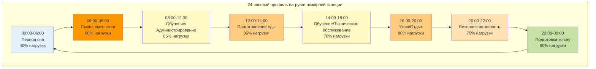

Пожарные и спасательные станции работают 24 часа в сутки, 365 дней в году, создавая уникальные вызовы для HVAC систем. В отличие от обычных зданий с предсказуемыми графиками заселения/отсутствия, пожарные станции поддерживают непрерывное укомплектование персоналом со сменяющимися сменами, приготовлением пищи, физической подготовкой и выездом в чрезвычайные ситуации. Это постоянное заселение в сочетании с высоко переменными профилями нагрузок требует специализированного подхода к проектированию систем.

## Выбор систем для непрерывной эксплуатации

HVAC системы для 24-часовой эксплуатации пожарной станции должны приоритизировать надёжность, резервирование и ремонтопригодность без снижения комфорта в любой период.

**Несколько блоков меньшей мощности или один крупный блок**

Развертывайте несколько блоков меньшей мощности, а не одну крупную систему. Зона жилых помещений, требующая 35,2 кВ охлаждения, должна использовать два блока по 17,6 кВ или три блока по 14,1 кВ, а не один блок на 35,2 кВ. Такой подход обеспечивает:

- Частичную работу при отказе оборудования
- Гибкое планирование технического обслуживания
- Лучшее соответствие нагрузке при частичной мощности
- Снижение риска отказа в одной точке

**Системы переменного расхода хладагента (VRF)**

Технология VRF превосходно подходит для 24-часовой эксплуатации пожарных станций благодаря встроенному резервированию и эффективности при частичных нагрузках. Отказ отдельного внутреннего блока не приводит к полной остановке системы. VRF системы с утилизацией тепла одновременно обеспечивают обогрев спальных помещений при охлаждении кухни и общей комнаты — обычное явление при ночной эксплуатации.

**Двухтопливные системы тепловых насосов**

Двухтопливные воздушные тепловые насосы с резервным ископаемым топливом оптимизируют экономику 24-часовой эксплуатации. Система работает в режиме теплового насоса при умеренных условиях для максимальной эффективности, автоматически переходя на газовое отопление при экстремальном холоде, когда эффективность теплового насоса падает ниже экономической целесообразности. Эта конфигурация обеспечивает непрерывную тепловую мощность независимо от внешних условий, минимизируя операционные затраты.

## Подбор оборудования для непрерывной работы

Традиционные методологии расчёта HVAC на основе пиковых условий проектирования оказываются неадекватны для объектов, никогда не входящих в режим сниженного питания.

**Анализ длительности нагрузки**

Вместо расчёта исключительно на пиковые условия проектирования анализируйте распределение нагрузки по времени. Пожарные станции большую часть эксплуатационных часов работают при 40–60 % пиковой нагрузки. Среднюю суточную нагрузку можно рассчитать:

$$Q_{avg} = \frac{1}{24} \sum_{h=1}^{24} Q_h$$

Где $Q_h$ обозначает почасовую нагрузку. Проектируйте системы для эффективной работы при этой средней нагрузке при сохранении мощности для пиков.

**Приоритет эффективности при частичной нагрузке**

Выбор оборудования должен приоритизировать метрики Integrated Energy Efficiency Ratio (IEER) и Integrated Part Load Value (IPLV) перед пиковыми показателями эффективности (EER, SEER). Пожарные станции работают на 100 % мощности менее 5 % в год. Блок с превосходной производительностью при частичной нагрузке обеспечивает существенно лучшую годовую энергетическую эффективность.

**Ступенчатое регулирование мощности**

Многоступенчатое или переменное оборудование позволяет точно соответствовать нагрузке в течение суток. Двухступенчатые компрессоры, модулирующие газовые клапаны и вентиляторы переменной скорости обеспечивают 3–4 различных уровня мощности, исключая потери эффективности, связанные с циклированием перегруженного оборудования.

## Энергетическая эффективность для объектов 24/7

Непрерывная эксплуатация усиливает финансовое воздействие решений по проектированию эффективности. Улучшение эффективности на 1 % экономит энергию 8 760 часов в год, а не 2 000–3 000 часов в обычных зданиях.

**Оптимизированные стратегии задания температуры**

Хотя истинное снижение температуры невозможно при 24-часовой эксплуатации, интеллектуальные стратегии задания температуры снижают нагрузки:

- Спальные помещения: 20°C отопление / 24°C охлаждение в периоды сна (22:00–06:00)
- Общая комната/кухня: 21°C отопление / 23°C охлаждение в периоды пиковой активности (06:00–22:00)
- Административные зоны: 20°C отопление / 26°C охлаждение ночью при отсутствии персонала

Эта стратегия дифференцированного задания температуры снижает средние нагрузки без ущерба комфорту в периоды эксплуатации.

**Вентиляция с рекуперацией тепла**

Пожарные станции требуют значительного расхода наружного воздуха для качества воздуха в помещениях в непрерывно заселённых помещениях. Вентиляторы рекуперации энергии (ERV) восстанавливают 70–80 % энергии отопления/охлаждения из вытяжного воздуха. Уравнение годовой экономии энергии:

$$E_{saved} = 1.08 \times CFM \times \Delta T \times hours \times \eta_{HRV}$$

Где $\eta_{HRV}$ обозначает эффективность рекуперации тепла (обычно 0,70–0,80). Для системы 500 CFM (849 м³/ч) с разностью температур 17°C в среднем, работающей 8 760 часов ежегодно при 75 % эффективности:

$$E_{saved} = 1.08 \times 500 \times 17 \times 8,760 \times 0.75 = 54,054,000 \text{ кДж/год}$$

## Переменные профили нагрузок в течение суток

Нагрузки пожарной станции проявляют резкие колебания в зависимости от деятельности смены, приготовления пищи, обучения и независимых от погоды закономерностей заселения.

**Вариации пиковой нагрузки**

Утренняя смена (06:00–08:00) и периоды приготовления пищи (12:00–14:00, 18:00–20:00) представляют пиковые нагрузки, часто достигающие 85–100 % проектной мощности. Ночные периоды сна падают до 40–50 % пиковой нагрузки. HVAC системы должны эффективно обрабатывать это изменение нагрузки в соотношении 2,5:1.

**Требования к времени отклика**

Пожарные станции не могут допустить 2–4 часовое время восстановления, типичное для стратегий сниженного питания. Системы должны постоянно поддерживать комфорт или восстанавливаться в течение 15–30 минут. Это требует увеличенных распределительных систем (воздуховодов, труб), которые минимизируют колебания температуры при переходе нагрузок.

## Проектные рассмотрения для непрерывной эксплуатации

| **Параметр проектирования** | **Обычное здание** | **24-часовая пожарная станция** | **Воздействие** |
|----------------------|----------------------|--------------------------|------------|
| Годовые эксплуатационные часы | 2 000–3 000 | 8 760 | 3–4× потребление энергии |
| Коэффициент разнообразия нагрузки | 0,60–0,75 | 0,85–0,95 | Более высокие одновременные нагрузки |
| Период снижения питания | 12–16 часов в сутки | Отсутствует | Нет экономии энергии восстановления |
| Часы частичной нагрузки | 40–50 % в год | 85–90 % в год | Эффективность при частичной нагрузке критична |
| Резервирование оборудования | N | N+1 или 2N | Нет допуска на отказ |
| Окна технического обслуживания | Неэксплуатируемые часы | Только плановые остановки | Сложное планирование |
| Требования вентиляции | Прерывистые | Непрерывные | Более высокие нагрузки вентиляции |
| Реагирование на пиковый спрос | Доступно | Ограничено | Невозможно ограничивать для комфорта |

## Проблемы планирования технического обслуживания

Непрерывная эксплуатация исключает удобные окна технического обслуживания, доступные в обычных зданиях. Все техническое обслуживание проводится в периоды заселения с нулевой терпимостью к нарушению комфорта.

**Резервирование N+1 для технического обслуживания**

Проектируйте все критические системы с резервированием N+1. Если две установки требуются для достижения пиковой нагрузки, установите три установки. Это позволяет полностью выключить одну установку для технического обслуживания без снижения мощности ниже пороговых значений комфорта. Дополнительная капитальная стоимость (обычно 15–25 %) окупается за счет избежания срочных вызовов обслуживания и продления срока службы оборудования благодаря надлежащему обслуживанию.

**Системы горячего резерва**

Поддерживайте резервное оборудование в режиме горячего резерва — питание включено, управление активно, готово к немедленной эксплуатации. Системы холодного резерва, требующие процедур запуска, создают неприемлемое нарушение комфорта при отказе основного оборудования или входе в техническое обслуживание. Системы горячего резерва принимают нагрузку в течение 30–60 секунд.

**Программы предиктивного технического обслуживания**

Внедрите комплексные программы предиктивного обслуживания с использованием вибрационного анализа, анализа масла, инфракрасной термографии и тенденций производительности. Предиктивные программы выявляют развивающиеся проблемы за 2–4 недели до отказа, обеспечивая гибкость в планировании технического обслуживания, чтобы координировать его в благоприятную погоду и периоды низкой активности (середина недели, середина дня, умеренные внешние условия).

## Резервирование для непрерывного комфорта

Резервирование HVAC пожарной станции выходит за пределы оборудования, включая управление, коммунальные услуги и распределительные системы.

**Двойные источники топлива**

Где возможно, предусмотрите двойную возможность топлива (природный газ + пропан, или электричество + природный газ). Это защищает от перебоев в подаче коммунальных услуг, одновременно позволяя переключение топлива на основе оптимизации стоимости.

**Распределённые против централизованных систем**

Распределённые системы (несколько пакетных установок или сплит-системы) по своей природе обеспечивают резервирование. Централизованные системы (установки холодильная/котельная) требуют спроектированного резервирования через несколько холодильников/котлов с независимыми контурами трубопроводов.

**Резервирование системы управления**

Критические компоненты управления требуют резервирования:
- Двойные термостаты с автоматическим переключением
- Резервные датчики температуры
- Резервное питание для цепей управления
- Ручное управление для всех автоматизированных функций

**Интеграция резервного питания**

Определите мощность резервного генератора для полной эксплуатации HVAC, а не только аварийного освещения и оборудования. Пожарный персонал должен отдыхать удобно между аварийными вызовами независимо от состояния сетевого питания. Расчёты мощности генератора должны включать пусковой ток в заблокированном роторе (LRA) для запуска оборудования:

$$kW_{required} = (HP_{HVAC} \times 0.746 \times 1.5) + kW_{other\\_loads}$$

Множитель 1,5 учитывает пусковой ток двигателя, превышающий рабочий ток.

## Операционные стратегии

**Предиктивное управление нагрузкой**

Интегрируйте прогноз погоды с системами автоматизации зданий для предварительного охлаждения или предварительного подогрева в периоды внесетевых тарифов на электроэнергию. 24-часовая эксплуатация пожарных станций позволяет смещать нагрузки по времени, чтобы минимизировать сборы за спрос без ущерба для комфорта.

**Изоляция зон**

Проектируйте независимые зоны для спальных помещений, общей комнаты, кухни, административных зон и бухт аппаратуры. Это позволяет целенаправленное кондиционирование заселённых зон при сохранении сниженных температур в временно незанятых зонах — единственная жизнеспособная стратегия снижения в 24-часовых объектах.

**Непрерывное комиссионирование**

Внедрите программы непрерывного комиссионирования, которые отслеживают производительность системы 24/7 и автоматически оптимизируют последовательности управления. Постоянно включённый характер пожарных станций обеспечивает обильные данные производительности для алгоритмов тенденций и оптимизации.

---

**Заключение**

Проектирование HVAC для 24-часовой эксплуатации пожарной станции требует фундаментальных отличий от обычных методологий проектирования. Выбор оборудования должен приоритизировать эффективность при частичной нагрузке, надёжность и ремонтопригодность перед пиковыми показателями производительности. Резервирование не является опциональным — оно необходимо для обеспечения непрерывности миссии. Значительные дополнительные капитальные инвестиции в надлежащим образом спроектированные системы непрерывной эксплуатации окупаются за счет снижения операционных затрат, исключения срочного ремонта в критические периоды и обеспечения длительного комфорта экипажа, поддерживающего готовность к чрезвычайным ситуациям.
