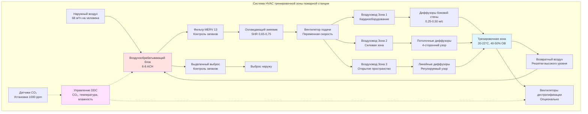

Тренировочные зоны пожарной станции требуют специализированного дизайна HVAC для поддержания комфорта при интенсивной физической активности, управления тепловыми нагрузками оборудования, контроля запахов и обеспечения адекватной вентиляции для людей, занимающихся аэробными и анаэробными упражнениями. Эти помещения работают непрерывно с изменяющимися моделями заполнения, определяемыми графиками смен и требованиями тренировок.

## Требования к вентиляции в помещениях для упражнений

Тренировочные зоны требуют значительно более высоких показателей вентиляции, чем стандартные занятые помещения, из-за повышенной метаболической активности и связанных с ней скоростей дыхания. При интенсивном упражнении потребление кислорода увеличивается в 10-15 раз выше уровня покоя, требуя пропорционального подачи наружного воздуха.

Показатели вентиляции для тренировочных зон пожарной станции:

$$Q_{fitness} = (A_{floor} \times ACH) = (A_{floor} \times 6-8)$$

где $Q_{fitness}$ — требуемый расход воздуха в CFM (м³/ч), $A_{floor}$ — площадь пола в квадратных метрах, разделенная на 60 для преобразования, и ACH представляет 6-8 воздухообменов в час для помещений упражнений.

Для расчетов на основе занятости:

$$Q_{occupant} = N \times 40 \text{ CFM/person (68 м³/ч на человека)}$$

где $N$ — максимально ожидаемая занятость. Пожарные станции обычно проектируют на 6-10 человек во время пиков тренировок смены.

Более высокое требование к вентиляции учитывает повышенное производство CO₂, выработку влаги из потоотделения и выбросы летучих органических соединений от людей и оборудования. Управление вентиляцией по требованиям, используя датчики CO₂, установленные для поддержания уровней ниже 1000 ppm, оптимизирует использование энергии в периоды переменной занятости.

## Выработка тепла оборудованием и расчеты нагрузок

Тренировочное оборудование создает существенные нагрузки явного тепла сверх типичной нагрузки, создаваемой людьми. Беговые дорожки, эллиптические тренажеры, стационарные велосипеды и гребные машины выделяют тепло через работу двигателя и деятельность пользователя.

Типичные выделения тепла оборудованием:

| Тип оборудования | Явное тепло (кДж/ч) | Количество (типично) | Общая нагрузка (кДж/ч) |
|---|---|---|---|
| Беговая дорожка | 3 700-4 750 | 2-3 | 7 400-14 250 |
| Эллиптический тренажер | 2 640-3 165 | 2 | 5 280-6 330 |
| Стационарный велосипед | 1 585-2 110 | 2-3 | 3 170-6 330 |
| Гребная машина | 530-845 | 1-2 | 530-1 690 |
| Силовые машины | 211-423 | 5-8 | 1 055-3 384 |
| Свободные веса (минимально) | Незначительно | Переменное | 528 |

Общая нагрузка от оборудования для типичной тренировочной зоны пожарной станции составляет 18 000-32 500 кДж/ч, что требует приблизительно 5,0-9,0 кВт выделенной охлаждающей способности сверх нагрузок от людей.

Выработка тепла людьми при упражнениях составляет в среднем 845-1 265 кДж/ч явного и 845-1 055 кДж/ч скрытого на человека, по сравнению с 264/211 кДж/ч для сидячей деятельности. Для 8 человек, одновременно занимающихся упражнениями:

$$Q_{total} = (Q_{sensible} + Q_{latent}) \times N = (1055 + 950) \times 8 = 16 040 \text{ кДж/ч}$$

Комбинированные нагрузки от оборудования и людей требуют надежных систем охлаждения с адекватной способностью осушения.

## Параметры проектирования температуры и влажности

Тренировочные зоны требуют более низких температур, чем стандартные занятые помещения, чтобы приспособиться к повышенным метаболическим нагрузкам и поддержать тепловой комфорт при упражнениях.

### Параметры проектирования для тренировочных зон пожарной станции

| Параметр | Значение проектирования | Допуск | Примечания |
|---|---|---|---|
| Температура сухого термометра | 20-22°C | ±1,1°C | Ниже офисных помещений |
| Относительная влажность | 40-50% | ±5% | Контрол влаги, риск плесени |
| Скорость воздуха (занятая зона) | 0,25-0,50 м/с | Переменная | Выше для комфорта |
| Норма наружного воздуха | 68 м³/ч на человека | Минимум | Требование ASHRAE 62.1 |
| Воздухообмены в час | 6-8 ACH | Минимум | Контроль запахов и влаги |
| Уровень звука (NC) | NC-35 до NC-40 | Максимум | Баланс с движением воздуха |
| Температура подаваемого воздуха | 13-14°C | ±1,1°C | Повышенный дифференциал |

Установки температуры должны стремиться к более низкому концу (20-21°C) в периоды пиковой использования и могут увеличиться до 22°C в периоды неиспользования для экономии энергии. Программируемые термостаты или датчики занятости оптимизируют эксплуатацию.

Контроль влажности предотвращает накопление влаги на оборудовании, зеркалах и поверхностях зданий, сохраняя комфорт. Способность осушения должна справляться с 2,7-3,6 кг влаги в час при пиковой занятости, требуя систем с коэффициентом явного тепла (SHR) 0,65-0,75.

$$SHR = \frac{Q_{sensible}}{Q_{sensible} + Q_{latent}} = \frac{16900}{16900 + 7600} = 0.69$$

## Стратегии движения и распределения воздуха

Повышенные скорости воздуха улучшают испарительное охлаждение и тепловой комфорт для упражняющихся. Распределение подаваемого воздуха должно обеспечивать скорости 0,25-0,50 м/с в занятой зоне без создания сквозняков при легкой активности или в периоды отдыха.

Стратегии проектирования включают:

- **Диффузоры боковой стены на высоте**: Подача воздуха по зонам оборудования с горизонтальными моделями выброса, создавая движение воздуха на высоте 1,2-1,8 м над полом, где люди упражняются
- **Потолочные диффузоры**: Четырехсторонние диффузоры в помещениях с адекватной высотой потолка (3+ метра) обеспечивают равномерное распределение
- **Вентиляция вытеснением**: Низкоскоростная подача у пола с высокоуровневым возвратом захватывает тепло и загрязнители через естественную конвекцию
- **Вентиляторы дестратификации**: Потолочные вентиляторы, работающие на низких скоростях (50-150 об/мин), улучшают циркуляцию воздуха и комфорт в режиме охлаждения

Решетки возвратного воздуха должны быть расположены для захвата поднимающегося теплого воздуха и влаги, обычно размещаются рядом с потолком или в верхних участках стен. Избегайте расположения возвратов около дверей, чтобы предотвратить коротким замыкание подачи наружного воздуха.

## Акустические рассмотрения

Тренировочные зоны создают значительный шум от работы оборудования, воздействия гирь и музыкальных систем. Системы HVAC должны обеспечивать адекватную вентиляцию без влияния на уровни шума, которые препятствуют общению или создают беспокойство.

Целевой критерий шума составляет NC-35 до NC-40, уравновешенный потребностью в движении воздуха. Стратегии для достижения акустических характеристик включают:

- **Проектирование воздуховодов с низкой скоростью**: Поддерживайте скорость в воздуховодах ниже 7,6 м/с в основных воздуховодах, 4,1 м/с в ветвях и 2,5 м/с у диффузоров
- **Глушители воздуховодов**: Установите облицованные глушители на 3,0-4,6 м выше по потоку от диффузоров, обслуживающих тренировочные зоны
- **Виброизоляция**: Установите оборудование обработки воздуха на пружинные изоляторы (38-51 мм прогиб) для предотвращения передачи конструкционного шума
- **Выбор оборудования**: Определите вентиляторы с низким звуком и акустически рассчитанные диффузоры с рейтингом NC ≤35
- **Маскирование звука**: Фоновое движение воздуха HVAC может маскировать прерывистый шум оборудования без чрезмерной скорости

Пути возвратного воздуха через коридоры или передаточные решетки обеспечивают акустическое разделение между тренировочными зонами и тихими зонами, такими как спальные помещения.

## Стратегии контроля запахов

Тренировочные зоны создают запахи из потоотделения, материалов оборудования и чистящих средств. Эффективный контроль запахов требует адекватной вентиляции, фильтрации и иногда дополнительной обработки.

Основные методы контроля запахов:

1. **Высокие процентные доли наружного воздуха**: Поддерживайте 50-100% наружный воздух в периоды использования вместо рециркуляции загрязненного воздуха
2. **Улучшенная фильтрация**: Фильтры MERV 13 захватывают частицы и некоторые соединения, вызывающие запахи; фильтры с активированным углем обеспечивают дополнительную адсорбцию запахов
3. **Выделенный выброс**: Непрерывно работающие вытяжные вентиляторы при 0,17-0,34 м³/(ч·м²) для поддержания небольшого отрицательного давления, предотвращая миграцию запахов в смежные помещения
4. **Частота воздухообмена**: 6-8 ACH обеспечивает разбавление и удаление запахов между сеансами упражнений
5. **Протоколы очистки поверхностей**: Регулярная чистка оборудования снижает источники запахов на уровне материала

Рассчитайте требуемую вентиляцию разбавления для контроля запахов:

$$Q_{dilution} = \frac{G}{C_{max} - C_{outdoor}}$$

где $G$ — скорость выработки загрязнителя, $C_{max}$ — максимально приемлемая концентрация и $C_{outdoor}$ — концентрация на открытом воздухе. Для тренировочных помещений эмпирические нормы наружного воздуха 68 м³/ч на человека обычно обеспечивают адекватное разбавление.

Контроль влажности ниже 50% ОВ препятствует бактериальному и грибковому росту на оборудовании и поверхностях, снижая биологические источники запахов. Убедитесь, что конденсатные стоки функционируют надлежащим образом и поверхности змеевиков остаются чистыми, чтобы предотвратить микробное усиление в оборудовании HVAC.

Отдельная вентиляция для помещений туалета/душа, смежных с тренировочными зонами, предотвращает перекрестное заражение влагой и запахами. Поддерживайте отношения давления: коридор (нейтраль) > тренировочная зона (-5 Па) > туалетные комнаты (-10 Па) для надлежащего направления потока воздуха.
