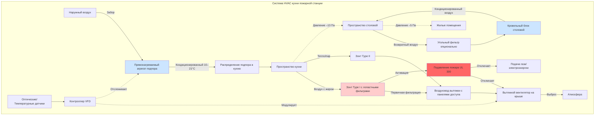

Кухни пожарных станций работают 24/7 с переменными нагрузками готовки и требуют специализированных систем HVAC, которые уравновешивают требования коммерческой кухни с ожиданиями жилищного комфорта. Эти объекты должны обеспечивать эффективную вытяжку, адекватный подпор воздуха и надлежащую изоляцию от других зон станции при сохранении энергоэффективности в периоды низкой активности.

## Требования коммерческой кухонной вытяжки

Кухни пожарных станций подпадают под коммерческие стандарты вентиляции, несмотря на их институциональный характер. Вытяжные зонты Type I требуются над оборудованием, которое производит насыщенные жиром пары и дым.

**Требования к скорости захвата зонта**:

$$V_{capture} = \frac{Q_{hood}}{A_{hood}} = 0.508–0.762 \text{ м/с}$$

где $Q_{hood}$ – расход воздуха вытяжки (м³/ч) и $A_{hood}$ – площадь лицевой части зонта (м²).

**Скорости выходного воздуха** зависят от типа и конфигурации зонта:

$$Q_{exhaust} = L \times W \times CF$$

где $L$ – длина зонта (м), $W$ – ширина зонта (м), и $CF$ – коэффициент конфигурации (м³/(ч·м²) в диапазоне от 1017–2034 м³/(ч·м²) для настенных навесных зонтов до 1526–3051 м³/(ч·м²) для островных навесных зонтов).

### Требования вентиляции кухни пожарной станции

| Тип зонта | Применение | Минимальная производительность вытяжки | Расширение площади захвата |
|-----------|-------------|---------------------|------------------------|
| Настенный навесной | Плита, духовка | 1017–1526 м³/(ч·м²) | 15 см сверх оборудования |
| Островной навесной | Многостанционная готовка | 1526–2034 м³/(ч·м²) | 30 см сверх оборудования |
| Задняя полка | Легкое оборудование | 1526–2542 м³/(ч·м пог.) | Позади оборудования |
| Близкая/вентилятор | Одно устройство | 1270–2034 м³/(ч·м²) | Минимальный свес |
| Type II (Тепло/пар) | Паровые котлы, посудомойки | 763–1270 м³/(ч·м²) | 15 см сверх оборудования |

## Системы подпора воздуха

Системы подпора воздуха должны заменять 100% вытяжного воздуха для поддержания баланса давления в здании и предотвращения обратного потока загрязнений из механического отделения в жилые помещения.

**Объем подпора воздуха**:

$$Q_{MA} = 0.8 \times Q_{exhaust}$$

Это обеспечивает замену воздуха при сохранении небольшого отрицательного давления (-5–13 Па) на кухне относительно столовой.

**Температура подпора воздуха** в отопительный сезон:

$$T_{supply} = T_{outdoor} + \Delta T_{preheat}$$

где $\Delta T_{preheat}$ поднимает наружный воздух до минимума 10–16°C, чтобы предотвратить дискомфорт для occupants. Прямо нагреваемые агрегаты подпора воздуха (80–90% эффективность) часто используются в приложениях пожарных станций.

**Скорость выхода подпора воздуха** должна быть ограничена:

$$V_{discharge} \leq 2.54 \text{ м/с на высоте 1.5 м от пола}$$

чтобы предотвратить сквозняки в зоне пребывания занимающихся лиц, обеспечивая при этом надлежащее распределение.

## Кондиционирование столовой

Столовые требуют отдельного контроля температуры от кухонных пространств, обычно обслуживая 10–20 персонала во время приема пищи с переменной занятостью в течение дня.

**Соображения по охлаждающей нагрузке**:
- Радиационное тепло от соседней кухни: 47–79 кДж/(ч·м²) общей стены
- Чувствительная нагрузка occupants: 293 кДж/ч на человека
- Скрытая нагрузка occupants: 234 кДж/ч на человека
- Освещение: 10.8–16.1 Вт/м²

**Требования вентиляции** согласно ASHRAE 62.1:
- Столовые: 3.8 м³/(ч·человек) + 1.29 м³/(ч·м²)
- Кухня (зоны без готовки): только компонент 1.29 м³/(ч·м²)

Отдельное зональное управление позволяет снизить потребление энергии в неиспользуемые периоды при поддержании работы кухонной вытяжки.

## Изоляция запахов и контроль давления

Эффективный контроль запахов требует тщательного управления отношениями давления между кухней, столовой и другими жилыми помещениями.

**Рекомендуемый каскад давления**:
1. Механическое отделение: 0 Па (эталон)
2. Кухня: –13 до –21 Па
3. Столовая: –5 до –8 Па
4. Спальные помещения: +5 до +8 Па

Переходные решетки между столовой и кухней должны иметь обратные клапаны для предотвращения обратного потока при переменной работе вытяжки. Рассмотрите использование фильтрации активированным углем в возвратном воздухе столовой для удаления остаточных запахов.

## Фильтрация жира и защита от пожара

Многоступенчатое удаление жира защищает воздуховоды и системы подавления, снижая требования к обслуживанию.

**Этапы фильтрации жира**:
1. **Лопастные фильтры**: 70–80% эффективность удаления, UL 1046 сертифицированы, установлены под углом 45–60°
2. **Центробежные сепараторы**: дополнительное удаление 15–20% при высоких объемах готовки
3. **Установки ESP** (опционально): 90–95% общая эффективность для чувствительных объектов

**Требования противопожарного подавления**:
- UL 300 сертифицированные системы мокрого химического подавления
- Активация плавкой перемычки при 177–260°C
- Станция ручного срабатывания на пути выхода
- Интеграция отключения топлива с активацией подавления

**Зазоры воздуховода вытяжки** согласно NFPA 96:
- 46 см до горючих конструкций (неограниченные)
- 15 см до горючих конструкций (заключенные в огнестойкий канал)
- Сертифицированные системы ограждения воздуховода жира сокращают зазор до 7.6 см

## Ночная готовка и соображения частичной нагрузки

Пожарные станции работают непрерывно с переменной интенсивностью готовки. Стратегии частичной нагрузки снижают потребление энергии в периоды низкой активности.

**Стратегии переменной вытяжки**:

$$Q_{night} = 0.5 \times Q_{design}$$

Минимальная вытяжка, требуемая кодексом, поддерживает захват при снижении затрат на кондиционирование воздуха подпора. VFD-управляемые вытяжные вентиляторы модулируют на основе:
- Датчики температуры над поверхностью готовки
- Оптические датчики дыма/жира
- Ручные переключатели отмены на станциях готовки

**Контролируемый подпор воздуха**:

$$Q_{MA,variable} = f(T_{plume}, C_{optical}) \times Q_{MA,design}$$

где подпор воздуха следует за снижением вытяжки, поддерживая отношения давления при минимизации затрат кондиционирования в ночные часы и в периоды низкой готовки.

## Конфигурация системы HVAC кухни

## Рекомендации по проектированию

Системы HVAC кухни пожарной станции должны отдавать приоритет:

1. **Резервирование**: Резервная способность вытяжки для аварийной готовки во время обслуживания
2. **Доступность**: Ежеквартальная очистка воздуховода жира требует панелей доступа каждые 3.7 м максимум
3. **Интеграция управления**: Вытяжка кухни заблокирована на открытие ворот механического отделения для предотвращения миграции дыма
4. **Рекуперация энергии**: Рассмотрите системы выделенного наружного воздуха с рекуперацией энергии для предварительного кондиционирования воздуха подпора в экстремальных климатах
5. **Контроль шума**: Шум оборудования кухни не должен превышать NC 45 для поддержания коммуникации во время аварийных вызовов

Надлежащая интеграция требований коммерческой кухни с требованиями эксплуатации пожарной станции обеспечивает безопасные, удобные и энергоэффективные кухни и столовые, которые поддерживают круглосуточные операции аварийного реагирования.
