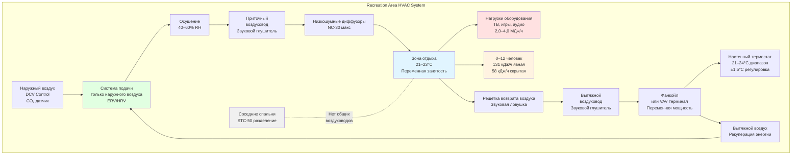

Зоны отдыха на пожарных станциях служат критически важными пространствами для восстановления личного состава, где персонал восстанавливается между аварийными вызовами, поддерживает боевой дух во время продолжительных смен и переходит от высокостресовых операций к отдыху. Эти комнаты отдыха и гостиные с телевизорами должны обеспечивать комфортные, гибкие среды, которые вмещают широко варьирующиеся схемы занятости, сохраняя при этом акустическую изоляцию от соседних спален для защиты отдыха персонала в нерабочее время.

## Требования к комфорту в комнатах отдыха

Комнаты отдыха на пожарных станциях функционируют как многофункциональные пространства для собраний с занятостью, варьирующейся от нулевой во время одновременных аварийных вызовов до полного состава экипажа во время смены, обеда или учебных сессий. Системы HVAC должны реагировать на эти быстрые переходы занятости, сохраняя при этом стабильные условия комфорта.

**Критические параметры комфорта:**

- Поддерживать температуру помещения на уровне 21–23°C во время занятости
- Проектировать относительную влажность в диапазоне 40–60% в течение года
- Обеспечить минимум 2,4 м³/(ч·чел) + 0,06 м³/(ч·м²) наружного воздуха согласно ASHRAE 62.1 Table 6-1
- Достичь эффективности распределения воздуха $E_v$ = 1,0 минимум для обеспечения полного перемешивания
- Целевые акустические критерии ниже NC-35 для поддержки разговора и просмотра медиа

Тепловая среда должна вмещать персонал в различных состояниях одежды — от полной формы до спортивной формы — без необходимости частой регулировки термостата. Проектировать для нейтрального теплового ощущения (PMV = 0 ± 0,5) на основе легкой малоподвижной деятельности при 1,0–1,2 мет.

## Тепловые нагрузки от развлекательного оборудования

Современные зоны отдыха пожарных станций содержат значительное электронное оборудование, генерирующее непрерывные внутренние тепловыделения. Большие телевизионные экраны, игровые приставки, аудиосистемы и компьютерное оборудование производят явные нагрузки, варьирующиеся в зависимости от схем использования, но способствуют базовому теплу даже в режиме ожидания.

**Типичные тепловые нагрузки развлекательного оборудования:**

| Тип оборудования | Типичный размер/мощность | Тепловыделение | Коэффициент разнообразия |
|----------------|---------------------|-----------------------|-------------------|
| Большой LED телевизор | 65–75 дюймов | 44–73 кДж/ч | 0,7–0,9 |
| Игровая консоль | 100–200 Вт | 102–205 кДж/ч | 0,3–0,5 |
| Аудиоресивер | 100–150 Вт | 102–146 кДж/ч | 0,5–0,7 |
| Кабельная/потоковая приставка | 20–40 Вт | 20–41 кДж/ч | 0,8–1,0 |
| Компьютеры/планшеты | 50–100 Вт на единицу | 49–102 кДж/ч | 0,4–0,6 |

Рассчитать общую нагрузку охлаждения оборудования используя:

$$Q_{equipment} = \sum_{i=1}^{n} (W_i \times 3.6 \times DF_i \times UF_i)$$

Где $W_i$ — мощность оборудования в ватах, $DF_i$ — коэффициент разнообразия, учитывающий вероятность одновременного использования, и $UF_i$ — коэффициент использования, представляющий среднюю долю времени операции. Для зон отдыха пожарных станций предположить $UF$ = 0,6–0,8 из-за схем круглосуточной занятости.

Нагрузки оборудования в комнатах отдыха обычно составляют 2,0–4,0 МДж/ч в зависимости от состава оборудования и размера помещения. В отличие от обычных коммерческих приложений, коэффициенты разнообразия остаются высокими из-за непрерывной занятости объекта и непредсказуемых схем использования.

## Рассмотрение переменной занятости

Занятость зоны отдыха резко колеблется в зависимости от объема аварийных вызовов, графика смен, учебной деятельности и времени суток. Системы HVAC должны вмещать эти вариации без чрезмерного потребления энергии в периоды низкой занятости или деградации комфорта при пиковом использовании.

**Стратегии отзывчивого HVAC, зависящие от занятости:**

Внедрить управляемую по спросу вентиляцию (DCV) с использованием датчиков CO₂ для модуляции подачи наружного воздуха на основе фактической занятости. Установить контроль CO₂ на максимум 1 000 ppm с вентиляцией в диапазоне:

$$V_{ot} = V_{bz} + (V_{max} - V_{bz}) \times \frac{(C_{measured} - C_{ambient})}{(C_{setpoint} - C_{ambient})}$$

Где $V_{bz}$ — базовая вентиляция зоны (компонент только площади), $V_{max}$ — максимальная вентиляция проектирования, $C_{measured}$ — текущий уровень CO₂, $C_{ambient}$ — наружный CO₂ (обычно 400 ppm), и $C_{setpoint}$ — точка установки управления (1 000 ppm).

Вариации тепловой нагрузки требуют отзывчивого температурного управления с быстрой способностью восстановления. Проектировать системы охлаждения на максимальную одновременную занятость (присутствует полный экипаж) плюс нагрузки оборудования, но внедрить многоступенчатое или оборудование переменной мощности для поддержания эффективности во время частичной нагрузки.

**Сценарии проектной занятости:**

| Сценарий | Плотность занятости | Явная нагрузка | Скрытая нагрузка | Скорость вентиляции |
|----------|-------------------|---------------|-------------|------------------|
| Минимальная (0–2 человека) | <0,01 чел./м² | Только оборудование | Незначительная | 0,06 м³/(ч·м²) |
| Типичная (4–6 человек) | 0,02–0,03 чел./м² | 131 кДж/ч на чел. | 58 кДж/ч на чел. | 2,4 м³/(ч·чел) + площадь |
| Пиковая (8–12 человек) | 0,04–0,06 чел./м² | 131 кДж/ч на чел. | 58 кДж/ч на чел. | 2,4 м³/(ч·чел) + площадь |
| Смена | 0,1+ чел./м² | 146 кДж/ч на чел. | 73 кДж/ч на чел. | 2,4 м³/(ч·чел) + площадь |

## Акустическая изоляция от спален

Зоны отдыха часто граничат стеной со спальнями, в которых отдыхает персонал в нерабочее время в течение дня. Передача звука через воздуховоды HVAC, пути возврата воздуха и пространства подвесного потолка создают неприемлемое нарушение сна, если должным образом не контролируется.

**Требования акустической изоляции:**

- Обеспечить полное разделение воздуховодов между зоной отдыха и спальней — без общих участков воздуховодов
- Установить звуковые глушители в приточных и вытяжных воздуховодах в пределах 3 м от диффузоров/решеток зоны отдыха
- Спроектировать пути возврата воздуха со звуковыми ловушками или облицованными воздуховодами для предотвращения кросс-помех между пространствами
- Поддерживать минимальный класс звукопередачи (STC) STC-50 для стен, разделяющих зону отдыха и спальни
- Уплотнить все проходы воздуховодов через рассчитанные стеновые узлы акустическим герметиком

Выбрать устройства распределения воздуха с низкими характеристиками звукогенерации. Указать диффузоры и решетки с рейтингами звука производителя (NC) как минимум на 5 пунктов ниже критериев проектирования помещения. Для зон отдыха с критериями NC-35 выбрать устройства с рейтингом NC-30 или ниже при скорости потока проектирования.

Избежать общих возвратных воздухопроводов подвесного потолка, обслуживающих как зону отдыха, так и спальню. Звук легко передается через пути возврата воздуха, и нормальная деятельность в комнатах отдыха (звук телевизора, разговор, игры) генерирует достаточный шум для нарушения сна персонала, если возвратные системы взаимосвязаны.

## Распределение свежего наружного воздуха

Эффективное распределение наружного воздуха в зонах отдыха предотвращает локальную затхлость, контролирует запах тела в периоды восстановления экипажа после физических аварийных операций и разбавляет выделения газов оборудования от электроники и мебели.

**Подход проектирования вентиляции:**

Установить системы для подачи только наружного воздуха (DOAS) или центральные обработчики воздуха с возможностью 100% наружного воздуха для отделения вентиляции от тепловых нагрузок. Это предотвращает избыточное охлаждение при мягкой погоде, когда требуются полные количества наружного воздуха, но явные требования к охлаждению скромны.

Распределить наружный воздух равномерно по всему пространству зоны отдыха, используя диффузоры средней или высокой индукции, способствующие перемешиванию. Рассчитать эффективность вентиляции используя:

$$E_v = \frac{C_{exhaust} - C_{supply}}{C_{breathing} - C_{supply}}$$

Для хорошо перемешиваемых пространств с правильным распределением воздуха целевой $E_v$ ≥ 1,0. Плохие схемы распределения с коротким замыканием между подачей и возвратом могут снизить $E_v$ до 0,7–0,8, требуя пропорционально более высокие скорости вентиляции для достижения приемлемого качества внутреннего воздуха.

Расположить решетки вытяжки/возврата вдали от приточных диффузоров для максимизации охвата воздуха через занятые зоны. В прямоугольных комнатах отдыха подавать воздух вдоль одной длинной стены с возвратом на противоположной стене для создания перекрестных схем потока, улучшающих эффективность перемешивания.

## Гибкость температурного управления

Зоны отдыха испытывают разнообразные одновременные предпочтения на основе уровня активности персонала, одежды и индивидуальных требований к тепловому комфорту. В отличие от спален, требующих индивидуального управления в помещении, комнаты отдыха функционируют как общие пространства, требующие компромиссной тепловой среды, удовлетворяющей большинство жителей.

**Гибкая реализация управления:**

Предоставить системы с одной зоной VAV или многоскоростные фанкойлы, позволяющие экипажу регулировать уставки температуры в пределах установленных административных полос пропускания. Типичный административный диапазон: 21–24°C охлаждение, 20–22°C отопление с 1°C дифференциалом для предотвращения чрезмерного циклирования.

Установить настенные термостаты в доступных местах вдали от прямого солнечного излучения, приточных диффузоров и внешних стен. Рассмотреть возможности блокировки или ограниченные диапазоны регулировки (±1,5°C от точки установки) для предотвращения экстремальных настроек, которые компрометируют энергоэффективность или создают конфликты между сменами.

Для более крупных комплексов отдыха с несколькими комнатами отдыха, гостиными с телевизорами и игровыми зонами внедрить отдельное управление зонами для каждого функционального пространства. Зона отдыха площадью 232 м² должна иметь минимум две зоны; более крупные объекты могут требовать 3–4 зоны на основе схем занятости и разнообразия нагрузок.

## Диаграмма системы HVAC зоны отдыха

## Выбор системы и интеграция управления

Выбрать оборудование HVAC с акцентом на тихую работу, переменную мощность и быстрый отклик на изменяющиеся нагрузки. Водяные тепловые насосы обеспечивают отличное управление на уровне зоны с низким уровнем шума. Системы с переменным хладагентом (VRF) предлагают высокую эффективность в условиях частичной нагрузки, обычных в зонах отдыха.

Интегрировать управление HVAC с системами управления зданием для отслеживания схем занятости, оптимизации подачи вентиляции и координации с управлением давлением в гаражах аппаратов. Поддерживать положительное давление в зонах отдыха относительно коридоров (минимум +5 Па) при обеспечении положительности жилых помещений относительно гаражей аппаратов.

Избежать перегруженного оборудования, которое кратко циклируется в периоды низкой занятости. Правильно рассчитать охлаждение на основе реалистичных пиковых нагрузок, а не экстремальных сценариев наихудшего случая. Использовать расчеты нагрузок с учетом разнообразия:

$$Q_{total} = Q_{envelope} + Q_{equipment} + (Q_{occupant} \times N_{design} \times DF_{occ})$$

Где $DF_{occ}$ (коэффициент разнообразия занятости) = 0,7–0,8 для зон отдыха, признавая, что редко все члены экипажа одновременно занимают комнаты отдыха при условиях пиковой нагрузки.

---

**Связанные темы:**
- [24-Hour Occupancy Requirements](../../../../../specialty-applications-testing/specialty-hvac-applications/fire-emt-stations/living-quarters/24-hour-occupancy/_index.md)
- [Sleeping Area HVAC Design](../../../../../specialty-applications-testing/specialty-hvac-applications/fire-emt-stations/living-quarters/sleeping-areas/_index.md)
- [Fitness Room Environmental Control](../../../../../specialty-applications-testing/specialty-hvac-applications/fire-emt-stations/living-quarters/fitness/_index.md)
- [Kitchen and Dining Area Ventilation](../../../../../specialty-applications-testing/specialty-hvac-applications/fire-emt-stations/living-quarters/kitchen-dining/_index.md)
- [Apparatus Bay Isolation](../../../../../specialty-applications-testing/specialty-hvac-applications/fire-emt-stations/apparatus-bays/_index.md)
