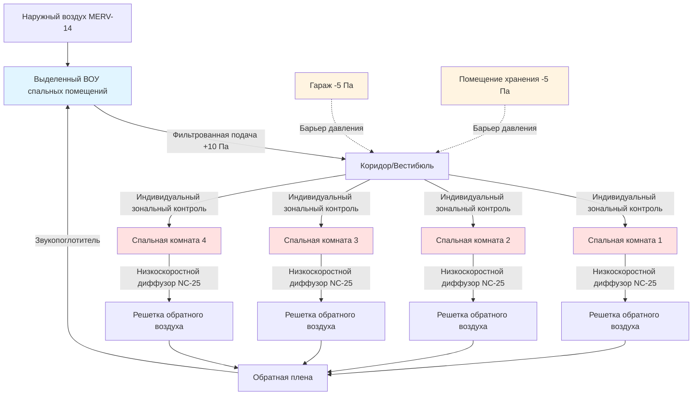

Спальные помещения пожарной станции представляют уникальные проблемы HVAC, которые сочетают строгие акустические требования, индивидуальный контроль комфорта, защиту от загрязнений и быстрое восстановление системы после экстренных операций. Эти пространства должны обеспечивать качественный отдых при одновременном поддержании операционной готовности 24/7.

## Акустические требования для качества сна

Спальные помещения пожарной станции требуют исключительно тихой работы HVAC для поддержки восстанавливающего сна между экстренными вызовами. Целевой критерий шума составляет **NC-25 to NC-30**, значительно ниже, чем в типичных коммерческих помещениях.

### Расчеты уровня звука

Общий уровень звукового давления от нескольких источников HVAC складывается логарифмически:

$$L_{total} = 10 \log_{10} \left( \sum_{i=1}^{n} 10^{L_i/10} \right)$$

Где $L_i$ представляет отдельные уровни звукового давления в дБ от диффузоров, воздуховодов и механического оборудования.

Для терминальных устройств уровень звука, скорректированный по комнате, составляет:

$$L_{room} = L_{device} - 10 \log_{10}(A) + 0.5$$

Где $A$ — поглощение звука комнатой в сабинах. Отдельные спальные комнаты обычно обеспечивают 50-100 сабин на среднихчастотах.

### Стратегии контроля шума

**Диффузоры приточного воздуха** должны работать при исключительно низких скоростях (60-90 м/с скорость в горловине) для минимизации регенерируемого шума. Потолочные диффузоры должны быть рассчитаны как минимум на 10 баллов NC ниже целевого при эксплуатации при расчетном расходе воздуха.

**Требования к звукоизоляции воздуховодов** обычно включают:
- Облицованные воздуховоды для всех ветвей, обслуживающих спальные зоны
- Звукопоглотители в основных приточных и обратных воздуховодах
- Минимум 4,5-6 м облицованного воздуховода перед терминальными устройствами
- Гибкие соединения воздуховодов ко всему оборудованию

**Виброизоляция** предотвращает передачу структурного шума от механического оборудования, даже если оно расположено далеко от спальных помещений.

## Индивидуальный контроль температуры

Пожарные имеют широко различающиеся предпочтения по тепловому комфорту, на которые влияют возраст, обмен веществ и личные предпочтения. **Индивидуальный зональный контроль** для каждой спальной комнаты является необходимым.

### Подходы к зонированию

**Кассетные доводчики** обеспечивают отличный индивидуальный контроль с минимальным центральным оборудованием. Каждая комната получает выделенный блок с доступным для пользователя термостатом. Блоки должны быть сверхтихими моделями (рейтинг NC-25) с электродвигателями EC.

**VAV терминальные блоки** с доогревом обеспечивают индивидуальный контроль из центральных систем. Электрические или водяные спирали доогрева обеспечивают регулировку температуры на уровне зоны. Однако низкие требования минимального расхода воздуха (часто 30-50 CFM (50,97-84,95 м³/ч)) могут увеличить начальную стоимость.

**Бесканальные мини-сплит системы** обеспечивают исключительный индивидуальный контроль и практически бесшумную работу. Многозонные системы обслуживают несколько спальных комнат от одного наружного блока. Внутренние кассетные блоки могут достичь работы NC-20.

## Качество воздуха и вентиляция

Спальные помещения требуют непрерывной вентиляции даже в период отсутствия, чтобы поддерживать качество воздуха и предотвратить застойные условия.

### Требования к вентиляции

ASHRAE 62.1 определяет **47,2 л/мин на человека плюс 0,646 л/мин на м²** для спальных зон. Для типичной спальной комнаты пожарного площадью 11,15 м²:

$$Q_{OA} = 47,2 \times 1 + 0,646 \times 11,15 = 54,4 \text{ л/мин}$$

Однако, **пожарные станции обычно обеспечивают 42,5-70,8 л/мин на спальную комнату** для учета:
- Инфильтрации через двери при частых входах
- Отношений давления с соседними пространствами
- Улучшенного разбавления запахов от тела и CO₂

### Фильтрация и очистка воздуха

**Фильтрация MERV 13-14** в центральных воздухообработчиках защищает спальные зоны от загрязнения частицами. Некоторые станции используют **фильтры с активированным углем** для удаления запахов дизельного выхлопа, которые могут проникнуть из гаражей.

## Разделение загрязнений

Физическое и давление разделение между спальными помещениями и гаражами предотвращает дизельный выхлоп, продукты сгорания и загрязнение оборудования от достижения зон отдыха.

### Стратегия контроля давления

Спальные помещения должны поддерживать **+5 to +10 Па положительного давления** относительно гаражей и зон хранения оборудования. Это требует:
- Выделенных систем подачи воздуха для спальных зон
- Минимальной или отсутствующей передачи обратного воздуха из загрязненных зон
- Мониторинга давления с уведомлением на тревогу
- Вестибюлей или воздушных шлюзов в переходных точках

**Разделение воздухообработчиков** предполагает полностью независимые системы:
- Спальные помещения обслуживаются выделенными ВОУ
- Отсутствие рециркуляции воздуха из гаражей
- Системы выхлопа в загрязненных зонах поддерживают отрицательное давление

## Быстрое кондиционирование после операций

Когда пожарные возвращаются с вызовов, спальные помещения должны быстро восстановить комфортные условия после длительного отсутствия или нарушений давления из-за дверей.

### Производительность восстановления

Системы должны восстановить условия уставки в течение **10-15 минут** после активации режима с пассажирами. Это требует:

$$Q_{recovery} = \frac{C \times V \times \rho \times \Delta T}{t_{recovery} \times 60}$$

Где:
- $C$ = удельная теплоемкость (1005 Дж/кг·К)
- $V$ = объем комнаты (м³)
- $\rho$ = плотность воздуха (1,2 кг/м³)
- $\Delta T$ = восстановление температуры (К)
- $t_{recovery}$ = время восстановления (минуты)

Для комнаты площадью 11,15 м² × 2,74 м высотой, требующей восстановления 2,78°C в течение 15 минут:

$$Q = \frac{1005 \times 30,5 \times 1,2 \times 2,78}{15 \times 60} = 3,78 \text{ кВт}$$

Общая холодопроизводительность должна учитывать как установившиеся нагрузки, так и требования восстановления.

## Ограничения ночного понижения температуры

В отличие от коммерческих зданий, пожарные станции имеют **ограниченные возможности для энергосбережения при понижении температуры** из-за непредсказуемой занятости и необходимости немедленного комфорта при возвращении.

### Стратегии понижения температуры

**Понижение температуры** обычно ограничивается **1,1-2,2°C** от уставки при занятости для баланса экономии энергии с быстрым восстановлением. Более глубокое понижение неприемлемо увеличивает время восстановления.

**Сокращение вентиляции** до требуемого кодексом минимума наружного воздуха во время отсутствия экономит значительную энергию вентилятора без ущерба для времени восстановления. Управляемая спросом вентиляция на основе датчиков CO₂ или присутствия позволяет эту стратегию.

**Распределение оборудования** позволяет частичной работе системы в периоды низкой занятости (обычно ночью, когда большинство персонала находится в спальных помещениях), при этом поддерживая полную мощность для быстрого реагирования.

## Сводка критериев проектирования

| Параметр | Требование | Примечания |
|-----------|-------------|-------|
| **Акустическая производительность** |
| Критерий шума | NC-25 to NC-30 | Целевой NC-25 для оптимального сна |
| Скорость в диффузоре | 60-90 м/с | На горловине, не на выходе |
| Вибрация оборудования | 0,0025-0,0051 м/с | В источнике, изолированное крепление |
| **Тепловой комфорт** |
| Индивидуальный контроль | Каждая комната | Термостат для каждой спальной комнаты |
| Диапазон температур | 20-24,4°C | Регулируемая пользователем уставка |
| Время восстановления | 10-15 минут | От понижения к уставке |
| Предел понижения | 1,1-2,2°C | Отопление и охлаждение |
| **Качество воздуха** |
| Скорость вентиляции | 42,5-70,8 л/мин на комнату | Непрерывная работа |
| Фильтрация | MERV 13-14 | В центральном воздухообработчике |
| Наружный воздух | 100% выделенное | Без рециркуляции из гаража |
| **Контроль давления** |
| Давление спальных помещений | +5 to +10 Па | Относительно гаража |
| Мониторинг давления | Непрерывный | Тревога при потере давления |
| Подрез двери | Максимум 1,27 см | Ограничить потерю давления при открытии |

## Соображения по выбору системы

Выбор между центральной VAV, кассетными доводчиками или бесканальными системами зависит от:

**Размер здания** - Станции с менее чем 8 спальными комнатами часто предпочитают бесканальные системы для простоты и индивидуального контроля.

**Приоритет акустики** - Бесканальные мини-сплит системы с инверторными компрессорами обеспечивают самую тихую работу (достижимо NC-20).

**Возможность обслуживания** - Центральные системы концентрируют деятельность по обслуживанию, но требуют более сложных элементов управления для управления отдельными зонами.

**Энергетическая эффективность** - Бесканальные тепловые насосы обеспечивают отличную эффективность при частичной нагрузке, критическую для пожарных станций с переменной занятостью.

Надлежащее проектирование HVAC для спальных помещений пожарной станции напрямую влияет на здоровье пожарных, качество отдыха и операционную готовность. Инвестиция в превосходную акустическую производительность, индивидуальный контроль комфорта и разделение загрязнений дает большие дивиденды в благополучии персонала и его удержании.
