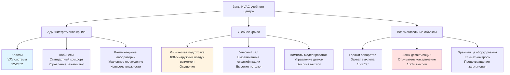

Учебные центры пожарной подготовки представляют уникальные проблемы HVAC, требующие интеграции учебных аудиторий, зон интенсивной физической подготовки, зон обслуживания оборудования и специализированных объектов дезактивации. Эти учреждения должны поддерживать комфорт в учебных помещениях, одновременно управляя экстремальными нагрузками влажности, удалением загрязняющих веществ и изменяющимися характерами занятости в различных функциональных зонах.

## Требования к HVAC учебного центра

Учебные центры пожарной подготовки объединяют образовательные, физической подготовки и функции операционной поддержки в одном комплексе. Система HVAC должна обеспечивать одновременное использование кондиционируемых классов, зон с высокой вентиляцией для фитнеса, гаражей аппаратов, объектов для обучения боевым действиям и специализированных зон дезактивации. Проектирование системы требует особого внимания к изоляции зон, предотвращению перекрестного загрязнения и энергоэффективности, несмотря на широко различающиеся профили нагрузок.

Полная нагрузка охлаждения центра объединяет несколько разнообразных компонентов:

$$Q_{total} = Q_{classroom} + Q_{physical} + Q_{apparatus} + Q_{decon} + Q_{admin}$$

Каждая зона работает при различных параметрах окружающей среды, графиках занятости и требованиях к качеству воздуха.

## Учебные и административные помещения

Учебные помещения следуют стандартному проектированию HVAC для образовательных учреждений с повышенной вентиляцией для более высокой плотности занятости взрослых. Классы обычно вмещают 20-30 курсантов плюс инструкторов, требуя надежной доставки наружного воздуха и эффективного контроля температуры.

Расчетная нагрузка охлаждения для типовой аудитории площадью 111 м²:

$$Q_{classroom} = (111 \times 430) + (30 \times 88) + (30 \times 29 \times 3.5)$$

$$Q_{classroom} = 47,730 + 2,640 + 3,045 = 53,415 \text{ кДж/ч}$$

Где термины представляют нагрузку ограждения (430 кДж/ч·м²), чувствительную нагрузку занятости (88 кДж/ч на человека) и скрытую нагрузку занятости (29 кДж/ч на человека при коэффициенте чувствительного тепла 3.5).

Административные кабинеты, компьютерные лаборатории и комнаты моделирования требуют стандартного кондиционирования для комфорта с контролем температуры 22-24°C и относительной влажностью 40-60%. Эти зоны выигрывают от управления, основанного на занятости, и ночного снижения для снижения энергопотребления в незанятые периоды.

## Вентиляция зон физической подготовки

Фитнес-центры, учебные залы и зоны физической подготовки создают существенные чувствительные и скрытые нагрузки от интенсивных упражнений. Центр, обслуживающий 40 курсантов, выполняющих тяжелые упражнения, создает:

$$Q_{latent} = 40 \times 41.1 = 1,644 \text{ кДж/ч скрытой}$$

$$Q_{sensible} = 40 \times 23.5 = 940 \text{ кДж/ч чувствительной}$$

Это дает коэффициент чувствительного тепла 0.36, указывая на нагрузки, доминируемые скрытым теплом, требующие значительной емкости осушения. Скорости наружного воздуха должны обеспечивать минимум 20 CFM (33.8 м³/ч) на человека, при этом многие центры обеспечивают 30-40 CFM (50.7-67.6 м³/ч) на человека для управления запахами и поддержания качества воздуха во время пиковых сеансов тренировки.

Вентиляторы большого объема с низкой скоростью (HVLS) дополняют механическое охлаждение, обеспечивая движение воздуха в зоне занятости, улучшая комфорт при более высоких уставках температуры (24-26°C) и снижая энергопотребление охлаждения на 20-30%.

## Хранилища оборудования и гаражи обслуживания

Гаражи аппаратов, вмещающие учебные машины, оборудование SCBA и боевую одежду, требуют кондиционированного пространства с повышенной вентиляцией. Эти области сталкиваются с загрязнением от выхлопных газов дизеля, выделением газов из оборудования пожаротушения и влажностью от влажной одежды.

Минимальные скорости вентиляции должны обеспечивать 0.03-0.04 CFM (0.051-0.068 м³/ч) на квадратный фут с более высокими скоростями (0.06-0.09 CFM/фут² или 0.102-0.153 м³/ч) в активных зонах обслуживания. Выделенные системы захвата выхлопных газов автомобилей дополняют общую вентиляцию, напрямую удаляя дизельные твердые частицы у выхлопной трубы.

Контроль температуры в гаражах аппаратов обычно поддерживает 15-18°C зимой и обеспечивает охлаждение максимум до 27°C летом, уравновешивая защиту оборудования с энергоэффективностью.

## Зоны дезактивации

Специализированные объекты дезактивации удаляют канцерогены и загрязняющие вещества из оборудования и персонала пожарной подготовки. Эти области требуют 100% выхлопа без рециркуляции, отрицательного давления относительно соседних помещений (-12-25 Па), и минимум 10 воздухообменов в час.

Зона дезактивации включает:

- Зона грубой дезактивации со станциями для промывки оборудования
- Переходные зоны с душевыми
- Чистое хранилище для дезактивированного оборудования
- Зоны хранения загрязненного оборудования

Каждая подзона работает при прогрессивно отрицательном давлении, создавая воздушный поток из чистых в загрязненные области. Выходящий воздух получает фильтрацию (минимум MERV 13-15) перед выпуском для предотвращения загрязнения окружающей среды.

Температура в активных зонах дезактивации должна поддерживать 22-24°C с относительной влажностью 50-60% для поддержки комфорта персонала при длительных операциях дезактивации.

## Интеграция многозонной системы

Эффективное проектирование HVAC учебного центра требует тщательной интеграции разнообразных функциональных зон с надлежащей изоляцией, отношением давлений и стратегиями управления.

## Критерии проектирования по типам помещений

| Тип помещения | Температура (°C) | Влажность (%) | Скорость наружного воздуха | ACH | Давление | Специальные требования |
|------------|-----------------|--------------|---------|-----|----------|---------------------|
| Классы | 22-24 | 40-60 | 25 CFM (42.4 м³/ч)/человека | 4-6 | Нейтральное | Мониторинг CO₂ |
| Физическая подготовка | 20-24 | 40-60 | 50-68 CFM (85-115 м³/ч)/человека | 8-12 | Нейтральное | Высокое осушение |
| Гараж аппаратов | 15-27 | 40-70 | 0.04 CFM (0.068 м³/ч)/фут² | 4-6 | Отрицательное | Захват выхлопа |
| Мокрая зона дезактивации | 22-24 | 50-60 | 100% наружный воздух | 10-15 | -12 Па | Без рециркуляции |
| Хранилище дезактивации | 20-22 | 40-50 | 0.12 CFM (0.20 м³/ч)/фут² | 6-8 | -6 Па | MERV 13 фильтрация |
| Учебный зал | 18-24 | 40-60 | 34 CFM (57.6 м³/ч)/человека | 3-4 | Нейтральное | Вентиляторы выравнивания стратификации |
| Комната моделирования | 21-24 | 40-60 | 0.09 CFM (0.153 м³/ч)/фут² | 12-20 | Отрицательное | Выхлоп дыма |
| Раздевалки | 22-24 | 40-70 | 0.06 CFM (0.102 м³/ч)/фут² | 10-12 | Только выхлоп | Контроль влажности |

## Управление и энергетическое хозяйство

Системы автоматизации зданий должны обеспечивать управление на уровне зон с расписанием, основанным на календарях тренировок и характерах использования центра. Вентиляция, управляемая по потребности, в классах и зонах физической подготовки оптимизирует доставку наружного воздуха на основе фактической занятости, снижая нагрузки кондиционирования в периоды частичного использования.

Отдельные блоки обработки воздуха для каждой основной функциональной зоны обеспечивают операционную гибкость и предотвращают перекрестное загрязнение между чистыми административными зонами и потенциально загрязненными зонами тренировки/аппаратов. Рекупирация тепла из выхлопа дезактивации и зон физической подготовки может обеспечить предподогрев или предварительное охлаждение входящего наружного воздуха, улучшая общую эффективность системы.

Ночное снижение в незанятые периоды и сезонное выравнивание температуры (более широкие приемлемые диапазоны в периоды некритичной подготовки) дополнительно снижают энергопотребление, одновременно поддерживая защиту оборудования и готовность центра.

Учебные центры пожарной подготовки требуют сложного проектирования HVAC, интегрирующего несколько специализированных зон с отличающимися требованиями к окружающей среде. Надлежащее проектирование системы обеспечивает комфорт инструкторов и курсантов, поддерживает качество воздуха во всех разнообразных видах деятельности, предотвращает перекрестное загрязнение между зонами и поддерживает критическую миссию подготовки спасателей к спасительному служению.
