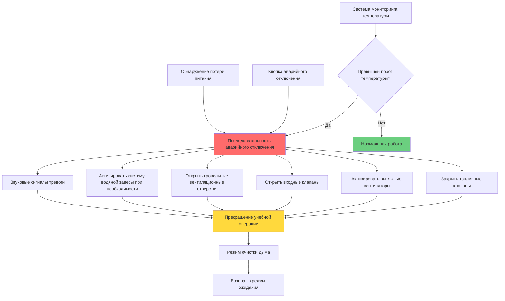

## Обзор проектирования

Учебные здания с контролируемыми пожарами требуют специализированных систем HVAC, которые поддерживают управляемые огневые учения при защите инструкторов, наблюдателей и самой конструкции. Эти объекты имитируют реальные условия пожара для обучения пожарных структурной тактике тушения пожаров, операциям поиска и спасения, а также управлению тепловой окружающей среды.

Фундаментальная задача проектирования заключается в обеспечении адекватной вентиляции для контроля продуктов горения и накопления тепла во время учебных операций, сохраняя при этом безопасные зоны наблюдения и обеспечивая быстрое рассеивание дыма между упражнениями. Современные учебные здания используют газовые системы или системы на топливе класса A с инженерной вентиляцией, заменяющей старые неконтролируемые деревянные конструкции.

Мониторинг температуры и интеграция экстренного отключения представляют собой критические системы безопасности, предотвращающие катастрофическое повреждение конструкции и защищающие персонал от чрезмерного теплового воздействия. Конструкция дымовой трубы должна учитывать контроль выбросов, управление тягой и герметизацию кровельного проема при сохранении надежной работы при экстремальном температурном цикле.

## Системы вентиляции учебных зданий с пожарами

### Компоненты естественной вентиляции

Вентиляция учебного здания объединяет естественные и механические системы, создающие контролируемые модели движения воздуха, поддерживающие реалистичное поведение огня при предотвращении опасных условий.

**Входные отверстия для воздуха**: Подача свежего воздуха для горения и охлаждения:
- Входные отверстия низкого уровня размером 15–25% от общей площади пола
- Вручную управляемые жалюзи или съемные панели
- Несколько местоположений позволяют инструкторам контролировать модели движения воздуха
- Защита от атмосферных осадков в неиспользуемом состоянии (крышки, дефлекторы)

**Кровельные вентиляционные отверстия**: Естественное удаление дыма и тепла:
- Площадь открытия минимум 10–15% площади пола
- Вручную управляемые или автоматические механизмы открывания
- Гидравлические или пневматические приводы выдерживают экстремальные температуры
- Возможность экстренного переопределения для быстрой вентиляции

**Окна и дверные проемы**: Учебные приспособления и контроль вентиляции:
- Функциональные окна, воспроизводящие конструкцию жилых зданий
- Сплошные двери и двери для взлома для реалистичной подготовки
- Конфигурация открытия контролирует поведение огня и эффективность вентиляции
- Сменяемые рамы учитывают повреждения при обучении

### Механические выхлопные системы

**Основные вытяжные вентиляторы**: Удаление дыма и продуктов горения между учебными упражнениями:
- Конструкция для работы при высоких температурах (непрерывный рейтинг 315–425°C)
- Производительность 6–12 воздухообменов в час (ACH) для учебных помещений
- Управление переменной скоростью позволяет постепенное или быстрое рассеивание дыма
- Резервные агрегаты обеспечивают наличие для запланированного обучения

**Расчет размера вентилятора**: На основе объема помещения и требуемого времени очистки:

$$Q_{выхлоп} = \frac{V \times ACH}{60}$$

Где:
- $Q_{выхлоп}$ = объемный расход выхлопа (м³/ч)
- $V$ = объем помещения (м³)
- $ACH$ = воздухообмены в час (типично 6–12)

Например, учебное помещение размером 9,1 м × 12,2 м × 3,0 м с требуемым уровнем ACH = 8:

$$Q_{выхлоп} = \frac{(9,1 \times 12,2 \times 3,0) \times 8}{60} = 45,4 \text{ м³/ч}$$

**Подпиточный воздух**: Сбалансированный поток воздуха при механической вентиляции:
- Выделенные вентиляторы подпиточного воздуха или пассивные предохранительные клапаны входа
- Нагревательная способность для зимней эксплуатации (опционально)
- Фильтрация предотвращает накопление загрязнений извне
- Объемный расход подпиточного воздуха 85–95% от производительности выхлопа предотвращает чрезмерное отрицательное давление

**Конструкция воздуховодов**: Материалы и конструкция для работы при высоких температурах:
- Минимум стальной воздуховод 304-го класса нержавеющей стали
- Сварные или фланцевые соединения (без спирального запирания)
- Минимум 5 см зазора до горючих материалов
- Компенсационные швы для длинных участков воздуховода
- Изоляция наружных участков предотвращает конденсацию

## Газовые системы и системы на топливе класса A

### Учебные системы на газе

Современные учебные объекты все чаще используют газовые системы, обеспечивающие повторяемые управляемые условия горения с пониженными выбросами и износом конструкции.

**Компоненты системы**:
- Трубопроводы природного газа или пропана в камеры горения
- Компьютерно-управляемые манифольды клапанов регулируют скорость выпуска тепла
- Контроли безопасности пламени предотвращают неконтролируемый выпуск газа
- Системы зажигания с контролем пламени
- Запорные вентили в нескольких местах

**Управление выпуском тепла**: Программируемая интенсивность огня:

$$Q_{пожар} = \dot{m}_{топливо} \times LHV \times \eta_{сгорание}$$

Где:
- $Q_{пожар}$ = скорость выпуска тепла (кДж/ч)
- $\dot{m}_{топливо}$ = массовый расход топлива (кг/ч)
- $LHV$ = низшая теплотворная способность (22 600 кДж/кг для природного газа)
- $\eta_{сгорание}$ = эффективность сгорания (0,95–0,98)

Типичные учебные сценарии варьируются от 1,5 ГДж/ч до 9,0 ГДж/ч выпуска тепла в зависимости от размера помещения и учебных целей.

**Преимущества**:
- Точный контроль температуры и повторяемость
- Быстрое циклирование операций (интервалы 15–20 минут)
- Пониженные выбросы твердых частиц
- Минимальная очистка и техническое обслуживание конструкции
- Расширенный срок службы конструкции (20–30 лет в сравнении с 5–10 для деревянных)

**Ограничения**:
- Более высокие начальные затраты на установку
- Характеристики дыма отличаются от структурных пожаров
- Требует инженерную инфраструктуру (газоснабжение, электроснабжение)
- Опасения по поводу реалистичности подготовки некоторыми инструкторами

### Системы на топливе класса A

Традиционные системы сжигания дерева используют поддоны, размерный пиломатериал и солому, создавая реалистичные условия структурного пожара с естественным поведением топлива.

**Рекомендации по загрузке топлива**:
- Типично 23–68 кг дерева для каждой операции
- Топливо расположено для создания требуемой модели роста огня
- Контролируемые воспламеняющиеся ускорители (только газета, картон)
- Запрещенные материалы: пластмассы, обработанный пиломатериал, резина, нефтепродукты

**Требования вентиляции**: Системы на натуральном топливе требуют более высоких скоростей вентиляции:
- 10–15 ACH во время фазы очистки
- Расширенное время очистки (30–45 минут) между операциями
- Накопление креозота и твердых частиц требует частой очистки
- Системы удаления золы или ручная очистка между использованиями

**Преимущества**:
- Более низкие начальные затраты
- Реалистичное поведение топлива и характеристики дыма
- Гибкость в создании сценариев пожара
- Отсутствие зависимости от коммунальных услуг (может работать автономно)

**Ограничения**:
- Непостоянное поведение огня от операции к операции
- Высокое производство твердых частиц и креозота
- Ухудшение конструкции от теплового цикла
- Опасения по поводу экологических выбросов
- Трудоемкая подготовка топлива и очистка

## Температурные пределы и мониторинг

### Температурные пределы конструкции

Бетонные и стальные конструкции выдерживают разные максимальные температуры:

**Бетонные конструкции**:
- Максимальная температура поверхности: 650–760°C
- Длительное воздействие выше 650°C вызывает отслоение и потерю прочности
- Огнестойкие покрытия или облицовка расширяют допуск к температуре
- Тепловой цикл ускоряет детериорацию (повреждение расширения/сжатия)

**Стальные конструкции**:
- Конструкционная сталь теряет прочность выше 540°C
- Рекомендуемая максимальная температура: 425–480°C для повторяющихся циклов
- Огнезащита или огнестойкие барьеры защищают конструктивные элементы
- Повреждение краски и отделки происходит выше 260°C

### Системы мониторинга температуры

**Массивы термопар**: Распределенное измерение температуры:
- Термопары типа K (0–1 260°C диапазон) наиболее распространены
- Несколько точек измерения на помещение (потолок, стены, конструктивные элементы)
- Отображение на панели управления инструктором
- Регистрация данных для анализа подготовки и документации безопасности

**Инфракрасный мониторинг температуры**: Бесконтактное измерение:
- Фиксированные инфракрасные датчики контролируют критические конструктивные точки
- Типичный диапазон измерения 540–1 370°C
- Более быстрый отклик, чем у термопар
- Более высокая стоимость ограничивает развертывание только критическими зонами

**Пороги срабатывания сигнала тревоги температуры**:

| Местоположение | Уровень предупреждения | Уровень отключения | Примечания |
|----------|--------------|----------------|-------|
| Поверхность потолка | 540°C | 650°C | Бетонные конструкции |
| Поверхность стены | 480°C | 595°C | Бетонные конструкции |
| Конструктивные стальные элементы | 370°C | 480°C | Защищенная конструкционная сталь |
| Потолок зоны наблюдателя | 65°C | 95°C | Защита от радиационного тепла |
| Дымовая труба | 650°C | 815°C | Зависит от материала трубы |

**Интеграция автоматического отключения**: Температурные пределы запускают экстренные ответы:
- Отключение топлива (газовые системы) или активация водяной завесы (системы класса A)
- Активация принудительной вентиляции (полная производительность выхлопа)
- Слышимые и визуальные сигналы тревоги во всех зонах
- Протокол прекращения учебной операции

## Конструкция дымовой трубы и выбросы

### Размеры и конфигурация трубы

**Расчет высоты трубы**: Адекватная тяга и рассеивание:

$$H_{труба} = H_{здание} + 3 \text{ м минимум}$$

Более высокие трубы улучшают тягу и рассеивание выбросов, но увеличивают нагрузки на конструкцию и сложность обслуживания.

**Диаметр трубы**: На основе объемного расхода выхлопа и требуемой скорости:

$$D_{труба} = \sqrt{\frac{4Q_{выхлоп}}{\pi V_{труба}}}$$

Где:
- $D_{труба}$ = внутренний диаметр трубы (см)
- $Q_{выхлоп}$ = объемный расход выхлопа (м³/ч)
- $V_{труба}$ = скорость в трубе (4,0–6,0 м/с типично)

Целевая скорость уравновешивает производительность тяги против чрезмерных потерь на трение и шума.

**Конструкция трубы**:
- Нержавеющая сталь (304 или 316 марки) для устойчивости к коррозии
- Двустенная изолированная конструкция предотвращает конденсацию
- Сварные швы (без механических соединений ниже линии крыши)
- Доступ для очистки в основании для удаления твердых частиц
- Дождевой колпак с защитой от птиц

**Управление тягой**: Управление естественной и механической тягой:
- Барометрические клапаны предотвращают чрезмерную тягу во время сильного ветра
- Вентиляторы переменной скорости обеспечивают управляемую механическую тягу
- Управление входным воздухом координируется с выхлопом для поддержания давления в здании
- Расчет эффекта дымохода для конструкции естественной вентиляции:

$$\Delta P_{труба} = 3,487 \times H_{труба} \times \left(\frac{1}{T_{снаружи}} - \frac{1}{T_{труба}}\right)$$

Где:
- $\Delta P_{труба}$ = разница давления (Па)
- $H_{труба}$ = высота трубы (м)
- $T_{снаружи}$ = температура наружного воздуха (К = °C + 273,15)
- $T_{труба}$ = температура газов в трубе (К)

### Контроль выбросов

**Выбросы твердых частиц**: Основная проблема систем на топливе класса A:
- Видимый дым во время учебных операций приемлем
- Дым после операций минимизирован полным сгоранием
- Отстойники в основании трубы захватывают тяжелые твердые частицы
- Искрогасители предотвращают выброс углей

**Монооксид углерода**: Побочный продукт неполного сгорания:
- Адекватный воздух для горения предотвращает чрезмерное образование CO
- Высота дымовой трубы и местоположение предотвращают накопление CO рядом с входами
- Газовые системы производят меньше CO, чем сжигание дерева

**Соответствие нормативным требованиям**: Местные нормативы по качеству воздуха варьируются:
- Некоторые юрисдикции требуют разрешение на качество воздуха для учебных зданий
- Испытание выбросов может потребоваться при вводе в эксплуатацию
- Ограничения часов работы в зонах без достижения нормативов
- Стратегии смягчения жалоб соседей (расписание, уведомления)

## Вентиляция зон наблюдателя и инструктора

### Конструкция галереи наблюдателя

Учебные здания включают защищенные зоны наблюдения, позволяющие инструкторам контролировать учебные операции, оставаясь в безопасности от теплового воздействия.

**Конструкция теплозащиты**:
- Закаленное или армированное проволокой стекло для окон наблюдения
- Воздушный зазор или водяная завеса между зоной огня и пространством наблюдателя
- Изолированные стены (минимум RSI 3,3) отделяют зону наблюдателя
- Максимальное лучистое тепловое воздействие 945 Вт/м² в позиции наблюдателя

**Требования вентиляции**:
- Положительное давление относительно зоны огня (+10–15 Па)
- 100% наружный воздух (отсутствие рециркуляции из зоны огня)
- Кондиционирование воздуха для летнего комфорта (подготовка часто проводится в теплую погоду)
- Объемный расход подачи 2,5–5,0 м³/ч на м² площади пола минимум
- Фильтрация MERV 13 предотвращает инфильтрацию дыма

**Экстренная подпиточка**: Защита от инфильтрации дыма:
- Увеличенный расход подачи воздуха во время учебных операций
- Подпиточка активируется автоматически при начале упражнений с огнем
- Тамбуры входных дверей с выделенной подачей воздуха предотвращают вход дыма
- Резервные вентиляторы обеспечивают надежность

### Станции управления инструктором

**Контроль климата**: Непрерывное занятие во время многочасовых учебных сессий:
- Индивидуальный контроль температуры, отделенный от зоны огня
- Проектная температура 21–24°C год-круглый
- Управление влажностью предотвращает запотевание окон
- Уровни шума NC-35 максимум для четкой коммуникации

**Интеграция систем связи**:
- Шум системы HVAC контролируется для обеспечения радио и PA связи
- Акустическая изоляция от зоны огня (герметизированные двери, стены, проникновения)
- Подача вентиляционного воздуха через звукопоглотители

## Интеграция экстренного отключения

### Автоматические триггеры отключения

Учебные здания с контролируемыми пожарами объединяют несколько автоматизированных систем безопасности, которые интегрируются с операциями HVAC.

**Отключение на основе температуры**:
- Термопары или RTD превышают заданные пороги
- Немедленное отключение топлива (газовые системы) или активация водяной завесы
- Полная активация механического выхлопа независимо от режима
- Клапаны входного воздуха открываются полностью для максимальной естественной вентиляции
- Сигнал тревоги прекращения учебной операции

**Ручное аварийное отключение**:
- Кнопочные станции в нескольких местах (зона инструктора, входные точки, контрольная комната)
- Беспроводные дистанционные триггеры для инструкторов в зоне пожара
- Четкое обозначение и защитные крышки предотвращают случайную активацию
- Возможность переопределения для технического обслуживания и испытаний

**Отключение при потере питания**:
- Устойчивое положение для всех клапанов и перекрытий
- Топливные клапаны закрываются при потере питания (пружинный возврат или гравитация)
- Клапаны выхлопа открываются при потере питания (пружинный возврат)
- Естественная вентиляция продолжается во время отключения электроэнергии
- Резервный генератор питает критический мониторинг, если предусмотрен

### Архитектура интеграции системы

### Последовательность вентиляции после операции

**Протокол очистки дыма**: Контролируемая последовательность удаляет продукты горения:

1. **Начальная фаза (0–5 минут)**:
   - Топливо обезопасено (газовые клапаны закрыты или сгорание завершено)
   - Механический выхлоп на 50% производительности
   - Входной воздух на 50% открыт (контролируемое движение дыма)
   - Температуры начинают снижаться

2. **Активная очистка (5–15 минут)**:
   - Механический выхлоп на 100% производительности
   - Все входные отверстия полностью открыты
   - Кровельные вентиляционные отверстия открыты, если оборудованы
   - Температуры снижаются до диапазона 150–200°C

3. **Завершающая очистка (15–30 минут)**:
   - Продолжающаяся полная вентиляция
   - Мониторинг температуры подтверждает безопасные уровни входа
   - Период оседания твердых частиц для систем класса A
   - Требуется разрешение инструктора перед повторным входом персонала

4. **Фаза сброса (30–45 минут)**:
   - Сниженный уровень вентиляции (25–50% производительности выхлопа)
   - Охлаждение конструкции до температуры окружающей среды
   - Подготовка к следующей операции или отключение на день

## Параметры конструкции учебного здания

| Параметр | Газовые системы | Системы на топливе класса A | Примечания |
|-----------|------------------|---------------------|-------|
| **Скорость выпуска тепла** | 1,5–9,0 ГДж/ч | Переменная (зависит от топлива) | Управляемое против естественного топлива |
| **Производительность выхлопа** | 6–10 ACH | 10–15 ACH | Выше для очистки класса A |
| **Время очистки** | 15–20 минут | 30–45 минут | Между операциями |
| **Макс. температура потолка** | 650°C (бетон) | 650°C (бетон) | Предел защиты конструкции |
| **Макс. температура стены** | 595°C (бетон) | 595°C (бетон) | Предел защиты конструкции |
| **Давление в зоне наблюдателя** | +10–15 Па | +10–15 Па | Относительно зоны огня |
| **Скорость в трубе** | 4,0–6,0 м/с | 4,0–6,0 м/с | Баланс тяги против трения |
| **Высота трубы** | Здание + 3 м минимум | Здание + 3 м минимум | Тяга и рассеивание |
| **Площадь входного воздуха** | 15–25% площади пола | 15–25% площади пола | Несколько местоположений |
| **Площадь кровельного вентиляционного отверстия** | 10–15% площади пола | 10–15% площади пола | Естественная вентиляция |
| **Подпиточный воздух** | 85–95% выхлопа | 85–95% выхлопа | Предотвращение чрезмерного отрицательного давления |
| **Интервал расположения термопар** | 3–4,5 м максимум | 3–4,5 м максимум | Адекватное покрытие |
| **Время цикла операции** | 20–30 минут | 45–60 минут | От подготовки до очистки |
| **Ожидаемый срок службы конструкции** | 20–30 лет | 5–10 лет | При надлежащем техническом обслуживании |

## Ввод в эксплуатацию и испытания

**Проверка производительности**: Систематическое испытание подтверждает замысел проектирования:
- Измерение воздушного потока выхлопной системы (питот-траверс или калиброванное балансирование)
- Калибровка мониторинга температуры в нескольких точках
- Испытание последовательности аварийного отключения (моделируемые триггеры)
- Проверка подпиточки (зоны наблюдателя, контрольные комнаты)
- Время очистки дыма при фактических условиях пожара

**Испытание систем безопасности**: Требуется регулярная проверка:
- Ежемесячное испытание термопар и функции сигнализации
- Ежеквартальное испытание аварийного отключения
- Годовое измерение производительности вытяжного вентилятора
- Испытание на утечку газовой системы и проверка предохранительного клапана
- Испытание системы водяной завесы, если установлена

**Обучение операторов**: Персонал объекта требует комплексного обучения:
- Обычные рабочие процедуры для каждого типа операции
- Распознавание аварийного отключения и ответный протокол
- Интерпретация мониторинга температуры
- Требования технического обслуживания и расписания
- Соответствие нормативным требованиям и документация

Надлежащее проектирование, установка и эксплуатация систем HVAC учебных зданий с пожарами позволяют безопасной, эффективной подготовке пожарных при защите объектов и персонала от чрезмерного теплового воздействия и опасностей продуктов горения.
