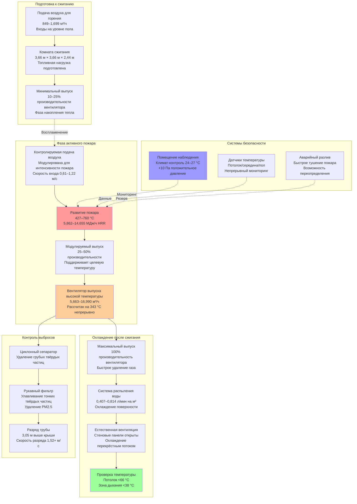

## Обзор проектирования

Объекты обучения тушению пожаров подвергают пожарных реалистичным условиям пожара в контролируемых учебных зданиях сжигания. Системы HVAC должны обеспечивать достаточное количество воздуха для горения для поддержания учебных пожаров, выдерживать экстремальные температуры свыше 649 °C, защищать оборудование от термического повреждения, удалять продукты горения между учебными эволюциями и быстро охлаждать конструкции для последующих пожаров. Проектирование уравновешивает требования интенсивности пожара с безопасностью инструкторов, защитой конструкции и соответствием экологическим нормам.

Фундаментальная инженерная задача включает управление потоками газа высокой температуры при сохранении контролируемых условий горения. В отличие от пожаров в зданиях, учебные пожары происходят повторно в одной и той же конструкции, что требует механических систем, которые облегчают воспламенение, поддерживают горение при желаемых интенсивностях, полностью выпускают продукты и восстанавливают условия окружающей среды между эволюциями.

## Требования к подаче воздуха для горения

### Расчёты стехиометрического воздуха

Полное сгорание учебного топлива требует точной подачи воздуха для достижения целевых интенсивностей пожара. Недостаточный воздух производит неполное сгорание и избыточный дым, а избыток воздуха снижает температуры и создаёт нереалистичные условия обучения.

**Теоретическое требование воздуха**: Для типичного учебного топлива класса A (деревянные поддоны, солома, ориентированная древесная стружка):

$$A_{theo} = \frac{m_{fuel} \cdot s}{0.232}$$

Где:
- $A_{theo}$ = теоретическое требование воздуха (кг воздуха/кг топлива)
- $m_{fuel}$ = скорость расхода топлива (кг/ч)
- $s$ = стехиометрическое соотношение (типично 6-8 для целлюлозных материалов)
- 0.232 = массовая доля кислорода в воздухе

**Практическая подача воздуха**: Операции обучения требуют избыточного воздуха выше стехиометрических значений:

$$Q_{combust} = A_{theo} \cdot m_{fuel} \cdot (1 + EA) \cdot \frac{1}{\rho_{air}}$$

Где:
- $Q_{combust}$ = скорость подачи воздуха для горения (м³/ч)
- $EA$ = коэффициент избыточного воздуха (типично 0,20–0,50, представляющий 20–50% избыток)
- $\rho_{air}$ = плотность воздуха при условиях подачи (1,225 кг/м³ при стандартных условиях)

**Пример расчёта**: Комната сжигания с расходом 91 кг/ч деревянных поддонов (s = 7,5):

$$A_{theo} = \frac{91 \cdot 7.5}{0.232} = 2,941 \text{ кг воздуха/ч}$$

При 30% избыточном воздухе ($EA$ = 0,30):

$$Q_{combust} = \frac{2,941 \cdot 1.30}{1.225} = 3,116 \text{ м³/ч (1,833 CFM)}$$

### Проектирование системы подачи воздуха

**Системы естественной вентиляции**: Простые объекты полагаются на естественное движение воздуха:
- Входные отверстия низкого уровня, размеры для скорости входа 0,30–0,61 м/с
- Минимальная площадь входа 0,14 м² на 293 кДж/ч тепловыделения
- Несколько входов, распределённых по периметру комнаты сжигания
- Регулируемые жалюзи контролируют подачу воздуха и интенсивность пожара
- Минимальная свободная площадь 70% номинального размера входа с учётом сопротивления жалюзи

**Механические системы подачи**: Выделенные вентиляторы подачи воздуха для горения для контролируемых условий:
- Центробежные вентиляторы с номинальной мощностью для прерывистого воздействия высокой температуры
- Преобразователи переменной частоты модулируют подачу воздуха к целевым интенсивностям пожара
- Воздуховоды подачи изолированы и защищены от тепла рядом с комнатами сжигания
- Обратные предохранительные клапаны предотвращают обратный поток горячего газа во время пожаров
- Производительность вентилятора 849–1,699 м³/ч на типичную комнату сжигания (3,66 м × 3,66 м × 2,44 м)

**Расположение входов воздуха**: Стратегическое размещение оптимизирует горение и видимость:
- Входы на уровне пола создают развитие пожара в восходящем направлении (реалистичное обучение)
- Несколько входов предотвращают предпочтительные воздушные каналы
- Скорость входа ограничена 0,91 м/с для предотвращения чрезмерной турбулентности
- Защита от прямого воздействия пламени с использованием огнеупорных экранов

## Системы выпуска высокой температуры

### Тепловые требования системы выпуска

**Условия температуры**: Выхлопные газы во время активного пожара достигают экстремальных температур:

| Фаза пожара | Температура газа | Продолжительность | Требования выпуска |
|-------------|------------------|-------------------|--------------------|
| Воспламенение | 204–316 °C | 5–10 мин | Минимальный выпуск, максимальное накопление тепла |
| Рост | 427–649 °C | 10–20 мин | Контролируемый выпуск поддерживает интенсивность |
| Полностью развитый | 538–760 °C | 15–30 мин | Полный выпуск предотвращает повреждение конструкции |
| Спад | 316–482 °C | 20–40 мин | Увеличенный выпуск ускоряет охлаждение |
| Вентиляция после сжигания | 93–204 °C | 30–60 мин | Максимальный выпуск для быстрого охлаждения |

**Расчёт тепловыделения**: Производительность системы выпуска на основе теплоотдачи пожара:

$$Q_{exhaust} = \frac{HRR}{c_p \cdot \rho_{gas} \cdot \Delta T}$$

Где:
- $Q_{exhaust}$ = необходимая скорость выпуска (м³/ч)
- $HRR$ = скорость тепловыделения (кДж/ч), типично 5,862–14,655 МДж/ч для учебных пожаров
- $c_p$ = удельная теплоёмкость газов сгорания (1,005 кДж/кг·°C)
- $\rho_{gas}$ = плотность газа при температуре выпуска (кг/м³)
- $\Delta T$ = повышение температуры выше окружающей среды (°C)

Для плотности газа при повышенной температуре:

$$\rho_{gas} = \frac{1.225 \cdot 288}{273 + T_{gas}}$$

Где $T_{gas}$ — температура выхлопного газа в °C.

### Компоненты системы выпуска

**Вентиляторы выпуска высокой температуры**: Специализированные вентиляторы выдерживают газы горения:
- Конструкция, устойчивая к искрам (алюминий или нержавеющая сталь)
- Клиноременная передача изолирует двигатель от горячего потока газа
- Колесо и корпус рассчитаны на 343 °C непрерывно, 538 °C прерывисто
- Виброизоляция защищает вентилятор от сил теплового расширения
- Производительность 5,663–16,990 м³/ч на учебное здание сжигания

**Переменное управление выпуском**: Модулирующий выпуск регулирует интенсивность пожара и тепловое воздействие:
- Управление VFD регулирует выпуск от 25% (накопление пожара) до 100% (охлаждение после сжигания)
- Автоматическое управление на основе температуры в комнате или переопределения инструктора
- Минимальный выпуск во время фазы роста пожара поддерживает высокие температуры
- Максимальный выпуск во время охлаждения уменьшает время между учебными эволюциями

**Материалы воздуховодов выпуска**:
- Нержавеющая сталь калибра 1,6 мм (304 или 316) для устойчивости к коррозии
- Изолированная двухслойная конструкция защищает окружающую конструкцию
- Расширительные швы компенсируют тепловое расширение (до 152 мм на 30,5 м)
- Минимальный уклон 2% в сторону дренажа конденсата удаляет влагу
- Скорость разряда 1,27–1,78 м/с предотвращает накопление конденсата

**Проектирование дымовой трубы**: Требования терминального разряда:
- Разряд выхлопных газов минимум 3,05 м над уровнем крыши
- Высота трубы расширяется на 0,91 м выше любой поверхности в радиусе 6,10 м
- Дождевой колпак и искрогаситель защищают от погодных условий и содержат искры
- Мониторинг температуры стека обеспечивает безопасные условия разряда
- Скорость разряда минимум 1,52 м/с для подъёма плюма и дисперсии

## Тепловая защита оборудования HVAC

### Тепловая защита оборудования

**Огнеупорные барьеры**: Физическое разделение защищает оборудование от лучистого тепла:
- Керамическая волокнистая изоляция (рассчитана на 1,260 °C) выстилает внутренние поверхности комнаты сжигания
- Минимальная толщина 51 мм на стенах, прилегающих к механическому оборудованию
- Облицовка из нержавеющей стали защищает изоляцию от физического повреждения
- Воздушный зазор между огнеупором и конструкционной сталью предотвращает передачу тепла проводимостью

**Тепловые барьеры для воздуховодов**: Изоляция воздуховодов и тепловые экраны:
- Высокотемпературная изоляция из минеральной ваты (рассчитана на непрерывное воздействие 232 °C)
- Алюминиевая оболочка защищает изоляцию от механического повреждения
- Минимум 152 мм воздушного зазора между горячими воздуховодами и горючими материалами
- Радиационные экраны (листовой металл) отражают лучистое тепло от воздуховодов

**Расположение оборудования**: Стратегическое размещение минимизирует тепловое воздействие:
- Вентиляторы выпуска расположены в кровельных пентхаусах вдали от комнат сжигания
- Приёмно-раздающие установки подачи воздуха находятся в отдельных механических комнатах с огнестойким разделением
- Панели управления и приборная часть находятся в климат-контролируемых помещениях наблюдения
- Холодильное оборудование изолировано от зон высокой температуры

### Системы охлаждения конструкции

**Система водяного распыления после сжигания**: Ускоряет охлаждение между учебными эволюциями:
- Форсунки разливного типа распыляют внутренние поверхности после завершения сжигания
- Расход воды 0,407–0,814 л/мин на м² площади поверхности
- Продолжительность распыления 5–10 минут снижает температуру поверхности ниже 93 °C
- Система дренажа удаляет воду и пар из комнат сжигания
- Блокировка интегрирована с вентиляторами выпуска для эвакуации пара

**Структурная вентиляция**: Естественное и механическое охлаждение:
- Открываемые стеновые панели создают перекрёстную вентиляцию во время охлаждения
- Открытие панели создаёт 8–12 воздухообменов в час естественной вентиляции
- Механический выпуск дополняет естественную вентиляцию по мере необходимости
- Датчики температуры подтверждают охлаждение до безопасного уровня входа (ниже 49 °C)

## Удаление продуктов горения

### Требования к выпуску после сжигания

**Эффективность вентиляции**: Полное удаление дыма и газов сгорания:

$$t_{purge} = \frac{V}{Q_{exhaust} \cdot E}$$

Где:
- $t_{purge}$ = время для достижения приемлемых условий (минуты)
- $V$ = объём комнаты сжигания (м³)
- $Q_{exhaust}$ = скорость выпуска (м³/ч)
- $E$ = эффективность вентиляции (0,5–0,8 для смешивающей вентиляции, 0,8–1,0 для вытеснения)

**Пример**: Комната сжигания 3,66 м × 3,66 м × 2,44 м (32,6 м³) с выпуском 3,399 м³/ч и смешивающей вентиляцией ($E$ = 0,6):

$$t_{purge} = \frac{32.6}{3,399 \cdot 0.6} = 0.016 \text{ часа} = 57 \text{ секунд}$$

Требуется несколько воздухообменов для приемлемых условий (типично 10–15 воздухообменов):

$$t_{total} = t_{purge} \cdot ACH_{required} = 0.016 \cdot 12 = 0.192 \text{ часа} = 11.5 \text{ минут}$$

### Удаление твёрдых частиц и газов

**Системы фильтрации**: Обработка выхлопа для соответствия экологическим нормам:
- Сухие скрубберы удаляют твёрдые частицы с помощью циклонного разделения
- Рукавные фильтры улавливают тонкие твёрдые частицы (PM2.5 и меньше)
- Материал фильтра рассчитан на непрерывное воздействие 204 °C
- Автоматическая очистка фильтра (обратный воздушный импульс) поддерживает перепад давления
- Сборники золы требуют еженедельного опорожнения

**Мониторинг выбросов**: Непрерывный мониторинг обеспечивает соответствие нормативам:
- Мониторы прозрачности измеряют видимые выбросы (целевой показатель ниже 20% прозрачности)
- Мониторы CO измеряют неполное сгорание (типичный диапазон 100–500 ppm)
- Мониторинг температуры подтверждает достаточное время пребывания для полного сгорания
- Регистрация данных демонстрирует соответствие разрешениям на качество воздуха

## Управление тепловой нагрузкой во время пожаров

### Стратегии контроля температуры

**Модуляция интенсивности пожара**: Контроль тепловыделения управляет тепловым воздействием:

$$HRR = m_{fuel} \cdot H_c \cdot \chi$$

Где:
- $HRR$ = скорость тепловыделения (кДж/ч)
- $m_{fuel}$ = скорость расхода топлива (кг/ч)
- $H_c$ = теплота сгорания (типично 32,5–39,4 МДж/кг для деревянных продуктов)
- $\chi$ = эффективность горения (0,6–0,9 в зависимости от вентиляции)

**Методы контроля**:
- Регулировка топливной нагрузки (увеличение/уменьшение количества топлива)
- Модуляция подачи воздуха (ограничение воздуха снижает интенсивность)
- Регулировка выпуска (увеличенный выпуск охлаждает газы, снижает температуры потолка)
- Применение водяного тумана (тонкий туман поглощает тепло без тушения пожара)

### Защита инструктора

**Климат-контроль помещения наблюдения**: Безопасные позиции для наблюдения требуют охлаждения:
- Отдельная система HVAC поддерживает области наблюдения при 24–27 °C
- Положительное давление предотвращает инфильтрацию дыма (минимум +10 Па)
- Окна из закалённого стекла или поликарбоната выдерживают лучистое тепло
- Аварийная вентиляция очищает дым при отказе окон

**Системы подачи дыхательного воздуха**: Подаваемый воздух для инструкторов в комнатах сжигания:
- SCBA (автономный респиратор) обязателен во время активных пожаров
- Линии подачи воздуха для продолжительных периодов наблюдения
- Качество дыхательного воздуха соответствует стандартам CGA Grade D
- Резервная подача воздуха для аварийного выхода

## Вентиляция и охлаждение после сжигания

### Требования быстрого охлаждения

Учебные объекты максимизируют использование за счёт быстрого охлаждения конструкции между пожарами. Целевое время охлаждения с 649 °C до 49 °C (безопасный вход) в течение 60–90 минут позволяет проводить несколько учебных эволюций в день.

**Расчёт скорости охлаждения**:

$$\frac{dT}{dt} = -\frac{h \cdot A \cdot (T_{surface} - T_{air})}{m \cdot c_p}$$

Где:
- $\frac{dT}{dt}$ = скорость охлаждения (°C/мин)
- $h$ = коэффициент конвективного теплообмена (кВт/м²·°C)
- $A$ = площадь поверхности (м²)
- $T_{surface}$ = температура поверхности (°C)
- $T_{air}$ = температура воздуха (°C)
- $m$ = тепловая масса (кг)
- $c_p$ = удельная теплоёмкость (кДж/кг·°C)

**Улучшенные методы охлаждения**:
1. **Максимальный механический выпуск**: 100% производительность вентилятора эвакуирует горячие газы
2. **Дополнение естественной вентиляции**: Откройте все стеновые панели для перекрёстного потока
3. **Применение водяного распыления**: Испарительное охлаждение поглощает значительное тепло
4. **Принудительная циркуляция воздуха**: Портативные вентиляторы увеличивают конвективное охлаждение

### Проверка охлаждения

**Мониторинг температуры**: Непрерывное измерение подтверждает безопасный вход:
- Термопары на уровне потолка, середины высоты и уровне пола
- Целевые температуры: потолок ниже 66 °C, зона дыхания ниже 38 °C
- Тепловизионные камеры сканируют на предмет горячих точек
- Звуковые и визуальные сигналы сигнализируют об условиях безопасного входа

**Проверка целостности конструкции**: Осмотр элементов, подверженных воздействию тепла:
- Визуальный осмотр огнеупорного материала на предмет отслаивания или трещин
- Конструкционные элементы из стали проверяются на деформацию
- Стыки воздуховода выпуска проверяются на разделение из-за теплового цикла
- Документирование любых повреждений, требующих ремонта перед следующим пожаром

## Диаграмма потока вентиляции при обучении тушению пожаров

## Таблица параметров проектирования

| Параметр | Типичный диапазон | Основание проектирования | Примечания |
|----------|-------------------|------------------------|----------|
| **Подача воздуха для горения** |
| Расход на комнату сжигания | 849–1,699 м³/ч | Стехиометрический + 20–50% избыток | Варьируется с топливной нагрузкой |
| Скорость входа | 0,30–0,91 м/с | Минимизация турбулентности, равномерное распределение | Более высокая скорость для механических систем |
| Свободная площадь входа | 0,14 м² на 293 кДж/ч HRR | Достаточный перепад давления | Регулировка по сопротивлению жалюзи |
| **Система выпуска** |
| Производительность вентилятора выпуска | 5,663–16,990 м³/ч | Объём здания и интенсивность пожара | Больше для множественных одновременных пожаров |
| Рассчитанная температура вентилятора | 343 °C непрерывно, 538 °C прерывисто | Выдержать пиковые температуры выпуска | Включить коэффициент безопасности |
| Скорость в воздуховоде | 1,27–1,78 м/с | Предотвращение оседания конденсата | Более высокая скорость в вертикальных участках |
| Высота дымовой трубы | 3,05 м минимум выше крыши | Дисперсия плюма и тяга | Увеличение рядом с воздухозаборниками |
| **Пределы температуры** |
| Максимальная температура потолка | 649–760 °C | Реальность обучения, защита конструкции | Ограничено огнеупорным рейтингом |
| Область наблюдения инструктора | 24–27 °C | Комфорт и безопасность персонала | Отдельный климат-контроль |
| Безопасная температура входа | Потолок <66 °C, зона дыхания <38 °C | Рекомендации NFPA | Измеряется после охлаждения |
| Температура газа выпуска | 204–649 °C активный пожар | Варьируется с фазой пожара | Непрерывный мониторинг |
| **Производительность охлаждения** |
| Время охлаждения | 60–90 минут | Операционная эффективность | 649 °C до 49 °C безопасного входа |
| Воздухообмены после сжигания | 10–15 ACH | Полное удаление газа | Выше для больших объёмов |
| Расход водяного распыления | 0,407–0,814 л/мин на м² | Испарительное охлаждение | Продолжительность 5–10 минут |
| **Защита конструкции** |
| Толщина огнеупорной изоляции | 51–102 мм | Рейтинг тепловой защиты | Керамическое волокно, рассчитано на 1,260 °C |
| Воздушный зазор к горючим материалам | 152 мм минимум | Защита от лучистого тепла | Требование кода |
| Разделение оборудования | Огнестойкие стены, отдельные помещения | Долговечность оборудования | Минимизация теплового воздействия |
| **Контроль выбросов** |
| Эффективность удаления твёрдых частиц | 95–99% | Соответствие нормативам | Производительность рукавного фильтра |
| Прозрачность стека | <20% | Лимит видимых выбросов | Непрерывный мониторинг |
| Концентрация CO | 100–500 ppm типично | Индикатор эффективности горения | Выше при неполном сгорании |

## Интеграция системы и управление

**Автоматизация зданий**: Централизованное управление координирует фазы пожара:
- Проверка предварительного списка перед сжиганием (топливо загружено, персонал очищен, выпуск работает)
- Автоматизированная последовательность сжигания (воспламенение, рост, устойчивая, фаза спада)
- Модуляция выпуска на основе температуры поддерживает целевые условия
- Автоматизация охлаждения после сжигания (водяное распыление, максимальный выпуск, вентиляция)
- Блокировки безопасности предотвращают небезопасные операции

**Блокировки безопасности**: Критическая защита системы:
- Работа вентилятора выпуска проверена перед разрешением воспламенения
- Система разлива вооружена и контролируется давление во время всех пожаров
- Кнопки аварийной остановки расположены на позициях инструктора
- Автоматическое активирование пожаротушения при превышении температуры
- Система учёта персонала подтверждает эвакуацию всех обучаемых

**Переопределение инструктора**: Ручное управление доступно в любое время:
- Позиционирование демпфера воздуха для горения
- Регулировка скорости вентилятора выпуска
- Активирование системы водяного распыления
- Открытие панели аварийной вентиляции
- Все автоматизированные последовательности подчиняются управлению инструктора

Объекты обучения тушению пожаров представляют одно из наиболее требовательных к теплу приложений HVAC. Успешные проекты обеспечивают адекватное снабжение воздухом для горения, удаляют высокотемпературные продукты горения, защищают оборудование и конструкцию от теплового повреждения и обеспечивают быстрое охлаждение между учебными эволюциями при сохранении безопасности инструктора на протяжении всех операций.
