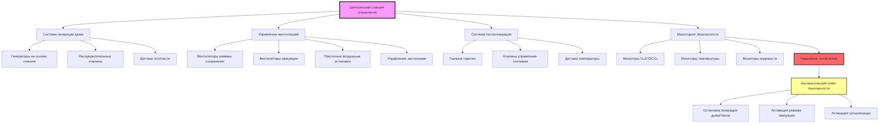

## Обзор системы

Учебные полигоны пожарной подготовки с дымом представляют уникальные вызовы для HVAC, требующие точного контроля плотности дыма, управления температурой при проведении упражнений с открытым огнем или моделированием, и быстрой эвакуации дыма после тренировки. Система должна сбалансировать реалистичные условия обучения с безопасностью обучающихся благодаря изощренной генерации дыма, контролю вентиляции и мониторингу качества воздуха.

Фундаментальное требование проектирования сосредоточено на управлении параметрами среды с дымом при сохранении выживаемости обучающихся. В отличие от стандартных систем HVAC зданий, которые устраняют дым, системы учебных заведений должны генерировать, сдерживать, управлять и затем быстро эвакуировать дым по требованию.

## Системы генерации дыма

### Театральные генераторы дыма

Современные учебные заведения используют театральные генераторы дыма, производящие плотный, нетоксичный дым для упражнений по поиску и спасению.

**Генераторы на основе гликоля**: основной метод производства дыма для обучения:
- Нагреваемое испарение пропиленгликоля или смесей глицерина с водой
- Производительность 85-565 м³/ч плотного белого дыма
- Регулируемая производительность для контроля переменной плотности
- Нетоксичная формулировка, безопасная при длительном воздействии на обучающихся
- Рабочая температура 175-230°C на испарительном элементе

**Проектирование системы распределения**:
- Несколько точек впрыска по всей учебной конструкции
- Трубопровод подачи дыма диаметром 51-102 мм от генераторов
- Управление по зонам позволяет выборочное развертывание дыма по комнатам или этажам
- Автоматические системы управления поддерживают целевые диапазоны видимости
- Датчики плотности дыма обеспечивают обратную связь для скорости генерации

**Расчет контроля видимости**:

Оптическая плотность дыма, необходимая для определенного расстояния видимости:

$$OD = \log_{10}\left(\frac{100}{V_d}\right) \times \frac{L}{3.28}$$

Где:
- $OD$ = Оптическая плотность (коэффициент экстинкции, м⁻¹)
- $V_d$ = Требуемое расстояние видимости (футы)
- $L$ = Длина пути через дым (метры)

Типичные целевые значения обучения: видимость 0,9-1,8 м для операций поиска, видимость 0-0,9 м для упражнений с нулевой видимостью.

**Определение размера генератора**:

Требуемая скорость генерации дыма зависит от объема объекта и инфильтрации:

$$Q_{smoke} = \frac{V \times ACH}{60} + Q_{leak}$$

Где:
- $Q_{smoke}$ = Скорость генерации дыма (CFM выход дыма)
- $V$ = Объем учебного объекта (ft³)
- $ACH$ = Требуемые воздухообмены в час для поддержания плотности (типичные 0,5-2 ACH)
- $Q_{leak}$ = Потери инфильтрации и открывания дверей (CFM)

### Генераторы дыма с теплом

Передовые учебные заведения используют контролируемые источники тепла, создающие термическое расслоение и реалистичные условия пожара.

**Газовые тепловые генераторы**:
- Горелки на природном газе или пропане, производящие тепло и продукты сгорания
- Выход 1.4-2.9 ГДж/ч на единицу
- Температура потолка 93-204°C, создающая термическое расслоение
- Автоматизированное управление топливом поддерживает целевые температуры потолка
- Требует непрерывного мониторинга и предохранительных блокировок

**Системы безопасности для тепловых генераторов**:
- Непрерывный мониторинг температуры потолка с отключением по верхнему пределу
- Мониторинг уровня кислорода (отключение ниже 19,5% O₂)
- Мониторинг монооксида углерода (сигнал тревоги при 100 ppm, отключение при 200 ppm)
- Станции ручного аварийного отключения у всех выходов
- Автоматическое перекрытие топлива при потере вентиляции

## Вентиляция и контроль дыма

### Вентиляция в обычном режиме обучения

Во время активных тренировочных упражнений системы вентиляции работают в режиме сохранения дыма, поддерживая контролируемую среду.

**Минимальные требования вентиляции**:

| Режим обучения | Скорость вентиляции | Назначение |
|---|---|---|
| Сохранение дыма | 0,5-1 ACH | Замена кислорода, потребляемого персоналом |
| Предварительная очистка | 6-10 ACH | Удаление остаточного дыма перед началом |
| Эвакуация после упражнения | 12-20 ACH | Быстрое удаление дыма |
| Режим ожидания | 2-4 ACH | Фоновая вентиляция |

**Проектирование приточного воздуха**:
- Нижний уровень введения (30-45 см над полом)
- Кондиционированный наружный воздух 13-21°C для предотвращения дискомфорта от тепла
- Производительность 50-100% от расхода вытяжки в режиме сохранения
- Увеличение до 100% в режиме эвакуации
- Отдельное управление по зонам для объектов с несколькими комнатами

**Вытяжка при сохранении дыма**:
- Точки высокоуровневой вытяжки на потолке (сохраняет тепловой слой)
- Вентиляторы с переменной скоростью поддерживают небольшое отрицательное давление
- Скорость вытяжки сбалансирована между подачей кислорода и потерей дыма
- Перепад давления -2 до -5 Па относительно наружного воздуха предотвращает неконтролируемую утечку

### Эвакуация дыма после упражнения

Быстрое удаление дыма между тренировочными эволюциями требует высокопроизводительной вытяжки с заменой наружного воздуха.

**Определение размера вентилятора эвакуации**:

$$Q_{evac} = \frac{V \times ACH_{evac}}{60} \times SF$$

Где:
- $Q_{evac}$ = Производительность эвакуационной вытяжки (CFM)
- $V$ = Объем объекта (ft³)
- $ACH_{evac}$ = Воздухообмены при эвакуации (типичные 12-20 ACH)
- $SF$ = Коэффициент безопасности (1,15-1,25 для потерь в воздуховодах)

Для учебного здания объемом 283 м³ с эвакуацией 15 ACH:
$$Q_{evac} = \frac{10,000 \times 15}{60} \times 1.2 = 3,000 \text{ CFM (5,100 м³/ч)}$$

**Конфигурация системы вытяжки**:
- Вентиляторы эвакуации, отдельные от вытяжки в режиме сохранения
- Точки высокой и низкой вытяжки для полного удаления дыма
- Вытяжка на уровне потолка сначала удаляет горячий верхний слой
- Вытяжка на уровне пола завершает эвакуацию, удаляя прохладный дым
- Автоматизированное управление: сначала потолочные вентиляторы, затем напольные после падения температуры

**Приточный воздух для эвакуации**:
- Механизированные приточные воздушные установки соответствуют расходу эвакуационной вытяжки
- Введение наружного воздуха через несколько точек низкого уровня
- Перекрестная вентиляция направляет дым к точкам вытяжки
- Нагреваемый приточный воздух предотвращает тепловой шок (минимум 10°C)

## Системы управления теплом

### Контроль температуры во время упражнений

Упражнения с открытым огнем и тепловые тренировки создают значительные тепловые нагрузки, требующие управления для безопасности обучающихся и защиты здания.

**Пределы температуры потолка**:
- Тренировочные упражнения: максимальная температура потолка 149-204°C
- Тренировка при flashover (продвинутая): контролируемые условия 316-427°C
- Защита конструкции: максимальная поддерживаемая температура стены 121°C
- Уровень пола: максимум 49°C для безопасности обучающихся

**Активные стратегии охлаждения**:

**Тепловое разбавление**: контролируемое введение наружного воздуха снижает пиковые температуры:
- Вентиляторы приточного воздуха с переменной скоростью увеличивают поток при высоком тепле
- Прохладный воздух введен ниже нейтральной плоскости (типично 1,2-1,8 м над полом)
- Регулировка расхода на основе показаний термопары потолка
- Сбалансирование требования охлаждения против сохранения дыма

**Охлаждение водяным туманом**: передовые системы для экстремального контроля тепла:
- Тонкие форсунки водяного тумана (100-200 микрон капель) на уровне потолка
- Испарительное охлаждение поглощает тепло без чрезмерного увлажнения
- Автоматизированная активация при предустановленных температурах потолка
- Импульсная работа минимизирует подачу воды и дренаж

### Защита здания от теплового воздействия

**Теплоизолированная конструкция**:
- Внутренние стены: одеяло из керамического волокна толщиной 25-51 мм (RSI 1,4-2,8)
- Потолок: подвесная система из керамической доски или одеяла (RSI 1,8-3,5)
- Пол: бетонная плита с дополнительным огнеупорным покрытием для экстремального тепла
- Наружные стены: стандартная изоляция плюс внутренний тепловой барьер

**Управление тепловой массой**:
- Бетонная и кирпичная конструкция поглощает тепло во время упражнения
- Вентиляция после упражнения включает продленный период охлаждения
- Минимум 30-60 минут восстановления между упражнениями с высоким тепловыделением
- Мониторинг температуры подтверждает возврат к безопасному исходному состоянию

## Требования контроля видимости

### Мониторинг оптической плотности

Точный контроль плотности дыма обеспечивает согласованные условия обучения и предотвращает опасное избыточное задымление.

**Системы измерения видимости**:
- Оптические передатчики пучка измеряют пропускание света через дым
- Путь пучка 3-15 м в зависимости от размера объекта
- Несколько мест измерения для картирования пространственной плотности
- Обратная связь в реальном времени к системе управления генерацией дыма

**Целевые диапазоны видимости**:

| Цель обучения | Расстояние видимости | Оптическая плотность | Концентрация дыма |
|---|---|---|---|
| Легкий дым | 4,5-9 м | 0,05-0,1 м⁻¹ | Начальные условия поиска |
| Умеренный дым | 1,8-4,5 м | 0,1-0,3 м⁻¹ | Стандартный поиск и спасение |
| Плотный дым | 0,9-1,8 м | 0,3-0,5 м⁻¹ | Продвинутые операции поиска |
| Нулевая видимость | 0-0,9 м | 0,5-1,0 м⁻¹ | Тренировка в экстремальных условиях |

**Автоматический контроль плотности**:
- PLC-система управления поддерживает целевую оптическую плотность
- Контур обратной связи регулирует скорость генерации дыма каждые 10-30 секунд
- Управление по отдельным зонам позволяет варьировать условия по комнатам
- Пределы безопасности предотвращают чрезмерную плотность (максимум 1,2 м⁻¹ типично)

### Управление расслоением

Контроль термического расслоения поддерживает реалистичные условия пожара с чистым нижним слоем и заполненным дымом верхним слоем.

**Управление нейтральной плоскостью**:
- Целевая высота нейтральной плоскости 1,2-1,8 м над полом (пространство ползания внизу)
- Перепад температуры 28-56°C между потолком и полом поддерживает расслоение
- Скорость приточного воздуха <0,25 м/с предотвращает нарушение слоя
- Вытяжка только из верхнего слоя сохраняет интерфейс

## Мониторинг качества воздуха

### Непрерывный мониторинг безопасности

Комплексный мониторинг газов защищает обучающихся во время упражнений с немедленными сигналами тревоги при опасных условиях.

**Требуемые параметры мониторинга**:

| Параметр | Нормальный диапазон | Уровень сигнала | Уровень отключения | Тип датчика |
|---|---|---|---|---|
| Кислород (O₂) | 20,9% | <19,5% | <19,0% | Электрохимический |
| Монооксид углерода (CO) | 0-50 ppm | 100 ppm | 200 ppm | Электрохимический |
| Двуокись углерода (CO₂) | 400-1000 ppm | 5000 ppm | 10000 ppm | NDIR |
| Температура (зона дыхания) | 16-38°C | 49°C | 60°C | Термопара |
| Температура (потолок) | 38-149°C | 204°C | 260°C | Термопара |

**Размещение датчиков**:
- Датчики зоны дыхания на высоте 1,2-1,8 м над полом (высота обучающегося при ползании)
- Несколько мест по всему объекту (минимум 1 на 46 м²)
- Датчики температуры потолка каждые 3-4,5 м
- Датчики вытяжного воздуховода контролируют качество выхлопного воздуха
- Дисплей управления показывает все параметры в реальном времени

**Ответные действия**:
- Уровень сигнала: слышимая и визуальная сигнализация, уведомление инструктора
- Уровень отключения: автоматическая остановка генерации дыма, активация режима эвакуации, сигнал эвакуации обучающихся
- Возможность ручного переопределения на станции управления
- Логирование событий для анализа после упражнения

### Защита персонала

**Дыхательная защита**:
- Все обучающиеся используют SCBA (автономные дыхательные аппараты) во время упражнений с дымом
- Подача воздуха независима от атмосферы объекта
- Минимум 30-минутная номинальная емкость SCBA
- Система напарников и отслеживание численности персонала обязательны

**Аварийный выход**:
- Освещенные выходные знаки видны через дым
- Несколько путей выхода из всех учебных зон
- Сигнал аварийной эвакуации (сирена, стробоскоп) активирован при отключении
- Двери разблокируются автоматически при подаче сигнала тревоги

## Управление и интеграция системы

### Архитектура системы управления

### Режимы работы

**Подготовка перед упражнением** (5-10 минут):
1. Проверить функциональность всех систем безопасности
2. Установить целевые параметры плотности дыма и температуры
3. Активировать вентиляцию в режиме сохранения (0,5-1 ACH)
4. Начать генерацию дыма до целевой плотности
5. Активировать тепловые генераторы при необходимости тепловой тренировки
6. Подтвердить видимость и качество воздуха в требуемых параметрах

**Тренировочное упражнение** (типично 15-30 минут):
1. Поддерживать плотность дыма посредством автоматического управления
2. Непрерывный мониторинг безопасности с обновлениями каждые 10 секунд
3. Возможность переопределения инструктором для регулировки плотности
4. Вентиляция в режиме сохранения сохраняет условия
5. Приточный воздух обеспечивает минимальное восполнение кислорода

**Эвакуация после упражнения** (5-15 минут):
1. Немедленно остановить генерацию дыма и тепла
2. Переключиться на вентиляцию в режиме эвакуации (12-20 ACH)
3. Активировать все вентиляторы вытяжки и приточные воздушные установки
4. Контролировать падение температуры и очистку от дыма
5. Подтвердить возврат качества воздуха к норме перед повторным входом

**Режим ожидания**:
1. Фоновая вентиляция поддерживает качество воздуха (2-4 ACH)
2. Все датчики безопасности остаются активны
3. Объект готов к подготовке следующей эволюции
4. Температура нормализуется к условиям окружающей среды

## Рекомендации по проектированию

**Определение размера объекта**: емкость тренировочной эволюции определяет требуемый объем:
- Однокомнатный тренажер: 28-85 м³
- Многокомнатный тренажер жилого типа: 142-425 м³
- Многоэтажный коммерческий тренажер: 566-1416 м³
- Больший объем требует пропорционально большей производительности генерации дыма и эвакуации

**Материалы конструкции**:
- Негорючая или ограниченно горючая конструкция по всему периметру
- Тепловые барьеры защищают конструктивные элементы
- Герметичная конструкция предотвращает неконтролируемую утечку дыма
- Окна и двери рассчитаны на тепловое воздействие и перепад давления

**Доступность для обслуживания**:
- Генераторы дыма требуют еженедельной очистки (удаление остатков гликоля)
- Газовые горелки требуют квартальной проверки и ежегодной сертификации
- Калибровка датчиков каждые 6-12 месяцев в зависимости от типа
- Доступ вентилятора вытяжки для смазки подшипников и проверки ремней

**Соответствие нормативам**:
- NFPA 1403: Стандарт на упражнения по пожарной подготовке с открытым огнем
- NFPA 1402: Руководство по строительству учебных центров пожарной службы
- Требования IMC к вытяжке и вентиляции
- Одобрение местного начальника пожарной охраны для операций с открытым огнем

Учебные полигоны пожарной подготовки с дымом требуют специализированных систем HVAC, сбалансирующих реалистичные условия обучения с абсолютными требованиями безопасности. Надлежащая интеграция генерации дыма, контроля вентиляции, управления теплом и комплексного мониторинга создает эффективные учебные среды, подготавливающие пожарных к реальным условиям при защите их здоровья и безопасности.
