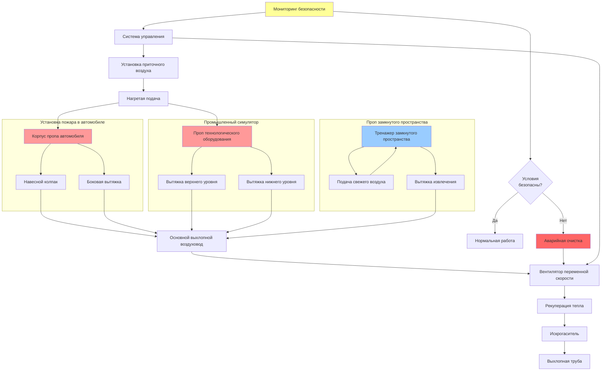

Тренировочные установки и симуляторы пожаротушения требуют специализированных HVAC систем для управления интенсивными тепловыми нагрузками, координации с эффектами дыма, обеспечения безопасности обучающихся и создания реалистичных сценариев при сохранении качества внутреннего воздуха. Эти системы должны обеспечивать баланс между эффективностью обучения и производительностью вентиляции.

## Вентиляция установки для моделирования пожара в автомобиле

Тренировочные установки для моделирования пожара в автомобиле генерируют значительное количество тепла и продуктов сгорания, требующих специальных систем вытяжки.

**Требования к вытяжке:**

Установки для автомобилей требуют вентиляции высокой производительности:

$$Q_{veh} = V_{prop} \times ACH + Q_{fire}$$

где $V_{prop}$ — объём корпуса установки (м³), $ACH$ — число воздухообменов в час (минимум 15-20), и $Q_{fire}$ — вклад скорости выделения тепла (типично 1000-3400 м³/ч на автомобиль).

**Характеристики конструкции системы:**

- Навесные колпаки с минимальной скоростью захвата 0,76 м/с
- Боковая вытяжка для захвата горизонтального слоя дыма
- Вентиляторы переменной скорости для адаптации к различным интенсивностям пожара
- Теплостойкие воздуховоды, рассчитанные на непрерывное воздействие 538°C
- Искрогасители и ловушки пламени в выхлопных путях
- Аварийная пропускная способность 30+ ACH
- Отдельные системы приточного воздуха для предотвращения обратного потока

**Контроль температуры:**

Охлаждение после упражнения требует:

$$t_{cool} = \frac{m_{prop} \times c_p \times \Delta T}{Q_{cool}}$$

где $m_{prop}$ — масса установки, $c_p$ — удельная теплоёмкость, $\Delta T$ — снижение температуры, и $Q_{cool}$ — производительность охлаждающего воздуха. Типичные периоды охлаждения составляют 15-45 минут.

## HVAC промышленного симулятора сценариев

Промышленные симуляторы пожара воспроизводят технологическое оборудование, резервуары для хранения и химические сценарии со сложными потребностями вентиляции.

**Стратегии вентиляции:**

Многозонные системы вытяжки решают следующие задачи:

- Удаление дыма с высокого уровня (вытяжки на потолке)
- Сбор паров с низкого уровня (забор со стороны пола)
- Периферийная вентиляция для зон безопасности обучающихся
- Специальные вытяжки для установок с воспламеняющимися парами
- Взрывозащищённое оборудование в классифицированных зонах

**Управление тепловой нагрузкой:**

Промышленные установки генерируют тепловые нагрузки 584-2930 кВт, требующие:

$$Q_{exhaust} = \frac{q_{sensible}}{1.08 \times \Delta T}$$

где $q_{sensible}$ — чувствительное тепловое усиление (кВт) и $\Delta T$ — повышение температуры (типично 56-111°C).

## Потребности вентиляции установок спасения

Установки замкнутого пространства, обрушения конструкций и вытаскивания автомобилей требуют дышащего воздуха для участников.

**Критерии вентиляции:**

- Минимум 14 м³/ч на одного обучаемого в установках замкнутого пространства
- Мониторинг CO с автоматическим увеличением вентиляции при 35 ppm
- Поддержание уровня кислорода выше 19,5% по объёму
- Фильтрация твёрдых частиц приточного воздуха (минимум MERV 13)
- Системы аварийного впрыска свежего воздуха
- Положительное давление в зонах наблюдения инструктора

**Отношения давлений:**

Установки замкнутого пространства поддерживают:

$$\Delta P = P_{ambient} - P_{prop} = -0,05 \text{ до } -0,13 \text{ см водяного столба}$$

Это небольшое отрицательное давление содержит загрязняющие вещества, позволяя безопасный вход/выход.

## Рассмотрение переносных установок

Мобильные тренировочные установки представляют уникальные HVAC проблемы, требующие гибких решений.

**Подходы к проектированию:**

- Автономные вентиляторы вытяжки с гибким воздуховодом
- Временные установки приточного воздуха с распределительными воздуховодами
- Быстроразъёмные вентиляционные соединения
- Портативные системы обнаружения газа и мониторинга
- Оборудование с питанием от аккумулятора или генератора
- Защищённые от атмосферных условий органы управления и электропроводка

**Расчёты производительности:**

Переносные установки требуют:

$$\text{м³/ч}_{portable} = V_{prop} \times 20 \text{ ACH} \times 1,2$$

Коэффициент 1,2 учитывает утечки и неполный захват во временных установках.

## Интеграция эффектов тепла и дыма

Координация вентиляции с эффектами обучения требует сложного управления.

**Координация системы:**

- Поэтапная активация вентиляции (отложенная для накопления дыма)
- Переменные скорости вытяжки, синхронизированные с интенсивностью пожара
- Интеграция генератора дыма с паттернами движения воздуха
- Совместимость с тепловизионной съёмкой (минимальное нарушение стратификации температуры)
- Программируемые последовательности вентиляции для реалистичности сценария

**Управление дымом:**

Театральные системы генерации дыма требуют:

- 5-10 ACH во время генерации дыма (сниженная вентиляция)
- 15-30 ACH для операций очистки
- Отдельные вытяжки для токсичных продуктов сгорания и театрального дыма
- Воздушные завесы в выходах установок для локализации эффектов

## Системы мониторинга безопасности

Интегрированный мониторинг обеспечивает защиту обучающихся во время реалистичных сценариев.

**Требования мониторинга:**

| Параметр | Порог сигнала тревоги | Уровень действия |
|-----------|----------------------|------------------|
| Концентрация CO | 35 ppm (8-часовой TWA) | 50 ppm (немедленное увеличение вентиляции) |
| Температура | 149°C | 204°C (прекращение упражнения) |
| Уровень кислорода | 19,5% | 19,0% (аварийная вентиляция) |
| Видимость | 3,05 м | 1,52 м (изменение сценария) |
| Тепловой поток | 5 кВт/м² | 10 кВт/м² (вмешательство безопасности) |

**Автоматические реакции:**

- Мгновенное отключение вентиляции при опасных условиях
- Слышимые/визуальные тревоги с отключением установки
- Регистрация данных для анализа после упражнения
- Интеграция с системами пожарной сигнализации здания

## Система вентиляции тренировочной установки

## Типы установок и требования HVAC

| Тип установки | Скорость вытяжки | Приточный воздух | Специальные требования |
|---------------|-----------------|-----------------|----------------------|
| Пожар в автомобиле | 3800-5700 м³/ч | 3300-5200 м³/ч | Высокотемпературный воздуховод, искрогаситель |
| Пожар в самолёте | 7100-11900 м³/ч | 6600-10900 м³/ч | Взрывозащищённые вентиляторы, координация подавления пеной |
| Пожар на кухне | 1400-2400 м³/ч | 1200-2100 м³/ч | Очистка жирного воздуховода, интеграция системы ansul |
| Промышленный резервуар | 4700-9500 м³/ч | 4300-8500 м³/ч | Обнаружение паров, классифицированная электропроводка |
| Замкнутое пространство | 700-1400 м³/ч | 950-1650 м³/ч | Подача положительного давления, мониторинг кислорода |
| Обрушение конструкции | 950-1900 м³/ч | 850-1700 м³/ч | Сбор пыли, фильтрация HEPA |
| Сценарий hazmat | 2400-4700 м³/ч | 2100-4300 м³/ч | Материалы, устойчивые к химикатам, скрубберы |
| Лесной пожар | 2800-7100 м³/ч | 2600-6600 м³/ч | Переход наружу/внутрь, защита от атмосферных условий |

**Соображения проектирования:**

Системы HVAC тренировочных установок должны обеспечивать:

- Быстрое удаление тепла для проведения последовательных тренировочных эволюций
- Гибкое управление для различной интенсивности сценариев
- Избыточный мониторинг безопасности с автоматическими отключениями
- Минимальное влияние на реалистичность обучения
- Рекуперация энергии, где это целесообразно (нагретый приточный воздух)
- Соответствие NFPA 1402 (Стандарту учебных объектов)

Надлежащее проектирование вентиляции позволяет учебным центрам проводить интенсивную, реалистичную подготовку, защищая участников и сохраняя целостность объекта. Производительность системы должна соответствовать пиковым нагрузкам при экономичной работе в режиме повседневного использования.
