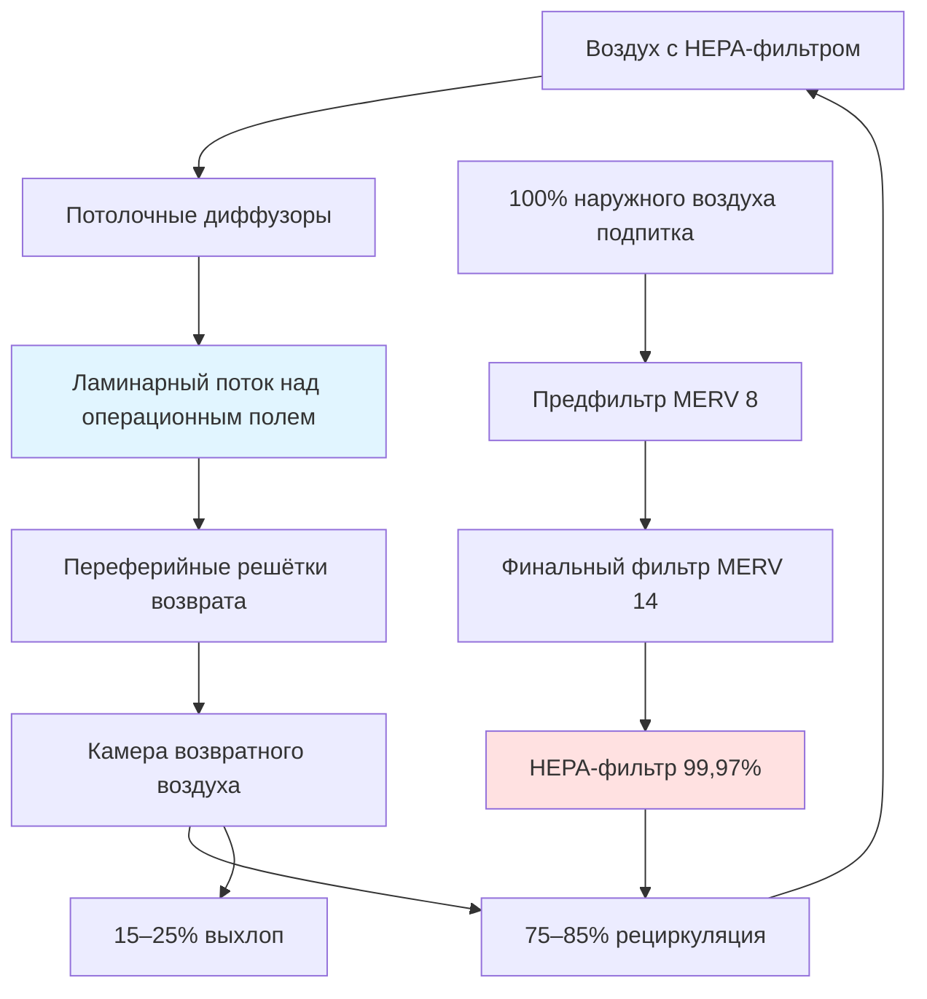

# Системы HVAC для медицинских учреждений

Системы HVAC медицинских учреждений выполняют критические функции безопасности жизни, выходящие за рамки комфорта пользователей. Надлежащее проектирование предотвращает передачу болезней воздушно-капельным путём, поддерживает стерильные условия для хирургических операций, контролирует условия фармацевтического компаундирования и обеспечивает среду для восстановления пациентов. Стандарт ASHRAE 170 и рекомендации Facility Guidelines Institute (FGI) устанавливают обязательные соотношения давлений, скорости вентиляции, требования к фильтрации, ограничения по температуре и диапазоны влажности для медицинских помещений.

## Соотношения давлений и схемы воздушных потоков

Дифференциалы давления между помещениями контролируют миграцию переносимых по воздуху загрязняющих веществ. Помещения с положительным давлением защищают пользователей от внешних загрязнений, а помещения с отрицательным давлением содержат инфекционные агенты или опасные материалы.

### Проектирование каскада давления

Фундаментальный принцип, управляющий соотношениями давлений в здравоохранении:

$$\Delta P = \frac{Q \cdot \rho}{2 \cdot C_d \cdot A} \times \frac{1}{3600^2}$$

Где:
- ΔP = дифференциал давления (Па)
- Q = дифференциал воздушного потока между помещениями (м³/ч)
- ρ = плотность воздуха (кг/м³)
- C_d = коэффициент расхода (обычно 0,6–0,65 для подрезок дверей)
- A = площадь утечки (м²)

Минимальные целевые значения проектирования составляют дифференциал 2,5 Па в условиях закрытой двери, увеличиваясь до 7,5–12,5 Па для критических помещений. Это требует примерно 40–60 м³/ч дифференциала через типичные подрезки дверей.

### Требования к давлению в помещениях

| Тип помещения | Соотношение давления | Минимальный дифференциал (Па) | Воздухообмены в час | Воздухообмены наружным воздухом в час |
|------------|---------------------|-------------------------------|---------------------|----------------------------|
| Операционные | Положительное к коридору | +2,5 | 20 | 4 |
| Защитная среда (PE) | Положительное к предбаннику | +2,5 | 12 | 2 |
| Изоляция воздушной инфекции (AII) | Отрицательное к коридору | -2,5 | 12 | 2 |
| Бронхоскопия | Отрицательное к коридору | -2,5 | 12 | 2 |
| Фармацевтический компаундинг (USP 797) | Положительное к смежному | +5–12,5 | 30+ | Переменное |
| Лаборатория – биологическая безопасность | Отрицательное к коридору | -2,5 | 6–12 | 2 |
| Помещение для грязных расходников | Отрицательное к коридору | -2,5 | 10 | 2 |
| Чистое рабочее помещение | Положительное к коридору | +2,5 | 4 | 2 |

**Функция предбанника:**

Предбанники обеспечивают переходы давления и барьеры контроля загрязнения. Существуют три конфигурации:

1. **Положительный предбанник** (AII-люкс): положительное к коридору, положительное к изолирующему помещению. Позволяет надевать ЛСЗ без воздействия загрязнения.
2. **Отрицательный предбанник** (PE-люкс): отрицательное к коридору, отрицательное к защитной среде. Содержит загрязнение во время входа.
3. **Нейтральный предбанник** (двойной функции): может переключаться для поддержки либо AII, либо PE в зависимости от потребностей пациента.

## Проектирование HVAC операционной

Операционные требуют наивысшего уровня контроля окружающей среды для минимизации риска инфекции хирургического поля (SSI). Температура, влажность, схемы скорости воздуха и концентрация твёрдых частиц напрямую влияют на исходы пациентов.

### Распределение воздушного потока

### Спецификации операционной

**Критические параметры:**

| Параметр | Требование | Допуск | Место измерения |
|-----------|------------|-----------|---------------------|
| Температура | 20–24 °C (регулируемая) | ±1 °C | 1,2 м над полом |
| Относительная влажность | 20–60% | ±5% | Среднее по помещению |
| Воздухообмены | 20 ACH минимум | +10% / -0% | Полная подача |
| Наружный воздух | 4 ACH минимум | +10% / -0% | Выделенный ОА |
| Давление | +2,5 Па мин | ±1,25 | К коридору |
| Фильтрация | HEPA терминальные фильтры | 99,97% @ 0,3 мкм | Воздух подачи |
| Счётность твёрдых частиц | ISO класс 7 (в покое) | По ISO 14644 | Операционное поле |

**Обоснование контроля температуры:**

Более низкие температуры (20–21 °C) снижают тепловой стресс хирургической команды во время длительных операций, одновременно минимизируя скорость роста бактерий. Связь между температурой и временем удвоения бактерий:

$$t_d = \frac{\ln(2)}{k \cdot e^{-E_a/(R \cdot T)}}$$

Время генерации бактерий экспоненциально увеличивается при понижении температуры ниже оптимального диапазона роста (36,7–37,8 °C).

**Контроль влажности:**

Поддержание 20–60% ОВ уравновешивает контроль инфекций с предотвращением электростатических разрядов. Ниже 20% ОВ статическое электричество угрожает электронике и создаёт риск искр рядом с легковоспламеняющимися анестетиками. Выше 60% ОВ ускоряется пролиферация бактерий и грибков. Выделенные системы наружного воздуха с осушением десиккантом обеспечивают превосходный контроль влажности по сравнению с обычным осушением на основе охлаждения.

### Ламинарный поток в сравнении с турбулентным смешиванием

**Ламинарный (однонаправленный) поток:**
- Скорость воздуха подачи: 0,13–0,18 м/с вниз
- Область покрытия: минимум 2,4 × 2,4 м над операционным столом
- Коэффициент разбавления твёрдых частиц: в 100–1000 раз больше, чем при турбулентном потоке
- Применение: замена ортопедических суставов, сердечно-сосудистые операции, нейрохирургия
- Надбавка за стоимость: 40–60% сверх турбулентных систем

**Турбулентное смешивание (обычное):**
- Скорость воздуха подачи: 0,13–0,25 м/с у лица диффузора
- Распределение: периферийные или множественные потолочные диффузоры
- Эффективность смешивания: зависит от разбавления воздухообменами
- Применение: общая хирургия, акушерство, эндоскопия
- Стоимость: стандартная медицинская конструкция

Системы ламинарного потока демонстрируют снижение глубоких хирургических инфекций поля на 20–50% при ортопедических имплантологических процедурах. Анализ стоимости-выгоды оправдывает внедрение для высокорисковых операций, где последствия инфекции серьёзны.

## Помещения с изоляцией воздушной инфекции

Помещения с изоляцией воздушной инфекции (AII) содержат пациентов с подозреваемыми или подтверждёнными переносимыми воздушно-капельным путём инфекциями, включая туберкулёз, корь, ветряную оспу и появляющиеся респираторные патогены.

### Требования к помещению AII

**Производительность вентиляции:**

$$ACH = \frac{Q}{V} \times 60$$

Где:
- ACH = воздухообмены в час
- Q = полный расход подачи воздуха (м³/ч)
- V = объём помещения (м³)

Минимум 12 воздухообменов полного воздуха с минимум 2 воздухообменами наружным воздухом. Для эффективности удаления патогенов:

$$t_{99\%} = \frac{\ln(100)}{ACH} \times 60 = \frac{276}{ACH} \text{ минут}$$

Помещение с 12 воздухообменами удаляет 99% переносимых по воздуху твёрдых частиц за 23 минуты. Увеличение до 15 воздухообменов снижает время удаления до 18 минут.

**Мониторинг давления:**

Непрерывный мониторинг давления с визуальными индикаторами (манометрами или цифровыми дисплеями) вне каждого помещения AII обеспечивает немедленную проверку состояния отрицательного давления. Системы сигнализации должны предупреждать персонал, когда дифференциал давления падает ниже -2,5 Па.

**Обработка выхлопного воздуха:**

Три подхода для обработки выхлопного воздуха помещения AII:

1. **Фильтрация HEPA перед выхлопом**: 99,97% эффективность при 0,3 мкм улавливает M. tuberculosis (1–5 мкм). Позволяет рециркуляцию или безопасный выхлоп.
2. **Прямой выхлоп в атмосферу**: требует анализа места выхлопа для предотвращения повторного поступления. Минимум 7,6 м от воздухозаборов, открываемых окон, пешеходных зон.
3. **Ультрафиолетовое облучение (UVGI)**: длина волны 254 нм обеспечивает дополнительную дезинфекцию в выхлопных каналах. Требования дозы варьируются в зависимости от организма.

### Проектирование предбанника для AII

Варианты конфигурации предбанника:

**Тип 1: Положительный предбанник (предпочтительно для защиты персонала)**
- Предбанник положительный к коридору и помещению AII
- Персонал надевает ЛСЗ в чистой среде
- Предотвращает выход загрязнённого воздуха при открытии дверей
- Требует на 10–15% большую подачу, чем выхлоп помещения AII

**Тип 2: Отрицательный предбанник (максимальное содержание)**
- Предбанник отрицательный к коридору, положительный к помещению AII
- Двойной барьер содержания
- Повышенное энергопотребление
- Используется для патогенов высокого риска

## Требования к фильтрации по типам помещений

Фильтрация в здравоохранении удаляет твёрдые частицы, микроорганизмы и аллергены при минимизации перепада давления и потребления энергии.

### Стандарты эффективности фильтра

| Категория помещения | Фильтр банк 1 (предфильтр) | Фильтр банк 2 (финальный) | Целевой размер твёрдых частиц | Основание эффективности |
|----------------|------------------------|-------------------|---------------------|-----------------|
| Операционные | MERV 14 (85%) | HEPA 99,97% | 0,3 мкм | Бактерии, споры |
| Защитная среда | MERV 14 | HEPA 99,97% | 0,3 мкм | Споры Aspergillus |
| ОИТ, критическое состояние | MERV 14 | MERV 14 | 1,0 мкм | Общие биоаэрозоли |
| Палаты пациентов | MERV 8 | MERV 14 | 3,0 мкм | Пыльца, перхоть |
| Изоляция воздушной инфекции | MERV 8 | MERV 14 | 1,0 мкм | M. tuberculosis |
| Аптеки (стерильные) | MERV 8 | HEPA 99,97% | 0,3 мкм | Загрязнение твёрдыми частицами |
| Лаборатории | MERV 8 | MERV 14 | 1,0 мкм | Переменное в зависимости от функции |

**Влияние перепада давления фильтра:**

Полное системное давление увеличивается с загрузкой фильтра:

$$\Delta P_{total} = \Delta P_{clean} + \Delta P_{loading}$$

HEPA-фильтры: 125–250 Па чистые, 375–500 Па при замене
Фильтры MERV 14: 75–125 Па чистые, 200–300 Па при замене

Энергия вентилятора увеличивается пропорционально перепаду давления. Манометры Magnehelic или датчики дифференциального давления контролируют загрузку фильтра для активирования замены до деградации производительности системы.

## Помещения защитной среды

Помещения защитной среды (PE) содержат тяжелобольных иммунокомпрометированных пациентов (трансплантация костного мозга, химиотерапия, реципиенты трансплантации органов), которые чрезвычайно уязвимы к грибковым инфекциям окружающей среды, особенно виду Aspergillus.

### Параметры проектирования помещения PE

**Спецификации окружающей среды:**

- Положительное давление: минимум +2,5 Па к коридору
- Воздухообмены: минимум 12 ACH
- Наружный воздух: минимум 2 ACH
- Фильтрация: HEPA 99,97% терминальные фильтры на подаче
- Температура: 20–24 °C
- Относительная влажность: 40–60%
- Герметичная конструкция помещения: отсутствие щелей для роста грибков

**Установка HEPA-фильтра:**

Терминальные HEPA-фильтры должны устанавливаться в потолок или стену помещения, чтобы предотвратить загрязнение от накопления твёрдых частиц в воздуховодах. Герметичное соединение на геле или острие ножа предотвращает утечку обхода. Испытание утечки на месте согласно IEST-RP-CC034 проверяет целостность фильтра.

**Предотвращение проникновения воды:**

Aspergillus размножается во влажных строительных материалах. Проектирование помещения PE требует:

- герметичной конструкции стен и потолка
- отсутствия ковролина (содержит споры грибков)
- водонепроницаемых поверхностей в санузлах пациентов
- непрерывного мониторинга давления в ограждающей конструкции здания
- немедленного устранения любых утечек воды в течение 24–48 часов

## Стратегии контроля влажности

Контроль влажности в здравоохранении предотвращает рост плесени, контролирует электростатические разряды и поддерживает комфорт пациентов. ASHRAE 170 требует 20–60% ОВ в большинстве помещений, с более узкими диапазонами для определённых областей.

### Подходы к осушению

**Осушение на основе охлаждения:**

Традиционные охлаждающие спирали удаляют влагу через конденсацию, когда температура воздуха падает ниже точки росы. Эффективность зависит от условий входящего воздуха и температуры спирали:

$$W_{removed} = 60 \cdot Q \cdot \rho \cdot (w_1 - w_2)$$

Где:
- W = скорость удаления влаги (кг/ч)
- Q = расход воздуха (м³/ч)
- ρ = плотность воздуха (кг/м³)
- w₁, w₂ = коэффициенты влажности входящего и выходящего воздуха (кг_воды/кг_сухого воздуха)

**Ограничения**: невозможно достичь низкую влажность без перепроизводства охлаждения и повторного нагрева, расходуя энергию.

**Осушение десиккантом:**

Твёрдые или жидкие десиканты химически поглощают влагу без охлаждения. Регенерация требует тепла (60–82 °C для твёрдых десикантов). Энергоэффективно при наличии источников регенерационного тепла (рекуперация отходящего тепла, солнечное тепловое отопление, газовые горелки).

**Выделенные системы наружного воздуха (DOAS):**

DOAS с колёсами рекуперации энергии отдельно обрабатывают скрытые нагрузки от явного охлаждения. Наружный воздух осушается до точки росы подачи (обычно 10–13 °C), затем нагревается до нейтральной температуры перед подачей в помещения. Параллельные системы явного охлаждения (охлаждаемые балки, радиантные панели, вентиляторные катушки) обрабатывают явные нагрузки помещения без штрафа за влажность.

## Специальные соображения

### Люкс магнитно-резонансной томографии (МРТ)

Магниты МРТ требуют выделенных систем HVAC:

- Немагнитные воздуховоды и компоненты в магнитном поле (обычно нержавеющая сталь или алюминий)
- Выделённое охлаждение для криогенных систем магнита: 35–42 кВт в зависимости от напряженности поля
- Аварийный выхлоп при сбросе: 1,4–4,7 м³/с пропускной способности для безопасного выпуска газа гелия в наружное пространство
- Акустический контроль: градиентные спирали МРТ генерируют более 100 дБА звука, требуя изоляции

### Фармацевтический компаундинг (USP 797/800)

**Стерильный компаундинг (USP 797):**

- ISO класс 5 первичные инженерные средства контроля (ламинарные потоки шкафов)
- ISO класс 7 буферное помещение, окружающее шкафы
- ISO класс 8 предбанник для облачения
- Каскад положительного давления: чистое к менее чистому
- Фильтрация HEPA во всех помещениях

**Компаундинг опасных лекарств (USP 800):**

- Отрицательное давление по всей зоне компаундирования
- Первичные инженерные средства контроля содержания (с наружным выхлопом)
- Минимум 12 воздухообменов, 100% выхлоп (без рециркуляции)
- Отрицательное давление к смежным помещениям на -50–75 Па

### Требования к аварийному питанию

Системы вентиляции, обеспечивающие безопасность жизни, требуют резервного аварийного питания:

- Операционные: поддерживают полные условия окружающей среды
- Помещения AII: поддерживают выхлоп и отрицательное давление
- Помещения PE: поддерживают подачу и положительное давление
- Зоны критического ухода: минимум 4 воздухообмена вентиляции
- Системы дымоудаления: полная пропускная способность

Переключение на аварийное питание должно происходить в течение 10 секунд для критических систем безопасности жизни.

## Заключение

Системы HVAC медицинских учреждений требуют строгого соответствия ASHRAE 170, рекомендациям FGI и применимым кодексам. Соотношения давлений предотвращают перекрёстное загрязнение, скорости вентиляции разбавляют переносимые по воздуху патогены, а фильтрация удаляет твёрдые частицы, которые вызывают инфекции. Проектирование операционной уравновешивает температуру для комфорта хирургической команды с контролем влажности и фильтрацией HEPA для профилактики инфекций. Pressurизация изолирующего помещения содержит или защищает уязвимых пациентов в зависимости от медицинских потребностей. Успешное проектирование HVAC в здравоохранении интегрирует принципы контроля инфекций с энергоэффективностью посредством технологий, включая DOAS, рекуперацию энергии и оптимизированные стратегии фильтрации.
