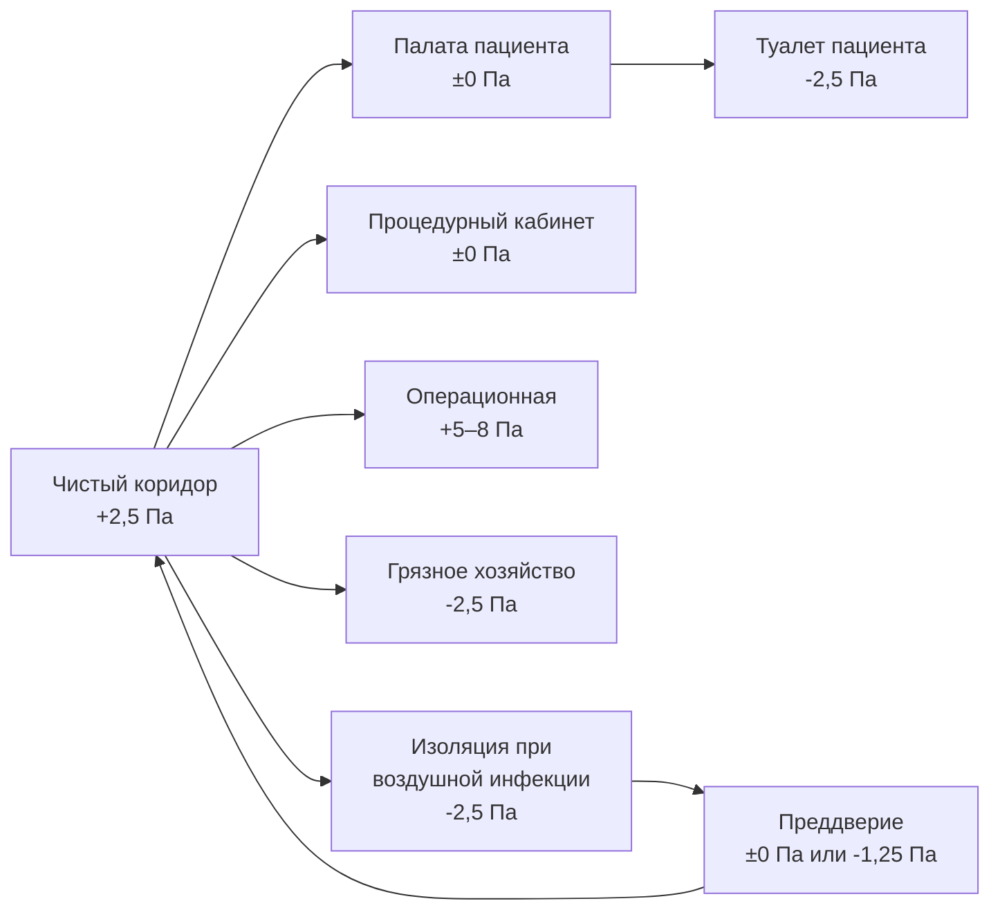
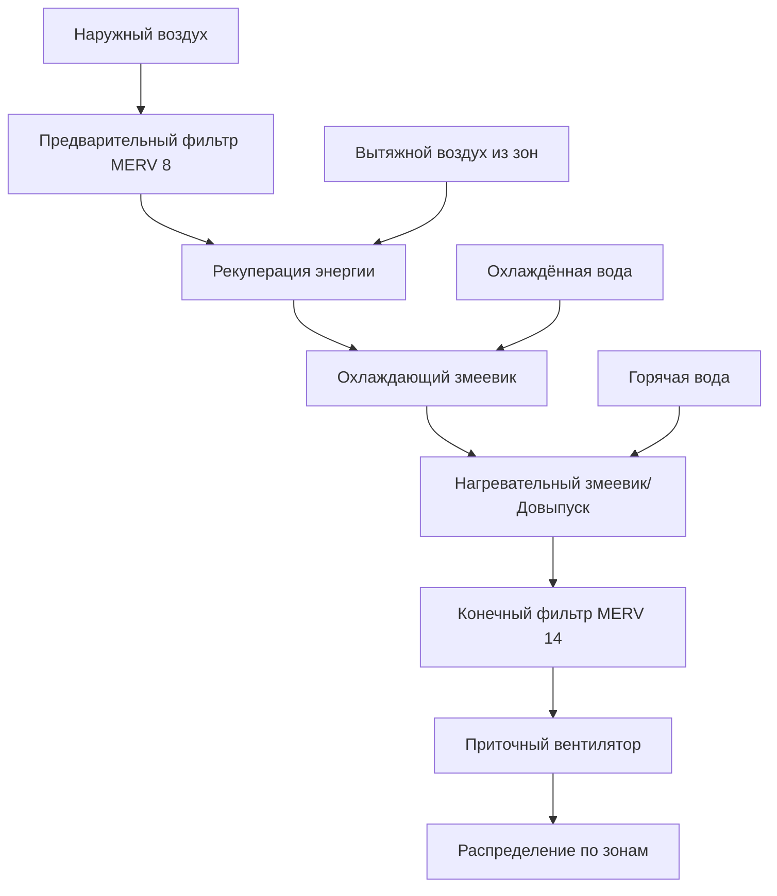

# Системы HVAC в больницах

Системы HVAC в больницах функционируют как критическая инфраструктура контроля инфекций, поддерживая точные условия окружающей среды, которые напрямую влияют на исходы лечения пациентов, уровень инфекций хирургических ран и безопасность медицинских работников. В отличие от обычных зданий, больничные системы должны одновременно решать противоречивые требования в различных помещениях: операционные с положительным давлением, палаты изоляции с отрицательным давлением, строгий контроль твёрдых частиц и непрерывную работу без остановок на техническое обслуживание. Стандарт ASHRAE 170 и рекомендации Facility Guidelines Institute (FGI) по проектированию и строительству больниц устанавливают минимальные критерии производительности для соотношений давления, вентиляции, температуры, влажности и фильтрации, которые формируют основу проектирования медицинских учреждений.

## Нормативно-правовая база и стандарты

### Основные стандарты проектирования

Проектирование систем HVAC в больницах должно соответствовать множеству перекрывающихся стандартов и кодексов:

**Стандарт ASHRAE 170**: Вентиляция медицинских учреждений устанавливает минимальные скорости вентиляции, соотношения давления, диапазоны температур, ограничения влажности, требования к воздухообмену и эффективность фильтрации для всех медицинских помещений. Этот консенсусный стандарт формирует основу для большинства государственных и местных кодексов здравоохранения.

**Рекомендации FGI**: Facility Guidelines Institute опубликовывает всеобъемлющие рекомендации по проектированию и строительству, обновляемые каждые 4 года. Эти рекомендации превышают минимальные требования ASHRAE 170 во многих областях и устанавливают требования для операционных блоков, отделений визуализации и специализированных зон лечения.

**NFPA 99**: Код безопасности медицинских учреждений рассматривает системы безопасности жизнедеятельности, включая медицинские газы, электрические системы и требования надёжности системы HVAC.

**Рекомендации CDC**: Центры по контролю и профилактике заболеваний публикуют рекомендации по контролю инфекций, которые влияют на проектирование HVAC, особенно для палат изоляции при воздушной инфекции и защитных помещений.

**Государственные и местные кодексы**: Многие юрисдикции принимают модифицированные версии национальных стандартов с дополнительными требованиями. Стандарт California Title 24, нормативные акты Department of Health штата Нью-Йорк и требования местного отдела здравоохранения часто устанавливают более строгие критерии, чем национальные минимумы.

### Иерархия проектных решений

Когда возникают конфликты между стандартами, обычно применяется следующая иерархия:

1. Требования местного отдела здравоохранения (наиболее строгие)
2. Государственные кодексы здравоохранения и нормативные акты
3. Рекомендации FGI (если приняты органом, имеющим юрисдикцию)
4. Стандарт ASHRAE 170
5. Международный механический кодекс (IMC) или Единый механический кодекс (UMC)
6. Главы справочника ASHRAE по применению (руководство по проектированию)

## Соотношения давления и конфигурации воздушного потока

### Стратегия каскада давления

Соотношения давления в больницах предотвращают перекрёстное загрязнение между помещениями путём контроля направления воздушного потока. Воздух движется из чистых помещений в загрязнённые, от зон высокого давления к зонам низкого давления.

**Иерархия давления для типичного этажа больницы:**

**Расчёт перепада давления:**

Объёмный дисбаланс, необходимый для поддержания перепада давления, зависит от характеристик герметичности оболочки:

$$\Delta Q = C_d A \sqrt{\frac{2 \Delta P}{\rho}}$$

Где:
- $\Delta Q$ = Объёмный дисбаланс между подачей и вытяжкой (CFM)
- $C_d$ = Коэффициент расхода (0,65 – типичное значение для подрезов двери)
- $A$ = Площадь утечки (м²)
- $\Delta P$ = Перепад давления (Па)
- $\rho$ = Плотность воздуха (1,2 кг/м³)

**Упрощённые критерии проектирования:**

Для типового больничного строительства с подрезами дверей и обычной герметичностью оболочки следующие смещения поддерживают указанные перепады давления:

| Перепад давления | Приблизительное смещение воздушного потока |
|----------------------|---------------------------|
| ±2,5 Па | 35–60 м³/ч на дверь |
| +5 Па | 70–95 м³/ч на дверь |
| -2,5 Па | 35–60 м³/ч на дверь |
| +8 Па | 95–120 м³/ч на дверь |

### Требования давления в критических помещениях

**Помещения с положительным давлением (предотвращают попадание загрязнения):**

- Операционные: минимум +5 Па, предпочтительно +8 Па относительно коридора
- Родовые: минимум +5 Па
- Лаборатории сердечной катетеризации: минимум +5 Па
- Защитные помещения (PE): минимум +2,5 Па
- Стерильная обработка (чистые зоны): минимум +2,5 Па
- Фармацевтическая компаундирующая комната (чистые комнаты): минимум +5 Па

**Помещения с отрицательным давлением (содержат загрязнение):**

- Палаты изоляции при воздушной инфекции (AII): минимум -2,5 Па
- Процедурные кабинеты бронхоскопии: минимум -2,5 Па
- Морги: минимум -5 Па
- Помещения грязного хозяйства: минимум -2,5 Па
- Помещения дезактивации: минимум -5 Па
- Преддверие изоляции: -1,25 Па относительно коридора (вариант 1) или ±0 Па (вариант 2)

**Помещения нейтрального давления:**

- Общие палаты пациентов: слегка положительное рекомендуется (+1,25 Па)
- Процедурные кабинеты: нейтральное приемлемо
- Коридоры: положительное относительно внешней среды, нейтральное относительно защитных помещений

### Мониторинг давления и сигнализация

ASHRAE 170 требует непрерывного мониторинга давления для:
- Всех палат изоляции при воздушной инфекции
- Всех защитных помещений
- Всех операционных и процедурных кабинетов

**Условия срабатывания сигнализации:**
- Визуальная и звуковая индикация при падении давления ниже минимума
- Задержка перед сигналом тревоги (30–60 секунд) для предотвращения ложных срабатываний при открытии двери
- Удалённая передача сигнала в управление объектом и инфекционный контроль
- Историческое отслеживание для проверки при наладке

**Расположение датчика мониторинга:**
- Порт опорного давления в коридоре на среднюю высоту
- Порт давления в помещении пациента/хирургическом пространстве на среднюю высоту
- Избегать расположения рядом с приточными диффузорами или вытяжными решётками (минимум 1 м разделения)
- Защищено от повреждений и несанкционированного доступа

## Скорости вентиляции и воздухообмен

### Минимальные требования к наружному воздуху

Таблица 7-1 ASHRAE 170 определяет минимальные требования к наружному воздуху для медицинских помещений. В отличие от коммерческих зданий, использующих ASHRAE 62.1 (основанные на занятости и площади), медицинские учреждения используют скорости воздухообмена:

$$Q_{OA} = \frac{ACH_{OA} \times V_{room}}{60}$$

Где:
- $Q_{OA}$ = Требуемый наружный воздух (м³/ч)
- $ACH_{OA}$ = Воздухообмены наружного воздуха в час
- $V_{room}$ = Объём помещения (м³)

### Скорости воздухообмена по типам помещений

| Тип помещения | Всего воздухообменов в час | Минимум воздухообменов наружного воздуха | Соотношение давления | Примечания |
|------------|---------------------------|---------------------------|---------------------|-------|
| Операционная | минимум 20, рекомендуется 25 | 4 | Положительное | Хирургические пространства классов B/C |
| Защитное помещение | 12 | 2 | Положительное | Пациенты с ослабленным иммунитетом |
| Палата изоляции при воздушной инфекции | 12 | 2 | Отрицательное | ТБ, корь, COVID-19 |
| Палата пациента | 6 | 2 | Нейтральное/положительное | Общемедицинская хирургия |
| Коридор пациентов | 4 | 2 | Положительное к внешней среде | — |
| Отделение интенсивной терапии | 6 | 2 | Нейтральное/положительное | Аналогично палате пациента |
| Отделение неотложной помощи | 12 | 2 | Отрицательное предпочтительнее | Высокий риск инфекции |
| Бронхоскопия | 12 | 2 | Отрицательное | Аэрозолеобразующие процедуры |
| Морг | 12 | 3 | Отрицательное | Контроль инфекции |
| Фармацевтическая компаундирующая | 12 | 4 | Положительное | Требования USP 797/800 |
| Радиология (КТ/МРТ) | 6 | 2 | Нейтральное | Тепловыделение оборудования |
| Грязное хозяйство | 10 | 2 | Отрицательное | Обработка отходов |
| Стерильная обработка (чистая) | 10 | 4 | Положительное | Рекомендуется ISO 7 |

**Расчёт общего воздушного потока:**

Общий приточный воздух должен быть больше из:
1. Требуемых полных воздухообменов (из таблицы)
2. Требования холодильной нагрузки
3. Требования нагрузки отопления
4. Требование наружного воздуха + рециркуляция минимум

$$Q_{total} = \max\left(\frac{ACH \times V}{60}, \frac{Q_c}{1,08 \times \Delta T}, ACH_{OA} \times \frac{V}{60}\right)$$

**Рециркуляция в помещении:**

ASHRAE 170 разрешает рециркуляцию в пределах того же помещения для большинства пространств (исключения включают палаты изоляции при воздушной инфекции, помещения грязного хозяйства и определённые процедурные кабинеты). Однако воздух не может рециркулироваться из одной палаты пациента в другую или из зон пациентов в общественные коридоры.

## Требования к температуре и влажности

### Критерии контроля температуры

ASHRAE 170 устанавливает узкие диапазоны температур для комфорта пациентов и контроля инфекций. Температура в операционной напрямую влияет на частоту инфекций хирургических ран и требования к анестезии.

**Диапазоны температур по типам помещений:**

| Тип помещения | Диапазон температуры (°C) | Допуск управления | Обоснование |
|------------|----------------------|------------------|---------------|
| Операционная | 20–23 (регулируемая) | ±1 °C | Комфорт хирурга, контроль инфекции |
| Родовая | 20–23 | ±1 °C | Терморегуляция новорождённого |
| Палата пациента | 21–24 | ±2 °C | Комфорт пациента |
| Детское отделение новорождённых | 22–26 | ±1 °C | Терморегуляция младенца |
| Отделение интенсивной терапии | 21–24 | ±1 °C | Мониторинг пациента |
| МРТ кабинет | 20–23 | ±1 °C | Управление тепловыделением оборудования |
| Фармацевтическая компаундирующая | 20–23 | ±1 °C | Стабильность лекарств |

**Проектные соображения:**

Операционные требуют индивидуального контроля температуры с возможностью ручного переопределения. Хирургические бригады предпочитают разные температуры: ортопедическая хирургия часто 18–20 °C, а детская хирургия требует 22–24 °C. Расположение термостата должно быть за пределами стерильного поля, но доступно хирургической бригаде.

### Требования к контролю влажности

Контроль влажности в медицинских учреждениях служит множеству функций: контроль инфекции (передача бактерий и вирусов), контроль электростатического электричества (в операционных с воспламеняющимися анестетиками, исторически), стабильность лекарств и комфорт пациента.

**Диапазоны влажности:**

| Тип помещения | Диапазон относительной влажности | Альтернативное управление точкой росы | Критический фактор |
|------------|------------------------|----------------------------|-----------------|
| Операционная | 20–60 % ОВ | — | Контроль инфекции, электростатика |
| Родовая | 20–60 % ОВ | — | Контроль инфекции |
| Защитное помещение | 40–60 % ОВ | — | Подавление Aspergillus |
| Палата пациента | Максимум 60 % ОВ | — | Предотвращение плесени |
| Детское отделение новорождённых | 30–60 % ОВ | — | Комфорт младенца |
| Стерильная обработка | 30–60 % ОВ | — | Высушивание инструментов |
| Фармацевтическая компаундирующая | 30–60 % ОВ | Максимум 14 °C ТР | Требование USP 797 |

**Влияние управления влажностью на энергию:**

Поддержание контроля влажности, особенно минимальной ОВ зимой, представляет значительный штраф на энергию. Энергия увлажнения для 400-коечной больницы в холодном климате может превысить 2100 МВт·ч ежегодно.

$$Q_{humidification} = \frac{CFM \times \rho \times \Delta W \times h_{fg}}{\eta}$$

Где:
- $Q_{humidification}$ = Энергия увлажнения (кДж/ч)
- $CFM$ = Объём наружного воздуха
- $\rho$ = Плотность воздуха (1,2 кг/м³)
- $\Delta W$ = Увеличение коэффициента влажности (кг воды/кг сухого воздуха)
- $h_{fg}$ = Скрытая теплота испарения (2440 кДж/кг)
- $\eta$ = Эффективность увлажнителя

**Проблемы осушения:**

Летнее осушение во влажном климате требует агрессивного охлаждения для конденсации влаги, а затем повторного нагрева для поддержания температуры в помещении. Системы выделенного наружного воздуха (DOAS) с рекуперацией энергии обеспечивают превосходный контроль влажности по сравнению с обычными системами VAV.

## Требования фильтрации

### Стандарты эффективности фильтра

ASHRAE 170 и рекомендации FGI устанавливают минимальную эффективность фильтра, используя рейтинги MERV (Minimum Efficiency Reporting Value) согласно стандарту ASHRAE 52.2.

**Требования фильтрации по расположению:**

| Расположение | Предварительный фильтр MERV | Конечный фильтр MERV | Требование HEPA | Обоснование |
|-----------|---------------|------------------|------------------|---------------|
| Все впускные отверстия наружного воздуха | MERV 7 минимум | — | Нет | Защита подчинённого оборудования |
| Общие воздухообработчики (зоны пациентов) | MERV 7–8 | MERV 14 минимум | Нет | Общий контроль инфекции |
| Подача операционной | MERV 7–8 | MERV 14 минимум | HEPA рекомендуется | Профилактика инфекции хирургических ран |
| Защитное помещение | MERV 7–8 | MERV 17 (99,97 % HEPA) | Да | Защита Aspergillus |
| Фармацевтическая компаундирующая | MERV 7–8 | MERV 17 (HEPA) | Да | Требование USP 797 |
| Вытяжка палаты AII | — | HEPA (опционально) | Нет (если патогены не требуют) | Содержание воздушных патогенов |
| Подача стерильной обработки | MERV 7–8 | MERV 14 минимум | Нет | Хранение чистых инструментов |

**Влияние перепада давления на фильтр:**

Фильтры HEPA накладывают значительный перепад давления (250–510 Па чистые, 635–1020 Па при замене). Статическое давление вентилятора должно учитывать полную загруженность фильтра:

$$\Delta P_{system} = \Delta P_{ductwork} + \Delta P_{coils} + \Delta P_{filters,dirty} + \Delta P_{terminal}$$

**Стратегия замены фильтра:**

- Предварительные фильтры: заменить при перепаде давления 125 Па
- Конечные фильтры (MERV 14): заменить при перепаде давления 250–380 Па
- Фильтры HEPA: заменить при перепаде давления 635 Па или ежегодно (в зависимости от того, что наступит раньше)
- Вести записи о смене фильтров для аудита контроля инфекции

### Фильтрация операционной и конфигурации воздушного потока

Операционные требуют специального рассмотрения распределения воздуха и фильтрации, чтобы минимизировать концентрацию твёрдых частиц на хирургическом участке.

**Ламинарный поток против турбулентного смешивания:**

Традиционные системы турбулентного смешивания подают HEPA-отфильтрованный воздух через потолочные диффузоры с низкой скоростью (< 0,38 м/с), достигая 20–25 воздухообменов в час. Воздух в помещении хорошо перемешивается, разбавляя концентрацию твёрдых частиц.

Однонаправленные (ламинарные) системы потока используют большие массивы фильтров HEPA (2,4 × 3 м типичные) прямо над хирургическим столом, подавляя воздух с вертикальной скоростью 0,12–0,25 м/с. Ламинарный поток создаёт завесу чистого воздуха, которая уносит частицы от хирургического участка перед смешиванием с воздухом в помещении. Исследования показывают, что ламинарный поток снижает частоту инфекций хирургических ран в ортопедической имплантологии.

**Сравнение стратегий вентиляции операционной:**

| Параметр | Турбулентное смешивание (стандартное) | Однонаправленный ламинарный поток |
|-----------|----------------------------|----------------------------|
| Конфигурация подачи | 2×2 или 2×4 диффузоры, распределённые | Массив HEPA 2,4×3 м, над столом |
| Скорость подачи | < 0,38 м/с на диффузоре | 0,12–0,25 м/с вертикально |
| Воздухообмены в час | 20–25 | 40–60 (в чистой зоне) |
| Количество частиц (0,5 мкм) | < 122/см³ на хирургическом участке | < 12/см³ на хирургическом участке |
| Первоначальная стоимость | Базовая | 2,5–3,5× турбулентная система |
| Эксплуатационные расходы | Базовые | 1,5–2× турбулентная система |
| Применение | Общая хирургия | Ортопедические имплантаты, трансплантация |

## Конфигурации систем и подходы проектирования

### Системы выделенного наружного воздуха (DOAS)

Архитектура DOAS отделяет кондиционирование вентиляционного воздуха от управления чувствительной нагрузкой помещения, обеспечивая превосходный контроль влажности, последовательную подачу наружного воздуха и упрощённые последовательности управления.

**Компоненты системы DOAS:**

**Преимущества DOAS в здравоохранении:**
- Гарантированная подача наружного воздуха независимо от нагрузки помещения
- Превосходное осушение через более низкую температуру подачи воздуха
- Упрощённое управление давлением (постоянный объём вентиляции)
- Рекуперация энергии на 100% потоке вытяжного воздуха
- Снижение риска ошибок в последовательности управления, скомпрометировавших вентиляцию

**Стратегия реализации DOAS:**

DOAS обрабатывает наружный воздух (типично 2–4 воздухообмена), подавая нейтральный или слегка охлаждённый воздух в каждое помещение. Концевое оборудование (фанкойлы, охлаждённые балки, радиантные панели или системы переменного потока хладагента) управляет чувствительным охлаждением и нагреванием без ответственности за наружный воздух.

$$Q_{DOAS} = ACH_{OA} \times \frac{V_{room}}{60}$$

$$Q_{terminal} = Q_{total} - Q_{DOAS} = \frac{q_{sensible}}{1,08 \times \Delta T_{room-supply}}$$

###全空气系統的VAV

Системы с переменным объёмом воздуха (VAV) с концевым довыпуском остаются распространёнными в палатных отделениях и административных зонах больниц. Системы VAV модулируют воздушный поток в соответствии с охлаждающей нагрузкой, поддерживая минимальные скорости вентиляции.

**Проблемы управления VAV в здравоохранении:**

VAV в здравоохранении отличается от коммерческого VAV, поскольку требования минимального наружного воздуха часто превышают охлаждающий воздушный поток. При низких нагрузках коробки VAV не могут снизиться ниже минимального объёма вентиляции, что требует непрерывного довыпуска.

**Стратегия сброса минимального потока:**

$$V_{min} = \max\left(V_{cooling,min}, \frac{ACH_{total} \times V_{room}}{60}, \frac{ACH_{OA} \times V_{room}}{60}\right)$$

Для многих палат пациентов минимальный поток равен максимальному потоку, фактически создавая работу с постоянным объёмом. Это происходит, когда:
- Охлаждающая нагрузка низкая (периметр зон зимой)
- Требование вентиляции превышает охлаждающий воздушный поток
- Управление давлением требует фиксированного объёма подачи

**Применимость VAV:**

Системы VAV работают лучше всего для:
- Административных зон (более низкие скорости вентиляции)
- Больших сборочных помещений (столовые, залы ожидания)
- Помещений с высокими и переменными охлаждающими нагрузками (визуализация, процедурные кабинеты)

Системы VAV требуют тщательного проектирования для:
- Палат пациентов (часто практика с постоянным объёмом)
- Малых процедурных кабинетов (минимальный поток близок к максимуму)

### Методы управления давлением в зоне

Поддержание соотношений давления между помещениями требует сложной координации управления.

**Отслеживание смещения подача-вытяжка:**

Самый простой метод управления давлением поддерживает фиксированное смещение между подачей и вытяжкой:

$$Q_{exhaust} = Q_{supply} + \Delta Q_{offset}$$

Для помещения с положительным давлением: $\Delta Q_{offset}$ = -70 м³/ч (вытяжка меньше подачи)
Для помещения с отрицательным давлением: $\Delta Q_{offset}$ = +70 м³/ч (вытяжка больше подачи)

**Прямое управление давлением:**

Продвинутые системы измеряют давление в помещении прямо и модулируют подачу или вытяжку для поддержания уставки. Датчик давления измеряет дифференциал между помещением и коридором, а контроллер PI регулирует воздушный поток:

$$Q_{supply}(t) = Q_{supply,base} + K_p \times e(t) + K_i \int e(t) dt$$

Где:
- $e(t)$ = Ошибка давления (уставка - факт)
- $K_p$ = Коэффициент пропорционального усиления
- $K_i$ = Коэффициент интегрального усиления

**Архитектура каскадного управления:**

Наиболее надёжный подход использует каскадное управление:
1. Контроллер давления (мастер) генерирует уставку воздушного потока
2. Контроллер воздушного потока (подчинённый) модулирует заслонку для достижения уставки потока
3. Более быстрый контур потока реагирует на возмущения перед отклонением давления значительно

Это предотвращает охоту и обеспечивает лучшее отклонение возмущений при открытии двери.

## Избыточность и требования надёжности

### Непрерывность критических систем

Системы HVAC в больницах должны поддерживать функции спасения жизни во время сбоев коммунальных служб, деятельности по техническому обслуживанию и отказов оборудования.

**Стратегия двойного воздухообработчика:**

Критические зоны (операционные, интенсивная терапия, отделение неотложной помощи) обычно используют 100 % избыточные воздухообработчики:
- Два воздухообработчика, каждый рассчитан на 100 % нагрузки
- Автоматическое переключение при обнаружении отказа
- Независимые источники питания (нормальное и аварийное)
- Взаимосвязанные воздуховоды с изолирующими заслонками

**Требования аварийного питания:**

NFPA 99 и рекомендации FGI требуют аварийного питания для:
- Минимум один воздухообработчик на операционный блок
- Всех вентиляторов вытяжки палат изоляции при воздушной инфекции
- Минимум один воздухообработчик на отделение интенсивной терапии
- Вентиляции отделения неотложной помощи
- HVAC чистой комнаты фармацевтики
- Поддержки системы медицинских газов (компрессоры, вакуумные насосы)

Аварийные системы должны восстановить работу в течение 10 секунд от потери питания (спасение жизни) или 60 секунд (критическая терапия).

**N+1 избыточность центрального растения:**

Центральные растения отопления и охлаждения, обслуживающие больницы, требуют N+1 избыточности:
- Чиллеры: минимум два, каждый ≥50 % мощности
- Котлы: минимум два, каждый ≥65 % мощности
- Градирни: конфигурация N+1 с изоляцией секции
- Первичные насосы: избыточные насосы для критических нагрузок

### Доступ к обслуживанию без остановки

Механические системы больницы работают 24/7/365, требуя стратегий обслуживания, которые поддерживают работу во время обслуживания:

- **Байпас фильтрационные банки**: позволяет заменить фильтр при поддержке воздушного потока
- **Избыточные массивы вентиляторов**: заменить один вентилятор во время работы остальных
- **Изолирующие клапаны**: обслуживание змеевиков и управления клапанами без остановки системы
- **Двойные компрессоры**: поддержание частичного охлаждения во время обслуживания компрессора

Стратегии изоляции не должны скомпрометировать контроль инфекции или безопасность пациента во время деятельности по техническому обслуживанию.

## Контроль инфекции и специальные соображения

### Палаты изоляции при воздушной инфекции (AII)

Палаты AII содержат пациентов с подтверждённой или подозреваемой воздушной инфекцией (туберкулёз, корь, ветряная оспа, COVID-19). Эти палаты предотвращают передачу патогена медицинским работникам и другим пациентам.

**Требования производительности:**
- Отрицательное давление: минимум -2,5 Па
- Воздухообмены: минимум 12 воздухообменов в час
- Наружный воздух: минимум 2 воздухообмена
- Вытяжка: прямая на улицу, без рециркуляции
- Фильтрация: HEPA опционально (рекомендуется для SARS-CoV-2)
- Мониторинг давления: непрерывный с сигналами
- Дверь: самозакрывающаяся

**Опции преддверия:**

ASHRAE 170 предусматривает две конфигурации давления преддверия:

**Вариант 1 (отрицательное преддверие):**
- Коридор: 0 Па (опорное)
- Преддверие: -1,25 Па относительно коридора
- Палата AII: -2,5 Па относительно преддверия (-3,75 Па общее)
- Воздушный поток: коридор → преддверие → палата AII → вытяжка

**Вариант 2 (положительное преддверие):**
- Коридор: 0 Па (опорное)
- Преддверие: +1,25 Па относительно коридора
- Палата AII: -3,75 Па относительно преддверия (-2,5 Па относительно коридора)
- Воздушный поток: палата AII → преддверие → коридор или вытяжка

**Обработка вытяжного воздуха:**

Прямая вытяжка на улицу выше уровня крыши. Фильтрация HEPA вытяжного воздуха не требуется для ТБ, но рекомендуется для SARS-CoV-2 и вирусных геморрагических лихорадок, если вытяжка рядом с чувствительными впусками.

### Защитные помещения (PE)

Защитные помещения защищают тяжелобольных пациентов с ослабленным иммунитетом (трансплантация костного мозга, пациенты с лейкемией) от грибных спор окружающей среды, особенно Aspergillus.

**Требования производительности:**
- Положительное давление: минимум +2,5 Па
- Воздухообмены: минимум 12 воздухообменов в час
- Фильтрация: HEPA (99,97 % при 0,3 мкм)
- Герметичная оболочка помещения: не обходит фильтры
- Мониторинг давления: непрерывный с сигналами
- Преддверие: требуется для переноса между коридором и помещением PE

**Контроль Aspergillus:**

Споры Aspergillus fumigatus (2–3 мкм диаметр) вызывают инвазивный аспергиллёз у пациентов с ослабленным иммунитетом с коэффициентом смертности более 50 %. Фильтрация HEPA удаляет >99,97 % спор. Положительное давление предотвращает попадание нефильтрованного воздуха.

Строительная деятельность рядом с помещениями PE представляет экстремальный риск. Во время строительства:
- Полностью запечатать все помещения PE
- Увеличить воздухообмены до 15–20 воздухообменов
- Непрерывно мониторить количество частиц
- Переместить пациентов, если количество частиц превысит 1 КОЕ/м³ Aspergillus

## Заключение

Системы HVAC в больницах интегрируют контроль инфекции, безопасность пациентов, защиту персонала и непрерывность операций в сложные, строго регулируемые конструкции. Успешная реализация требует глубокого понимания требований ASHRAE 170, физики соотношений давления, производительности фильтрации и координации систем управления. Инженер должен уравновешивать конкурирующие требования энергетической эффективности с неоспоримыми требованиями контроля инфекции, надёжностью системы с доступностью обслуживания и первоначальными затратами с производительностью в течение жизненного цикла. Тщательная наладка, подготовка персонала и постоянный мониторинг производительности обеспечивают защиту этих критических систем для здоровья пациентов при поддержке клинической миссии современных медицинских учреждений.
