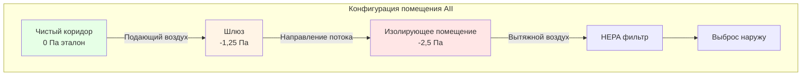
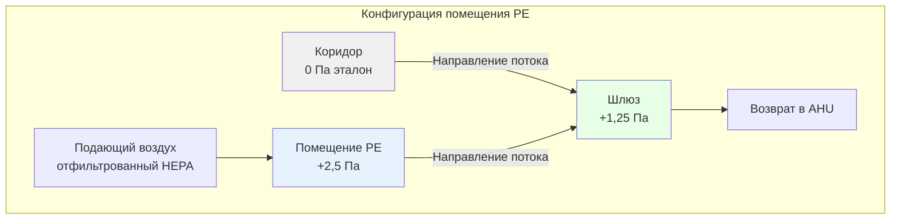

## Обзор

HVAC-системы изолирующих помещений обеспечивают критический контроль окружающей среды для предотвращения передачи возбудителей инфекций по воздуху в учреждениях здравоохранения. Эти специализированные помещения используют перепад давления, улучшенную фильтрацию и контролируемые характеры воздушного потока для защиты пациентов, персонала и посетителей от передачи инфекционных заболеваний.

Фундаментальный принцип основан на направлении воздушного потока от чистых к загрязненным зонам через точное управление давлением и требования к кратности воздухообмена, которые превышают стандартные спецификации обычных палат пациентов.

## Типы изолирующих помещений

### Палаты для изоляции воздушно-капельных инфекций (AII)

Помещения с отрицательным давлением локализуют инфекционные агенты внутри пространства:

| Параметр | Требование | Назначение |
|-----------|-------------|---------|
| Перепад давления | -2,5 Па минимум | Предотвратить распространение воздушно-капельных патогенов |
| Кратность воздухообмена | 12 ч⁻¹ минимум | Разбавление концентрации переносимых по воздуху загрязнений |
| Наружный воздух | 2 ч⁻¹ минимум | Обеспечить свежий воздух для здоровья занятых |
| Вытяжной воздух | 100% удаляется | Нет рециркуляции загрязненного воздуха |
| Фильтрация (вытяжка) | HEPA при недостаточном разбавлении | Удалить патогены перед выбросом |

**Применение:** туберкулез, корь, ветряная оспа, SARS-CoV-2, новые респираторные патогены

### Защитные помещения (PE)

Помещения с положительным давлением защищают иммунокомпрометированных пациентов:

| Параметр | Требование | Назначение |
|-----------|-------------|---------|
| Перепад давления | +2,5 Па минимум | Предотвратить попадание загрязненного воздуха |
| Кратность воздухообмена | 12 ч⁻¹ минимум | Поддержание чистоты разбавлением |
| Фильтрация (подача) | HEPA 99,97% при 0,3 мкм | Удалить частицы и споры переносимые по воздуху |
| Шлюз | Обязателен | Буферная зона давления и переходная зона |
| Рециркуляция | Допустима с HEPA | Снизить энергопотребление при сохранении качества |

**Применение:** пациенты после трансплантации костного мозга, выраженная иммуносупрессия, нейтропенические пациенты

## Физика перепада давления

Разница давления на границах изолирующего помещения управляет направленным воздушным потоком. Взаимосвязь между потоком воздуха и давлением определяется:

$$Q = C \cdot A \cdot \sqrt{\frac{2\Delta P}{\rho}}$$

Где:
- $Q$ = объемный поток воздуха через проемы (м³/с)
- $C$ = коэффициент расхода (0,6–0,7 для щелей двери)
- $A$ = эффективная площадь утечки (м²)
- $\Delta P$ = перепад давления (Па)
- $\rho$ = плотность воздуха (кг/м³)

Для помещений с отрицательным давлением AII вытяжной расход воздуха должен превышать подающий расход. Достигаемый перепад давления зависит от разницы чистого потока воздуха и характеристик утечки помещения:

$$\Delta P = \frac{\rho}{2} \left(\frac{Q_{net}}{C \cdot A}\right)^2$$

Где $Q_{net} = Q_{exhaust} - Q_{supply}$ для помещений с отрицательным давлением.

**Критическое конструктивное соображение:** типичный дифференциальный поток 425 м³/ч (250 CFM) создает перепад давления приблизительно -2,5 до -5 Па в зависимости от подреза двери и герметичности конструкции.

## Требования к кратности воздухообмена

Стандарт ASHRAE 170 устанавливает минимальную кратность воздухообмена для достижения адекватного разбавления загрязнений. Концентрация распада переносимых по воздуху патогенов следует кинетике первого порядка:

$$C(t) = C_0 \cdot e^{-N \cdot t}$$

Где:
- $C(t)$ = концентрация загрязнения в момент времени $t$
- $C_0$ = начальная концентрация
- $N$ = кратность воздухообмена (ч⁻¹)
- $t$ = время (часы)

Для снижения концентрации до 1% от начального уровня:

$$t_{99\%} = \frac{-\ln(0.01)}{N} = \frac{4.6}{N}$$

При 12 ч⁻¹: $t_{99\%} = 23$ минуты. Для стандартных помещений с 6 ч⁻¹: $t_{99\%} = 46$ минут.

Удвоение кратности воздухообмена уменьшает требуемое время удаления патогена в два раза, что критически важно для оборота помещений между инфекционными пациентами.

## Проектирование характера воздушного потока

### Однонаправленный каскад давления

Каскад давления обеспечивает постоянное направление воздушного потока. Для помещений AII с шлюзом:

- Коридор: 0 Па (эталон)
- Шлюз: -1,25 до -1,5 Па
- Изолирующее помещение: -2,5 Па минимум

Это создает два перепада давления, предотвращая загрязнение коридора даже при открытии двери.

## Управление перепадом давления

### Мониторинг и тревожная сигнализация

Непрерывный мониторинг давления с визуальной индикацией у входа в помещение обеспечивает информацию о статусе в режиме реального времени. ASHRAE 170 требует:

- Постоянное устройство визуального мониторинга давления
- Уведомление об отклонении давления от уставки
- Показания давления видны снаружи помещения

**Типичные уставки тревоги:**
- Предупреждение: отклонение ±0,5 Па от уставки
- Тревога: отклонение ±1,0 Па или реверс давления

### Стратегии управления

**Способ 1: Смещение постоянного объема**

Вентиляторы подачи и вытяжки работают с фиксированными скоростями при калиброванном смещении:
- AII: $Q_{exhaust} = Q_{supply} + Q_{offset}$
- PE: $Q_{supply} = Q_{exhaust} + Q_{offset}$

Типичное смещение: 170–255 м³/ч (100–150 CFM)

**Способ 2: Модулирующее управление давлением**

Прямое цифровое управление (DDC) модулирует заслонку/вентилятор вытяжки или подачи для поддержания уставки:

$$Q_{control}(t) = Q_{base} + K_p \cdot e(t) + K_i \int e(t)dt$$

Где $e(t) = P_{setpoint} - P_{measured}$ — ошибка давления.

**Преимущества:** точный контроль, автоматическая компенсация изменения утечки
**Недостатки:** выше сложность, требуется регулярная калибровка датчика

## Требования к фильтрации

### Эффективность HEPA-фильтрации

Фильтры высокоэффективной очистки воздуха (HEPA) захватывают частицы посредством нескольких механизмов:

1. **Перехват:** частицы следуют линиям тока и соприкасаются с волокнами
2. **Инерционное столкновение:** частицы с инертностью отклоняются от линий тока
3. **Диффузия:** броуновское движение вызывает захват малых частиц

Наиболее проникающий размер частиц (MPPS) возникает приблизительно при 0,3 мкм, где все механизмы наименее эффективны. HEPA-фильтры достигают 99,97% захвата этого размера.

Перепад давления через HEPA-фильтр определяется:

$$\Delta P_{filter} = \Delta P_{clean} + k \cdot m_{dust}$$

Где $m_{dust}$ — накопленная масса пыли, $k$ — коэффициент насыщения.

**Конструктивное соображение:** выбирать HEPA-фильтры на 2× перепад давления чистого фильтра для продления срока службы до замены.

### Стратегия расположения фильтров

| Применение | Фильтрация подачи | Фильтрация вытяжки |
|-------------|-------------------|-------------------|
| Помещение AII | MERV 14 минимум | HEPA если центральная вытяжка |
| Помещение AII | MERV 14 минимум | Нет при отдельной вытяжке наружу |
| Помещение PE | HEPA 99,97% требуется | MERV 8–13 достаточно |
| Рециркуляция PE | HEPA на обратном пути | Неприменимо |

## Последовательность герметизации помещения

### Эффекты открытия двери

Открытие двери временно нарушает перепад давления. Время восстановления давления зависит от:

$$t_{recovery} = \frac{V_{room}}{Q_{net}} \cdot \ln\left(\frac{\Delta P_{initial}}{\Delta P_{final}}\right)$$

Для помещения 18,6 м² × 2,74 м (высота) с дифференциалом 255 м³/ч (150 CFM):
- Объем помещения: 51 м³
- Чистый поток воздуха: 255 м³/ч (150 CFM)
- Время восстановления: 12–15 секунд до 90% уставки

**Конструктивная стратегия:** шлюзы обеспечивают буферную зону, позволяя одной двери закрыться перед открытием второй двери, сохраняя направленный контроль.

## Требования к наружному воздуху

ASHRAE 170 требует минимального количества наружного воздуха для разбавления и здоровья занятых:

$$Q_{OA} = \max(Q_{ventilation}, Q_{makeup})$$

Где:
- $Q_{ventilation}$ = 2 ч⁻¹ × объем помещения (требование вентиляции)
- $Q_{makeup}$ = количество вытяжки для помещений AII (требование подпиточного воздуха)

Для 100%-й вытяжки в помещениях AII весь подаваемый воздух должен быть наружным воздухом или передаваемым воздухом из чистых зон. Рециркуляция воздуха помещения не допускается.

## Соображения по уровню шума

Высокие кратности воздухообмена создают повышенные уровни шума. ASHRAE 170 ограничивает:
- Палаты пациентов: NC 35 максимум
- Изолирующие помещения: часто NC 35–40 из-за увеличенного потока воздуха

Стратегии звукоглушения:
- Облицованные воздуховоды около диффузоров и решеток
- Выбор низкоскоростных диффузоров (< 2,54 м/с скорость на выходе)
- Изоляция механического оборудования
- Виброизоляция вентиляторов вытяжки

## Проверка и тестирование производительности

### Испытания при начальном вводе в эксплуатацию

| Испытание | Критерий приемки | Метод |
|------|-------------------|---------|
| Перепад давления | -2,5 Па минимум (AII) | Калиброванный датчик перепада давления |
| Перепад давления | +2,5 Па минимум (PE) | Калиброванный датчик перепада давления |
| Кратность воздухообмена | 12 ч⁻¹ минимум | Измерение потока на всех устройствах |
| Направление потока | Видимое движение в помещение (AII) | Визуализация дымом |
| Восстановление давления | < 30 секунд до уставки | Тест открытия двери |
| Проверка тревоги | Активация звуковой/визуальной тревоги | Имитация отказа давления |

### Периодическая проверка производительности

Ежегодное тестирование согласно ASHRAE 170 и политике учреждения по контролю инфекций:
- Измерение перепада давления
- Проверка направления воздушного потока
- Подтверждение кратности воздухообмена
- Измерение перепада давления на фильтре
- Калибровка системы управления

## Соображения по энергии

Изолирующие помещения потребляют 2–3× энергии стандартных палат пациентов из-за:
- 100% наружного воздуха для помещений AII (возврат тепла невозможен)
- Повышенные кратности воздухообмена (12 против 6 ч⁻¹)
- Непрерывная работа (нет регулировки по заселению)

Стратегии оптимизации энергии без компромисса безопасности инфекционного контроля:
- Возврат тепла на общей вытяжке (не на вытяжке AII)
- Управление по требованию при пустых помещениях (требует одобрения контроля инфекций)
- Высокоэффективные вентиляторы HEPA с оптимизированным выбором фильтра

## Литература

- ASHRAE Standard 170-2021: Ventilating of Health Care Facilities
- CDC Guidelines for Environmental Infection Control in Health-Care Facilities (2003)
- FGI Guidelines for Design and Construction of Hospitals (2022)
- ASHRAE Handbook—HVAC Applications, Chapter 9: Healthcare Facilities

---

*HVAC-системы изолирующих помещений представляют пересечение инженерной точности и науки о контроле инфекций, требуя строгого проектирования, ввода в эксплуатацию и технического обслуживания для защиты уязвимых групп населения.*
