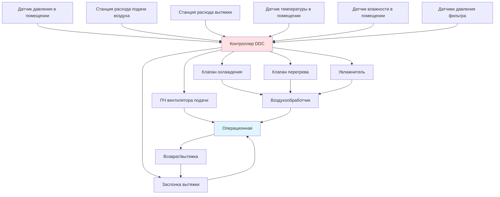

# Системы вентиляции операционных

Системы вентиляции операционных поддерживают строгие условия окружающей среды для минимизации инфекций операционного поля, поддержки управления анестезирующими газами и обеспечения теплового комфорта хирургических бригад во время длительных операций. Эти системы подают отфильтрованный кондиционированный воздух при повышенных скоростях потока, сохраняя при этом положительное давление относительно соседних помещений, точный контроль температуры и влажности, а также минимальную турбулентность воздуха в операционном поле. Стандарт ASHRAE 170 устанавливает минимальные требования к вентиляции, фильтрации, давлению, температуре и влажности для учреждений здравоохранения. Руководство "Руководящие принципы проектирования и строительства больниц" Института рекомендаций по объектам (FGI) предоставляет дополнительные критерии проектирования на основе исследований инфекционного контроля и стандартов клинической практики.

## Требования к вентиляции и кратности воздухообмена

### Кратность воздухообмена согласно ASHRAE 170

Операционные требуют существенно более высоких кратностей воздухообмена, чем общие палаты пациентов, для разбавления воздушных загрязнений и поддержания качества воздуха во время хирургических процедур.

**Минимальные требования к вентиляции:**

| Классификация помещения | Минимальная кратность воздухообмена | Минимальная кратность наружного воздуха | Отношение воздушных движений | Диапазон температур (°C) | Диапазон относительной влажности (%) |
|---------------------|-------|-------|--------------------------|------------|-----------|
| Операционная (Класс B и C) | 20 | 4 | Положительное | 20-23 | 20-60 |
| Операционная (ортопедическая) | 20 | 4 | Положительное | 20-23 | 20-60 |
| Лаборатория катетеризации сердца | 15 | 3 | Положительное | 21-24 | 30-60 |
| Операционная для кесарева сечения | 20 | 4 | Положительное | 20-23 | 20-60 |
| Отделение послеоперационного наблюдения | 6 | 2 | Н/П | 21-24 | 30-60 |
| Помещение хранения анестетиков | 8 | 2 | Отрицательное | 21-24 | 30-60 |
| Грязная рабочая комната | 10 | 2 | Отрицательное | 20-23 | 30-60 |
| Стерильная обработка | 10 | 2 | Положительное | 20-23 | 30-60 |

ASHRAE 170-2017 требует минимум 20 кратностей воздухообмена в час (ACH) для операционных с минимум 4 ACH из наружного воздуха. Это устанавливает базовое требование вентиляции, хотя многие объекты проектируют на 25-30 ACH для обеспечения дополнительной емкости разбавления и сохранения характеристик ламинарного потока.

**Расчет кратности воздухообмена:**

$$ACH = \frac{Q_{supply}}{V_{room}} \times 60$$

Где:
- $Q_{supply}$ = Расход подачи воздуха (CFM)
- $V_{room}$ = Объем помещения (кубические футы)
- 60 = Коэффициент преобразования минут в час

**Пример расчета для стандартной операционной:**
- Размеры помещения: 20 ft × 20 ft × 10 ft высота потолка = 4 000 ft³
- Минимальное требование: 20 ACH
- Требуемый расход воздуха: $(20 \times 4000) / 60 = 1 333$ CFM
- Типичный проект: 25 ACH = 1 667 CFM

### Требования к наружному воздуху

Минимальное требование 4 ACH наружного воздуха обеспечивает непрерывное введение свежего воздуха для разбавления анестезирующих газов, запахов тела и летучих органических соединений из дезинфицирующих растворов и хирургических материалов.

**Расчет наружного воздуха:**

$$Q_{OA} = \frac{4 \times V_{room}}{60}$$

Для примера стандартной операционной 400 ft²:
$$Q_{OA} = \frac{4 \times 4000}{60} = 267 \text{ CFM}$$

Это представляет 20% наружного воздуха при проектировании 20 ACH или 16% при 25 ACH. Оставшаяся часть подачи воздуха рециркулирует через HEPA-фильтры, снижая энергопотребление при сохранении качества воздуха.

## Контроль положительного давления

Операционные поддерживают положительное давление относительно соседних коридоров и вспомогательных помещений для предотвращения миграции нефильтрованного воздуха в стерильное поле при открытии дверей.

### Требования к дифференциалу давления

ASHRAE 170 и FGI Guidelines требуют минимальные дифференциалы давления между операционными и соседними помещениями:

**Иерархия давления:**
1. Операционная: +0,02–0,04 дюйма в.ст. (5–10 Па) относительно коридора
2. Стерильный коридор ядра: +0,01–0,02 дюйма в.ст. (2,5–5 Па) относительно общего коридора
3. Вспомогательное помещение: Равно операционной или +0,01 дюйма в.ст. (2,5 Па) относительно операционной
4. Индукция анестезии: Равно коридору
5. Зоны мытья/подготовки: Равно коридору
6. Грязная рабочая комната: -0,01 дюйма в.ст. (-2,5 Па) отрицательное относительно коридора

**Физика дифференциала давления:**

Разница давления между помещениями результируется из объемного дисбаланса потока и сопротивления потоку соединяющих путей:

$$\Delta P = \frac{\rho (Q_{in} - Q_{out})^2}{2 C^2 A^2}$$

Где:
- $\Delta P$ = Дифференциал давления (в.ст.)
- $\rho$ = Плотность воздуха (0,075 фунт/ft³ стандартные условия)
- $Q_{in}$ = Полный расход воздуха в помещение (CFM)
- $Q_{out}$ = Полный расход воздуха из помещения (CFM)
- $C$ = Коэффициент выхода (0,6–0,7 для нижних проемов двери)
- $A$ = Полная площадь утечки (ft²)

**Упрощенное соотношение проектирования:**

Для начального проектирования приблизительно определите избыточную подачу, требуемую для поддержания положительного давления:

$$Q_{excess} = 50–100 \text{ CFM на дверь для дифференциала +0,03 дюйма в.ст.}$$

Типовая операционная с двумя дверями (вход из коридора и соединение со вспомогательным помещением) требует 100–200 CFM избыточной подачи над вытяжкой для поддержания предписанного положительного давления.

### Стратегии управления давлением

**Прямой контроль дифференциала давления:**
- Датчик давления измеряет дифференциал операционная-к-коридору
- Контроллер модулирует заслонку вытяжки для поддержания уставки
- Расход подачи воздуха остается постоянным
- Время отклика: 5–15 секунд
- Наиболее распространенный метод управления

**Управление отслеживанием расхода воздуха:**
- Подача воздуха поддерживается при постоянном расчетном значении
- Расход вытяжки устанавливается с фиксированным смещением ниже подачи (обычно на 150–200 CFM меньше)
- Дифференциал давления результируется из смещения
- Более простое управление, но менее точное
- Подходит для стабильных сред

**Управление каскадным помещением:**
- Несколько помещений совместно используют мониторинг давления
- Система управления поддерживает иерархию давления
- Координация подачи и вытяжки по всему хирургическому отделению
- Требует сложной системы автоматизации зданий
- Используется в крупных хирургических отделениях

## Распределение воздуха и ламинарный поток

### Системы унидирекционального воздушного потока

Высокопроизводительные операционные используют системы ламинарного (унидирекционального) воздушного потока для минимизации концентрации аэрозольных частиц в операционном поле. Эти системы подают HEPA-отфильтрованный воздух через большой массив потолочных диффузоров непосредственно над операционным столом, создавая вертикальную схему воздушного потока, которая уносит частицы от стерильного поля.

**Критерии проектирования ламинарного потока:**

| Параметр | Обычное смешивание | Унидирекциональный поток | Ультрачистая (ортопедическая) |
|-----------|-------------------|---------------------|------------------------|
| Покрытие диффузора подачи | 25–40% потолка | Минимум 8 ft × 8 ft | Минимум 10 ft × 10 ft |
| Скорость подачи | Н/П | 25–35 FPM | 35–50 FPM |
| Схема воздушного потока | Турбулентное смешивание | Вертикальный ламинар | Вертикальный ламинар |
| Класс чистоты ISO | ISO 7 (10 000) | ISO 6 (1 000) | ISO 5 (100) |
| Количество частиц (≥0,5 μm/ft³) | ≤10 000 | ≤1 000 | ≤100 |
| Кратность воздухообмена в час | 20–25 | 25–30 | 30–40 |
| Первоначальная стоимость (относительная) | 1,0 | 1,5–2,0 | 2,5–3,5 |

**Расчет вертикального ламинарного потока:**

Диффузор подачи должен подавать достаточный расход воздуха для достижения целевой скорости потока через защищаемую зону:

$$Q_{supply} = V_{face} \times A_{diffuser}$$

Где:
- $V_{face}$ = Целевая скорость потока (FPM)
- $A_{diffuser}$ = Площадь диффузора (ft²)

Для потолка ламинарного потока 8 ft × 8 ft (64 ft²) при 30 FPM:
$$Q = 30 \times 64 = 1 920 \text{ CFM}$$

Эта скорость потока превышает минимум ASHRAE 170 и устанавливает базис проектирования для высокопроизводительных операционных.

**Размещение вытяжного воздуха:**

Системы ламинарного потока требуют низкие настенные вытяжки или напольные вытяжки для поддержания вертикальных схем воздушного потока. Типовые места вытяжки включают:

- Низкие настенные вытяжки на высоте 12–18 дюймов над готовым полом
- Четыре стороны помещения для оптимальной симметрии
- Полная площадь вытяжки, рассчитанная на скорость потока ниже 500 FPM
- Вытяжки, расположенные вне границы стерильного поля (минимум 3 ft от стола)

### Системы обычного смешивания

Стандартные операционные без ламинарного потока используют диффузоры, установленные на потолке и распределенные по потолку для обеспечения вентиляции смешивания. Этот подход менее затратен, но достигает более низкого качества воздуха в операционном поле.

**Проектирование системы смешивания:**
- 4–8 диффузоров на операционную
- Терминальные HEPA-фильтры у каждого диффузора (или центральный HEPA)
- Скорость подачи воздуха у диффузора: 150–300 FPM
- Схема воздушного потока: турбулентное смешивание с несколькими воздухообменами
- Разбавление частиц вместо вытеснения

**Критерии выбора диффузора:**
- Высокий коэффициент индукции для содействия смешиванию
- Низкая скорость выпуска для минимизации сквозняков
- Регулируемые контроллеры воздушных потоков для гибкости
- Встроенные HEPA-фильтры (предпочтительно) или восходящий центральный HEPA

## Требования к фильтрации

### HEPA-фильтрация согласно ASHRAE 170

Стандарт ASHRAE 170 требует HEPA-фильтры с эффективностью 99,97% (минимальное значение эффективности отчета MERV 17) для всего воздуха, подаваемого в операционные. Этот уровень фильтрации захватывает частицы ≥0,3 μm, включая бактерии (0,5–10 μm) и споры грибков (2–10 μm).

**Спецификации фильтра:**

| Тип фильтра | Эффективность | Размер частиц | Начальный перепад давления | Применение |
|-------------|-----------|---------------|---------------------|--------------|
| MERV 8 (префильтр) | 70–75% | 3–10 μm | 0,25 дюйма в.ст. | Первая ступень воздухообработчика |
| MERV 14 (финальный) | 90–95% | 0,3–1,0 μm | 0,40 дюйма в.ст. | Здравоохранение без операционной |
| HEPA (99,97%) | 99,97% | 0,3 μm | 1,0–1,5 дюйма в.ст. | Операционные |
| ULPA (99,999%) | 99,999% | 0,12 μm | 1,5–2,0 дюйма в.ст. | Специальные чистые помещения |

**Варианты размещения фильтра:**

**Центральные HEPA-батареи:**
- Фильтры, расположенные в механическом помещении или над потолком
- Несколько операционных обслуживаются одной батареей фильтров
- Меньшая доступность для обслуживания
- Риск загрязнения воздуховода вниз по потоку
- Требует утвержденные протоколы очистки воздуховодов

**Терминальные HEPA-фильтры:**
- Отдельный фильтр у каждого диффузора подачи
- Защищенная доставка стерильного воздуха в точку использования
- Более легкая проверка стерильного воздуха
- Более дорогая установка
- Сложность замены в полевых условиях
- Предпочтительный подход для критических приложений

### Двухступенчатая стратегия фильтрации

Большинство воздухообработчиков операционных используют двухступенчатую фильтрацию для защиты дорогостоящих HEPA-фильтров и увеличения срока их службы:

1. **Этап префильтра**: Мешочные фильтры MERV 8–11 удаляют крупные частицы и защищают HEPA-фильтры от быстрого засорения
2. **Финальный этап HEPA**: HEPA-фильтры с эффективностью 99,97% обеспечивают доставку стерильного воздуха

**Срок службы фильтра и замена:**
- Префильтры: интервал замены 3–6 месяцев
- HEPA-фильтры: интервал замены 3–5 лет (в зависимости от перепада давления)
- Мониторинг перепада давления через батареи фильтров
- Замена HEPA-фильтров при превышении перепада давления 2,0 дюйма в.ст. или 1,5× начального
- Проверка целостности HEPA-фильтра после установки (тест DOP или PAO аэрозоль)

## Контроль температуры и влажности

### Требования к температуре

Спецификации температуры операционной уравновешивают тепловой комфорт хирургических бригад, одетых в непроницаемые для воздуха халаты, с терморегуляцией пациента во время анестезии, когда механизмы терморегуляции подавлены.

**Диапазон управления температурой:**

ASHRAE 170 требует температуру операционной в пределах 20–23°C, регулируемую в зависимости от типа хирургической процедуры и предпочтений хирурга. Типичная практика:

- Общая хирургия: 20–22°C
- Сердечно-сосудистая хирургия: 18–20°C (прохладнее для хирургической бригады во время длительных операций)
- Педиатрическая хирургия: 22–24°C (предотвращение гипотермии у новорожденных)
- Хирургия ожогов: 27–29°C (минимизация метаболического стресса у пациентов с ожогами)

**Точность управления температурой:**

Операционные требуют жесткого управления температурой:
- Полоса управления: ±1°C максимум от уставки
- Время отклика управления: < 10 минут для изменения 1°C
- Нет температурной стратификации (< 2°C градиент от пола к потолку)

**Соображения при расчете нагрева и охлаждения:**

Тепловые нагрузки операционной включают:
- Хирургические светильники: 400–800 ватт на светильник (обычно 2–4 светильника)
- Медицинское оборудование: 1 000–3 000 ватт (визуализация, лазеры, электрохирургия)
- Люди: 8–12 человек при 400–500 BTU/hr каждый (явная нагрузка)
- Нагрузка вентиляции наружного воздуха: самый крупный компонент
- Нагрузки оболочки: минимальные из-за внутреннего расположения

**Расчет нагрузки охлаждения:**

$$Q_{cooling} = 1.08 \times CFM \times (T_{supply} - T_{room}) + q_{lights} + q_{equipment} + q_{people}$$

Для операционной 1 667 CFM при 21°C с подачей воздуха 13°C:
$$Q_{sensible} = 1.08 \times 1667 \times (21-13) + 1600 + 2000 + 4000 = 34 600 \text{ BTU/hr (10,1 кДж/ч)}$$

### Управление влажностью

Управление влажностью предотвращает накопление статического электричества (опасность пожара с легковоспламеняющимися анестетиками, хотя редко используется), поддерживает комфорт пациента и контролирует рост бактерий на поверхностях.

**Требования к влажности ASHRAE 170:**
- Минимум: 20% RH (предотвращение статического электричества)
- Максимум: 60% RH (предотвращение роста бактерий)
- Типичный диапазон проектирования: 40–60% RH
- Допуск управления: ±5% RH от уставки

**Стратегии управления влажностью:**

**Система выделенного наружного воздуха (DOAS):**
- Отдельный воздухообработчик кондиционирует наружный воздух к точке росы
- Удаляет скрытую нагрузку из основного воздухообработчика операционной
- Основной воздухообработчик работает только с явной нагрузкой и перегревом
- Обеспечивает превосходный контроль влажности в течение всего года
- Более высокие первоначальные затраты, но лучшая производительность

**Перегрев с увлажнением:**
- Воздухообработчик охлаждает ниже точки росы для осушения
- Катушка перегрева повышает температуру до уставки
- Паровой увлажнитель добавляет влагу в периоды низкой влажности
- Распространенный подход, но более высокое энергопотребление
- Требует источник пара (котел или электрический)

**Расчет скрытой нагрузки:**

$$Q_{latent} = 4.5 \times CFM \times (W_{room} - W_{supply})$$

Где:
- $W$ = Коэффициент влажности (зёрна влаги на фунт сухого воздуха)
- 4.5 = Константа преобразования (0.68 × 60 / 1000 × 7000 зёрен/фунт)

Операционные имеют минимальные внутренние скрытые нагрузки (люди в хирургических халатах), поэтому управление влажностью решает в первую очередь нагрузки наружного воздуха.

## Соображения при проектировании системы

### Выделенный относительно общего воздухообработчика

**Выделенный воздухообработчик на операционную:**
- Одна операционная, обслуживаемая выделенным блоком обработки воздуха (AHU)
- Максимальная гибкость управления
- Позволяет индивидуальную регулировку температуры
- Избыточность через несколько блоков
- Более высокие затраты на оборудование
- Больше требований к механическому помещению
- Типичный вариант для специализированных операционных (кардиологические, нейрохирургические)

**Воздухообработчик на несколько помещений:**
- Один блок обработки воздуха обслуживает 2–6 операционных
- Терминальный перегрев в каждом помещении для управления температурой
- Общая батарея HEPA-фильтров снижает затраты
- Единственная точка отказа влияет на несколько помещений
- Более низкие первоначальные затраты на помещение
- Более эффективен для стандартизированных хирургических отделений

### Требования к избыточности системы

Критические хирургические объекты требуют избыточность для поддержания условий окружающей среды при отказе оборудования:

**Избыточная обработка воздуха:**
- Конфигурация N+1 воздухообработчика (один резервный блок)
- Автоматическое переключение при обнаружении отказа
- Резервный блок способен поддерживать минимум 15 ACH
- Распространено на крупных хирургических отделениях (8+ операционных)

**Системы с двойным воздуховодом:**
- Два воздуховода подачи в каждую операционную от отдельных блоков обработки воздуха
- Заслонки выбирают активный источник подачи
- Обеспечивает избыточность без полного резервного блока
- Более высокие затраты на установку

**Питание в аварийном режиме:**
- Вся вентиляция операционной на питание в аварийном режиме
- Автоматическое переключение в течение 10 секунд
- Поддержание минимум 15 ACH на питании в аварийном режиме
- Требуется NFPA 99 и большинством строительных норм

## Последовательности управления и автоматизация

### Стратегия управления операционной

Современные операционные используют сложное прямое цифровое управление (DDC) для одновременного поддержания нескольких параметров окружающей среды:

**Основные контуры управления:**

1. **Управление расходом подачи воздуха**
   - Поддерживает постоянный расход CFM через ПЧ или входные жалюзи
   - Компенсирует засорение фильтров с течением времени
   - Уставка: требуемое значение ACH

2. **Управление давлением**
   - Модулирует заслонку вытяжки для поддержания положительного давления
   - Уставка: +0,03 дюйма в.ст. типичная
   - Допуск управления: ±0,01 дюйма в.ст.

3. **Управление температурой**
   - Модулирует клапаны охлаждения и перегрева
   - Каскадное управление предотвращает одновременный нагрев/охлаждение
   - Уставка: регулируемая 20–23°C

4. **Управление влажностью**
   - Модулирует увлажнитель в периоды низкой влажности
   - Увеличивает охлаждение для осушения при необходимости
   - Уставка: 40–60% RH

### Режимы занятости

Операционные обычно работают в нескольких режимах в зависимости от графика операций:

**Режим при занятости (во время операции):**
- Полный расход воздуха по проекту (20–30 ACH)
- Температура и влажность на уставке
- Положительное давление поддерживается
- Все сигналы тревоги активны

**Режим отключения при отсутствии:**
- Сниженный расход воздуха (обычно минимум 10–15 ACH)
- Отключение температуры до 18°C (нагрев) / 24°C (охлаждение)
- Управление влажностью продолжается (предотвращение роста плесени)
- Положительное давление поддерживается
- Экономия энергии: 30–50% во время отсутствия

**Режим промывки:**
- Активируется после терминальной очистки
- Полный расход воздуха для быстрого восстановления качества воздуха
- Продолжительность: 15–30 минут
- Возвращается в режим отключения после завершения промывки

**Режим запуска:**
- Начинается за 1–2 часа до первой процедуры
- Постепенное увеличение от условий отключения к условиям занятости
- Обеспечивает стабильную среду в начале операции
- Автоматическое расписание через систему автоматизации зданий

## Введение в эксплуатацию и испытание производительности

### Проверка соответствия ASHRAE 170

Системы вентиляции операционных требуют комплексное тестирование и балансировку для проверки соответствия кодексу и производительности проектирования:

**Требуемые измерения при испытании:**

1. **Проверка расхода воздуха**
   - Расход подачи в каждую операционную (±10% от проекта)
   - Процент наружного воздуха (≥20% минимум)
   - Расход вытяжки и баланс
   - Подтверждение достижения минимума ACH

2. **Испытание соотношения давления**
   - Дифференциал давления помещение-к-коридору
   - Проверка поддержания положительного давления
   - Испытание при закрытых дверях и при открытии двери
   - Измерение времени спада давления после закрытия двери

3. **Испытание распределения воздуха**
   - Измерения скорости воздуха в критических местах
   - Визуализация воздушного потока дымом
   - Подтверждение характеристик ламинарного потока (если применимо)
   - Проверка отсутствия мертвых зон и короткого замыкания

4. **Проверка фильтрации**
   - Испытание целостности HEPA-фильтра (сканирование DOP или PAO)
   - Подтверждение эффективности 99,97%
   - Отсутствие обхода фильтра
   - Перепад давления в допустимом диапазоне

5. **Проверка температуры и влажности**
   - Проверка диапазона управления 20–23°C
   - Измерения температуры в нескольких точках
   - Управление влажностью 20–60% RH
   - Испытание времени восстановления

6. **Испытание воздухообмена в помещении и воздушного потока**
   - Измерение кратности воздухообмена с помощью газ-трассера
   - Испытание количества частиц в операционном поле
   - Измерения уровня звука (обычно NC 35–40)

### Испытание количества частиц

Критические и ультрачистые операционные проходят испытание количества частиц для проверки классификации чистоты ISO:

**Классы чистоты ISO 14644-1:**

| Класс ISO | Максимум частиц/м³ (≥0,5 μm) | Максимум частиц/ft³ (≥0,5 μm) | Применение |
|-----------|-------------------------------|--------------------------------|-------------|
| ISO 5 | 10 200 | 289 | Ультрачистые ортопедические операционные |
| ISO 6 | 102 000 | 2 890 | Высокопроизводительные операционные |
| ISO 7 | 1 020 000 | 28 900 | Стандартные операционные |
| ISO 8 | 10 200 000 | 289 000 | Стерильные коридоры |

**Протокол испытания:**
- Счетчик частиц с чувствительностью 0,5 μm
- Несколько мест отбора проб вокруг операционного поля
- Испытание «в состоянии покоя» (без присутствия людей при работающих системах)
- Испытание «в операционном режиме» (во время имитирующей операции)
- Минимум 3 образца на место
- Сравнение результатов с пределами классификации ISO

## Энергетические соображения

Системы вентиляции операционных потребляют в 3–5 раз больше энергии на квадратный фут, чем типовые коммерческие здания, из-за высоких скоростей вентиляции, 100% наружного воздуха, HEPA-фильтрации и непрерывной работы.

**Стратегии снижения энергопотребления:**

1. **Отключение в периоды отсутствия**
   - Сокращение с 25 ACH до 10–15 ACH ночью
   - Потенциальная экономия: 30–40% годовой энергии HVAC

2. **Рекуперация тепла вытяжки**
   - Замкнутый цикл гликоля между вытяжкой и наружным воздухом
   - Эффективность рекуперации энергии: 50–65%
   - Период окупаемости: 4–7 лет в большинстве климатов

3. **Выделенная система наружного воздуха**
   - Кондиционирование наружного воздуха с рекуперацией тепла
   - Снижает нагрузку на воздухообработчики операционной
   - Лучший контроль влажности снижает избыточное охлаждение/перегрев

4. **Эффективная фильтрация**
   - Высококачественные префильтры продлевают срок службы HEPA
   - Мониторинг перепада давления, замена при необходимости
   - Более низкий перепад давления снижает потребление энергии вентилятором

5. **Светодиодное хирургическое освещение**
   - Снижение нагрузки охлаждения на 40–60% по сравнению с галогенными
   - Более низкое электропотребление
   - Быстрое окупение за счет экономии коммунальных услуг

**Эталоны энергопотребления:**
- Типичная интенсивность энергопотребления операционной: 200–400 кБТЕ/ft²/год
- Высокопроизводительная операционная: 150–250 кБТЕ/ft²/год (с рекуперацией тепла)
- Сравнимое офисное помещение: 50–80 кБТЕ/ft²/год

Системы вентиляции операционных представляют наиболее требовательное приложение в проектировании объектов здравоохранения, требуя интеграции принципов инфекционного контроля, точного управления окружающей средой, избыточности для безопасности жизнедеятельности и управления энергопотреблением. Успешные проекты уравновешивают эти конкурирующие цели за счет внимательного соблюдения требований ASHRAE 170, проверенных конфигураций систем и комплексного введения в эксплуатацию для проверки производительности.
