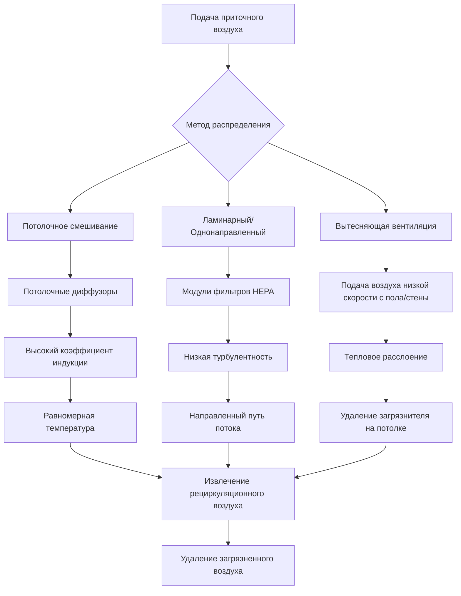

# Проектирование и требования HVAC для палат пациентов в больницах

Системы HVAC палат пациентов напрямую влияют на контроль инфекций, скорость выздоровления пациентов и тепловой комфорт. Стандарт ASHRAE 170 и руководство Facilities Guidelines Institute (FGI) устанавливают минимальные параметры окружающей среды для общих палат пациентов, в то время как клинические исследования демонстрируют связь между надлежащим управлением окружающей средой и снижением внутрибольничных инфекций (ВБИ). Проектирование должно уравновешивать профилактику инфекций, энергоэффективность и комфорт пациентов, одновременно адаптируясь к переменной занятости и тепловым нагрузкам.

## Минимальные требования ASHRAE 170

Стандарт ASHRAE 170-2021 устанавливает обязательные показатели вентиляции, соотношения давления, эффективность фильтрации, диапазоны температур и пределы влажности для медицинских помещений. Эти требования формируют базис для всех проектов палат пациентов в медицинских учреждениях США.

### Требования к параметрам окружающей среды

| Параметр | Общая палата пациента | Кабинет осмотра | Палата восстановления | Критическое отделение/ОИТ |
|-----------|---------------------|-----------|---------------|-------------------|
| Кратность воздухообмена (всего) | 6 об./ч | 6 об./ч | 6 об./ч | 6 об./ч |
| Наружный воздух (минимум) | 2 об./ч | 2 об./ч | 2 об./ч | 2 об./ч |
| Соотношение давления | Равное или положительное | Равное или положительное | Равное или положительное | Положительное |
| Минимальная температура | 21°C | 21°C | 21°C | 21°C |
| Максимальная температура | 24°C | 24°C | 24°C | 24°C |
| Минимальная относительная влажность | 30% | 30% | 30% | 30% |
| Максимальная относительная влажность | 60% | 60% | 60% | 60% |
| Минимальная фильтрация (подача) | MERV 14 | MERV 14 | MERV 14 | MERV 14 |
| Рециркуляция | Допускается в пределах палаты | Допускается в пределах палаты | Допускается в пределах палаты | Допускается в пределах палаты |

Минимум 6 об./ч обеспечивает надлежащее разбавление переносимых по воздуху загрязнителей, запахов и анестезирующих газов. Требование 2 об./ч наружного воздуха обеспечивает свежий воздух для находящихся в помещении и предотвращает накопление следовых загрязнителей, которые рециркуляция не может удалить.

## Расчет кратности воздухообмена и распределение воздушного потока

Кратность воздухообмена определяет объемный расход воздуха относительно объема помещения. Требуемый расход приточного воздуха зависит от геометрии помещения и требований кратности воздухообмена.

**Общий расход приточного воздуха:**

$$Q_{supply} = \frac{V \times ACH}{60}$$

Где:
- $Q_{supply}$ = расход приточного воздуха (м³/ч)
- $V$ = объем помещения (м³)
- $ACH$ = кратность воздухообмена (ч⁻¹)

Для типичной палаты пациента размером 3,66 м × 4,88 м с потолком 2,74 м:

**Расчет:**
- Объем помещения: 3,66 × 4,88 × 2,74 = 48,9 м³
- Минимальная общая подача: (48,9 × 6) / 60 = 4,89 м³/ч
- Минимальный наружный воздух: (48,9 × 2) / 60 = 1,63 м³/ч

Расход приточного воздуха должен удовлетворять как требованию общей кратности воздухообмена, так и минимальному требованию наружного воздуха одновременно. В этом примере 4,89 м³/ч всего с минимум 1,63 м³/ч наружного воздуха соответствует требованиям ASHRAE 170.

### Схемы распределения воздушного потока

Надлежащее распределение воздуха предотвращает застойные зоны и обеспечивает равномерное разбавление по всему занятому пространству. Метод доставки приточного воздуха значительно влияет на эффективность вентиляции.

**Смешивающая вентиляция**: Стандартный подход с использованием потолочных диффузоров, которые индуцируют воздух помещения в струю приточного воздуха, создавая турбулентное смешивание. Эффективность воздухообмена обычно 0,9–1,0, что означает, что фактическое удаление загрязнителей равно или немного превышает номинальное значение кратности воздухообмена.

**Вытесняющая вентиляция**: Воздух низкой скорости подается на уровне пола при температурах на 1,7–2,8°C ниже уставки помещения. Тепловые плюмы от пациентов, оборудования и освещения создают восходящий воздушный поток, переносящий загрязнители на выхлопное отверстие уровня потолка. Возможны значения эффективности 1,2–1,4, но требуется тщательное проектирование, чтобы избежать сквозняков.

**Ламинарный/Однонаправленный поток**: Зарезервирован для критических применений, таких как операционные и комнаты защитного окружения. Обычно не используется в общих палатах пациентов из-за высокого энергопотребления и требований по пространству.

## Соотношения давления и баланс воздушного потока

Поддержание надлежащих соотношений давления предотвращает миграцию загрязнителей между пространствами. Общие палаты пациентов работают с равным или положительным давлением относительно коридоров, чтобы предотвратить инфильтрацию воздуха из коридора.

**Расчет дифференциального давления:**

Дифференциальное давление между пространствами зависит от дисбаланса воздушного потока и сопротивления пути утечки:

$$\Delta P = \left(\frac{Q_{leak}}{C \times A}\right)^2 \times \rho$$

Где:
- $\Delta P$ = дифференциальное давление (Па)
- $Q_{leak}$ = дисбаланс воздушного потока (м³/ч)
- $C$ = коэффициент потока (безразмерный, обычно 0,6–0,7)
- $A$ = эффективная площадь утечки (м²)
- $\rho$ = плотность воздуха (кг/м³)

Для практического проектирования применяется упрощенное соотношение:

**Целевое давление:** +2,5–7,5 Па относительно коридора

**Требуемый дисбаланс воздушного потока:** Приблизительно 24–70 м³/ч избыток приточного воздуха для типичной герметичности оболочки палаты пациента.

### Стратегии управления давлением

| Метод управления | Описание | Точность | Сложность | Применение |
|----------------|-------------|----------|------------|-------------|
| Фиксированная подача/возврат | Постоянные объемы подачи и возврата с калиброванным смещением | ±1,25 Па | Низкая | Небольшие учреждения, стабильные нагрузки |
| Управление дифференциальным давлением | Датчик прямого давления модулирует подачу или выхлоп | ±0,25 Па | Средняя | Новые учреждения, критические помещения |
| Каскадное отслеживание воздушного потока | Возврат отслеживает подачу с фиксированным смещением | ±0,75 Па | Средняя | Крупные больницы, зональное управление |
| Системы с вентурийскими клапанами | Самобалансирующиеся станции воздушного потока поддерживают давление | ±0,5 Па | Высокая | Реконструкция, устаревшие системы |

Датчики дифференциального давления с каскадным управлением обеспечивают превосходные характеристики, постоянно измеряя фактическое давление в помещении и модулируя устройства воздушного потока для поддержания уставки независимо от открывания дверей, засорения фильтра или изменений системы.

## Требования к фильтрации и эффективность

ASHRAE 170 требует минимальной фильтрации MERV 14 для всего приточного воздуха в палаты пациентов. Этот уровень фильтрации улавливает 75–90% частиц в диапазоне 0,3–1,0 микрон, включая большинство бактерий и крупные ядра капель, переносящих вирус.

### Проектирование системы фильтрации

Двухступенчатая фильтрация улучшает общую эффективность системы и продлевает срок службы финального фильтра:

**Этап 1 – Предварительный фильтр:**
- Эффективность MERV 8–11
- Улавливает крупные частицы, пыль, ворс
- Защищает нижележащие катушки и финальные фильтры
- Интервал замены: 3–6 месяцев

**Этап 2 – Финальный фильтр:**
- Эффективность MERV 14–15
- Удаляет тонкие частицы, биоаэрозоли
- Перепад давления при чистоте: 75–125 Па
- Интервал замены: 12–24 месяца

**Перепад давления на фильтре:**

По мере засорения фильтра частицами перепад давления увеличивается, снижая воздушный поток, если давления вентилятора недостаточно.

$$\Delta P_{filter} = \Delta P_{clean} \times \left(1 + \frac{m_{dust}}{m_{capacity}}\right)^n$$

Где:
- $\Delta P_{filter}$ = текущий перепад давления на фильтре (Па)
- $\Delta P_{clean}$ = перепад давления на чистом фильтре (Па)
- $m_{dust}$ = накопленная масса пыли (грамм)
- $m_{capacity}$ = емкость фильтра по задержанию пыли (грамм)
- $n$ = показатель загрузки (обычно 1,5–2,0)

Манометры Magnehelic или датчики дифференциального давления контролируют засорение фильтра. Заменяйте фильтры при достижении перепада давления 2,0–2,5 раза больше чистого перепада давления или согласно рекомендации производителя.

## Контроль температуры и влажности

Тепловой комфорт значительно влияет на удовлетворенность пациентов и выздоровление. Температура и влажность должны оставаться в пределах диапазонов ASHRAE 170, одновременно приспосабливаясь к индивидуальным предпочтениям пациентов, где это возможно.

### Соображения теплового комфорта

Скорость метаболизма пациентов в покое составляет в среднем 0,8–1,0 мет (метаболические эквиваленты), ниже, чем у малоподвижных офисных работников. В сочетании с сниженной теплоизоляцией одежды (0,3–0,5 кло), пациентам требуются более теплые температуры окружающей среды для теплового нейтралитета.

**Анализ предсказанной средней оценки (PMV):**

Модель PMV предсказывает тепловое ощущение по 7-балльной шкале от холода (-3) до жара (+3), где 0 представляет тепловой нейтралитет.

Для пациента в покое:
- Скорость метаболизма: 0,9 мет (52 Вт/м²)
- Теплоизоляция одежды: 0,4 кло (больничный халат)
- Скорость воздуха: <0,05 м/с
- Средняя температура излучения ≈ температура воздуха

При этих условиях тепловой нейтралитет (PMV = 0) происходит при приблизительно 23–24°C, что объясняет, почему многие пациенты предпочитают температуры на верхнем конце диапазона ASHRAE 170.

**Индивидуальное зональное управление:**

Каждая палата пациента требует независимого контроля температуры посредством:
- Индивидуальные термостаты зоны, доступные для медицинского персонала
- Местные подогревающие катушки (электрические или с горячей водой)
- Переменный объем воздуха с обеспечением минимального воздушного потока
- Лучистые панели для дополнительного отопления/охлаждения без изменения воздушного потока

### Проблемы контроля влажности

Поддержание 30–60% ОВ круглый год представляет значительные проблемы как в отопительный, так и в охлаждающий сезоны.

**Зимнее увлажнение:**

Холодный наружный воздух содержит минимальное количество влаги. Нагревание этого воздуха до температуры помещения без увлажнения приводит к чрезвычайно низкой относительной влажности.

**Требуемое добавление влаги:**

$$\dot{m}_{water} = \frac{Q_{oa} \times \rho \times (W_{room} - W_{oa})}{3600}$$

Где:
- $\dot{m}_{water}$ = скорость добавления влаги (кг/ч)
- $Q_{oa}$ = расход наружного воздуха (м³/ч)
- $\rho$ = плотность воздуха (1,2 кг/м³ стандартная)
- $W_{room}$ = соотношение влажности в помещении (кг воды/кг сухого воздуха)
- $W_{oa}$ = соотношение влажности наружного воздуха (кг воды/кг сухого воздуха)

Для 1700 м³/ч наружного воздуха при -7°C, 30% ОВ нагретого до 22°C, 35% ОВ:
- Соотношение влажности наружного воздуха: 0,0007 кг/кг
- Соотношение влажности помещения: 0,0047 кг/кг
- Требуемая влага: (1700 × 1,2 × (0,0047 - 0,0007)) / 3600 = 0,0019 кг/мин = 0,11 кг/ч на м³/ч ОВ = всего 0,19 кг/ч

**Летнее осушение:**

Горячий и влажный наружный воздух требует глубокого охлаждения для конденсации влаги, а затем повторного нагрева для поддержания температуры в помещении. Системы рекуперации энергии снижают эту нагрузку, предварительно охлаждая и осушая наружный воздух с помощью выходящего воздуха.

## Типы систем и сравнение

Несколько конфигураций системы могут удовлетворять требованиям ASHRAE 170. Выбор зависит от размера учреждения, бюджета, возможности обслуживания и приоритетов производительности.

### Распространенные системы HVAC для палат пациентов

| Тип системы | Управление вентиляцией | Управление температурой | Управление влажностью | Энергоэффективность | Первоначальная стоимость | Обслуживание |
|-------------|---------------------|---------------------|------------------|-------------------|------------|-------------|
| Центральная VAV с подогревом | Отличное | Отличное | Отличное | Среднее | Среднее–Высокое | Среднее |
| DOAS + Блоки фанкойла | Отличное | Хорошее | Отличное | Высокое | Высокое | Среднее–Высокое |
| DOAS + Охлаждаемые балки | Отличное | Отличное | Хорошее | Высокое | Очень высокое | Среднее |
| 4-трубное фанкойл с MUA | Хорошее | Отличное | Справедливое | Среднее | Среднее | Низкое–Среднее |
| Однозональный AHU на палату | Отличное | Отличное | Отличное | Низкое | Высокое | Высокое |
| Упакованные терминальные блоки | Слабое | Хорошее | Слабое | Низкое | Низкое | Среднее |

**Центральная система VAV:**
Терминальные устройства переменного объема воздуха обслуживают каждую палату пациента или небольшую группу палат. Центральные блоки обработки воздуха обеспечивают отопление, охлаждение, увлажнение, осушение и фильтрацию. Уставки минимального расхода воздуха обеспечивают требование 6 об./ч. Терминалы VAV, независимые от давления, с измерением расхода воздуха обеспечивают точную доставку вентиляции независимо от колебаний давления в воздуховодах.

**DOAS + Фанкойл:**
Системы выделенного наружного воздуха обрабатывают 100% наружного воздуха с рекуперацией энергии, обеспечивая вентиляцию, контроль влажности и фильтрацию. Блоки фанкойла в каждой палате обрабатывают явное охлаждение и отопление без введения дополнительного наружного воздуха. Это разделение позволяет оптимизировать контроль влажности и обеспечивает последовательную вентиляцию независимо от тепловых нагрузок помещения.

**DOAS + Охлаждаемые балки:**
Активные или пассивные охлаждаемые балки обеспечивают явное охлаждение за счет конвекции от охлаждаемых водяных катушек. DOAS подает 100% наружного воздуха при нейтральной температуре и контролируемой влажности. Эта конфигурация обеспечивает отличную энергоэффективность и очень тихую работу, но требует осторожного контроля точки росы, чтобы предотвратить конденсацию на балках.

## Контроль шума и вибрации

Чрезмерный шум HVAC мешает отдыху и выздоровлению пациентов. ANSI/ASA S12.60 не применяется к медицинским учреждениям, но руководство FGI и практика в отрасли устанавливают максимальные критерии шума.

**Целевые уровни шума:**

| Пространство | Максимум RC/NC | Целевой проект (дБА) |
|-------|--------------|---------------------|
| Палаты пациентов | RC 35(N) | 30–35 |
| Критическое отделение | RC 35(N) | 30–35 |
| Кабинеты осмотра | RC 35(N) | 30–35 |
| Процедурные комнаты | RC 38(N) | 33–38 |

**Меры контроля шума:**

- Выбор терминального устройства: VAV-боксы и диффузоры с низким перепадом давления с данными о звуке производителя
- Пределы скорости воздухопровода: максимум 7,6 м/с в магистралях, 4,1 м/с в ответвлениях, 2,5 м/с в терминалах
- Глушители воздухопровода: установите в приточных воздухопроводах выше по потоку от чувствительных к шуму областей
- Виброизоляция: пружинные изоляторы для блоков обработки воздуха, гибкие соединения воздухопровода, эластичные подвески
- Расположение оборудования: отделить механические помещения от палат пациентов с помощью конструкции с звуковым рейтингом

## Стратегии повышения энергоэффективности

Палаты пациентов работают непрерывно круглый год, что делает энергоэффективность критически важной для управления затратами жизненного цикла.

**Меры повышения эффективности высокого воздействия:**

- **Рекуперация энергии от наружного воздуха**: Энтальпийные колеса или пластинчатые теплообменники восстанавливают 60–80% тепловой и охлаждающей энергии из выхлопного воздуха
- **Вентиляторы с регулируемой скоростью**: Снижают потребление энергии вентилятором в периоды низких нагрузок при сохранении минимального воздушного потока
- **Светодиодное освещение**: Снижает внутренние тепловыделения и нагрузки на охлаждение на 50–70% по сравнению с люминесцентными
- **Вентиляция по требованию**: Уменьшите наружный воздух до 2 об./ч во время незанятой очистки (если коды это позволяют)
- **Экономайзер**: Свободное охлаждение, когда условия наружного воздуха благоприятны
- **Чиллеры с рекуперацией тепла**: Одновременное отопление и охлаждение с использованием тепла конденсатора для подогрева или горячего водоснабжения
- **Улучшенное управление**: Интегрируйте управление вентиляцией, температурой, влажностью и освещением с обнаружением занятости и прогнозированием нагрузки

## Соображения по контролю инфекций

Хотя общие палаты пациентов не требуют строгого контроля палат изоляции, надлежащее проектирование HVAC снижает риск ВБИ.

**Принципы контроля инфекций:**

- Поддерживайте положительное давление, чтобы предотвратить инфильтрацию воздуха из коридора
- Обеспечьте надлежащий наружный воздух для разбавительной вентиляции
- Обеспечьте минимальную фильтрацию MERV 14 для удаления переносимых по воздуху патогенов
- Контролируйте влажность в диапазоне 30–60%, чтобы минимизировать выживание патогенов и оптимизировать иммунную функцию
- Предотвращайте застойные зоны, где могут накапливаться загрязнители
- Проектируйте для легкой очистки и обслуживания без загрязнения занятых пространств

Когда палаты пациентов должны вмещать случаи изоляции (отрицательное давление для воздушных предосторожностей), возможность преобразования должна быть спроектирована в системе. Это обычно требует емкости вытяжного вентилятора и последовательности управления для реверса давления в помещении по требованию.

## Обслуживание и наладка

Надлежащая наладка и текущее обслуживание обеспечивают постоянное соответствие параметрам окружающей среды.

**Проверка при наладке:**

- Измерьте и задокументируйте расходы приточного, рециркуляционного и наружного воздуха на каждом терминале
- Проверьте давление в помещении при всех положениях двери
- Подтвердите контроль температуры и влажности во всем диапазоне проектирования
- Протестируйте установку фильтра на предмет утечки и надлежащего уплотнения
- Измерьте уровни звука в незанятых палатах пациентов
- Проверьте последовательности управления для всех режимов работы

**График профилактического обслуживания:**

- **Ежемесячно**: Проверяйте и заменяйте фильтры по мере необходимости, проверяйте соотношения давления
- **Ежеквартально**: Смажьте подшипники вентилятора, проверьте ремни и приводы, очистите катушки
- **Ежегодно**: Комплексное измерение и повторная балансировка воздушного потока, калибровка управления, проверка уровня звука
- **Непрерывно**: Мониторинг систем автоматизации зданий температур, влажности, давления и воздушных потоков с автоматическими сигналами тревоги при выходе за пределы диапазона

Комплексное обслуживание предотвращает деградацию системы, которая может скомпрометировать контроль инфекций и комфорт пациентов, одновременно увеличивая потребление энергии.
