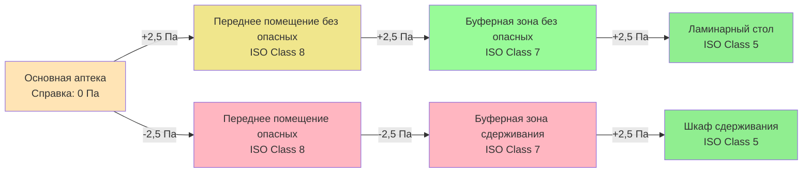
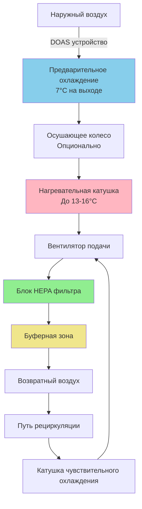

# Системы HVAC для больничной аптеки

Больничные аптеки требуют специализированных систем HVAC для поддержания условий окружающей среды, установленных USP General Chapters 797 и 800, которые регулируют стерильное приготовление препаратов (CSP) и обращение с опасными лекарствами. Система HVAC должна обеспечивать точный контроль температуры и влажности, поддерживать определенные классификации чистоты воздуха, устанавливать отношения давления между помещениями и предотвращать перекрестное загрязнение, обеспечивая безопасность персонала.

## Стандарты USP и классификации чистых помещений

USP <797> устанавливает требования для приготовления стерильных препаратов (CSP), а USP <800> определяет требования для обращения с опасными лекарствами. Эти стандарты определяют буферные зоны, требования к переднему помещению и отделенные зоны приготовления с определенными средствами управления окружающей средой.

### Классификации чистых помещений ISO для помещений аптеки

| Тип помещения | Классификация ISO | Максимум частиц ≥0,5 мкм на м³ | Воздухообмены в час (ACH) | Отношение давления |
|------------|-------------------|----------------------------------|---------------------------|----------------------|
| Первичное инженерное управление (PEC) | ISO Class 5 | 3 520 | Н/Д (однонаправленный поток) | Положительное к буферной зоне |
| Буферная зона (без опасных веществ) | ISO Class 7 | 352 000 | 30 минимум | Положительное к переднему помещению |
| Буферная зона (опасные вещества) | ISO Class 7 | 352 000 | 30 минимум | Отрицательное к переднему помещению |
| Переднее помещение (без опасных веществ) | ISO Class 8 | 3 520 000 | 20 минимум | Положительное к основной аптеке |
| Переднее помещение (опасные вещества) | ISO Class 8 | 3 520 000 | 20 минимум | Отрицательное к основной аптеке |
| Отделенная зона приготовления | ISO Class 7 | 352 000 | 30 минимум | Положительное к окружающей зоне |

**Первичные инженерные управления (PEC)** включают ламинарные рабочие столы с воздушным потоком (LAFW), биологические шкафы безопасности (BSC) и асептические изоляторы для приготовления препаратов (CAI). Эти устройства обеспечивают условия ISO Class 5 в критической зоне приготовления препаратов через HEPA-фильтрованный однонаправленный поток воздуха со скоростью 27 ± 6 м/мин.

Каскад давления предотвращает миграцию частиц и загрязнений. Для приготовления препаратов без опасных веществ воздух течет от самого чистого (буферная зона) к менее чистому (переднее помещение) и в основную аптеку. Для опасных лекарств буферная зона сдерживания работает при отрицательном давлении, чтобы предотвратить выход опасных веществ.

## Требования к перепаду давления

Поддержание правильных отношений давления между помещениями аптеки имеет решающее значение для контроля загрязнения. Перепады давления достигаются за счет дисбаланса подачи и выпуска воздуха.

### Проектирование каскада давления

**Расчет перепада давления:**

Требуемый поток воздуха для достижения целевого перепада давления на перегородке определяется площадью утечки:

$$Q = 0,0437 \times A \times \sqrt{\frac{\Delta P}{\rho}}$$

Где:
- $Q$ = поток воздуха через пути утечки (м³/ч)
- $A$ = эффективная площадь утечки (м²)
- $\Delta P$ = перепад давления (Па)
- $\rho$ = плотность воздуха (кг/м³, стандартная = 1,2)

Для типичной конструкции с площадью утечки 0,009 м² на 9,3 м² площади перегородки и целевым дифференциалом 2,5 Па:

$$Q = 0,0437 \times 0,009 \times \sqrt{\frac{2,5}{1,2}} = 0,0144 \text{ м³/ч} \approx 0,51 \text{ м³/ч}$$

Этот расчет устанавливает минимальный требуемый дисбаланс подачи и выпуска. При фактическом проектировании обычно используется дифференциал 0,85-1,70 м³/ч для учета открытия дверей и загрузки фильтра.

**Мониторинг давления:**

Непрерывный мониторинг давления с визуальными индикаторами (манометрами Magnehelic или цифровыми дисплеями) в каждой точке входа переднего помещения обеспечивает проверку в реальном времени правильных отношений давления. Система автоматизации здания должна выдавать сигнал тревоги при отклонении дифференциалов давления более ±20% от уставки.

## Скорости воздухообмена и фильтрация

Скорости воздухообмена определяют как разбавление частиц, так и классификацию чистоты воздуха. Более высокие значения ACH обеспечивают более быстрое восстановление после событий загрязнения и поддерживают более низкие концентрации частиц во время деятельности по приготовлению препаратов.

### Минимальные требования к воздухообмену

| Классификация помещения | Минимум ACH | Рекомендуемый ACH | Фильтрация приточного воздуха | Фильтрация вытяжного воздуха |
|---------------------|-------------|-----------------|---------------------|-------------------|
| ISO Class 5 PEC | Однонаправленный поток 27 м/мин | Н/Д | HEPA 99,99% при 0,3 мкм | Н/Д (рециркуляция) |
| ISO Class 7 Буферная зона | 30 | 40-60 | HEPA 99,97% при 0,3 мкм | HEPA при опасных |
| ISO Class 8 Переднее помещение | 20 | 25-30 | MERV 14-16 минимум | HEPA при опасных |
| Помещение опасных отходов | 12 | 15-20 | MERV 14 минимум | HEPA 99,99% при 0,3 мкм |

**Время очистки частиц:**

Время, требуемое для снижения концентрации аэрозольных частиц на 99% или 99,9%, зависит от скорости воздухообмена:

$$t = \frac{-\ln(C/C_0)}{ACH/60}$$

Где:
- $t$ = время (минуты)
- $C/C_0$ = отношение конечной/начальной концентрации
- $ACH$ = воздухообмены в час

Для снижения на 99% ($C/C_0 = 0,01$) при ACH 30:

$$t = \frac{-\ln(0,01)}{30/60} = \frac{4,605}{0,5} = 9,2 \text{ минуты}$$

Для снижения на 99,9% при ACH 30: 13,8 минут. Более высокие скорости ACH обеспечивают более быстрое восстановление, что критично после пролитий или между сеансами приготовления препаратов.

**Установка HEPA фильтров:**

HEPA фильтры должны быть установлены в воздуховодах подачи как можно ближе к месту использования. Корпусы терминальных HEPA фильтров должны включать:
- Возможность вкладывания/извлечения в мешки для зон опасных лекарств
- Порты для испытания целостности фильтра DOP на месте
- Дроссельные клапаны для балансировки потока воздуха
- Мониторинг перепада давления на блоках фильтров

## Контроль температуры и влажности

USP <797> требует поддерживать определенные диапазоны температуры и влажности в зонах приготовления препаратов, чтобы обеспечить стабильность лекарств, комфорт персонала и контроль роста микробов.

### Установки параметров окружающей среды

| Параметр | Требование USP | Рекомендуемый диапазон управления | Допуск управления |
|-----------|----------------|--------------------------|------------------|
| Температура | ≤25°C | 20-23°C | ±1,1°C |
| Относительная влажность | ≤60% RH | 30-50% RH | ±5% RH |
| Мониторинг температуры | Непрерывный | Каждый час | Н/Д |
| Мониторинг влажности | Непрерывный | Каждый час | Н/Д |

**Рассмотрение коэффициента чувствительного тепла:**

Системы HVAC чистых помещений работают при высоких коэффициентах чувствительного тепла (SHR) из-за повышенных скоростей воздухообмена и минимальной внутренней генерации влаги. Требуемая холодопроизводительность преимущественно чувствительна:

$$SHR = \frac{Q_{sensible}}{Q_{sensible} + Q_{latent}}$$

Типичные чистые помещения аптеки показывают значения SHR 0,85-0,95. Это требует тщательного выбора оборудования:
- Стандартное оборудование с прямым расширением может переохлаждать перед адекватной осушкой
- Системы приточного воздуха, выделенные (DOAS) с отдельным чувствительным охлаждением улучшают контроль влажности
- Повторное нагревание может потребоваться для достижения уставки температуры после осушки

**Стратегия контроля влажности:**

Эта конфигурация разделяет скрытую нагрузку (наружный воздух) от чувствительной нагрузки (рециркулированный воздух), обеспечивая превосходный контроль влажности. DOAS подает осушенный наружный воздух в точном количестве, требуемом для вентиляции и нагнетания давления, в то время как воздухообработчики рециркуляции решают чувствительные задачи охлаждения.

## Картины потоков воздуха и контроль загрязнения

Правильное распределение воздуха предотвращает перекрестное загрязнение между чистыми и менее чистыми помещениями при поддержании классификации ISO.

**Распределение приточного воздуха:**

Неаспирирующие, низкотурбулентные диффузоры с терминальными HEPA фильтрами равномерно распределяют воздух по потолку. Расстояние между диффузорами HEPA 0,6-1,2 м по центру создает вертикальную схему ламинарного потока, которая направляет частицы вниз к решеткам возврата воздуха на низком уровне.

**Расположение возвратного воздуха:**

Решетки возврата воздуха низкого уровня, установленные на 0,3-0,45 м над готовым полом, удаляют воздух, содержащий частицы. Эта конфигурация устанавливает нисходящий поток воздуха, который непрерывно очищает зону дыхания от частиц, образующихся при деятельности по приготовлению препаратов.

**Исследование визуализации потока воздуха:**

Моделирование вычислительной гидродинамики (CFD) или физические исследования с дымом проверяют правильные картины потока воздуха. Критические точки проверки включают:
- Отсутствие мертвых зон, где накапливаются частицы
- Отсутствие турбулентного смешивания между загрязненными и чистыми потоками воздуха
- Адекватная скорость воздуха (0,005-0,015 м/с) для транспортировки частиц к решеткам возврата
- Защита критических участков приготовления препаратов от загрязнения, создаваемого персоналом

## Конфигурации систем HVAC

Несколько типов систем HVAC могут соответствовать требованиям чистого помещения аптеки. Выбор зависит от размера объекта, бюджета, требований к избыточности и интеграции с больничной инфраструктурой.

### Сравнение систем

| Тип системы | Первоначальная стоимость | Эксплуатационная стоимость | Избыточность | Сложность | Применение |
|-------------|-----------|----------------|------------|------------|-------------|
| Отдельный рециркуляционный AHU | Высокая | Низкая | Отличная | Средняя | Новое строительство, крупные объекты |
| DOAS + рециркуляционные блоки фильтров | Высокая | Низкая | Хорошая | Высокая | Реновации, несколько чистых помещений |
| Модифицированный центральный больничный AHU | Средняя | Средняя | Удовлетворительная | Низкая | Небольшие аптеки в существующих зданиях |
| Комплектное чистое помещение | Средняя-высокая | Средняя | Слабая | Низкая | Однокамерные чистые помещения, временные объекты |

**Отдельный рециркуляционный обработчик воздуха:**

Постоянный обработчик воздуха обслуживает чистые помещения аптеки исключительно. Устройство работает 24/7 с:
- 100% возвратный воздух с небольшим макияжем наружного воздуха (обычно 10-20% от общего потока воздуха)
- Фильтрация HEPA в воздуховодах подачи
- Избыточные вентиляторы (рабочий/резервный или параллельная работа)
- Точный контроль влажности с использованием повторного нагревания и увлажнения
- Приводы с переменной частотой для управления давлением

Этот подход обеспечивает максимальную надежность и производительность, но требует выделенного помещения для механического оборудования и более высокую первоначальную стоимость.

**DOAS + блоки фильтров:**

Система выделенного наружного воздуха обеспечивает вентиляционный воздух, макияж для нагнетания давления и скрытое охлаждение. Потолочные блоки фильтров (FFU) обеспечивают рециркуляцию и фильтрацию HEPA непосредственно в пространстве чистого помещения. Каждый FFU содержит мотор, HEPA фильтр и органы управления, исключая необходимость в возвратном воздуховоде.

Преимущества включают модульную установку, легкое расширение и отдельное управление зонами. Недостатки включают более высокие затраты на замену фильтров (каждый FFU требует собственного HEPA фильтра) и потенциальные акустические проблемы от нескольких небольших вентиляторов.

## Сдерживание опасных лекарств

USP <800> требует сдерживания опасных лекарств во время приготовления, хранения и обращения с отходами для защиты персонала от воздействия.

**Зоны сдерживания с отрицательным давлением:**

Помещения, в которых приготавливаются опасные лекарства, работают при отрицательном давлении относительно соседних помещений. Система выпуска удаляет загрязненный воздух и предотвращает миграцию в чистые помещения.

**Обработка вытяжного воздуха:**

Вытяжной воздух из помещений с опасными лекарствами должен быть:
- Отфильтрован HEPA перед выбросом в атмосферу
- Выпущен выше уровня кровли с адекватной высотой дымохода для предотвращения повторного входа
- Не рециркулирован в занятые помещения
- Постоянно контролируется на предмет потока воздуха и давления

**Расчет высоты вытяжного дымохода:**

Скорость выпуска и высота дымохода предотвращают попадание вытяжного воздуха во входные отверстия здания или занятые помещения. ASHRAE рекомендует:

$$h_{min} = h_{intake} + 0,914 \times \sqrt{\frac{Q_{exhaust}}{V_{discharge}}}$$

Где:
- $h_{min}$ = минимальная высота дымохода над кровлей (м)
- $h_{intake}$ = высота ближайшего входного отверстия воздуха (м)
- $Q_{exhaust}$ = расход вытяжного воздуха (м³/ч)
- $V_{discharge}$ = скорость выпуска (м/с, минимум 10,2 м/с)

Для выпуска 850 м³/ч с скоростью выпуска 10,2 м/с:

$$h_{min} = h_{intake} + 0,914 \times \sqrt{\frac{850}{10,2}} = h_{intake} + 2,97 \text{ м}$$

**Шкафы биологической безопасности:**

Шкафы биологической безопасности класса II типа B2 обеспечивают защиту персонала, продукта и окружающей среды при приготовлении опасных лекарств. Эти шкафы:
- Выпускают 100% потока воздуха (без рециркуляции)
- Поддерживают скорость входа на лицевой стороне 30 м/мин
- Обеспечивают отфильтрованную HEPA зону работы ISO Class 5
- Требуют выделенное соединение выпуска с избыточными вентиляторами

Выбор BSC должен учитывать совместимость лекарств с материалами шкафа и картинами потока воздуха.

## Мониторинг и валидация

Непрерывный мониторинг окружающей среды и периодическая сертификация обеспечивают постоянное соответствие требованиям USP.

**Требуемые параметры мониторинга:**

- Температура и относительная влажность (непрерывные, записанные)
- Перепад давления между помещениями (непрерывный, с сигналами тревоги)
- Скорость потока воздуха в критических местах (периодическая проверка)
- Целостность HEPA фильтра (ежегодное тестирование DOP)
- Классификация ISO (полугодовые подсчеты частиц)
- Поверхностный жизнеспособный отбор проб (периодический микробиологический мониторинг)

**Тестирование подсчета частиц:**

ISO 14644-1 определяет процедуры подсчета частиц и пределы классификации. Тестирование выполняется:
- При первоначальной квалификации установки (IQ) перед использованием
- Полугодово при квалификации эксплуатации (OQ)
- После замены HEPA фильтра
- После любого изменения системы

Места отбора проб включают углы, центр и рядом с источниками загрязнения на высоте поверхности работы (75 см). Несколько образцов проверяют последовательную чистоту по всему пространству.

**Ввод системы в эксплуатацию:**

Тестирование функциональной производительности проверяет:
1. Скорости воздухообмена соответствуют или превышают минимальные требования
2. Перепады давления поддерживают правильный каскад при всех позициях дверей
3. Температура и влажность остаются в пределах диапазонов управления
4. Исследования дыма подтверждают правильные картины потока воздуха
5. Тестирование восстановления демонстрирует адекватную очистку частиц
6. Функциональность сигналов тревоги для критических параметров
7. Автоматическое переключение системы избыточности

Документирование результатов ввода в эксплуатацию обеспечивает исходные данные для постоянной проверки производительности.

## Заключение

Системы HVAC для больничной аптеки должны соответствовать строгим требованиям по чистоте воздуха, контролю давления, температуре и влажности при обеспечении безопасности персонала при обращении с опасными лекарствами. Соответствие USP <797> и USP <800> требует тщательного проектирования системы, правильного выбора оборудования, непрерывного мониторинга и регулярной валидации. Фильтрация HEPA, адекватные скорости воздухообмена и правильные каскады давления составляют основу контроля загрязнения. Выделенные системы с избыточностью и точными органами управления обеспечивают надежную работу, необходимую для безопасности пациентов и соответствия требованиям нормативно-правовых актов.
