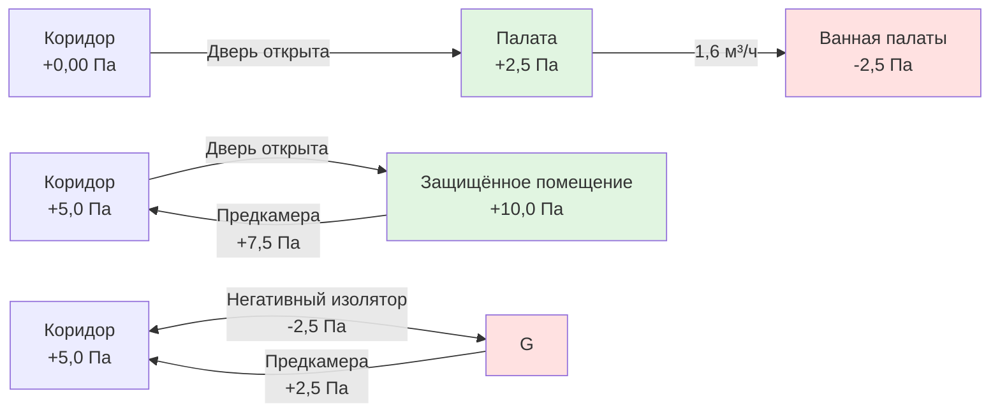

HVAC системы в здравоохранении представляют наиболее требовательное применение в области управления микроклиматом зданий, где отказы могут напрямую влиять на результаты лечения пациентов, уровень инфекций и безопасность жизни. Эти системы должны одновременно поддерживать точные условия температуры и влажности, устанавливать контролируемые соотношения давления между помещениями, обеспечивать исключительно высокую кратность воздухообмена и предоставлять многоступенчатую фильтрацию—всё при непрерывной круглосуточной работе без перерывов.

## Основные критерии проектирования

ASHRAE стандарт 170 «Вентиляция медицинских учреждений» устанавливает минимальные требования к HVAC системам в здравоохранении на основе медицинских исследований, связывающих условия окружающей среды с уровнем инфекций и результатами выздоровления пациентов.

### Требования к кратности воздухообмена

Кратность воздухообмена в медицинских учреждениях значительно превышает стандарты для коммерческих зданий из-за требований вентиляции для разбавления воздуха в целях контроля инфекций. Объёмное разбавление следует экспоненциальному убыванию первого порядка:

$$C(t) = C_0 e^{-\frac{ACH}{60}t}$$

где $C(t)$ — концентрация загрязняющего вещества во времени $t$ (минуты), $C_0$ — начальная концентрация, и $ACH$ — кратность воздухообмена в час.

Для достижения 99% удаления загрязняющих веществ:

$$t_{99\%} = \frac{-\ln(0.01) \times 60}{ACH} = \frac{276}{ACH} \text{ минут}$$

Для операционной с кратностью 20 воздухообменов в час удаление загрязняющих веществ на 99% происходит за 13,8 минут—критически важно для подготовки помещения между процедурами.

| Тип помещения | Минимум ACH | Наружный воздух ACH | Давление | Температура (°C) | Относительная влажность |
|------------|-------------|-----------------|----------|------------------|-------------------|
| Операционная | 20 | 4 | Положительное | 20-24 | 20-60% |
| Защищённое помещение | 12 | 2 | Положительное | 20-24 | 40-60% |
| Изолятор воздушно-капельных инфекций | 12 | 2 | Отрицательное | 20-24 | 30-60% |
| Палата (общая) | 6 | 2 | Равное/Положительное | 21-24 | 30-60% |
| Отделение скорой помощи | 12 | 2 | Отрицательное | 21-24 | 30-60% |
| Эндоскопический кабинет | 15 | 3 | Положительное | 20-24 | 30-60% |

### Физика соотношения давления

Перепады давления предотвращают миграцию воздушно-распространяемых патогенов между помещениями. Перепад давления в дверном проёме создаёт направленный воздушный поток, управляемый следующей зависимостью:

$$Q = C_d A \sqrt{\frac{2\Delta P}{\rho}}$$

где $Q$ — объёмный расход воздуха (м³/ч), $C_d$ — коэффициент расхода (0,6-0,65 для дверных проёмов), $A$ — площадь утечки (м²), $\Delta P$ — перепад давления (Па), и $\rho$ — плотность воздуха (кг/м³).

ASHRAE 170 требует минимального перепада давления 2,5 Па. При стандартных условиях с эффективной площадью утечки 0,93 м²:

$$Q = 0,65 \times 0,93 \times \sqrt{\frac{2 \times 2,5}{1,2}} = 1,6 \text{ м³/ч}$$

Этот разностный поток воздуха поддерживает направленный контроль даже при открывании двери.

## Контроль инфекций через вентиляцию

Инфекции, связанные с медицинской помощью (HAI), обходятся миллиардами и вызывают значительную заболеваемость. Надлежащно спроектированные HVAC системы служат основным инженерным средством контроля воздушно-распространяемых патогенов.

### Эффективность вентиляции разбавления

Уравнение Уэллса-Райли количественно определяет риск инфекции на основе вентиляции:

$$P = 1 - e^{-\frac{Iqpt}{Q}}$$

где $P$ — вероятность инфекции, $I$ — количество заражённых, $q$ — скорость образования квант (патогены/час), $p$ — скорость лёгочной вентиляции (м³/час), $t$ — время экспозиции (часы), и $Q$ — скорость вентиляции помещения (м³/час).

Удвоение скорости вентиляции ($Q$) экспоненциально снижает вероятность инфекции—что демонстрирует, почему операционные требуют 20+ воздухообменов в час по сравнению с 6 воздухообменами для общих палат.

### Требования к фильтрации

ASHRAE 170 предписывает минимальную эффективность фильтрации для улавливания воздушных частиц:

- **Приточный воздух во все помещения**: MERV 14 минимум (85% улавливания частиц 1-3 мкм)
- **Рециркулируемый воздух**: MERV 7 минимум перед рециркуляцией
- **Защищённые помещения**: Терминальная HEPA фильтрация (99,97% при 0,3 мкм)

Перепад давления на фильтровальных блоках следует:

$$\Delta P = \frac{1,414 \times v^2 \times \rho}{2g_c}f$$

где $v$ — скорость на фильтре (м/мин), и $f$ — коэффициент сопротивления фильтра. По мере загрязнения фильтров частицами перепад давления растёт до требования замены—непрерывно контролируется датчиками дифференциального давления.

## Проектирование критических помещений

### Операционные

Операционные представляют наиболее строгие требования HVAC, сочетающие высокую кратность воздухообмена, точное управление температурой/влажностью, однонаправленный поток воздуха и экстремальную чистоту.

**Однонаправленный (ламинарный) поток**: Высокоэффективные диффузоры создают направленный вниз поток воздуха со скоростью 0,13-0,18 м/с через область хирургического вмешательства. Число Рейнольдса для этого потока:

$$Re = \frac{\rho v L}{\mu}$$

остаётся в переходном режиме (2000-4000), обеспечивая унос частиц при избегании турбулентности, которая перемешивает осадившиеся загрязнения.

**Управление температурой**: Узкий диапазон 20-24°C учитывает:
- Комфорт хирургической команды при высокоинтенсивном освещении и физических нагрузках
- Предотвращение гипотермии пациента при анестезии, когда терморегуляция нарушена

**Управление влажностью**: 20-60% ОВ предотвращает:
- Статический разряд электричества около легковоспламеняющихся анестетиков (нижний предел)
- Бактериальное размножение на поверхностях (верхний предел)

Контроль точки росы критичен; поддержание точки росы 7°C в операционной при 22°C требует:

$$W = 0,622 \frac{P_{sat}(T_{dp})}{P_{atm} - P_{sat}(T_{dp})} = 0,622 \frac{0,758}{101,325 - 0,758} = 0,0047 \text{ кг воды/кг сухого воздуха}$$

### Защищённые помещения (пациенты с ослабленным иммунитетом)

Пациенты, проходящие химиотерапию или трансплантацию костного мозга, требуют сверхчистых помещений из-за скомпрометированной иммунной системы. Эти помещения имеют:

- Положительное давление относительно коридоров (+2,5 Па минимум)
- HEPA-фильтрованный приточный воздух (99,97% эффективность при 0,3 мкм)
- Герметичную конструкцию, минимизирующую инфильтрацию
- Давление в предкамере каскадного типа, создающее буферную зону

### Изоляторы воздушно-капельных инфекций

Пациенты с туберкулёзом, корью, ветрянкой или COVID-19 требуют отрицательно-давленческую изоляцию, предотвращающую выход патогенов. Ключевые элементы проектирования:

- Отрицательное давление (-2,5 Па минимум относительно коридора)
- 100% выброс (без рециркуляции)
- 12 ACH минимум для быстрого разбавления
- HEPA фильтрация выбросного воздуха или выброс в атмосферу выше уровня кровли

Системы мониторинга давления с визуальными и звуковыми сигналами обеспечивают непрерывную проверку статуса отрицательного давления.

## Конфигурация системы

HVAC системы в здравоохранении обычно используют 100% наружный воздух или системы приточного воздуха (DOAS) с параллельным охлаждением для избежания перекрёстного загрязнения между зонами. Рекуперация энергии допускается, если утечка между потоками воздуха предотвращается через проверенное разделение или колёса с полным энтальпийным обменом с секцией очистки.

Тепловая нагрузка от вентиляционного воздуха доминирует в HVAC системах здравоохранения:

$$Q_{vent} = 0,34 \times \text{м³/ч} \times \Delta T + 3010 \times \text{м³/ч} \times \Delta W$$

Для операционной с кратностью 20 воздухообменов (1,4 м³/ч для 8,4 м³), кондиционирование наружного воздуха от 35°C/24°C мокрого термометра до 13°C приточного воздуха требует 226 кВт чувствительного плюс 113 кВт скрытого тепла—всего 339 кВт охлаждения только на вентиляцию.

Резервирование обязательно; большинство систем здравоохранения предусмотрены конфигурацией N+1 или 2N оборудования, обеспечивающей непрерывную работу при техническом обслуживании или отказе оборудования. Нормы по безопасности жизни запрещают единственные точки отказа в критических помещениях.
