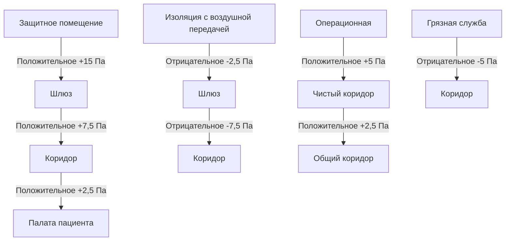

## Обзор стандарта ASHRAE 170

ASHRAE Standard 170 "Вентиляция учреждений здравоохранения" устанавливает минимальные требования к вентиляции медицинских помещений для минимизации передачи инфекций, контроля запахов и поддержания надлежащих условий окружающей среды. Стандарт предоставляет предписывающие требования на основе функции помещения, признавая, что медицинские среды требуют точного контроля из-за уязвимых групп пациентов и критических процедур.

Физическую основу этих требований составляют **принципы разбавляющей вентиляции**, где концентрация загрязняющего вещества экспоненциально снижается с увеличением кратности воздухообмена согласно:

$$C(t) = C_0 \cdot e^{-\frac{Q}{V}t} + \frac{G}{Q}(1 - e^{-\frac{Q}{V}t})$$

где $C(t)$ — концентрация загрязняющего вещества в момент времени $t$, $C_0$ — начальная концентрация, $Q$ — кратность вентиляции, $V$ — объём помещения, $G$ — скорость образования загрязняющего вещества.

## Требования к соотношению давлений

Контроль перепада давления предотвращает миграцию воздушных загрязняющих веществ между помещениями. Стандарт указывает соотношения положительного или отрицательного давления относительно смежных площадей, поддерживая перепады давления обычно между 2,5 и 7,5 Па.

### Иерархия давлений

Перепад давления поддерживается за счет дисбаланса воздушных потоков вытяжки/приточки:

$$\Delta P = \frac{8\rho L Q^2}{\pi^2 D^5}$$

где $\Delta P$ — перепад давления, $\rho$ — плотность воздуха (1,2 кг/м³), $L$ — эквивалентная длина путей утечки, $Q$ — дисбаланс воздушного потока, $D$ — эквивалентный диаметр отверстий утечки.

## Требования к вентиляции по типам помещений

### Критические помещения интенсивной терапии

| Тип помещения | Кратность воздухообмена (раз/ч) | Минимальный наружный воздух (раз/ч) | Соотношение давлений | Минимальная фильтрация | Диапазон температуры (°C) | Максимальная влажность (%) |
|------------|----------------------------|---------------------------|----------------------|-------------------------|----------------------|----------------|
| Операционная | 20 | 4 | Положительное | MERV 14 + HEPA (99,97%) | 20–23 | 60 |
| Родовспомогательная | 20 | 4 | Положительное | MERV 14 | 20–23 | 60 |
| Катетеризационная лаборатория | 15 | 3 | Положительное | MERV 14 | 21–24 | 60 |
| Хранилище анестетиков | 8 | 2 | Отрицательное | MERV 8 | 24 | 60 |

### Помещения ухода за пациентами

| Тип помещения | Кратность воздухообмена (раз/ч) | Минимальный наружный воздух (раз/ч) | Соотношение давлений | Минимальная фильтрация | Диапазон температуры (°C) | Максимальная влажность (%) |
|------------|----------------------------|---------------------------|----------------------|-------------------------|----------------------|----------------|
| Палата пациента | 6 | 2 | Равное/Положительное | MERV 14 | 21–24 | 65 |
| Защитное помещение | 12 | 2 | Положительное | MERV 14 + HEPA (99,97%) | 21–24 | 65 |
| Изоляция с воздушной передачей (AII) | 12 | 2 | Отрицательное | MERV 14 | 21–24 | 65 |
| ОИТ | 6 | 2 | Положительное | MERV 14 | 21–24 | 60 |
| Неонатология | 6 | 2 | Положительное | MERV 14 | 22–26 | 60 |

### Служебные помещения

| Тип помещения | Кратность воздухообмена (раз/ч) | Минимальный наружный воздух (раз/ч) | Соотношение давлений | Минимальная фильтрация | Диапазон температуры (°C) |
|------------|----------------------------|---------------------------|----------------------|-------------------------|----------------------|
| Грязная служба | 10 | 2 | Отрицательное | MERV 8 | 21–24 |
| Чистая служба | 4 | 2 | Положительное | MERV 8 | 21–24 |
| Кабинет выдачи лекарств | 4 | 2 | Положительное | MERV 8 | 21–24 |
| Аптека | 4 | 2 | Положительное | MERV 8 | 21–24 |
| Лаборатория (общая) | 6 | 2 | Отрицательное | MERV 14 | 21–24 |
| Лаборатория (бактериология) | 6 | 2 | Отрицательное | MERV 14 + Выпускной HEPA | 21–24 |

## Требования к фильтрации

ASHRAE 170 требует многоступенчатой фильтрации для прогрессивного удаления частиц:

### Конструкция системы фильтрации

Проникновение частиц через батареи фильтров следует правилу мультипликативной вероятности:

$$P_{total} = P_1 \times P_2 \times P_3 = (1-E_1)(1-E_2)(1-E_3)$$

где $P$ — доля проникновения, $E$ — эффективность. Для MERV 8 (85%) + MERV 14 (90%) + HEPA (99,97%):

$$P_{total} = 0,15 \times 0,10 \times 0,0003 = 0,0000045 \text{ или } 0,00045\%$$

## Контроль температуры и влажности

Требования к температуре достигают баланса между тепловым комфортом пациента и контролем инфекций. Терморегуляторная нейтральная зона для седированных пациентов уже (±0,3°C), чем для амбулаторных пациентов (±1,1°C).

Теплопередача от пациента к окружающей среде:

$$Q_{total} = Q_{conv} + Q_{rad} + Q_{evap} = h_c A(T_{skin}-T_{air}) + \sigma \epsilon A(T_{skin}^4 - T_{mrt}^4) + h_{fg} \dot{m}_{evap}$$

где $h_c$ — коэффициент конвективной теплопередачи (2–5 Вт/м²·К в зависимости от скорости воздуха), $\sigma$ — постоянная Стефана–Больцмана (5,67×10⁻⁸ Вт/м²·К⁴), $\epsilon$ — коэффициент излучательной способности кожи (0,95), $T_{mrt}$ — средняя лучистая температура, $h_{fg}$ — удельная теплота испарения (2 260 кДж/кг), $\dot{m}_{evap}$ — скорость испарения.

Контроль влажности предотвращает рост микробов (>65% ОВ) и накопление статического электричества (<30% ОВ). Выживаемость бактерий резко варьирует в зависимости от относительной влажности, с минимальной выживаемостью при 40–60% ОВ для большинства патогенов.

## Требования к кратности воздухообмена

Кратность воздухообмена определяет как эффективность разбавления, так и схемы распределения воздуха в помещении. Более высокие кратности создают более интенсивное перемешивание и снижают время пребывания загрязняющего вещества.

Время достижения конкретной эффективности удаления загрязняющего вещества:

$$t = -\frac{V}{Q} \ln(1-E) = -\frac{60}{ACH} \ln(1-E)$$

Для удаления 99% (E = 0,99):

- 6 раз/ч: $t = -\frac{60}{6} \ln(0,01) = 46$ минут
- 12 раз/ч: $t = -\frac{60}{12} \ln(0,01) = 23$ минуты
- 20 раз/ч: $t = -\frac{60}{20} \ln(0,01) = 14$ минут

Эта зависимость объясняет, почему критические помещения, такие как операционные, требуют 20 раз/ч — быстрое удаление загрязняющего вещества между процедурами.

## Требования к наружному воздуху

Минимальный наружный воздух предотвращает накопление следовых загрязняющих веществ, не контролируемых рециркуляционной фильтрацией, включая анестетические газы, запахи тела и летучие органические соединения.

Требуемая доля наружного воздуха:

$$Y = \frac{C_r - C_s}{C_r - C_o}$$

где $Y$ — доля наружного воздуха, $C_r$ — концентрация загрязняющего вещества в рециркуляционном воздухе, $C_s$ — целевая концентрация в приточном воздухе, $C_o$ — концентрация в наружном воздухе.

Для большинства медицинских приложений наружный воздух обеспечивает 2–4 раза/ч из общей 6–20 раз/ч кратности, оставшаяся вентиляция происходит через фильтрованную рециркуляцию для повышения энергоэффективности при сохранении качества воздуха.

## Проверка соответствия

Верификационное тестирование подтверждает производительность:

- **Измерение воздушного потока**: Измерения захватывающим колпаком или анемометром лопастного типа в каждой диффузорной и решетке
- **Мониторинг перепада давления**: Калиброванные манометры или датчики давления с точностью ±0,025 см вод. ст.
- **Тестирование целостности фильтра**: Тестирование аэрозольным испытанием DOP или PAO для фильтров HEPA
- **Балансировка воздуха**: Приток в помещение минус вытяжка определяет соотношение давлений
- **Температура/влажность**: Непрерывный мониторинг с точностью ±0,3°C, ±3% ОВ

Регулярные интервалы тестирования: ежеквартально для критических помещений, ежегодно для общих палатных отделений.

---

*Требования ASHRAE 170 представляют инженерный консенсус по минимальным показателям вентиляционного обеспечения безопасности и функциональности медицинских учреждений.*
