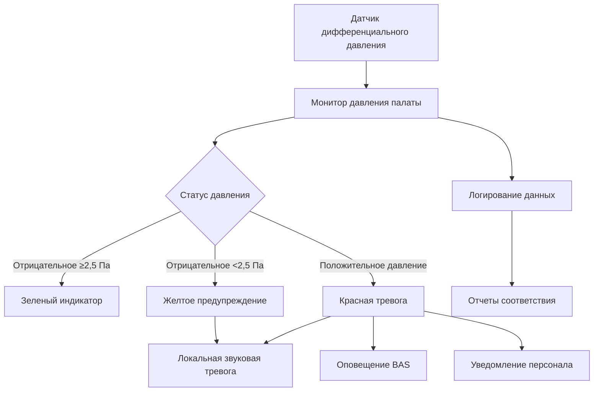

## Обзор

Палаты изоляции при переносе инфекции по воздуху (AII) защищают медицинский персонал и других пациентов от воздействия переносимых по воздуху инфекционных агентов путем поддержания контролируемого отрицательного давления относительно прилегающих пространств. Эти специализированные среды используют градиенты дифференциального давления, направленный воздушный поток и улучшенную фильтрацию для сдерживания патогенов, таких как туберкулез, корь, ветряная оспа и новые инфекционные заболевания.

Фундаментальная физика, определяющая производительность изолирующей палаты, сосредоточена на перепадах давления и сохранении потока массы. Когда объем вытяжного воздуха превышает объем приточного воздуха, палата работает с отрицательным давлением относительно прилегающих пространств, обеспечивая движение воздуха всегда от чистых зон к загрязненным.

## Принципы проектирования отрицательного давления

### Требования к перепаду давления

ASHRAE 170 устанавливает минимальные перепады давления между изолирующей палатой и прилегающими пространствами. Соотношение, описывающее перепад давления на открытии:

$$\Delta P = \frac{\rho v^2}{2}$$

Где $\Delta P$ — перепад давления (Па), $\rho$ — плотность воздуха (кг/м³), $v$ — скорость воздуха через пути утечки (м/с).

Для изолирования в медицинских учреждениях ASHRAE 170 требует:

| Параметр | Требование | Примечания |
|----------|------------|-----------|
| Минимальный перепад давления | -2,5 Па | Палата к коридору |
| Рекомендуемый перепад давления | -5–10 Па | Улучшенное сдерживание |
| Максимальное время открытия двери | 5 секунд | Поддержание отрицательного давления |
| Время восстановления | ≤30 секунд | Возврат к отрицательному после закрытия двери |

Объемный дисбаланс потока, создающий отрицательное давление:

$$Q_{вытяжка} - Q_{подача} = Q_{утечка} + Q_{дверь}$$

Где $Q_{вытяжка}$ — общий объем вытяжного воздуха, $Q_{подача}$ — объем приточного воздуха, $Q_{утечка}$ представляет инфильтрацию через конструктивные щели, и $Q_{дверь}$ учитывает нижние зазоры и проемы дверей.

### Требования к интенсивности воздухообмена

ASHRAE 170 предписывает минимальную интенсивность воздухообмена для изолирующих палат, обеспечивающую адекватное разбавление переносимых по воздуху контаминантов. Эффективность вентиляции при удалении патогенов следует экспоненциальному затуханию:

$$C(t) = C_0 \cdot e^{-\lambda t}$$

Где $C(t)$ — концентрация патогена в момент времени $t$, $C_0$ — начальная концентрация, $\lambda$ — интенсивность воздухообмена (ч⁻¹).

**Требования ASHRAE 170:**

- **Существующие сооружения**: минимум 6 воздухообменов в час (2 наружного воздуха)
- **Новое строительство**: минимум 12 воздухообменов в час (2 наружного воздуха)
- **Рекомендация CDC**: 12 воздухообменов в час или выше для изоляции при туберкулезе

Время для сокращения переносимого по воздуху загрязнения на 99%:

| Воздухообмены в час | Время до 99% удаления | Время до 99,9% удаления |
|-----|---------------------|----------------------|
| 6 | 46 минут | 69 минут |
| 12 | 23 минуты | 35 минут |
| 15 | 18 минут | 28 минут |
| 20 | 14 минут | 21 минута |

Уравнение эффективности удаления:

$$t = \frac{-\ln(C/C_0)}{ACH} \times 60$$

Где $t$ — время в минутах для достижения отношения концентраций $C/C_0$.

## Конфигурация предкамеры

Предкамеры служат зонами переходного давления между изолирующей палатой и коридором, обеспечивая дополнительный барьер против распространения патогенов при входе/выходе из палаты. Существует три конфигурации давления предкамеры:

### Стратегии давления в предкамере

| Конфигурация | Давление в предкамере | Применение | Преимущество |
|---------------|-------------------|-------------|-----------|
| Положительно-Отрицательная | Положительное к коридору, отрицательное к палате | Общая AII | Защита коридора от загрязнения |
| Отрицательно-Отрицательная | Отрицательное к обоим | Высокорисковые патогены | Максимальное сдерживание |
| Отрицательно-Положительная | Отрицательное к коридору, положительное к палате | Многофункциональные палаты | Конвертируемость в защитную среду |

ASHRAE 170 позволяет исключить предкамеру, если:
1. Палата поддерживает минимум -2,5 Па к коридору
2. Обеспечен постоянный визуальный мониторинг давления
3. Установлены автоматические доводчики дверей
4. Реализованы усиленные протоколы подготовки персонала

## Обработка вытяжного воздуха

Вытяжной воздух из изолирующих палат требует обработки перед выпуском, чтобы предотвратить загрязнение окружающей среды и защитить жителей здания.

### Требования фильтрации HEPA

Фильтры высокоэффективной очистки воздуха от взвешенных частиц (HEPA) удаляют 99,97% частиц размером ≥0,3 мкм, включая палочки туберкулеза (1–5 мкм), вирус кори (0,1–0,2 мкм в капельных ядрах) и другие переносимые по воздуху патогены.

Перепад давления на фильтрах HEPA:

$$\Delta P_{HEPA} = \Delta P_{начальное} + \frac{V}{A} \cdot K \cdot m$$

Где $V$ — объемный расход, $A$ — площадь фильтра, $K$ — коэффициент сопротивления, $m$ — накопленная масса частиц.

**Варианты вытяжки HEPA:**

1. **HEPA на уровне палаты**: отдельные корпуса фильтров на выпусках каждой изолирующей палаты
   - Преимущества: избыточность, изоляция отдельной палаты
   - Недостатки: многочисленные точки обслуживания, требования по пространству

2. **Центральная HEPA**: общая секция HEPA, обслуживающая несколько изолирующих палат
   - Преимущества: централизованное обслуживание, эффективность использования пространства
   - Недостатки: риск перекрестного загрязнения без надлежащего проектирования воздуховодов

3. **Двойная HEPA**: последовательная фильтрация для критических приложений
   - Комбинированная эффективность 99,9999%
   - Требуется для некоторых лабораторий биоудержания

### Точка выпуска вытяжного воздуха

Руководящие принципы CDC для выпуска вытяжного воздуха:

- Минимальное расстояние 7,6 м от воздухозаборников, открываемых окон, пешеходных зон
- Вертикальный выпуск с минимальной восходящей скоростью 12,7 м/с
- Расчеты высоты стека согласно моделированию дисперсии (коэффициент разбавления >1000)
- Недопущение рециркуляции вытяжного воздуха из изолирующей палаты

## Мониторинг давления и системы сигнализации

Постоянный мониторинг обеспечивает поддержание отрицательного давления в изолирующей палате. Современные системы используют датчики дифференциального давления с визуальной и звуковой сигнализацией.

### Компоненты системы мониторинга

**Технические характеристики датчика:**

| Параметр | Требование |
|----------|------------|
| Точность | ±0,25 Па |
| Время отклика | <5 секунд |
| Интервал выборки | Непрерывно или максимум 10 секунд |
| Место размещения дисплея | За пределами палаты, видимо из коридора |
| Задержка тревоги | 30–60 секунд (предотвращение ложных сигналов) |
| Частота калибровки | Минимум ежегодно |

### Стратегии управления

Современные системы управления изолирующей палатой поддерживают отрицательное давление посредством:

1. **Постоянный объемный дифференциал**: фиксированный сдвиг подачи/вытяжки (типичная величина 141–283 м³/ч)
   $$Q_{сдвиг} = Q_{вытяжка} - Q_{подача}$$

2. **Модуляция на основе давления**: модуляция заслонки вытяжки на основе обратной связи датчика давления
   - алгоритм управления PID регулирует вытяжку для поддержания заданного значения
   - более быстрый отклик на открытие двери и колебания давления

3. **Управление вентури-клапаном**: устройства фиксированного сопротивления, создающие предсказуемые перепады давления
   - не требуют электропитания для работы
   - механическая надежность для критических приложений

## Конструкция и герметизация палаты

Эффективность изолирующей палаты зависит от целостности оболочки, минимизирующей неконтролируемую утечку воздуха.

**Требования герметизации:**

- Загерметизированные проемы в потолке (электрические, сантехнические, HVAC)
- Двери с защитой от непогоды и автоматическими доводчиками
- Загерметизированные окна (предпочтительно неоткрываемые)
- Непрерывный паровой барьер в стенах и потолке
- Загерметизированные коммунальные каналы и проемы
- Максимальный нижний зазор двери: 1,27 см (обеспечивает контролируемый путь утечки)

Эффективная площадь утечки определяет отклик давления:

$$A_{эфф} = \frac{Q_{сдвиг}}{C_d \sqrt{2\Delta P/\rho}}$$

Где $A_{эфф}$ — эффективная площадь утечки, $Q_{сдвиг}$ — дифференциал подачи/вытяжки, $C_d$ — коэффициент расхода (типично 0,6–0,7).

## Пусконаладка и проверка производительности

ASHRAE 170 требует первоначальной и периодической проверки производительности изолирующей палаты.

**Испытания пусконаладки:**

1. **Проверка перепада давления**
   - Измерение дифференциала палата-коридор калиброванным манометром
   - Проверка поддержания при открытии двери (визуальный тест дымом)
   - Подтверждение 30-секундного восстановления после закрытия двери

2. **Измерения воздушного потока**
   - Проверка объема подачи и вытяжки (допуск ±10%)
   - Расчет и проверка интенсивности воздухообмена
   - Проверка сдвига подачи/вытяжки, создающего требуемое отрицательное давление

3. **Функциональные испытания системы сигнализации**
   - Проверка активации тревоги при пороговом давлении
   - Испытание функций визуальной и звуковой сигнализации
   - Подтверждение интеграции BAS и систем уведомления

4. **Испытание целостности оболочки**
   - Визуализация направления потока воздуха у дверей трубкой дыма
   - Испытание под давлением (опционально, для приложений высокого удержания)

**Постоянный мониторинг:**

- Ежедневная визуальная проверка мониторов давления персоналом
- Ежемесячные проверки калибровки оборудования мониторинга
- Ежеквартальные измерения расхода воздуха (подача и вытяжка)
- Ежегодное комплексное испытание производительности
- Немедленный отклик на условия тревоги

## Особые соображения

**Интеграция вытяжки туалета:**
Туалеты в изолирующей палате требуют отдельной вытяжки, поддерживающей отрицательное давление относительно пациентской палаты. Это создает каскад давления: Коридор > Палата > Туалет.

**Независимость системы HVAC:**
Изолирующие палаты должны обслуживаться отдельными приточно-вытяжными установками или иметь возможность изоляции от общих систем HVAC, чтобы предотвратить перекрестное загрязнение во время обслуживания.

**Планирование резервной мощности:**
Медицинские учреждения должны разрабатывать гибкую инфраструктуру, позволяющую конвертировать стандартные палаты в временные палаты изоляции во время пандемических событий, включая предусмотрение дополнительных вентиляторов вытяжки и портативных установок HEPA.

## Заключение

Проектирование палат изоляции при переносе инфекции по воздуху интегрирует фундаментальные принципы механики жидкостей, термодинамики и систем управления для создания безопасных сред здравоохранения. Надлежащая реализация дифференциалов отрицательного давления, адекватная интенсивность воздухообмена, эффективная обработка вытяжного воздуха и постоянный мониторинг защищают медицинский персонал и пациентов от передачи переносимых по воздуху патогенов. Соответствие стандартам ASHRAE 170 и руководящим принципам CDC обеспечивает производительность палат изоляции, отвечающую нормативным требованиям и целям клинической безопасности.
