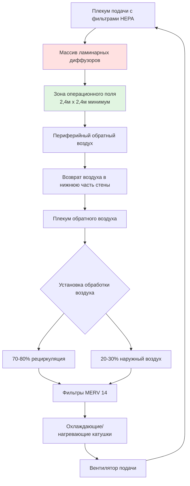
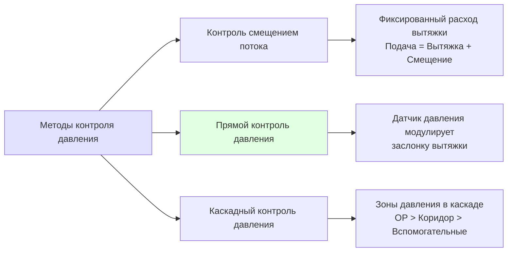

Системы HVAC операционных (ОР) представляют наиболее критичное и требовательное применение в учреждениях здравоохранения. Основной целью является предотвращение хирургических инфекций в области разреза (SSI) путём точного контроля воздушного загрязнения, температуры, влажности и дифференциального давления. Эти системы должны находить баланс между строгими требованиями контроля инфекций, комфортом пребывающих в помещении и энергоэффективностью.

## Основные критерии проектирования

ASHRAE 170 и рекомендации FGI устанавливают минимальные стандарты производительности вентиляции операционных. Эти критерии вытекают из физики переноса частиц и исследований передачи инфекций.

**Минимальные требования к вентиляции:**

| Параметр | Требование ASHRAE 170 | Рекомендации FGI |
|-----------|------------------------|----------------|
| Общее количество воздухообменов | минимум 20 воздухообменов в час | минимум 20 воздухообменов в час |
| Наружный воздух | минимум 4 воздухообмена в час | минимум 4 воздухообмена в час |
| Соотношение давления | Положительное (+0,060–0,180 Па) | Положительное относительно коридора |
| Диапазон температур | 20-23°C | 20-24°C |
| Относительная влажность | 20-60% | 20-60% (предпочтительно 30-60%) |
| Фильтрация | MERV 14 + терминальная HEPA | минимум MERV 14 + HEPA |

Требование положительного давления предотвращает инфильтрацию воздуха из коридора, содержащего более высокие концентрации частиц. Дифференциальное давление создаёт поток воздуха в соответствии с уравнением отверстия:

$$Q = C_d A \sqrt{\frac{2\Delta P}{\rho}}$$

где $Q$ — объёмный расход воздуха через щели двери (м³/ч), $C_d$ — коэффициент расхода (0,6–0,65), $A$ — площадь утечки (м²), $\Delta P$ — дифференциальное давление (Па), и $\rho$ — плотность воздуха (кг/м³).

Для типичных зазоров в дверях ОР (1,3–1,9 см), поддержание давления +0,120 Па требует примерно 71–142 м³/ч избыточного подачи над вытяжкой и перепуском воздуха.

## Системы вентиляции с ламинарным потоком

Системы с ламинарным (однонаправленным) потоком обеспечивают наивысший уровень чистоты воздуха для сверхчистых хирургических операций, таких как имплантация ортопедических изделий и трансплантация органов. Эти системы создают поршневидный паттерн воздушного потока, который сметает частицы вниз и в сторону от операционного поля.

### Физика потока воздуха

Истинный ламинарный поток требует числа Рейнольдса ниже 2300:

$$Re = \frac{\rho V D_h}{\mu}$$

где $V$ — скорость воздуха (м/с), $D_h$ — гидравлический диаметр (м), и $\mu$ — динамическая вязкость (Па·с).

Для применения в ОР, вертикальные скорости воздуха 0,13–0,18 м/с через массивы диффузоров создают квазиламинарные условия. Критический параметр проектирования — однородность скорости на операционном поле, обычно требующая коэффициента вариации (CV) менее 20%:

$$CV = \frac{\sigma_V}{\bar{V}} \times 100\%$$

где $\sigma_V$ — стандартное отклонение измерений скорости.

### Конфигурация диффузоров

Диффузоры ламинарного потока должны покрывать минимальную площадь 2,4 м × 2,4 м, центрированную над операционным столом. Распределение подаваемого воздуха следует принципам вытеснения пробок, а не смешивающей вентиляции. Концентрация частиц экспоненциально уменьшается с расстоянием от источника загрязнения:

$$C(x) = C_0 \exp\left(-\frac{V x}{D}\right)$$

где $C(x)$ — концентрация частиц на расстоянии $x$ от источника, $C_0$ — концентрация источника, $V$ — скорость воздуха, и $D$ — коэффициент диффузии частиц.

## Контроль температуры и влажности

Тепловой контроль в операционных решает противоречивые требования: комфорт хирурга при физически требовательных процедурах против профилактики переохлаждения пациента во время анестезии.

**Компоненты тепловой нагрузки:**

| Источник | Типичная нагрузка (кДж/ч) | Примечания |
|--------|----------------------|-------|
| Хирургические светильники | 4,2–8,4 | Светодиодная технология снижает нагрузку |
| Медицинское оборудование | 3,2–6,3 | Визуализация, электрохирургические аппараты |
| Персонал (4-8 человек) | 1,7–3,4 | Явная тепловыделение при лёгкой активности |
| Пациент | -0,5 до +0,5 | Потеря тепла при анестезии |
| Инфильтрация/наружный воздух | Переменная | Зависит от климата |

Температура подаваемого воздуха должна рассчитываться для удовлетворения явных и скрытых нагрузок:

$$T_s = T_r - \frac{q_s}{1.2 \times Q}$$

где $T_s$ — температура подаваемого воздуха (°C), $T_r$ — установленная температура помещения (°C), $q_s$ — явное тепловыделение (кДж/ч), и $Q$ — подача воздуха (м³/ч).

Для типичной ОР с подачей воздуха 1,4 м³/с (примерно 5100 м³/ч) и явной нагрузкой 15,8 МДж/ч:

$$T_s = 21 - \frac{15800}{1.2 \times 5100} = 21 - 2.6 = 18.4°C$$

Контроль влажности предотвращает накопление статического электричества (минимум 20% относительной влажности) и микробный рост на поверхностях (максимум 60% относительной влажности). Низкая температура подаваемого воздуха часто требует дополнительного нагрева для предотвращения переохлаждения при достижении осушения. Контроль точки росы обеспечивает более надёжное управление влажностью, чем контроль относительной влажности, с целевыми точками росы 2–7°C.

## Требования фильтрации HEPA

Фильтры высокоэффективной очистки воздуха от частиц (HEPA) задерживают 99,97% частиц ≥0,3 мкм, наиболее проникающего размера частиц (MPPS), где механизмы диффузии и перехвата наименее эффективны. Падение давления на фильтрах HEPA следует соотношению Дарси–Вейсбаха:

$$\Delta P = f \frac{L}{D_h} \frac{\rho V^2}{2}$$

Начальное падение давления составляет 30–60 Па при номинальном потоке, увеличиваясь до 120–150 Па в конце срока службы фильтра. Это повышение давления влияет на производительность вентилятора и расход воздуха системы.

Терминальные фильтры HEPA, установленные на подаче в помещение, устраняют загрязнение воздуха, поступающее от воздуховодов и систем после них, и обеспечивают окончательную очистку воздуха. Скорость на сечении фильтра не должна превышать 1,3 м/с для поддержания эффективности и минимизации падения давления.

## Стратегии контроля давления

Поддержание положительного давления требует активных систем управления, которые регулируют расходы подачи и вытяжки на основе измерений давления в реальном времени. Существуют три основные стратегии:

**Прямой контроль давления** обеспечивает наиболее надёжную производительность, но требует высокоточных датчиков дифференциального давления (±0,006 Па точность) и настроенных управляющих циклов PID. Алгоритм управления регулирует расход вытяжного воздуха для поддержания уставки:

$$Q_{выпуск} = Q_{подача} - Q_{смещение} + K_p e + K_i \int e \, dt + K_d \frac{de}{dt}$$

где $e$ — ошибка давления, и $K_p$, $K_i$, $K_d$ — пропорциональное, интегральное и дифференциальное усиления.

## Резервирование и надёжность

Системы HVAC операционных требуют 100% резервной мощности для критичных компонентов:

- Двойные установки обработки воздуха (конфигурация N+1)
- Резервные вентиляторы подачи и вытяжки
- Резервное питание для всего оборудования HVAC
- Автоматическое переключение при отказе компонента
- Постоянный мониторинг давления, температуры, влажности и состояния фильтров

Системы аварийного питания должны поддерживать полную работу HVAC во время отключения сети. Размер генератора должен учитывать пусковые токи в 6–8 раз больше, чем номинальный ток для электромоторного оборудования.

## Сдача в эксплуатацию и тестирование

Тестирование функциональной производительности проверяет соответствие системы критериям проектирования. Критические тесты включают:

1. **Проверка расходов воздуха:** измерить общий и наружный воздух в пределах ±10% от проектного значения
2. **Соотношения давления:** подтвердить +0,060–0,180 Па с закрытыми дверями
3. **Кратность воздухообмена:** вычислить воздухообмены в час из объёма помещения и измеренного расхода
4. **Время восстановления:** измерить время снижения концентрации частиц на 90% после испытания дымом
5. **Контроль температуры/влажности:** проверить поддержание уставки при переменных нагрузках
6. **Целостность фильтра:** провести DOP тест аэрозоля на фильтрах HEPA (0% утечка)

Тест времени восстановления оценивает эффективность воздухообмена, используя кинетику очистки частиц:

$$t_{90} = \frac{2.3}{\lambda} = \frac{2.3 \times V}{Q}$$

где $t_{90}$ — время для снижения на 90% (минуты), $\lambda$ — кратность воздухообмена (1/мин), $V$ — объём помещения (м³), и $Q$ — эффективный расход воздуха (м³/ч).

Для операционной объёмом 34 м³ с подачей воздуха 5100 м³/ч, теоретическое время восстановления составляет:

$$t_{90} = \frac{2.3 \times 34}{5100} = 0.0153 \text{ минуты} \approx 55 \text{ секунд}$$

Системы HVAC операционных представляют вершину точного контроля окружающей среды, интегрируя физику частиц, термодинамику и механику жидкостей для защиты безопасности пациента во время наиболее уязвимых медицинских процедур. Надлежащее проектирование, установка и обслуживание этих систем напрямую влияют на результаты хирургических вмешательств и уровень инфекций, связанных со здравоохранением.
