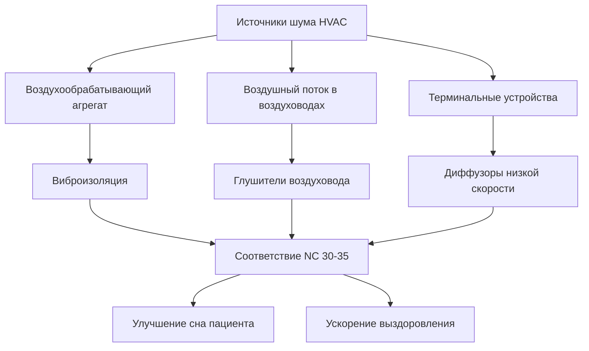
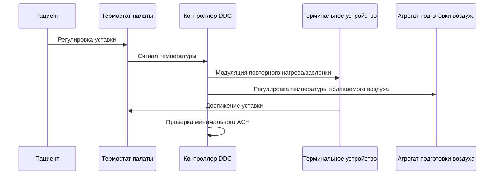

## Обзор

Системы HVAC палат пациентов должны уравновешивать контроль инфекций, тепловой комфорт, энергоэффективность и индивидуальные предпочтения пациента. ASHRAE 170 устанавливает минимальные требования вентиляции, признавая, что комфорт пациента напрямую влияет на результаты выздоровления. Проектная задача заключается в поддержании стабильных параметров окружающей среды для разнообразного контингента пациентов с различными скоростями обмена веществ и ожиданиями комфорта.

## Требования вентиляции ASHRAE 170

### Кратность воздухообмена

ASHRAE 170 предписывает минимальные скорости вентиляции для обычных палат пациентов на основе принципов контроля инфекций и разбавляющей вентиляции. Требуемая общая кратность воздухообмена в час (ACH):

$$Q_{total} = \frac{V_{room} \times ACH}{60}$$

где $Q_{total}$ — объемный расход (м³/ч), $V_{room}$ — объем палаты (м³), и ACH — воздухообмен в час.

| Параметр | Требование | Назначение |
|-----------|-------------|---------|
| Общий воздухообмен | 6 ACH минимум | Разбавление загрязнителей |
| Наружный воздух | 2 ACH минимум | Контроль запаха, создание давления |
| Рециркуляционный воздух | 4 ACH минимум | Энергоэффективность |
| Движение воздуха | Весь подаваемый воздух к пациенту | Минимизация перекрестного загрязнения |

### Расчет наружного воздуха

Требование наружного воздуха обеспечивает адекватное разбавление биоэффлювентов и поддерживает небольшое избыточное давление относительно коридоров:

$$Q_{OA} = \frac{V_{room} \times 2}{60} \text{ м³/ч}$$

Для типовой палаты пациента площадью 11,2 м² с высотой потолка 2,7 м (объем 30 м³):

$$Q_{OA} = \frac{30 \times 2}{60} = 1,0 \text{ м³/ч}$$

$$Q_{total} = \frac{30 \times 6}{60} = 3,0 \text{ м³/ч}$$

Физической основой является экспоненциальное затухание концентрации загрязнителей при разбавляющей вентиляции:

$$C(t) = C_0 \cdot e^{-\frac{Q}{V} \cdot t}$$

где $C(t)$ — концентрация загрязнителя в момент времени $t$, $C_0$ — начальная концентрация, $Q$ — скорость вентиляции, и $V$ — объем палаты. Более высокие кратности воздухообмена ускоряют удаление загрязнителей.

## Стратегия контроля температуры

### Параметры теплового комфорта

Палаты пациентов требуют точного контроля температуры в диапазоне ASHRAE 170 от 21 до 24°C. Уравнение теплового комфорта для лежачих пациентов в больничных одеяниях:

$$PMV = [M - W - E_{sk} - C_{res} - E_{res} - R - C]$$

где PMV — Прогнозируемая средняя оценка, $M$ — скорость обмена веществ (примерно 0,8 мет для отдыхающих пациентов), $W$ — внешняя работа (нулевая), $E_{sk}$ — испарительные потери теплоты с кожи, $C_{res}$ и $E_{res}$ — респираторные конвективные и испарительные потери, $R$ — тепловое излучение, и $C$ — конвективная теплопередача.

Пациенты имеют более низкие скорости обмена веществ, чем здоровые люди (0,7–0,9 мет в сравнении с 1,0–1,2 мет), требуя более высоких уставок температуры:

| Состояние | Скорость обмена веществ | Оптимальная температура |
|-----------|----------------|---------------------|
| Пациент в постоперационном периоде | 0,7–0,8 мет | 23–24°C |
| Пациент с общим заболеванием | 0,8–0,9 мет | 22–23°C |
| Амбулаторный пациент | 0,9–1,0 мет | 21–22°C |

### Индивидуальные элементы управления палатой

Индивидуальный контроль температуры удовлетворяет потребностям конкретного пациента. Системы управления должны обеспечивать:

**Диапазон уставок:** 21–24°C с шагом 0,5°C
**Дифференциал:** Минимум 1°C для предотвращения частого включения-отключения
**Время отклика:** Изменение температуры в течение 15 минут после регулировки

Скорость теплопередачи, необходимая для регулировки температуры:

$$q = \dot{m} \cdot c_p \cdot (T_{supply} - T_{return})$$

где $q$ — скорость теплопередачи (кВт), $\dot{m}$ — массовый расход воздуха (кг/ч), $c_p$ — удельная теплоемкость воздуха (1,006 кДж/кг·°C), и $T$ — температуры.

Для быстрого отклика температуры при системах с постоянным объемом необходима модуляция температуры подаваемого воздуха через дополнительный нагрев:

$$T_{supply} = T_{room} - \frac{q}{\dot{m} \cdot c_p}$$

## Управление влажностью

ASHRAE 170 определяет диапазон 30–60% относительной влажности. Контроль влажности влияет как на тепловой комфорт, так и на контроль инфекций:

$$RH = \frac{p_v}{p_{sat}(T)} \times 100\%$$

где $p_v$ — парциальное давление водяного пара и $p_{sat}$ — давление насыщения при температуре $T$.

Психрометрическое соотношение между температурой и влажностью влияет на воспринимаемый комфорт. При 22°C и 30% ОВ в сравнении с 60% ОВ разница в содержании влаги составляет:

$$\Delta W = 0,622 \times \left(\frac{p_v(60\%)}{p_{atm} - p_v(60\%)} - \frac{p_v(30\%)}{p_{atm} - p_v(30\%)}\right)$$

| Уровень влажности | Влияние на комфорт | Влияние на патогены |
|----------------|-------------------|---------------------|
| Ниже 30% | Сухие слизистые оболочки, статика | Повышенное выживание вирусов |
| 30–40% | Комфортно для большинства | Оптимально для контроля |
| 40–60% | Ощущение легкой влажности | Возможен рост бактерий |
| Выше 60% | Дискомфорт, липкость | Риск роста плесени |

## Акустические характеристики

Шум в палатах пациентов нарушает сон и замедляет выздоровление. Критерии звука ASHRAE для палат пациентов:

**Максимальный уровень NC:** NC 30–35
**Максимальное взвешенное по шкале A звучание:** 40 дBA

Звуковая мощность от систем HVAC соответствует:

$$L_p = L_w - 10\log_{10}(A) + K$$

где $L_p$ — уровень звукового давления у приемника, $L_w$ — уровень звуковой мощности источника, $A$ — поглощение помещения, и $K$ — постоянная помещения.

### Стратегии контроля шума

**Выбор терминального устройства:** Диффузоры со скоростями выброса менее 2 м/с минимизируют регенерированный шум. Звуковая мощность диффузора:

$$L_w = K + 10\log_{10}(Q) + 20\log_{10}(v)$$

где $K$ — постоянная, $Q$ — расход воздуха (м³/ч), и $v$ — скорость (м/с).

## Соотношения давлений

Палаты пациентов поддерживают небольшое избыточное давление (2,5–7,5 Па) относительно коридоров для предотвращения инфильтрации загрязнителей коридора. Перепад давления является результатом дисбаланса приточно-вытяжного воздуха:

$$\Delta P = \frac{\rho v^2}{2} \cdot K$$

где $\Delta P$ — разность давлений, $\rho$ — плотность воздуха, $v$ — скорость, и $K$ — коэффициент потерь.

Для контроля инфекций минимальный перепад давления предотвращает обратный поток воздуха через щели дверей:

$$Q_{leak} = C \cdot A \cdot \sqrt{\Delta P}$$

где $C$ — коэффициент расхода, $A$ — площадь утечки, и $\Delta P$ — перепад давления.

## Подходы к проектированию системы

### Постоянный объем в сравнении с переменным объемом

| Тип системы | Преимущества | Недостатки |
|-------------|-----------|---------------|
| Постоянный объем с повторным нагревом | Гарантированные скорости вентиляции, простое управление | Более высокое потребление энергии |
| VAV с минимальным расходом | Энергоэффективность | Сложное управление, проверка минимального расхода |
| Вентилятор терминального устройства | Постоянное движение воздуха, избыточность | Более высокие первоначальные затраты, потенциал шума |

### Последовательность управления

Логика управления должна предотвратить регулировку пациентом снижения минимальной вентиляции:

$$Q_{actual} \geq Q_{min} = \frac{V_{room} \times 6}{60}$$

независимо от уставки температуры.

## Специальные соображения

**Иммунокомпрометированные пациенты:** Некоторые учреждения предоставляют HEPA-фильтрацию (99,97% при 0,3 мкм) и повышенный воздухообмен (12 ACH) для защитных сред.

**Возможность изоляции:** Спроектируйте системы с возможностью преобразования в изоляцию с отрицательным давлением путем активации заслонок и вытяжного вентилятора.

**Ночное снижение температуры:** Хотя экономит энергию, ночное снижение температуры в занятых палатах пациентов обычно избегается из-за постоянной заселенности и уязвимого контингента.

Сочетание адекватной вентиляции, точного контроля температуры, надлежащей влажности и низкого уровня шума создает среду, способствующую выздоровлению при соблюдении стандартов контроля инфекций, установленных ASHRAE 170.
