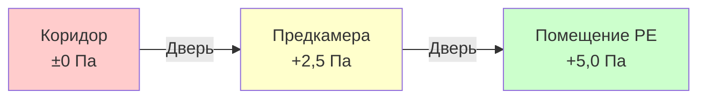

Помещения с защитной средой (PE) обеспечивают наивысший уровень контроля окружающей среды в учреждениях здравоохранения для пациентов с тяжелым иммунодефицитом, проходящих трансплантацию костного мозга, клеточную терапию или интенсивную химиотерапию. Эти специализированные помещения используют каскады избыточного давления, высокоэффективную фильтрацию и герметичную конструкцию для создания ультра-чистой среды, которая минимизирует риск оппортунистических инфекций.

## Физические принципы защиты посредством избыточного давления

Фундаментальный механизм защиты основан на перепадах давления, которые создают исходящий поток воздуха, предотвращая попадание загрязненного воздуха из коридора в палату пациента. Перепад давления на двери или щели определяет объемный расход согласно уравнению потока через отверстие:

$$Q = C_d A \sqrt{\frac{2\Delta P}{\rho}}$$

где $Q$ — объемный расход (CFM), $C_d$ — коэффициент расхода (0,6–0,65 для щелей в дверях), $A$ — площадь утечки (м²), $\Delta P$ — перепад давления (Па), и $\rho$ — плотность воздуха (кг/м³). ASHRAE 170 требует минимального перепада давления +2,5 Па между помещением PE и предкамерой, а также между предкамерой и коридором, создавая каскадную иерархию давления.

Этот, казалось бы, небольшой перепад давления создает достаточную исходящую скорость через щели в дверях, чтобы преодолеть турбулентное перемешивание при открытии дверей. Для типичной двери размером 0,9 м × 2,1 м с зазором периметра 1,3 см (0,07 м²), перепад давления +2,5 Па создает примерно 16,5 м³/ч (9,7 CFM) исходящего потока утечки, что эквивалентно 7,2 м/мин скорости через зазор — достаточно, чтобы предотвратить внутреннее загрязнение при кратковременном открытии.

## Требования к HEPA-фильтрации

Помещения PE требуют концевой HEPA-фильтрации с минимальной эффективностью 99,97% при размере частиц 0,3 мкм, наиболее проникающем размере частиц (MPPS), где механизмы фильтрации переходят между диффузией и перехватом. Физика фильтрации включает три механизма:

1. **Перехват**: Частицы, следующие линиям потока, контактируют с волокнами фильтра (преобладает для частиц >0,5 мкм)
2. **Диффузия**: Броуновское движение заставляет малые частицы отклоняться от линий потока (преобладает <0,1 мкм)
3. **Инерционный удар**: Крупные частицы не могут следовать кривизне потока воздуха вокруг волокон

Комбинированная эффективность показывает минимум при примерно 0,3 мкм, что делает этот размер критическим тестовым размером. HEPA-фильтры должны устанавливаться с герметичными прокладками и тестироваться на месте, используя аэрозольное сканирование DOP (диоктилфталата) или PAO (полиальфаолефина) для проверки проникновения <0,01% во всех точках, включая уплотнения фильтр-рама.

Количество подаваемого воздуха должно достичь минимум 12 воздухообменов в час (ACH) согласно ASHRAE 170, хотя многие учреждения указывают 15–20 ACH для улучшенной защиты. Для типичного помещения PE размером 3,7 м × 4,3 м × 2,7 м (43 м³):

$$\text{Требуемый объем} = \frac{\text{Объем} \times \text{ACH}}{60} = \frac{43 \times 12}{60} = 8,6 \text{ м³/ч (минимум)}$$

## Герметичная конструкция помещения

Поддержание избыточного давления требует минимизации неконтролируемых путей утечки. Конструкция помещения PE использует:

- **Монолитный потолок**: Герметичный гипсокартон или аналогичная поверхность без отверстий исключает утечку из плленума
- **Герметизированные проходы**: Все электрические коробки, проходы для труб и отверстия воздуховодов герметизированы подходящим герметиком без выделения газов
- **Непрерывный паробарьер**: Простирается от пола до настила, чтобы исключить утечки из полостей стен
- **Двери с прокладками**: Самозакрывающиеся двери с прижимными прокладками со всех четырех сторон
- **Сварные или герметизированные оконные рамы**: Если предусмотрены смотровые окна

Общая утечка помещения не должна превышать разницу между подачей и вытяжкой, необходимую для поддержания давления. Типичное смещение проектирования 35–47 м³/ч для стандартного помещения PE учитывает переводы воздуха под дверями, утечку концевого оборудования и несовершенства конструкции.

## Стратегия контроля давления

Поддержание стабильного избыточного давления при изменяющихся условиях требует активного контроля давления. Уравнение баланса давления:

$$\Delta P = f(Q_{подача} - Q_{вытяжка} - Q_{передача} - Q_{утечка})$$

Большинство систем помещений PE используют одну из двух стратегий контроля:

| Стратегия | Контроль подачи | Контроль вытяжки | Демпфер передачи | Стабильность давления |
|-----------|-----------------|------------------|-------------------|----------------------|
| **Смещение постоянного объема** | Фиксированный м³/ч | Фиксированный м³/ч (смещение) | Фиксированное открытие | Умеренная (±0,0005 кПа) |
| **Прямой контроль давления** | Модулирующий демпфер | Фиксированный м³/ч | Модулирующий или фиксированный | Высокая (±0,00001 кПа) |

Прямой контроль давления с датчиком давления в помещении и модулирующим демпфером подачи обеспечивает превосходную стабильность при открытии дверей и изменении загрузки фильтра, автоматически регулируя объем подачи для поддержания уставки.

## Конфигурация предкамеры

ASHRAE 170 допускает две конфигурации предкамеры для помещений PE:

**Конфигурация 1: Каскад положительного давления**
- Коридор: 0 Па (эталон)
- Предкамера: минимум +2,5 Па
- Помещение PE: минимум +5,0 Па (дополнительно +2,5 Па выше предкамеры)
- Подача в предкамеру: 47–59 м³/ч с HEPA-фильтрацией
- Обеспечивает промежуточную зону для надевания защитного оборудования
- Обе двери не должны открываться одновременно

**Конфигурация 2: Предкамера с возможностью положительного/отрицательного давления**
- Позволяет переключить предкамеру на отрицательное давление, когда пациент в помещении PE имеет воздушно-капельное инфекционное заболевание
- Требует двойной управления уставками и систем подачи/вытяжки независимого от давления
- Менее распространена из-за сложности и потенциала для ошибок управления

## Проверка производительности вентиляции

Ввод в эксплуатацию помещения PE требует строгого тестирования согласно ASHRAE 170 и протоколам, специфичным для учреждения:

| Тест | Критерии приемки | Частота |
|------|------------------|---------|
| Перепад давления | Минимум +2,5 Па (помещение к предкамере, предкамера к коридору) | Начальный, ежегодно, замена фильтра |
| Целостность HEPA-фильтра | Нулевое проникновение >0,01% аэрозольным сканированием | Начальный, ежегодно |
| Объем воздушного потока | ≥12 ACH, проверка во всех терминальных точках | Начальный, ежегодно |
| Распределение воздуха в помещении | Однородность температуры ±1,1°C, отсутствие застойных зон | Начальный |
| Подсчет частиц | Класс 100 (ISO 5): ≤100 частиц/см³ ≥0,5 мкм | Начальный, ежегодно |
| Время восстановления | 99% удаление частиц <30 минут | Начальный |

Тестирование времени восстановления измеряет способность помещения удалять введенное загрязнение, рассчитываемую на основе экспоненциального затухания:

$$C(t) = C_0 e^{-\frac{N \cdot t}{60}}$$

где $C(t)$ — концентрация частиц в момент времени $t$ (минуты), $C_0$ — начальная концентрация, и $N$ — эффективный воздухообмен в час, включая эффективность фильтрации.

## Критические соображения при проектировании

**Распределение подаваемого воздуха**: Ламинарный или однонаправленный поток от потолочных массивов HEPA-фильтров обеспечивает превосходную производительность по сравнению с традиционной смешивающей вентиляцией. Целевая скорость подаваемого воздуха 18–27 м/мин через зону пациента создает нежный нисходящий поток, который выводит частицы к нижним выходным решеткам.

**Расположение вытяжки**: Размещение выходных решеток низко на стене напротив источника подачи, позади кровати пациента. Это расположение устанавливает поток от пола к потолку, который непрерывно удаляет частицы, образующиеся в зоне пациента, прежде чем они смогут рециркулировать.

**Контроль температуры и влажности**: Пациенты с иммунодефицитом часто испытывают нарушенную терморегуляцию. Предусмотрите индивидуальный контроль в помещении с диапазоном 20–24°C и относительной влажностью 30–60%. Достичь точного контроля влажности через систему наружного воздуха (DOAS) с центральной осушкой, а не полагаться на концевой пересчет.

**Избыточность**: Критические блоки PE требуют резервного оборудования воздухообработки N+1 или 2N с автоматическим переключением для поддержания защиты во время обслуживания или отказа оборудования. Включите аварийные подключения питания для непрерывной работы при отключении коммунальных услуг.

**Непрерывный мониторинг**: Установите постоянные мониторы давления с визуальным индикатором у входа в помещение и удаленной сигнализацией в систему мониторинга учреждения. Отклонения давления ниже уставки вызывают немедленное уведомление, позволяя предпринять корректирующие действия до воздействия на пациента.

Помещения с защитной средой представляют вершину инженерии вентиляции в здравоохранении, объединяя точный контроль давления, высокоэффективную фильтрацию и герметичную конструкцию для создания сред, приближающихся к стандартам чистых помещений. Надлежащее проектирование, строительство и постоянная проверка обеспечивают надежную защиту этих критических пространств для наиболее уязвимого населения пациентов.
