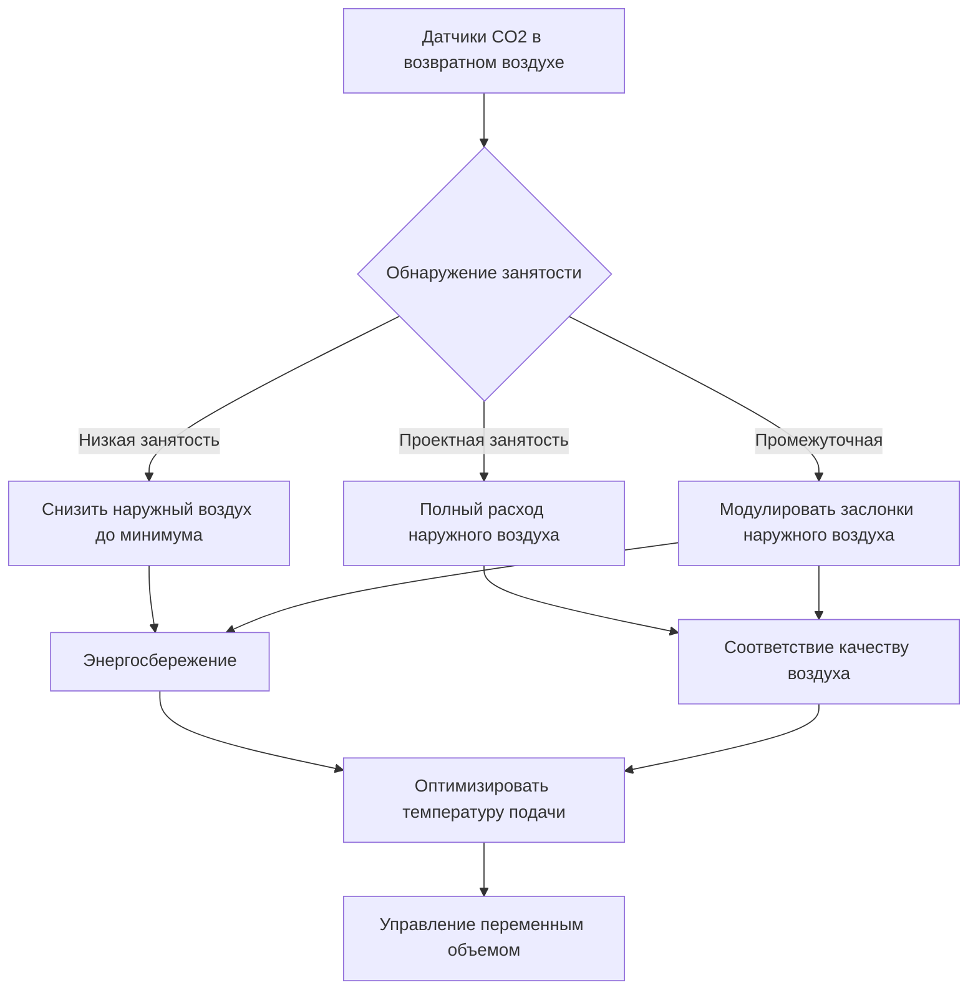
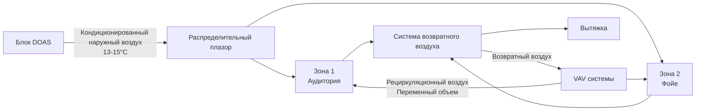

# HVAC системы для помещений с высокой плотностью занятости

Помещения с высокой плотностью занятости представляют уникальные проблемы для HVAC из-за сконцентрированных тепловых выделений, повышенных требований к вентиляции и переменных режимов нагрузки. Эти среды—аудитории, театры, лекционные залы, конференц-центры и культовые помещения—требуют специализированных подходов к проектированию для поддержания приемлемого качества воздуха в помещении при управлении потреблением энергии.

## Классификация плотности занятости

ASHRAE 62.1 классифицирует плотность занятости для определения требований к расходу вентиляции. Помещения с высокой плотностью превышают типичное коммерческое занятие в 3-10 раз.

| Тип помещения | Проектная занятость | Категория ASHRAE 62.1 | $R_p$ (л/с на чел.) | $R_a$ (л/с на м²) |
|------------|-----------------|---------------------|-------------------|----------------|
| Офис | 5 человек/93 м² | Деловое | 2.36 | 0.032 |
| Аудитория класса | 35 человек/93 м² | Образовательное | 4.72 | 0.064 |
| Театр (фиксированные места) | 150 человек/93 м² | Собрание | 2.36 | 0.032 |
| Стоячее место | 100 человек/93 м² | Собрание | 3.54 | 0.032 |
| Аудитория | 150 человек/93 м² | Собрание | 2.36 | 0.032 |

Полное требование к вентиляции объединяет компоненты на основе количества людей и площади:

$$V_{oz} = R_p \cdot P_z + R_a \cdot A_z$$

Где:
- $V_{oz}$ = требуемый наружный воздух для зоны (л/с)
- $R_p$ = расход наружного воздуха на человека (л/с на чел.)
- $P_z$ = население зоны (человек)
- $R_a$ = расход наружного воздуха на единицу площади (л/с на м²)
- $A_z$ = площадь пола зоны (м²)

## Характеристики нагрузок

Высокоплотные помещения генерируют значительные чувствительные и скрытые нагрузки, сконцентрированные на ограниченной площади пола.

### Чувствительное тепло от людей

Метаболическое тепло человека варьируется в зависимости от уровня активности. Для сидячих собраний:

$$Q_{sensible} = N \cdot q_s \cdot CLF$$

Где:
- $N$ = количество людей
- $q_s$ = чувствительное тепловыделение на человека (73 Вт при сидении, низкая активность)
- $CLF$ = коэффициент охлаждающей нагрузки (0,8-1,0 для высокоплотных помещений)

### Скрытое тепло от людей

Выделение влаги создает значительные нагрузки на осушку:

$$Q_{latent} = N \cdot q_l$$

Где:
- $q_l$ = скрытое тепловыделение на человека (59 Вт при сидении, низкая активность)

Для аудитории на 500 мест, работающей на полную мощность:
- Чувствительная нагрузка: 500 × 73 × 0,9 = 32,85 кВт
- Скрытая нагрузка: 500 × 59 = 29,5 кВт
- Полная нагрузка от занятости: 62,35 кВт

### Коэффициент чувствительного тепла

Высокоплотные помещения показывают более низкие коэффициенты чувствительного тепла, чем типичные коммерческие приложения:

$$SHR = \frac{Q_{sensible}}{Q_{sensible} + Q_{latent}}$$

Типичные значения SHR:
- Стандартный офис: 0,75-0,85
- Высокоплотное собрание: 0,50-0,65
- Стоячие места на событиях: 0,45-0,55

Этот низкий SHR требует оборудования с повышенной способностью осушки.

## Проектирование вентиляционной системы

### Требования к наружному воздуху

Для аудитории площадью 930 м² с 1 500 местами:

$$V_{oz} = (2,36 \text{ л/с на чел.} \times 1 500) + (0,032 \text{ л/с на м}^2 \times 930)$$
$$V_{oz} = 3 540 + 30 = 3 570 \text{ л/с}$$

Это представляет значительную долю наружного воздуха по сравнению с типичными офисными зданиями.

### Управляемая спросом вентиляция

Системы DCV модулируют наружный воздух в зависимости от фактической занятости, измеряемой датчиками CO₂:

$$V_{oa}(t) = V_{min} + \left(\frac{CO_2(t) - CO_{2,outdoor}}{CO_{2,setpoint} - CO_{2,outdoor}}\right) \cdot (V_{design} - V_{min})$$

Где:
- $V_{oa}(t)$ = расход наружного воздуха в момент времени t
- $V_{min}$ = минимальный наружный воздух (требуемая нормами вентиляция при отсутствии занятости)
- $CO_{2,setpoint}$ = целевой CO₂ в помещении (обычно 1 000-1 100 ppm)
- $CO_{2,outdoor}$ = окружающий CO₂ (обычно 400-450 ppm)

## Типы систем и стратегии

### Системы на основе воздуха

**VAV с несколькими зонами и выделенной системой наружного воздуха (DOAS)**

Этот подход разделяет вентиляцию и тепловой контроль:

Преимущества:
- Развязанная вентиляция и пространственный контроль
- Повышенная осушка в блоке DOAS
- Сниженные объемы подаваемого воздуха при низких скрытых нагрузках
- Улучшенная эффективность на частичных нагрузках

**Система распределения воздуха под полом (UFAD)**

Системы UFAD подают кондиционированный воздух на уровне пола, используя тепловую стратификацию:

- Температура подаваемого воздуха: 17-20°C (выше, чем в системах с верхней подачей)
- Объем подаваемого воздуха снижен на 20-30% благодаря стратификации
- Улучшенная эффективность вентиляции: $E_v$ = 1,2-1,3 против 1,0 для верхней подачи
- Эффективный расход вентиляции: $V_{eff} = E_v \cdot V_{supply}$

### Системы воздух-вода

**Системы охлаждаемых балок**

Активные охлаждаемые балки объединяют вентиляционный воздух с локальным чувствительным охлаждением:

- Первичный воздух (вентиляция): 0,4-0,6 л/с на м² при 13-14°C
- Охлаждение чиллированной воды: 75-125 Вт/м²
- Подходит для нагрузок до SHR = 0,65 с дополнительной осушкой

Ограничение: Высокие скрытые нагрузки требуют предварительной осушки для поддержания точки росы помещения ниже температуры поверхности балки (обычно 14-15°C).

## Стратегии управления

### Очистка перед занятостью

Перед запланированными событиями системы выполняют циклы очистки:

1. За 2 часа до события: 100% наружный воздух при максимальном расходе
2. За 1 час до события: Снизить до 50% наружного воздуха, начать охлаждение помещения
3. Начало события: Переход в режим управления DCV

### Стратегии сброса нагрузки

Сброс температуры подаваемого воздуха в зависимости от занятости:

$$T_{supply} = T_{min} + \left(1 - \frac{CO_2 - CO_{2,outdoor}}{CO_{2,design} - CO_{2,outdoor}}\right) \cdot (T_{max} - T_{min})$$

Это повышает температуру подаваемого воздуха при низкой занятости, снижая энергию рециркуляции и улучшая осушку при высоких скрытых нагрузках.

## Соображения проектирования

### Акустические требования

Высокоплотные помещения требуют критериев NC 25-30:

- Максимальная скорость воздуха в воздуховодах: 6-9 м/с в занятых помещениях
- Перепад давления на терминальном устройстве: <37 Па
- Размещение выпуска: избегать прямого пути к сцене/области презентации
- Звукоизоляция воздуховода: 25-50 мм в последних 3-4,5 м подающих воздуховодов

### Переходная реакция

Быстрые изменения занятости требуют отзывчивых систем:

- Минимальный стабилизирующий коэффициент VAV коробки: 30-40% (против 20-30% в офисах)
- Скорость привода заслонки: 60-90 секунд полный ход
- Время отклика системы DDC: опрос датчика каждые 30-60 секунд
- Полномочия клапана чиллированной воды: 0,4-0,5 для быстрого отклика

### Распределение воздуха

Равномерное распределение воздуха в помещениях с высокими потолками:

- Дальность подачи: 0,75 × высота потолка для смешивающих систем
- Скорость в зоне занятости: <0,75 м/с
- Температурный дифференциал: 11-14°C для высоких потолков (>6 м)
- Воздухообмен: 6-12 ACH при проектной занятости

## Оптимизация энергии

Высокоплотные помещения показывают экстремальное разнообразие нагрузок. Пиковые проектные нагрузки возникают <5% времени работы. Энергоэффективные проекты включают:

1. **Управляемая спросом вентиляция**: 30-50% годового энергосбережения в сравнении с постоянным объемом наружного воздуха
2. **Работа с экономайзером**: Свободное охлаждение во время отсутствия/низкой занятости
3. **Приводы с переменной скоростью**: Энергия вентилятора пропорциональна (расход)³, значительное энергосбережение на частичных нагрузках
4. **Рекупеация тепла**: Вентиляторы с рекупераций тепла возвращают 60-80% тепла выхлопного газа в экстремальных климатических условиях

Штраф за энергию вентиляции в высокоплотных приложениях:

$$E_{vent} = 1,08 \cdot V_{oa} \cdot \Delta T \cdot h_{operation}$$

Для примера аудитории 3 570 л/с с температурным дифференциалом 22°C и 2 000 часов/год работы:

$$E_{vent} = 1,08 \times 3 570 \times 22 \times 2 000 = 169 411 200 \text{ кДж/год}$$

Это составляет приблизительно 47 МВт·ч/год энергии кондиционирования—управление спросом может снизить это на 40-60% в зависимости от фактических режимов использования.

## Заключение

HVAC системы для помещений с высокой плотностью занятости требуют тщательного интегрирования требований вентиляции, управления нагрузками и стратегий управления. Успех зависит от точных прогнозов занятости, надлежащего выбора системы для конкретного коэффициента чувствительного тепла и отзывчивого управления, которое адаптируется к высокопеременным условиям. Управляемая спросом вентиляция представляет наиболее эффективную меру энергосбережения при одновременном поддержании качества воздуха в помещении в соответствии с нормами.
