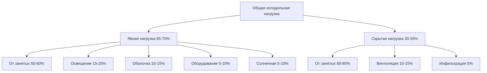

# Охлаждение помещений для собрания

Помещения собрания—театры, концертные залы, конференц-центры, арены и культовые сооружения—создают уникальные проблемы холодильной нагрузки из-за экстремальной плотности занятости, прерывистых режимов использования и одновременных пиковых нагрузок. Понимание физики генерации и передачи тепла в этих условиях критически важно для правильного определения размера системы.

## Анализ компонентов нагрузки

Общая холодильная нагрузка для помещений собрания определяется прежде всего теплоприбылью от людей, которая может достигать 29–88 кДж/ч на человека в зависимости от уровня активности и конструкции здания. В отличие от офисных или жилых помещений, где нагрузки от оболочки и оборудования являются первостепенными, помещения собрания испытывают холодильные нагрузки, в которых люди вносят вклад 60–75% от общего прироста тепла.

### Уравнение общей холодильной нагрузки

Комплексная холодильная нагрузка для помещения собрания выражается следующим образом:

$$Q_{total} = Q_{sensible} + Q_{latent}$$

Где:

$$Q_{sensible} = Q_{occupants,s} + Q_{lights} + Q_{envelope} + Q_{equipment} + Q_{solar}$$

$$Q_{latent} = Q_{occupants,l} + Q_{infiltration,l} + Q_{ventilation,l}$$

Отношение явной теплоты (SHR) для помещений собрания обычно составляет 0,60–0,75, что значительно ниже, чем в коммерческих зданиях (0,75–0,85), указывая на значительные скрытые нагрузки.

## Характеристики нагрузки от занятых

Справочник ASHRAE Fundamentals предоставляет скорости выработки метаболического тепла для различных уровней активности. Для помещений собрания:

| Тип занятости | Явная теплота (кДж/ч·чел) | Скрытая теплота (кДж/ч·чел) | Общая теплота (кДж/ч·чел) |
|----------------|-------------------------------|----------------------------|---------------------------|
| Театр (дневной сеанс) | 206 | 148 | 354 |
| Театр (вечерний сеанс) | 206 | 148 | 354 |
| Концертный зал (сидячий) | 206 | 148 | 354 |
| Арена (высокая активность) | 174 | 327 | 501 |
| Конференц-зал | 222 | 158 | 380 |

Явная теплота от людей учитывает конвекцию и излучение от человеческого тела, в то время как скрытая теплота представляет влагу, выделяемую при дыхании и потоотделении. При условиях проектирования 1000-местный театр генерирует примерно 205 МДж/ч явной теплоты и 148 МДж/ч скрытой теплоты только от присутствия людей—что эквивалентно емкости охлаждения 9,9 кВт.

## Нагрузки от освещения и оборудования

Помещения собрания требуют значительного освещения для сценических площадей с расчетом теплоприбыли:

$$Q_{lights} = W_{installed} \times FU \times FSA$$

Где:
- $W_{installed}$ = установленная мощность освещения (Вт)
- $FU$ = коэффициент использования (0,8–1,0)
- $FSA$ = коэффициент специального допуска (1,0–1,2 для накаливания)

Современное светодиодное театральное освещение снижает холодильные нагрузки на 60–70% по сравнению с устаревшими системами накаливания. Типичный 500-местный театр может иметь 30 000–50 000 Вт установленной мощности освещения, что способствует 105–179 МДж/ч явной холодильной нагрузке.

Звуковое оборудование, проекционное оборудование и системы управления добавляют 5 000–15 000 Вт в специализированных концертных площадках.

## Рассмотрение оболочки и вентиляции

Помещения собрания часто имеют минимальную площадь внешней стены относительно площади пола, что снижает нагрузку на оболочку. Однако требования к вентиляции доминируют из-за высокой занятости:

$$Q_{ventilation} = 1.08 \times CFM \times \Delta T + 0.68 \times CFM \times \Delta W$$

Стандарт ASHRAE 62.1 требует минимальной скорости вентиляции 5 CFM (8,5 м³/ч) на человека плюс 0,06 CFM/м² (0,19 м³/ч·м²) для помещений собрания. Для аудитории 929 м² с 1000 занятыми:

- Требуемая вентиляция = (8,5 × 1 000) + (0,19 × 929) = 8 677 м³/ч (5 102 CFM)
- При условиях проектирования (35°C ТБ, 24°C ТВ на улице; 24°C ТБ, 50% ОВ внутри)
- Явная нагрузка = 1,08 × 5 102 × (35 - 24) = 60,4 МДж/ч
- Скрытая нагрузка = 0,68 × 5 102 × (0,0145 - 0,0093) = 18,1 МДж/ч

## Разнообразие нагрузки и время

В отличие от постоянно занятых зданий, помещения собрания испытывают драматические колебания нагрузки:

```mermaid
gantt
    title Профиль нагрузки помещения собрания
    dateFormat HH:mm
    axisFormat %H:%M
    section Занятость
    Не занято : 09:00, 5h
    Подготовка : 14:00, 1h
    Полная занятость : 15:00, 3h
    После события : 18:00, 1h
    section Холодильная нагрузка
    Минимальная нагрузка : 09:00, 5h
    Возрастание : 14:00, 1h
    Пиковая нагрузка : 15:00, 3h
    Спад : 18:00, 1h
```

Этот прерывистый режим использования создает проблемы при проектировании:

1. **Эффекты тепловой массы**: Конструкция здания поглощает тепло в периоды занятости, выделяя его впоследствии
2. **Требования предварительного охлаждения**: Системы должны снижать температуру помещения на 1–2 часа перед приходом людей
3. **Время пикового спроса**: Плата за пиковый спрос коммунального предприятия влияет на расходы на эксплуатацию
4. **Циклирование оборудования**: Частая работа с остановками влияет на долговечность компонентов

## Рассмотрения при определении размера

Правильное определение размера системы для помещений собрания требует тщательного анализа одновременных нагрузок. Расчет блочной холодильной нагрузки должен учитывать:

**Коэффициенты разнообразия**: Не все источники тепла достигают пика одновременно. Применяйте коэффициент разнообразия 0,85–0,95 к общей подключенной мощности освещения и оборудования.

**Коэффициенты безопасности**: Ограничивайте коэффициенты безопасности максимум 10–15%. Оборудование завышенного размера приводит к плохой осушке, короткому циклированию и дискомфорту занятых.

**Разбивка холодильной нагрузки (типичный 1000-местный театр)**:

| Компонент | Явная (МДж/ч) | Скрытая (МДж/ч) | Общая (МДж/ч) | Процент |
|-----------|-------------------|-----------------|---------------|------------|
| От занятых | 205 | 148 | 353 | 56% |
| Освещение | 127 | 0 | 127 | 20% |
| Вентиляция | 127 | 21 | 148 | 23% |
| Оболочка | 16 | 0 | 16 | 3% |
| Оборудование | 11 | 0 | 11 | 2% |
| **Всего** | **486** | **169** | **655** | **100%** |

Это дает общее требование охлаждения 18,6 кВт при условиях проектирования.

## Рекомендации по проектированию

На основе принципов ASHRAE Fundamentals и практического опыта:

1. **Рассчитывайте нагрузки от занятых при максимальной проектной занятости**—используйте расчетную нагрузку от строительных норм, а не количество мест
2. **Явно учитывайте скрытые нагрузки**—помещения собрания требуют 30–35% емкости для осушки
3. **Рассмотрите стратегии предварительного охлаждения**—снижайте уставку неиспользуемого помещения на 2–3 часа перед событиями
4. **Оцените преимущества тепловой массы**—тяжелая конструкция снижает пиковые нагрузки на 10–15%
5. **Спроектируйте для работы с частичной нагрузкой**—системы работают на 20–40% емкости 60–70% времени работы
6. **Проверьте соответствие требованиям вентиляции**—требования к наружному воздуху часто определяют размер системы больше, чем холодильные нагрузки

Точный расчет холодильной нагрузки для помещений собрания требует строгого применения принципов передачи тепла, признания профилей нагрузки, вызванных занятостью, и надлежащего учета требований к вентиляции. Эти факторы отличают проектирование помещений собрания от обычных коммерческих приложений и требуют специализированного инженерного анализа.
