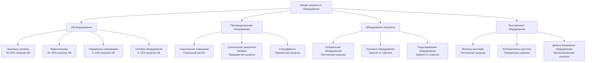
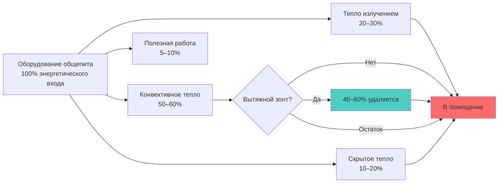

Тепловвыделение от оборудования в зонах массового скопления людей представляет существенную составляющую охлаждающей нагрузки, требующую тщательной оценки. В отличие от офисных помещений, в зонах массового скопления размещается специализированное оборудование с высокой плотностью мощности и переменными режимами работы. Точная оценка нагрузок требует понимания типов оборудования, характеристик потребления мощности и коэффициентов одновременной работы.

## Основы тепловвыделения от оборудования

Оборудование преобразует электрическую энергию в полезную работу и тепловые потери. Тепловвыделение в кондиционируемое помещение зависит от КПД оборудования, графика работы и распределения тепла между радиационными и конвективными компонентами.

### Основное уравнение тепловвыделения

Явное тепловвыделение от оборудования:

$$Q_{eq} = P_{input} \times F_U \times F_{rad} \times CLF$$

Где:
- $Q_{eq}$ = явное тепловвыделение (кДж/ч или Вт)
- $P_{input}$ = номинальная мощность оборудования (Вт)
- $F_U$ = коэффициент использования (фактическая мощность / номинальная мощность)
- $F_{rad}$ = доля излучения, поступающего в помещение
- $CLF$ = коэффициент охлаждающей нагрузки (учитывает тепловое накопление)

Для прямых конвективных нагрузок (оборудование с вентиляцией):

$$Q_{eq,conv} = 3.41 \times P_{input} \times F_U$$

Для круглосуточной работы в зонах массового скопления, CLF приближается к 1,0 благодаря непрерывным режимам занятости.

## Нагрузки от оборудования АВ-систем

Современные АВ-системы представляют самую крупную категорию нагрузок от оборудования в концертных залах, спортивных аренах и конференц-центрах.

### Компоненты звуковых систем

| Тип оборудования | Плотность мощности | Коэффициент использования | Доля излучения |
|---|---|---|---|
| Усилители мощности (рэковые) | 500–2000 Вт/блок | 0,4–0,6 | 0,35 |
| Микшерные пульты | 200–800 Вт | 0,8–1,0 | 0,45 |
| Сигнальные процессоры | 50–150 Вт/блок | 0,9–1,0 | 0,40 |
| Приёмники беспроводных микрофонов | 20–40 Вт/блок | 1,0 | 0,50 |
| Усилители сабвуферов | 1000–4000 Вт/блок | 0,3–0,5 | 0,30 |

Расчёт нагрузки усилителя:

$$Q_{amp} = 3.41 \times \sum_{i=1}^{n} (P_{rated,i} \times F_{U,i} \times F_{sim})$$

Где $F_{sim}$ = коэффициент одновременной работы (0,5–0,8 для многозонных систем).

### Оборудование видео и дисплеев

**Проекционные системы:**
- Обычные лампы: 2000–5000 Вт на проектор, $F_U$ = 0,8–1,0
- LED/лазерные проекторы: 500–1500 Вт на проектор, $F_U$ = 0,9–1,0
- Отвод тепла: 75–85% через выхлоп, 15–25% в помещение

**LED видеостены и табло:**

$$Q_{LED} = A_{display} \times \rho_{pixel} \times P_{pixel} \times F_{brightness} \times 3.41$$

Где:
- $A_{display}$ = площадь экрана (м²)
- $\rho_{pixel}$ = плотность пиксельной сетки (пиксели/м²)
- $P_{pixel}$ = мощность одного пикселя при максимальной яркости (Вт)
- $F_{brightness}$ = типичный уровень яркости (0,4–0,7)

Типичная LED видеостена: 160–430 Вт/м² при максимальной яркости.

## Нагрузки от производственного оборудования

Производственное оборудование в театрах, спортивных аренах и конференц-центрах генерирует значительные прерывистые нагрузки.

### Сценические и производственные системы

| Категория оборудования | Типичная нагрузка | Режим работы | Коэффициент разнородности |
|---|---|---|---|
| Механизированные такелажные системы | 3,7–14,9 кВт на двигатель | Прерывистая, <5% цикла | 0,10–0,15 |
| Цепные тали | 0,7–2,2 кВт на блок | Прерывистая, только настройка | 0,05–0,10 |
| Поворотные столы/подъёмники | 7,5–37 кВт | Прерывистая во время представления | 0,15–0,25 |
| Машины дымо/туманообразования | 1000–3000 Вт | Прерывистые эффекты | 0,20–0,30 |
| Контроллеры пиротехники | 500–2000 Вт | Прерывистые, короткие | 0,05 |

Тепловвыделение от двигателя в помещение:

$$Q_{motor} = \frac{2545 \times HP \times F_L}{EFF} \times (1 - EFF) \times F_{room}$$

Где:
- $HP$ = номинальная мощность двигателя
- $F_L$ = коэффициент нагрузки (фактическая нагрузка / номинальная мощность)
- $EFF$ = КПД двигателя (в долях)
- $F_{room}$ = доля тепла в помещение (0,0 если двигатель и приводимое оборудование вне помещения)

## Оборудование общепита и вспомогательное оборудование

Оборудование пищевого обслуживания, расположенное рядом с зонами массового скопления, создаёт значительные скрытые и явные нагрузки.

### Тепловвыделение от оборудования общепита

| Тип оборудования | Явное тепло (кДж/ч) | Скрытое тепло (кДж/ч) | Коэффициент использования |
|---|---|---|---|
| Аппарат для попкорна (340 г) | 8500–10600 | 1400–2100 | 0,6–0,8 |
| Аппарат для хот-догов (30 шт) | 6370–7800 | 710–1060 | 0,5–0,7 |
| Подогреватель сыра начо | 2830–4250 | 350–530 | 0,7–0,9 |
| Кофеварка (двойная) | 5310–7080 | 2830–4250 | 0,4–0,6 |
| Холодильник для напитков | 4250–6370 | 0 | 0,8–1,0 |
| Ледогенератор (227 кг/сут) | 28300–35400 | 5310–7080 | 0,4–0,6 |
| Микроволновая печь (1200 Вт) | 7080–8850 | 710–1060 | 0,2–0,3 |

Оборудование, расположенное за прилавками обслуживания, обычно отводит 40–60% тепла через отдельную вентиляцию. Остальное тепло поступает в помещение зоны массового скопления.

## Выставочное и демонстрационное оборудование

Конференц-центры, музеи и выставочные пространства содержат разнообразное оборудование с различными характеристиками отвода тепла.

**Категории выставочного оборудования:**

1. **Выставочное освещение (LED):** 86–161 Вт/м² выставочного пространства
2. **Интерактивные киоски:** 200–400 Вт на устройство, $F_U$ = 0,6–0,8
3. **Демонстрационное оборудование:** Сильно варьируется, требуется обследование
4. **Станции зарядки:** 50–100 Вт на станцию, $F_U$ = 0,3–0,5
5. **Холодильные витрины:** 500–2000 Вт на витрину, $F_U$ = 0,9–1,0

## Разнородность оборудования и одновременная работа

В зонах массового скопления редко работает всё оборудование одновременно. Коэффициенты разнородности снижают проектные охлаждающие нагрузки.

### Рекомендуемые коэффициенты разнородности

| Тип объекта | Категория оборудования | Диапазон коэффициента разнородности |
|---|---|---|
| Театр/концертный зал | АВ-оборудование | 0,7–0,85 |
| Театр/концертный зал | Производственное оборудование | 0,4–0,6 |
| Спортивная арена | Табло/видео | 0,9–1,0 |
| Спортивная арена | Оборудование общепита | 0,6–0,8 |
| Конференц-центр | Выставочное оборудование | 0,5–0,7 |
| Конференц-центр | АВ-системы | 0,6–0,8 |
| Многоцелевой объект | Всё оборудование | 0,65–0,80 |

Общая нагрузка от оборудования с учётом разнородности:

$$Q_{total} = \sum_{i=1}^{n} (Q_{eq,i} \times F_{div,i})$$

Применяйте коэффициенты разнородности после расчёта отдельных нагрузок от оборудования, а не к номинальной мощности.

## Методология оценки нагрузок

**Пошаговая процедура:**

1. **Составьте инвентаризацию оборудования** по категориям и местоположению
2. **Получите технические данные** о потреблении мощности
3. **Определите коэффициенты использования** на основе информации оператора
4. **Рассчитайте отдельные нагрузки** используя соответствующие уравнения
5. **Применяйте коэффициенты разнородности** на основе типа объекта и режимов работы
6. **Разделите нагрузки отвода** и нагрузки в помещение
7. **Проверьте с помощью измеренных данных** из аналогичных объектов, когда возможно

Для существующих объектов поддиапазонные электрические данные обеспечивают наиболее точные профили нагрузок. Пиковая нагрузка обычно наступает через 1–2 часа после начала события, когда оборудование достигает установившегося режима работы.

## Проектные соображения

- Нагрузки от оборудования в зонах массового скопления превышают нагрузки от освещения и ограждающих конструкций
- АВ-оборудование и табло работают независимо от занятости в большинстве объектов
- Оборудование общепита достигает пиковых нагрузок во время антрактов и перед началом события
- Разнородность производственного оборудования сильно варьируется в зависимости от типа события
- Проектируйте с учётом модернизации оборудования на 20–30% в будущем
- Координируйте с инженерами-электриками для получения точных данных о мощности
- Учитывайте циклы замены оборудования (3–7 лет для АВ, 10–15 лет для общепита)

**Справочник:** ASHRAE Fundamentals, Глава 18 (Расчёты охлаждающих и нагревающих нагрузок для нежилых зданий), Таблицы 4–6 (Тепловвыделение от оборудования).

Точная оценка нагрузок от оборудования требует взаимодействия с операторами объекта, консультантами АВ-систем и специалистами пищевого обслуживания для установления реалистичных рабочих сценариев и профилей потребления мощности конкретного объекта и его программы событий.
