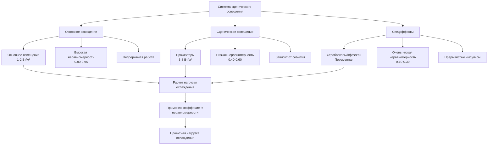
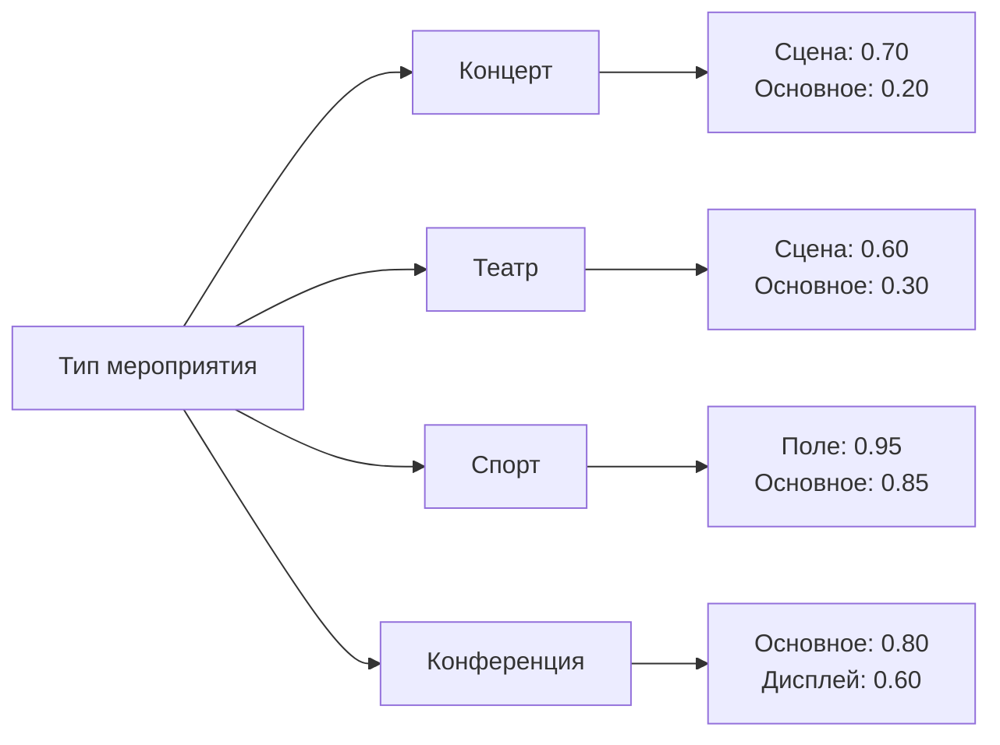

Освещение представляет значительную явную нагрузку охлаждения в сборочных помещениях с характеристиками теплоотдачи, существенно отличающимися между основным освещением и системами сценического освещения. Точное определение нагрузок от освещения требует понимания плотности установленной мощности освещения, коэффициентов неравномерности и тепловых свойств современных технологий освещения.

## Основные уравнения расчета теплоотдачи

Мгновенная теплоотдача от освещения рассчитывается по формуле:

$$Q_{light} = W_{installed} \times F_{use} \times F_{special}$$

где:
- $Q_{light}$ = мгновенная теплоотдача от освещения (Вт)
- $W_{installed}$ = общая установленная мощность освещения (Вт)
- $F_{use}$ = коэффициент использования освещения (доля работающих светильников)
- $F_{special}$ = специальный коэффициент потерь в балласте/драйвере

Для люминесцентных и HID систем с удаленными балластами:

$$Q_{light} = 3.41 \times W_{lamp} \times (1 + BF) \times F_{use} \times F_{SA}$$

где:
- $BF$ = коэффициент баланса (обычно 0.10-0.25 для магнитных, 0.05-0.15 для электронных)
- $F_{SA}$ = доля пространства (часть теплоты, поступающая в кондиционируемое помещение)

Для светодиодных систем:

$$Q_{LED} = W_{fixture} \times F_{use} \times \eta_{thermal}$$

где:
- $\eta_{thermal}$ = коэффициент теплового КПД (0.90-0.95 для светодиодных светильников)

## Плотность установленной мощности освещения по типам помещений

ASHRAE 90.1 устанавливает максимальные плотности установленной мощности освещения, однако фактические нагрузки существенно варьируются:

| Тип помещения | Типовая ППМ (Вт/м²) | Диапазон проектирования (Вт/м²) | Коэффициент неравномерности |
|------------|-------------------|---------------------|------------------|
| Основное освещение - театр | 13 - 19 | 11 - 27 | 0.70 - 0.85 |
| Сценическое освещение - театр | 32 - 86 | 22 - 161 | 0.40 - 0.60 |
| Освещение арены мероприятий | 27 - 48 | 22 - 65 | 0.50 - 0.70 |
| Основное освещение арены | 11 - 16 | 9 - 22 | 0.80 - 0.95 |
| Конференц-зал | 16 - 27 | 13 - 32 | 0.70 - 0.85 |
| Зона зрительских мест | 10 - 15 | 8 - 19 | 0.75 - 0.90 |
| Освещение стадиона | 43 - 129 | 32 - 215 | 0.60 - 0.80 |
| Вестибюль/коридоры | 11 - 16 | 9 - 22 | 0.85 - 0.95 |

## Влияние технологии светодиодов

Светодиодные системы освещения принципиально изменяют расчеты нагрузок охлаждения тремя механизмами:

**Снижение теплоотдачи**

Светодиодные светильники преобразуют 30-40% электрической мощности в свет (световая отдача 80-150 лм/Вт) по сравнению с 10-20% для ламп накаливания и 20-30% для люминесцентных систем. Снижение избыточного тепла напрямую уменьшает нагрузки охлаждения:

$$\Delta Q = (W_{traditional} - W_{LED}) \times F_{use}$$

Для театра площадью 929 м² при замене 21.5 Вт/м² ламп накаливания на 8.6 Вт/м² светодиодов:

$$\Delta Q = (20000 - 8000) \times 0.75 = 9000 \text{ Вт} = 9 \text{ кВт}$$

**Эффективность драйвера**

Светодиодные драйверы имеют меньшие потери, чем магнитные балласты (5-10% против 15-25%), при этом основная часть тепла рассеивается непосредственно в светильнике. Это влияет на соотношение лучистого/конвективного тепла и расчеты температуры в межпотолочном пространстве.

**Спектральные характеристики**

Спектральный состав светодиодов содержит минимальное инфракрасное излучение, что снижает передачу лучистого тепла к людям и поверхностям в сравнении с лампами накаливания.

## Сценическое и сценическое освещение

Театральное и сценическое освещение создает экстремальные локальные тепловые поступления, требующие специализированного подхода:

## Применение коэффициента неравномерности

Коэффициент неравномерности освещения представляет долю установленной мощности, работающей одновременно. Сборочные помещения характеризуются низкой неравномерностью из-за требований программирования:

**Основное освещение против режима производства**

Во время представлений основное освещение затемняется, а сценическое включается. Пиковая нагрузка охлаждения возникает во время переходов или репетиций, когда обе системы работают:

$$Q_{peak} = (W_{house} \times F_{house}) + (W_{stage} \times F_{stage})$$

Для проектирования:

$$Q_{design} = \max\left[(W_{house} \times 0.90), (W_{stage} \times 0.60), (W_{house} \times 0.40 + W_{stage} \times 0.60)\right]$$

Третий член обычно определяющий, представляет частичное основное освещение при подготовке к представлению.

**Учет типа мероприятия**

Различные типы мероприятий создают характерные профили освещения:

## Методология расчета

**Этап 1: Инвентаризация установленной мощности**

Документирование всех цепей освещения по зонам:
- Системы основного освещения
- Сценическое/сценическое освещение
- Архитектурное акцентное освещение
- Аварийное освещение выхода

**Этап 2: Определение коэффициентов использования**

Установление коэффициентов неравномерности на основе:
- График программирования мероприятий
- Последовательности управления освещением
- Возможности системы затемнения
- Интервью с операторами

**Этап 3: Расчет теплоотдачи**

Применение соответствующих уравнений с учетом:
- Размещение баланса/драйвера (в помещении или удаленно)
- Монтаж светильника (прямой в кондиционируемое помещение или межпотолочное пространство)
- Соотношение лучистого/конвективного тепла (влияет на время поступления нагрузки)

**Этап 4: Применение коэффициентов безопасности**

Добавить запас 10-15% для:
- Будущих расширений системы освещения
- Отказов системы управления
- Непредвиденных сценариев полной яркости

## Рекомендации по проектированию

**Подход к расчету нагрузок**

- Использовать фактические графики светильников, а не минимальные значения ППМ по кодам
- Интервьюировать проектировщиков освещения для получения реалистичных коэффициентов неравномерности
- Рассчитывать отдельно нагрузки для режимов основного и сценического освещения
- Учитывать влияние системы затемнения на мгновенную нагрузку

**Последствия для проектирования системы**

- Зонировать системы HVAC в соответствии с зонами управления освещением
- Предусмотреть дополнительную емкость рядом с высокоинтенсивными светильниками
- Проектировать для быстрых изменений нагрузки во время переходов освещения
- Рассмотреть возможность рекуперации тепла от высокомощных светильников

**Требования к проверке**

- Измерить фактическую потребляемую мощность освещения во время пусконаладки
- Проверить коэффициенты неравномерности через мониторинг эксплуатации
- Отрегулировать последовательности управления, если измеренные нагрузки превышают проектные
- Документировать фактическую мощность освещения для будущих модификаций

## Ссылки

Раздел "Основы" ASHRAE, глава 18, предоставляет подробные данные о теплоотдаче от освещения, включая спектральные характеристики, коэффициенты балланса и доли пространства для различных типов светильников. ASHRAE 90.1 устанавливает базовую плотность установленной мощности освещения для соответствия энергетическим кодам, хотя фактические установленные нагрузки в сборочных приложениях часто превышают эти минимальные значения.
