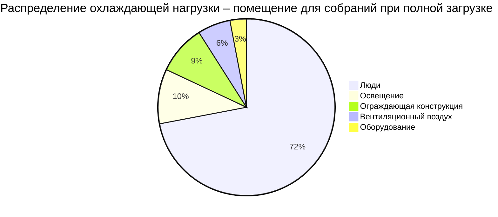
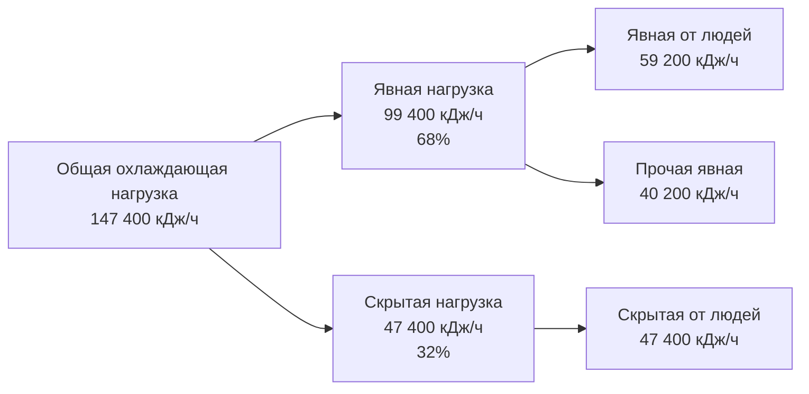
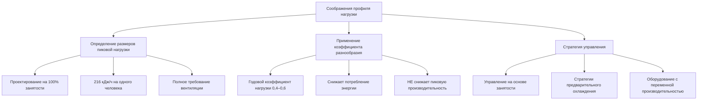

## Доминирование нагрузки в помещениях с высокой плотностью размещения людей

В театрах, аудиториях, лекционных залах и других помещениях для собраний теплоотдача от людей представляет 60–80 процентов от общей охлаждающей нагрузки. Это доминирование коренным образом изменяет проектирование системы, методику определения размеров и стратегии управления по сравнению с обычными коммерческими помещениями, где преобладают нагрузки от ограждающей конструкции и оборудования.

Концентрация метаболического теплоотделения в ограниченных объемах создает требования к охлаждению, которые превышают типичные офисные здания в три-пять раз на единицу площади пола. Понимание физики отвода тепла от людей и его временных характеристик является необходимым для надлежащего определения производительности системы.

## Компоненты теплоотдачи от людей

Каждый занятый человек выделяет тепло в результате метаболических процессов, при этом общее теплоотделение делится на явную и скрытую части.

**Явное теплоотделение** передается непосредственно к температуре воздуха посредством конвекции и излучения. Этот компонент составляет примерно 115–130 кДж/ч на одного сидящего взрослого при уровне активности в театре (ASHRAE Fundamentals, глава 18).

**Скрытое теплоотделение** происходит в результате добавления влаги при дыхании и испарении. Этот компонент варьируется от 73 до 97 кДж/ч на одного сидящего взрослого в зависимости от уровня активности и условий термического комфорта.

Общее теплоотделение на одного человека:

$$q_{occ,total} = q_{sensible} + q_{latent}$$

Для типичных условий в помещениях для собраний:

$$q_{occ,total} = 122 + 94 = 216 \text{ кДж/ч на одного человека}$$

Коэффициент явного теплоотделения (SHR) для нагрузок от людей в помещениях для собраний обычно варьируется от 0,55 до 0,60:

$$SHR = \frac{q_{sensible}}{q_{sensible} + q_{latent}} = \frac{122}{216} = 0,56$$

Такой низкий SHR резко контрастирует с типичными коммерческими зданиями (SHR = 0,70–0,85) и определяет значительные требования к осушению воздуха.

## Распределение нагрузки по компонентам

Распределение охлаждающих нагрузок в типичном 500-местном аудитории при полной загрузке:

| Компонент нагрузки | Теплоотделение (кДж/ч) | Процент от общей | Примечания |
|----------------|-------------------|---------------------|-------|
| Люди (500 человек) | 107 100 | 72% | Основной источник нагрузки |
| Освещение (21,5 Вт/м²) | 14 200 | 10% | Сценическое и заловое освещение |
| Ограждающая конструкция (стены, крыша) | 13 300 | 9% | Минимальное остекление типично |
| Вентиляционный воздух | 8 500 | 6% | Наружный воздух при расчетных условиях |
| Оборудование (аудиовизуальное, прочее) | 4 300 | 3% | Звуковая система, проектор |
| **Общая охлаждающая нагрузка** | **147 400** | **100%** | **Примерно 42 кВт** |

## Распределение явной и скрытой нагрузки

Разделение явной и скрытой нагрузки значительно влияет на выбор оборудования:

| Тип нагрузки | Теплоотделение (кДж/ч) | Процент | Влияние на систему |
|-----------|-------------------|------------|---------------|
| Явная (люди) | 59 200 | 40% | Управление температурой воздуха |
| Скрытая (люди) | 47 400 | 32% | Требование осушения |
| Явная (прочие источники) | 40 200 | 28% | Освещение, ограждающая конструкция, оборудование |
| **Общая нагрузка** | **147 400** | **100%** | Общая производительность системы = 42 кВт |

Общий SHR помещения:

$$SHR_{space} = \frac{59200 + 40200}{147400} = 0,68$$

## Разнообразие занятости и профили нагрузки

Помещения для собраний редко работают при расчетной занятости постоянно. Коэффициенты разнообразия учитывают фактическую и расчетную занятость.

**События с полной загрузкой** (концерты, премьеры, пиковые представления) происходят в 10–20 процентах часов работы. Эти события определяют расчетную производительность охлаждения.

**События с частичной загрузкой** (репетиции, внеплановые показы, лекции) представляют 60–70 процентов часов работы с занятостью в пределах 30–60 процентов от производительности.

**Периоды подготовки/разборки** включают минимальную занятость, но потенциально высокие нагрузки от оборудования и освещения.

Типичный профиль нагрузки для вечернего представления:

| Временной период | Занятость (%) | Охлаждающая нагрузка (%) | Продолжительность |
|-------------|---------------|------------------|----------|
| Подготовка к события | 5% | 25% | 2 часа |
| Открытие дверей/размещение | 50% → 100% | 40% → 95% | 0,5 часа |
| Представление | 100% | 100% | 2 часа |
| Антракт | 80% | 90% | 0,25 часа |
| Завершение представления | 100% → 0% | 100% → 15% | 0,5 часа |
| После события | 5% | 20% | 1 час |

## Последствия для определения размеров системы

Доминирование нагрузок от людей создает специфические требования к проектированию:

**Производительность должна соответствовать условиям пиковой занятости.** Недоразмер даже на 10 процентов приводит к неприемлемому повышению температуры и уровней влажности при событиях с полной загрузкой. Тепловая масса занятых помещений обеспечивает минимальное буферизирование из-за высокой плотности размещения людей.

**Производительность осушения должна соответствовать доле скрытой нагрузки.** Стандартное оборудование DX с SHR 0,75–0,80 не может адекватно осушать помещения с SHR менее 0,70. Необходимо дополнительное осушение или выбор оборудования с низким SHR.

**Вентиляционный воздух представляет значительную долю общей нагрузки**, когда соблюдаются требования наружного воздуха (обычно 7 CFM (12 м³/ч) на одного человека для помещений для собраний согласно ASHRAE 62.1). При расчетных условиях:

$$q_{ventilation} = 1.08 \times CFM \times \Delta T + 0.68 \times CFM \times \Delta W$$

Для 500 человек при 7 CFM (12 м³/ч) на одного человека при наружных условиях 35°C DB, 26°C WB и внутреннем уставе 24°C, 50% относительная влажность вентиляционная нагрузка приближается к 15–20 процентам от общей нагрузки.

**Быстрые изменения нагрузки требуют реагирующей модуляции производительности.** Занятость может увеличиться с 10 до 100 процентов в течение 30 минут при размещении во время события. Системы должны обеспечивать достаточную ступенчатость производительности или модуляцию с переменной скоростью для отслеживания этих переходных процессов нагрузки без чрезмерного колебания температуры.

Изменчивость профиля нагрузки также позволяет использовать стратегии рекуперации энергии во время периодов частичной занятости, при этом годовое потребление энергии обычно составляет 40–60 процентов того, что потребовалось бы при непрерывной работе на пиковой мощности.

## Литература

ASHRAE Handbook—Fundamentals, Chapter 18: Nonresidential Cooling and Heating Load Calculations

ASHRAE Standard 62.1: Ventilation for Acceptable Indoor Air Quality
