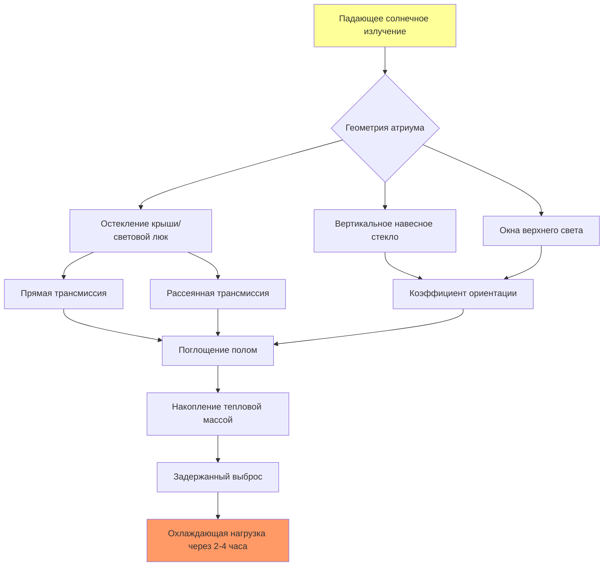

## Основы солнечных нагрузок в залах общественного назначения

Солнечное излучение представляет собой доминирующий компонент теплоприхода в остекленных объектах общественного назначения. Большие площади остекления, световые люки и атриумы создают значительные охлаждающие нагрузки, которые динамически изменяются в зависимости от положения солнца, облачности и ориентации здания. Залы общественного назначения представляют уникальные проблемы из-за обширного остекления, высоких потолков и прерывистых режимов использования, которые усложняют традиционные стратегии солнечного управления.

Мгновенный солнечный теплоприход через остекление рассчитывается по формуле:

$$Q_{solar} = A_{glazing} \times SHGC \times SHGF \times CLF$$

где:
- $Q_{solar}$ = солнечный теплоприход (кДж/ч или Вт)
- $A_{glazing}$ = эффективная площадь остекления (м²)
- $SHGC$ = коэффициент солнечного теплоприхода (безразмерный)
- $SHGF$ = коэффициент солнечного теплоприхода из таблиц (Вт/м²)
- $CLF$ = коэффициент охлаждающей нагрузки с учетом тепловой массы

## Коэффициент солнечного теплоприхода по типам остекления

SHGC характеризует долю падающего солнечного излучения, которая становится теплопрходом в кондиционируемое помещение. Залы общественного назначения требуют осторожного выбора SHGC для баланса между целями естественного освещения и управлением охлаждающей нагрузкой.

| Тип остекления | SHGC | Видимое пропускание | Применение |
|--------------|------|----------------------|-------------|
| Одинарное прозрачное 6 мм | 0,86 | 0,90 | Не рекомендуется для залов общественного назначения |
| Двойное прозрачное 6 мм | 0,76 | 0,81 | Ограниченное применение, северные фасады |
| Двойное коричневатое тонированное | 0,62 | 0,61 | Стандартное остекление залов общественного назначения |
| Двойное низкоэмиссионное (ε=0,10) | 0,71 | 0,79 | Баланс тепловой/солнечной защиты |
| Двойное низкоэмиссионное + тонирование | 0,39 | 0,64 | Высокопроизводительные залы общественного назначения |
| Тройное низкоэмиссионное селективное | 0,27 | 0,70 | Приложения с максимальным управлением |
| Отражающее двойное | 0,19 | 0,15 | Максимальное отклонение солнечного излучения |

## Анализ солнечного теплоприхода через световые люки

Световые люки создают серьезные охлаждающие нагрузки в залах общественного назначения из-за их горизонтальной ориентации, максимизирующей летнее солнечное воздействие. Эффективный SHGC для световых люков должен учитывать:

$$SHGC_{eff} = SHGC_{rated} \times IAC \times \frac{1}{cos(\theta)}$$

где:
- $IAC$ = коэффициент внутреннего затухания для затеняющих устройств
- $\theta$ = угол падения (приближается к 0° в летний полдень)

Пиковые коэффициенты солнечного теплоприхода через световые люки для горизонтальных поверхностей:

| Широта | Пик июня (Вт/м²) | Время | Проектный SHGC | Результирующая нагрузка (Вт/м²) |
|----------|------------------------|-------|-------------|------------------------------|
| 30°N | 903 | 12:00 | 0,30 | 271 |
| 35°N | 876 | 12:00 | 0,30 | 263 |
| 40°N | 844 | 12:00 | 0,30 | 253 |
| 45°N | 804 | 12:00 | 0,30 | 241 |

Системы световых люков в залах общественного назначения должны включать:
- Остекление с низким SHGC (SHGC ≤ 0,30)
- Моторизованное внутреннее затенение с автоматическим солнечным отслеживанием
- Рассеивающие элементы для распределения света при блокировании прямого солнечного излучения
- Термические разрывы в несущих конструкциях для предотвращения кондуктивных теплопотерь

## Моделирование солнечной нагрузки в пространстве атриумов

Многоэтажные атриумы создают сложные картины солнечной нагрузки, требующие специализированных методов расчета. Общая солнечная нагрузка в атриуме включает:

$$Q_{atrium} = Q_{glazed-roof} + Q_{vertical-glazing} + Q_{reflected} + Q_{thermal-storage}$$

Слагаемое, учитывающее тепловую массу, значительно в атриумах из-за массивных конструкций, подвергающихся солнечному излучению. Полы и стены с высокой тепловой массой поглощают солнечную энергию во время работы и отдают ее во время вечерних мероприятий, требуя продленной работы HVAC.

## Влияние ориентации на вертикальное остекление

Залы общественного назначения с обширным вертикальным остеклением испытывают зависящие от ориентации охлаждающие нагрузки. Пиковые коэффициенты солнечного теплоприхода (Вт/м²) для двойного прозрачного стекла (SHGC=0,76) на широте 40°N в июле:

| Ориентация | 8:00 | 10:00 | 12:00 | 14:00 | 16:00 | Время пика |
|-------------|------|-------|-------|-------|-------|-----------|
| Север | 139 | 161 | 173 | 161 | 139 | 12:00 |
| Северо-восток | 413 | 280 | 173 | 129 | 113 | 8:00 |
| Восток | 554 | 384 | 173 | 129 | 113 | 8:00 |
| Юго-восток | 523 | 457 | 249 | 129 | 113 | 10:00 |
| Юг | 113 | 249 | 324 | 249 | 113 | 12:00 |
| Юго-запад | 113 | 129 | 249 | 457 | 523 | 16:00 |
| Запад | 113 | 129 | 173 | 384 | 554 | 16:00 |
| Северо-запад | 113 | 129 | 173 | 280 | 413 | 16:00 |

Восточные и западные фасады испытывают наибольшие мгновенные нагрузки из-за низких углов солнца, которые глубоко проникают в залы общественного назначения. Южное остекление получает более низкие пиковые нагрузки, но устойчивое воздействие в течение всего дня.

## Стратегии солнечного управления для применения в залах общественного назначения

### Архитектурные решения

**Внешние затеняющие устройства** обеспечивают наиболее эффективное солнечное управление, перехватывая излучение до того, как оно достигнет поверхностей остекления. Горизонтальные козырьки, рассчитанные по формуле:

$$L_{overhang} = H \times tan(\alpha_{critical})$$

где $H$ - вертикальное расстояние от козырька до подоконника и $\alpha_{critical}$ - угол высоты солнца при проектном условии исключения.

**Спецификации остекления** должны приоритизировать спектрально избирательные низкоэмиссионные покрытия, которые отражают ближнее инфракрасное излучение при пропускании видимого света. Для залов общественного назначения, требующих естественного освещения:
- Целевой SHGC ≤ 0,40 для вертикального остекления
- Целевой SHGC ≤ 0,30 для световых люков и наклонного остекления
- Спецификация видимого пропускания ≥ 0,60 для поддержания эффективности естественного освещения

### Реакции системы HVAC

**Тепловое зонирование** должно разделять солнечно-воздействуемые периметральные зоны от внутренних зон. Периметральные зоны должны быть узкими (глубина 3,5-4,5 м) для предотвращения чрезмерных требований по расходу воздуха, которые могут привести к охлаждению температур внутренних зон ниже уставки.

**Системы с выделенным наружным воздухом (DOAS)** в сочетании с лучистым охлаждением могут эффективно управлять солнечными нагрузками в залах общественного назначения. Система лучистого охлаждения поглощает солнечное излучение на поверхностях до того, как оно становится явной охлаждающей нагрузкой в пространстве воздуха, снижая требуемый расход воздуха и энергию вентилятора.

**Тепловое аккумулирование** переносит производство охлаждения с периодов пиковой солнечной нагрузки (полдень) на внепиковые часы (ночь), снижая пиковый электрический спрос и улучшая эффективность холодильника за счет более низких температур конденсации.

## Протокол расчета проектной нагрузки

Согласно ASHRAE Fundamentals Chapter 18, расчеты солнечной нагрузки для залов общественного назначения требуют:

1. **Установить условия проектного дня** включая пиковые значения солнечного излучения для широты площадки, месяца и времени суток
2. **Рассчитать геометрию солнечного угла** (высота и азимут) для каждой ориентации фасада
3. **Определить SHGF из таблиц** на основе ориентации, широты и наклона остекления
4. **Применить SHGC** для указанных стеклопакетов, включая эффекты рамы
5. **Применить коэффициенты охлаждающей нагрузки** для учета тепловой массы и временной задержки
6. **Суммировать все вклады поверхностей остекления** включая вертикальные, наклонные и горизонтальные элементы
7. **Добавить внутреннее солнечное поглощение** для излучения, передаваемого на полы и мебель

Солнечные нагрузки в залах общественного назначения обычно представляют 40-60% от общей пиковой охлаждающей нагрузки, что делает точный расчет критическим для определения размера системы и энергетических характеристик.

---

**Ссылки**: ASHRAE Fundamentals (2021), Chapter 15 (Fenestration) и Chapter 18 (Nonresidential Cooling and Heating Load Calculations)
