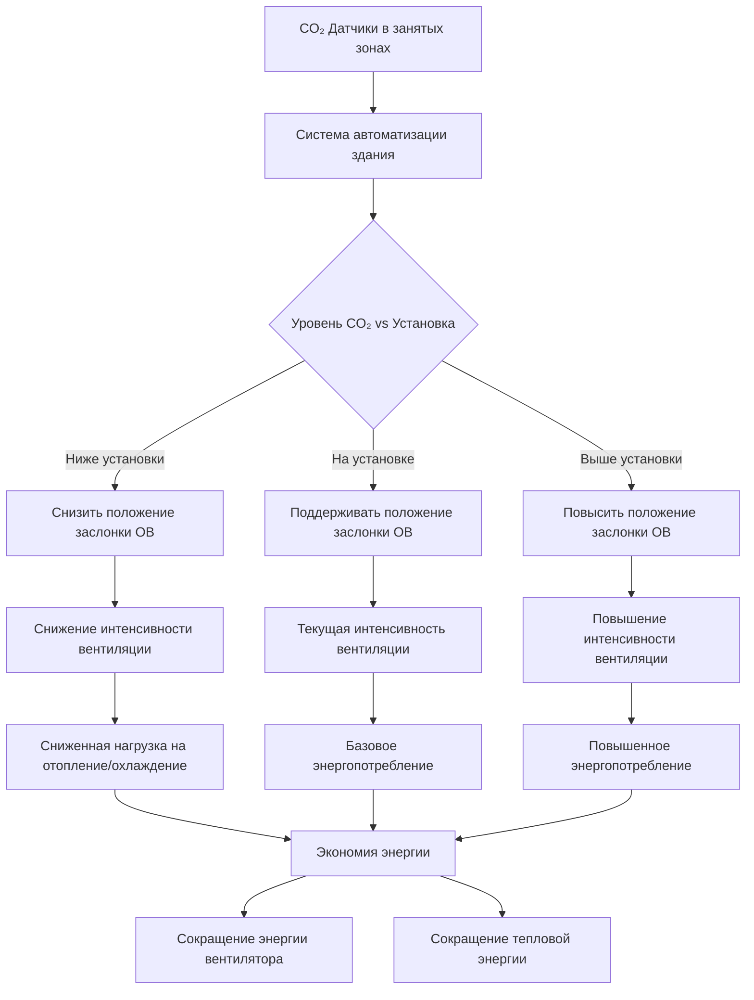
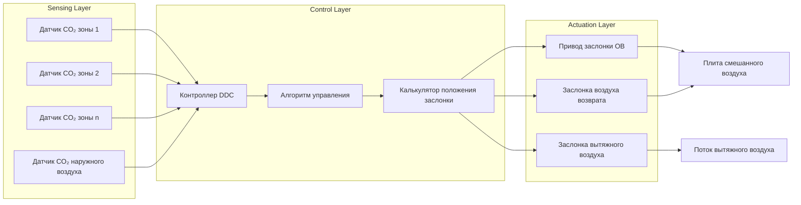

# Управление вентиляцией по спросу (DCV)

Управление вентиляцией по спросу динамически регулирует забор наружного воздуха на основе реальной заполняемости помещения вместо поддержания постоянной интенсивности вентиляции для расчетной заполняемости. Системы DCV используют датчики CO₂ в качестве прокси-индикаторов плотности населения, модулируя вентиляцию для соответствия фактическому спросу при одновременной минимизации энергопотребления в периоды низкой заполняемости.

## Фундаментальный принцип работы

Системы DCV работают на основе принципа, что концентрация CO₂ во внутреннем воздухе напрямую коррелирует с плотностью населения. Так как люди выдыхают CO₂ с интенсивностью примерно 0,3 л/мин на человека, уровни CO₂ в помещении возрастают выше концентраций наружного воздуха (как правило, 400–450 ppm). Путем измерения концентрации CO₂ и сравнения ее с пороговыми значениями, система автоматизации здания регулирует заслонки наружного воздуха для поддержания приемлемого качества воздуха в помещении при одновременном сокращении ненужной вентиляции в периоды неполной заполняемости.

Соотношение между заполняемостью, выработкой CO₂ и требуемой интенсивностью вентиляции:

$$\dot{m}_{CO_2} = N \cdot G_{person}$$

Где:
- $\dot{m}_{CO_2}$ = интенсивность выработки CO₂ (л/мин)
- $N$ = количество людей
- $G_{person}$ = выработка CO₂ на человека (≈0,3 л/мин для взрослых в состоянии покоя)

Концентрация CO₂ в установившемся режиме:

$$C_{indoor} = C_{outdoor} + \frac{N \cdot G_{person}}{\dot{V}_{OA}}$$

Где:
- $C_{indoor}$ = концентрация CO₂ в помещении (ppm)
- $C_{outdoor}$ = концентрация CO₂ снаружи (ppm)
- $\dot{V}_{OA}$ = интенсивность вентиляции наружным воздухом (CFM)

## Потенциал экономии энергии

Системы DCV снижают энергию вентиляции за счет сокращения нагрева, охлаждения и мощности вентилятора наружного воздуха. Годовую экономию энергии можно оценить как:

$$E_{savings} = \sum_{i=1}^{8760} \left[\dot{V}_{design} - \dot{V}_{DCV}(i)\right] \cdot \rho \cdot c_p \cdot \left(T_{outdoor}(i) - T_{setpoint}\right) \cdot \frac{1}{\eta_{HVAC}}$$

Где:
- $\dot{V}_{design}$ = расчетная интенсивность забора наружного воздуха (CFM)
- $\dot{V}_{DCV}(i)$ = модулированная интенсивность потока DCV в час $i$ (CFM)
- $\rho$ = плотность воздуха (0,075 lbm/ft³)
- $c_p$ = удельная теплоемкость воздуха (0,24 BTU/lbm·°F)
- $T_{outdoor}(i)$ = наружная температура в час $i$ (°F)
- $T_{setpoint}$ = заданное значение температуры в помещении (°F)
- $\eta_{HVAC}$ = эффективность системы HVAC

Типичная экономия энергии составляет 20–60% энергопотребления, связанного с вентиляцией, в зависимости от:
- Изменчивости заполняемости
- Климатической зоны
- Типа помещения
- Графика работы

## Требования норм и применимость

### Требования ASHRAE 62.1

ASHRAE 62.1 разрешает DCV в помещениях, отвечающих конкретным критериям:

**Допустимые применения:**
- Помещения с переменной заполняемостью
- Плотность расчетной заполняемости ≥25 человек на 1000 ft²
- Установка CO₂ обычно 1000–1200 ppm выше наружного окружающего воздуха

**Запрещенные применения:**
- Помещения с значительными источниками загрязнения, не связанными с присутствием людей
- Площади, требующие постоянной вентиляции (лаборатории, медицинские учреждения)
- Помещения, где датчики заполняемости не могут точно представлять условия зоны

### Энергетический стандарт ASHRAE 90.1

ASHRAE 90.1 требует DCV для:
- Систем, обслуживающих помещения высокой плотности (≥40 человек на 1000 ft²)
- Пропускная способность воздухообработчика >3000 CFM
- Минимальный наружный воздух >1200 CFM

**Исключения:**
- Системы с возможностью экономайзера, отвечающие требованиям 100% наружного воздуха
- Помещения с минимальным наружным воздухом <300 CFM на зону
- Многозонные системы без элементов управления DDC

## Архитектура системы DCV

## Стратегии внедрения

### Размещение и калибровка датчиков

Критические факторы для точной работы DCV:

1. **Размещение датчика**
   - Установка на высоте дыхательной зоны (0,9–1,8 м над полом)
   - Избегание расположений рядом с дверями, окнами или воздухораспределителями подачи
   - Несколько датчиков для больших или неправильной формы помещений
   - Датчики воздуховода возврата приемлемы для однородных помещений

2. **Протокол калибровки**
   - Заводская точность калибровки: ±50 ppm
   - Интервал полевой калибровки: 12–24 месяца
   - Проверка по инструменту эталонного класса
   - Процедуры регулировки нуля и диапазона

3. **Выбор технологии датчика**

| Технология | Точность | Дрейф | Срок службы | Стоимость | Применение |
|------------|----------|-------|----------|------|-------------|
| NDIR (инфракрасная недисперсионная) | ±30–50 ppm | Низкий | 10–15 лет | $$$ | Коммерческий стандарт |
| Электрохимическая | ±100 ppm | Умеренный | 2–5 лет | $$ | Жилые, легкие коммерческие |
| Оксид металла | ±200 ppm | Высокий | 3–5 лет | $ | Не рекомендуется для DCV |

### Стратегии управления

**Пропорциональное управление:**
$$\dot{V}_{OA} = \dot{V}_{min} + K_p \cdot (C_{measured} - C_{setpoint})$$

Где:
- $\dot{V}_{min}$ = минимальная интенсивность вентиляции по норме (CFM)
- $K_p$ = константа пропорционального коэффициента усиления
- $C_{measured}$ = измеренная концентрация CO₂ (ppm)
- $C_{setpoint}$ = целевая концентрация CO₂ (ppm)

**Многозонные системы:**
Для систем VAV, обслуживающих несколько зон, применяется подход критической зоны:

$$\dot{V}_{OA,system} = \max\left(\dot{V}_{min,system}, \max_{z=1}^{n}\left[\dot{V}_{OA,z}\right]\right)$$

Забор наружного воздуха системой равен максимальному требованию зоны среди всех зон.

### Проверка производительности

**Требования к наладке:**
1. Проверка точности датчика по инструменту эталонного класса
2. Подтверждение минимальной интенсивности наружного воздуха при всех условиях
3. Проверка отклика управления во всем диапазоне заполняемости
4. Документирование базовых уровней CO₂ при расчетной заполняемости
5. Проверка времени отклика заслонки и линейности

**Текущий мониторинг:**
- Отслеживание уровней CO₂ и положения заслонки наружного воздуха
- Сравнение энергопотребления с базовым значением
- Мониторинг дрейфа датчика через периодическую калибровку
- Оповещение об отказе датчика или выходе за пределы диапазона

## Сравнение производительности DCV

| Тип системы | Управление вентиляцией | Экономия энергии | Капитальная стоимость | Сложность | Лучшее применение |
|-------------|-------------------|----------------|--------------|------------|------------------|
| Постоянный объем | Фиксированная заслонка ОВ | Базовое (0%) | $ | Низкая | Помещения с постоянной заполняемостью |
| По расписанию DCV | Модуляция по времени | 10–25% | $$ | Низкая | Предсказуемые графики |
| DCV на основе CO₂ | Управление датчиком в реальном времени | 20–60% | $$$ | Средняя | Переменная заполняемость |
| DCV с датчиком заполняемости | Подсчет людей | 25–65% | $$$$ | Высокая | Критические применения |
| Гибридная DCV | CO₂ + расписание + заполняемость | 30–70% | $$$$$ | Высокая | Приложения высокой стоимости |

## Экономический анализ

Период простой окупаемости для внедрения DCV:

$$PBP = \frac{C_{capital}}{E_{savings} \cdot C_{energy} + M_{avoided}}$$

Где:
- $C_{capital}$ = установленная стоимость системы DCV
- $E_{savings}$ = годовая экономия энергии (кВт⋅ч или термы)
- $C_{energy}$ = смешанная стоимость энергии ($/кВт⋅ч или $/терм)
- $M_{avoided}$ = избегнутые затраты на оборудование HVAC

Типичные периоды окупаемости:
- Помещения высокой плотности заполняемости: 2–4 года
- Умеренная изменчивость заполняемости: 4–7 лет
- Низкая изменчивость заполняемости: 7–12 лет (граничный случай)

## Проектные соображения

**Интеграция систем:**
- Совместимость с существующими протоколами системы автоматизации здания (BACnet, Modbus, LonWorks)
- Согласование с элементами управления экономайзером для предотвращения конфликтов
- Интеграция с программами реагирования на спрос
- Интерфейс с системами управления энергией для отслеживания и оптимизации

**Возможные проблемы:**
- Загрязнение датчика в пыльной или загрязненной среде
- Временная задержка между изменениями заполняемости и реакцией CO₂ (10–30 минут)
- Нерепрезентативное расположение датчика в стратифицированных или разделенных помещениях
- Вариации концентрации CO₂ на улице, влияющие на точность управления

Системы DCV обеспечивают значительную экономию энергии в помещениях с переменной заполняемостью при одновременном соответствии требованиям норм по вентиляции. Надлежащий выбор датчика, размещение, калибровка и реализация стратегии управления являются критически важными для достижения прогнозируемой производительности и экономии энергии.
