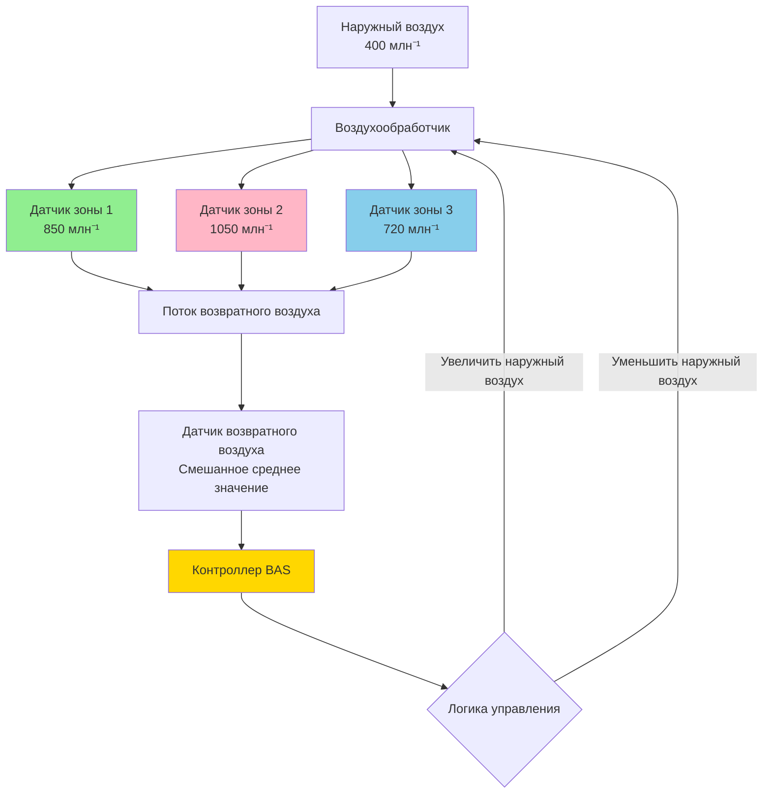
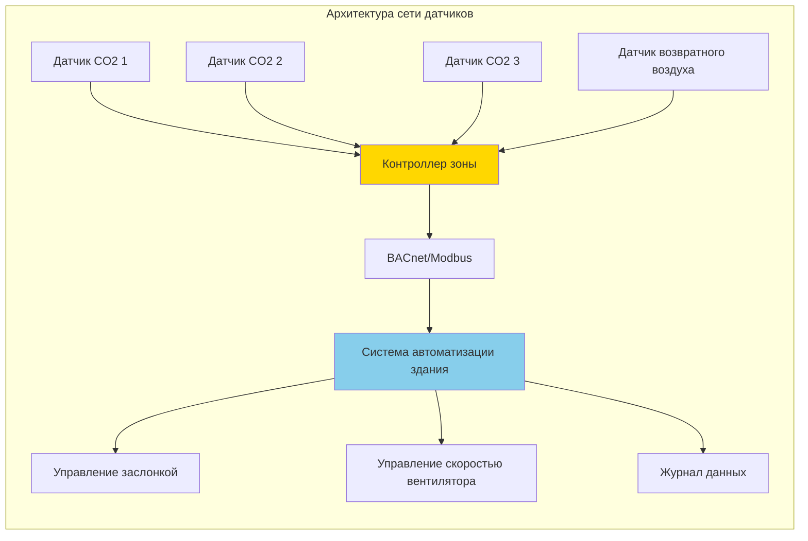

## Технология датчиков CO2 для систем DCV

Датчики углекислого газа служат основным измерительным устройством в системах вентиляции с управлением по требованию (DCV), обеспечивая модуляцию подачи наружного воздуха в реальном времени на основе уровня занятости помещения. Эффективность стратегий DCV критически зависит от точности датчика, его размещения и интеграции с системами автоматизации зданий.

### Технология датчиков NDIR

Датчики неселективного инфракрасного поглощения (NDIR) представляют собой отраслевой стандарт для приложений HVAC благодаря их стабильности, точности и экономичности. Эти датчики работают путем измерения поглощения инфракрасного излучения на длине волны 4,26 мкм, характерной для молекул CO2.

**Принцип работы:**

Датчик пропускает инфракрасный свет через камеру отбора пробы. Молекулы CO2 поглощают энергию на своей характеристической длине волны, а детектор измеряет снижение интенсивности:

$$I = I_0 e^{-\alpha C L}$$

Где:
- $I$ = интенсивность передаваемого света (Вт/м²)
- $I_0$ = интенсивность падающего света (Вт/м²)
- $\alpha$ = коэффициент поглощения (м²/моль)
- $C$ = концентрация CO2 (млн⁻¹)
- $L$ = оптическая длина пути (м)

Концентрация CO2 рассчитывается из соотношения Бира-Ламберта:

$$C = \frac{1}{\alpha L} \ln\left(\frac{I_0}{I}\right)$$

### Спецификации точности и производительности датчика

ASHRAE 62.1 устанавливает конкретные требования к точности датчиков CO2, используемых в приложениях DCV. Стандарт требует, чтобы датчики поддерживали точность в пределах ±75 млн⁻¹ или 5% от показания при 1000 млн⁻¹, в зависимости от того, что больше.

| Класс датчика | Точность при 1000 млн⁻¹ | Скорость дрейфа | Интервал калибровки | Применение |
|--------------|---------------------|------------|---------------------|-------------|
| Премиум | ±30 млн⁻¹ | <2% в год | 5 лет | Критические помещения, лаборатории |
| Стандарт | ±50 млн⁻¹ | <3% в год | 3 года | Офисные здания, школы |
| Эконом | ±100 млн⁻¹ | <5% в год | 1–2 года | Легкие коммерческие помещения |

**Компенсация температуры и влажности** необходима для получения точных показаний. Датчики должны корректировать эти переменные окружающей среды:

$$C_{corrected} = C_{measured} \times K_T(T) \times K_{RH}(RH)$$

Где $K_T$ и $K_{RH}$ — коэффициенты корректировки температуры и влажности, предоставляемые производителем.

### Методы калибровки датчика

В приложениях HVAC применяются три подхода калибровки:

**1. Ручная калибровка**

Технические специалисты подвергают датчики воздействию известных концентраций CO2 (обычно 400 млн⁻¹ наружного воздуха и 1000 млн⁻¹ эталонного газа):

$$Slope = \frac{C_{ref,high} - C_{ref,low}}{V_{high} - V_{low}}$$

$$Offset = C_{ref,low} - Slope \times V_{low}$$

**2. Автоматическая фоновая калибровка (ABC)**

Датчик предполагает, что самое низкое устойчивое показание в течение 7–14 дней представляет наружный воздух (примерно 400 млн⁻¹) и автоматически регулируется. Этот метод не подходит для непрерывно занятых помещений или местоположений, лишенных периодического воздействия наружного воздуха.

**3. Одноточечная калибровка**

Датчик подвергается воздействию наружного воздуха и регулируется на 400–420 млн⁻¹. Этот упрощенный метод обеспечивает адекватную точность для большинства приложений HVAC.

### Стратегия размещения датчика

Стратегическое размещение датчика напрямую влияет на производительность системы DCV и энергоэффективность. ASHRAE 62.1 предоставляет рекомендации для приложений с одной и несколькими зонами.

**Системы с одной зоной:**

- Один датчик в потоке возвратного воздуха рядом с воздухообработчиком
- Минимум 1 м от решетки возврата для обеспечения пробы смешанного воздуха
- Защита от прямого воздействия потока воздуха

**Системы с несколькими зонами:**

Несколько датчиков требуются, когда зоны имеют различные режимы занятости:

$$V_{ot} = \sum_{i=1}^{n} V_{oi} \times \frac{CO2_i - CO2_{outdoor}}{CO2_{design} - CO2_{outdoor}}$$

Где:
- $V_{ot}$ = общее требование к наружному воздуху (м³/ч)
- $V_{oi}$ = расчетный наружный воздух для зоны $i$ (м³/ч)
- $CO2_i$ = измеренный CO2 в зоне $i$ (млн⁻¹)
- $CO2_{design}$ = расчетное значение (обычно 1000–1100 млн⁻¹)

**Размещение датчика в помещении:**

- Монтаж на высоте дыхательной зоны (0,9–1,8 м над полом)
- Избегать размещения рядом с дверями, окнами или вентиляционными распределителями
- Минимум 1 датчик на 930 м² или на зону
- Дополнительные датчики для зон с высокой плотностью (переговорные комнаты, аудитории)

### Интеграция управления и алгоритмы

BAS интегрирует показания датчиков CO2 с управлением вентиляцией, используя пропорциональные или пошаговые стратегии управления.

**Пропорциональное управление:**

$$OA\% = OA_{min} + (OA_{max} - OA_{min}) \times \frac{CO2_{measured} - CO2_{setpoint,low}}{CO2_{setpoint,high} - CO2_{setpoint,low}}$$

Типичные уставки:
- $CO2_{setpoint,low}$ = 800 млн⁻¹ (минимум наружного воздуха)
- $CO2_{setpoint,high}$ = 1000 млн⁻¹ (максимум наружного воздуха)

**Пошаговое управление:**

| Уровень CO2 | Положение заслонки наружного воздуха |
|-----------|----------------------------|
| < 800 млн⁻¹ | Минимальное положение (15–20%) |
| 800–900 млн⁻¹ | Открыто на 40% |
| 900–1000 млн⁻¹ | Открыто на 70% |
| > 1000 млн⁻¹ | Полностью открыто (100%) |

### Техническое обслуживание и проверка

Регулярное техническое обслуживание обеспечивает устойчивую точность и производительность системы:

**Ежеквартальные проверки:**
- Визуальный осмотр физического повреждения или препятствия
- Проверка показаний датчика в сравнении с портативным эталонным счетчиком
- Очистка оптических поверхностей в соответствии с инструкциями производителя

**Ежегодная калибровка:**
- Двухточечная калибровка с использованием наружного воздуха и эталонного газа
- Документирование дрейфа от предыдущей калибровки
- Замена датчиков, показывающих дрейф >75 млн⁻¹ в год

**Проверка производительности в соответствии с ASHRAE 90.1:**

Проверить работу DCV для снижения потребления наружного воздуха в периоды низкой занятости при сохранении минимальных норм вентиляции в соответствии с ASHRAE 62.1. Потенциал экономии энергии:

$$E_{saved} = \rho \times c_p \times Q_{reduced} \times \Delta T \times h_{operation}$$

Где типичная экономия варьируется от 20–40% энергии кондиционирования в помещениях с переменной занятостью.

## Критерии выбора датчика

**Критические факторы:**
- Спецификация точности, соответствующая требованиям ASHRAE 62.1
- Диапазон температур, совместимый с местоположением установки (−12°C до 49°C минимум)
- Совместимость выходного сигнала (4–20 мА, 0–10 VDC, BACnet, Modbus)
- Возможность самодиагностики и отчетности об ошибках
- Опция отключения логики ABC для помещений, занятых 24/7
- Период гарантии и поддержка производителя

Правильный выбор датчика, размещение и техническое обслуживание формируют основу эффективных систем вентиляции с управлением по требованию, которые сбалансируют качество внутреннего воздуха с энергоэффективностью.
