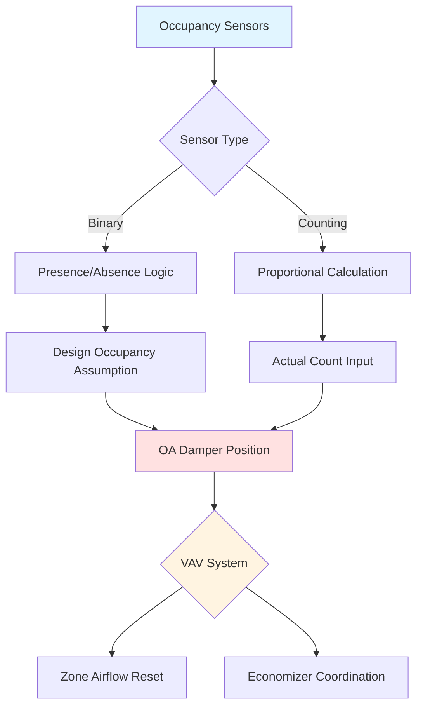

## Обзор

Датчики присутствия предоставляют данные в реальном времени о количестве людей в системы управляемой вентиляции (DCV), обеспечивая точное регулирование поступления наружного воздуха на основе фактического использования помещения вместо расчетной занятости. Выбор датчика влияет на точность вентиляции, экономию энергии и соответствие требованиям стандарта ASHRAE 62.1 для помещений с переменной занятостью.

## Технологии датчиков

### ИК-датчики присутствия (PIR)

ИК-датчики обнаруживают тепловое излучение от людей в зоне обнаружения. Эти устройства измеряют разницу температур между человеческим телом (примерно 37 °C) и окружающими поверхностями.

**Принцип работы:**

- Пироэлектрические элементы обнаруживают инфракрасное излучение в диапазоне 8–14 мкм
- Линза Френеля разделяет поле зрения на зоны обнаружения
- Движение запускает выходной сигнал при пересечении тепловой сигнатурой границ зоны

**Ограничения:**

- Только бинарное обнаружение (занято/свободно), а не подсчет людей
- Требует движения для обнаружения, не работает с неподвижными людьми
- Ограниченный диапазон: типичный радиус охвата 6–9 м
- Деградация производительности в зависимости от температуры

### Ультразвуковые датчики присутствия

Ультразвуковые датчики передают звуковые волны на частотах 25–40 кГц и анализируют отраженные сигналы, используя принцип эффекта Доплера для обнаружения движения.

**Способ обнаружения:**

$$f_r = f_t \left(1 + \frac{v}{c}\right)$$

Где:
- $f_r$ = принятая частота (Гц)
- $f_t$ = передаваемая частота (Гц)
- $v$ = скорость движущегося объекта (м/с)
- $c$ = скорость звука в воздухе (343 м/с при 20 °C)

**Характеристики:**

- Доступны шаблоны охвата на 360 градусов
- Обнаруживает движение за препятствиями и перегородками
- Более чувствительны к незначительным движениям, чем ИК-датчики
- Подвержены ложным срабатываниям от потока воздуха HVAC и вентиляторов

### Системы видеоаналитики

Системы на базе камер используют алгоритмы компьютерного зрения для подсчета и отслеживания людей с высокой точностью.

**Архитектура обработки:**

**Преимущества:**

- Точный подсчет людей (±5 % в оптимальных условиях)
- Отслеживание направления (входы и выходы)
- Картирование плотности присутствия
- Аналитика исторических данных

**Соображения по проектированию:**

- Вопросы конфиденциальности требуют анонимизации
- Производительность, зависящая от освещения
- Более высокие затраты на установку и обработку
- Требования к пропускной способности сети

### Системы подсчета присутствия

Системы прямого подсчета измеряют фактическое количество людей через физические точки обнаружения.

#### Интеграция турникетов

Механические или оптические турникеты обеспечивают определенный подсчет входов/выходов в контролируемых точках доступа. Интеграция рассчитывает чистую занятость:

$$N(t) = N_0 + \sum_{i=1}^{t}(E_i - X_i)$$

Где:
- $N(t)$ = присутствие в момент времени $t$
- $N_0$ = начальный подсчет занятости
- $E_i$ = входы в интервале $i$
- $X_i$ = выходы в интервале $i$

#### Системы счетчиков потока

Инфракрасные или датчики времени пролета в дверных проемах обнаруживают направление прохождения, используя логику двойного луча для различения входов и выходов.

## Сравнение технологий датчиков

| Технология | Точность подсчета | Область охвата | Стоимость установки | Техническое обслуживание | Влияние на конфиденциальность |
|------------|------------------|-----------------|-------------------|----------------------|---------------------------|
| ИК-датчик | Только бинарно | 46–65 м² | Низкая (2000–4500 р.) | Минимальное | Нет |
| Ультразвуковой | Только бинарно | 56–93 м² | Низкая (2500–6000 р.) | Минимальное | Нет |
| Двойная технология | Только бинарно | 46–74 м² | Средняя (3000–7500 р.) | Минимальное | Нет |
| Счетчик потока | ±2–5 % | На дверной проем | Средняя (7500–22500 р.) | Низкое | Нет |
| Видеоаналитика | ±5–10 % | 140–280 м² | Высокая (30000–75000 р.) | Среднее | Умеренное |
| Турникет | ±1 % | На точку входа | Высокая (45000–120000 р.) | Среднее | Низкое |

## Интеграция с системами вентиляции

### Расчет наружного воздуха

ASHRAE 62.1 определяет требования к наружному воздуху на основе занятости:

$$V_{ot} = R_p \times P_z + R_a \times A_z$$

Где:
- $V_{ot}$ = расход наружного воздуха (CFM)
- $R_p$ = норма наружного воздуха на человека (CFM/человека)
- $P_z$ = население зоны от датчиков присутствия
- $R_a$ = норма наружного воздуха на площадь (CFM/м²)
- $A_z$ = площадь зоны (м²)

### Стратегии управления интеграцией

**Пропорциональное управление:**

Расход вентиляции изменяется линейно с обнаруженной занятостью. Подходит для помещений с постепенными изменениями занятости.

**Ступенчатое управление:**

Вентиляция увеличивается дискретными этапами при пороговых значениях занятости. Снижает циклирование заслонки в системах переменного расхода воздуха.

## Точность оценки присутствия

Расположение и калибровка датчиков напрямую влияют на точность вентиляции.

**Распространение погрешности:**

$$\sigma_{V_{ot}} = \sqrt{\left(R_p \sigma_{P_z}\right)^2 + \left(P_z \sigma_{R_p}\right)^2}$$

Где:
- $\sigma_{V_{ot}}$ = неопределенность расхода наружного воздуха
- $\sigma_{P_z}$ = неопределенность подсчета присутствия
- $\sigma_{R_p}$ = неопределенность нормы наружного воздуха

## Рекомендации по проектированию

**Критерии выбора датчика:**

- Бинарные датчики приемлемы для помещений с предсказуемыми схемами занятости
- Системы подсчета требуются для помещений с высокой вариабельностью (конференц-залы, аудитории, спортзалы)
- Видеоаналитика оправдана для крупных сборок более 100 человек
- Избыточное охватывающее датчики для критичных по надежности приложений

**Рекомендации по установке:**

- Установите ИК-датчики на высоте 2,4–3,7 м от пола для оптимального охвата
- Расположите счетчики потока только в основных точках доступа
- Калибруйте видеосистемы при типичных условиях освещения и занятости
- Внедрите отказоустойчивость при сбое связи с переходом на расчетные значения занятости

**Требования к техническому обслуживанию:**

- Проверяйте точность датчиков ежеквартально с помощью ручного подсчета людей
- Очищайте оптические поверхности два раза в год
- Проверяйте интерфейсы связи при сезонных испытаниях
- Обновляйте алгоритмы по мере изменения схем использования помещений

## Соответствие стандарту ASHRAE 62.1

Раздел 6.2.7 допускает DCV с использованием датчиков присутствия при следующих условиях:

- Датчики обеспечивают подсчет людей или надежное обнаружение присутствия
- Система переходит на расчетную занятость при отказе датчика
- Поддерживаются минимальные расходы вентиляции в соответствии с компонентом площади ($R_a \times A_z$)
- Испытания подтверждают точность датчика и отклик управления

Управляемая по присутствию DCV обычно достигает экономии энергии вентиляции на 20–40 % в приложениях с переменной занятостью при сохранении требований к качеству внутреннего воздуха.
