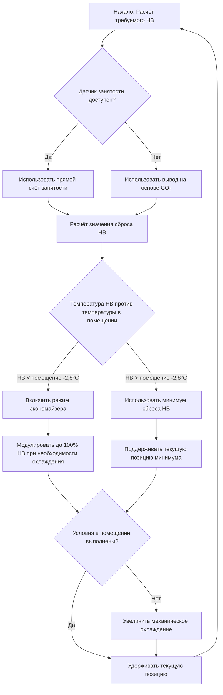
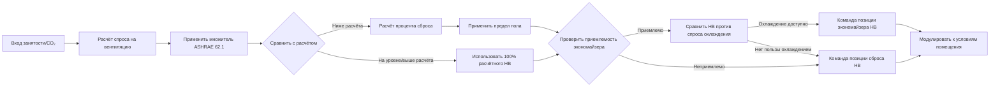

## Обзор

Сброс подачи наружного воздуха (OA) представляет собой передовую стратегию управления, которая динамически регулирует минимальные расходы вентиляции в зависимости от фактического спроса на занятость при одновременном соблюдении требований ASHRAE 62.1 по вентиляции. Этот подход оптимизирует потребление энергии путём сокращения ненужного кондиционирования наружного воздуха в периоды низкой занятости, одновременно обеспечивая работу экономайзера при благоприятных наружных условиях.

## Основы управления сбросом

### График сброса на основе занятости

Установка минимальной подачи наружного воздуха регулируется пропорционально измеренной или определённой занятости:

$$V_{oa,min} = V_{oa,design} \times \frac{N_{actual}}{N_{design}} + V_{oa,floor}$$

Где:
- $V_{oa,min}$ = минимальный расход подачи наружного воздуха (CFM)
- $V_{oa,design}$ = расчётный расход подачи наружного воздуха (CFM)
- $N_{actual}$ = фактическая измеренная занятость (люди)
- $N_{design}$ = расчётная занятость (люди)
- $V_{oa,floor}$ = минимальный расход вентиляции пола (CFM)

### Алгоритм сброса на основе CO₂

Для помещений без прямого датчика занятости концентрация CO₂ служит косвенной мерой:

$$V_{oa,reset} = V_{oa,floor} + (V_{oa,design} - V_{oa,floor}) \times \frac{C_{space} - C_{ambient}}{C_{setpoint} - C_{ambient}}$$

Где:
- $C_{space}$ = концентрация CO₂ в помещении (ppm)
- $C_{ambient}$ = концентрация CO₂ на улице (обычно 400 ppm)
- $C_{setpoint}$ = расчётная установка CO₂ (обычно 1000–1100 ppm)

## Реализация графика сброса

### Типовые графики сброса по назначению

| Назначение | Расчётный НВ (%) | Минимум сброса (%) | Основание сброса | Время отклика |
|-------------|-----------------|-------------------|-----------------|---------------|
| Зал собраний | 100 | 30 | CO₂ + график | 15–20 мин |
| Классная комната | 100 | 40 | Датчик CO₂ | 10–15 мин |
| Ресторан | 100 | 50 | CO₂ + время | 10–15 мин |
| Спортзал | 100 | 35 | CO₂ + график | 20–30 мин |
| Театр | 100 | 25 | Счётчик занятости | 15–20 мин |
| Переговорная комната | 100 | 30 | Датчик CO₂ | 8–12 мин |

### Логика последовательности управления

## Интеграция экономайзера

### Стратегия управления двойным путём

Системы сброса НВ должны координироваться с работой экономайзера для максимизации экономии энергии:

$$\text{OA}_{damper} = \max(OA_{reset}, OA_{economizer})$$

Положение заслонки подачи наружного воздуха реагирует на больший из двух факторов: спроса на вентиляцию или спроса на охлаждение экономайзера.

### Условия блокировки экономайзера

| Параметр | Включить экономайзер | Отключить экономайзер |
|----------|---------------------|----------------------|
| Температура по сухому термометру | < 18,3°C | > 21,1°C |
| Энтальпия | < 120 кДж/кг | > 127 кДж/кг |
| Точка росы | < 12,8°C | > 15,6°C |
| Дифференциальная температура | НВ < ВВ - 2,8°C | НВ > ВВ - 1,1°C |

## Архитектура логики управления

### Многоступенчатый алгоритм сброса

## Оптимизация энергопотребления

### Преимущества в отопительный сезон

Во время отопления сброс НВ снижает энергию отопления путём кондиционирования меньшего количества наружного воздуха:

$$Q_{saved} = \rho \times c_p \times V_{oa,reduced} \times (T_{space} - T_{oa}) \times 60$$

Где:
- $Q_{saved}$ = сэкономленная энергия отопления (кДж/ч)
- $\rho$ = плотность воздуха (1,2 кг/м³)
- $c_p$ = удельная теплоёмкость воздуха (1,005 кДж/кг·°C)
- $V_{oa,reduced}$ = сокращение подачи наружного воздуха в результате сброса (CFM)
- $T_{space}$ = температура в помещении (°C)
- $T_{oa}$ = температура наружного воздуха (°C)

### Оптимизация в сезон охлаждения

Когда наружные условия неблагоприятны для работы экономайзера, сброс минимизирует нагрузку охлаждения:

$$Q_{cooling,saved} = \rho \times V_{oa,reduced} \times (h_{oa} - h_{space}) \times 60$$

Где $h$ представляет энтальпию (кДж/кг).

## Соответствие ASHRAE 62.1

### Процедура расчёта расхода вентиляции

Сброс НВ должен поддерживать минимальные расходы вентиляции в соответствии с ASHRAE 62.1:

$$V_{oz} = R_p \times P_z + R_a \times A_z$$

Где:
- $V_{oz}$ = требуемый расход наружного воздуха в зоне (CFM)
- $R_p$ = расход наружного воздуха на человека (CFM/человек)
- $P_z$ = численность населения зоны (люди)
- $R_a$ = расход наружного воздуха на площадь (CFM/м²)
- $A_z$ = площадь пола зоны (м²)

График сброса никогда не должен снижать НВ ниже этого расчётного минимума.

### Эффективность вентиляции системы

Многозонные системы требуют коэффициента эффективности вентиляции:

$$E_v = \frac{1 + X_s - Z_d}{1 + X_s}$$

Где:
- $E_v$ = эффективность вентиляции системы
- $X_s$ = некорректированная доля наружного воздуха системы
- $Z_d$ = доля наружного воздуха зоны (критическая зона)

## Лучшие практики реализации

**Размещение датчиков:**
- Располагайте датчики CO₂ в дыхательной зоне (122–183 см над полом)
- Усредняйте показания нескольких датчиков в больших помещениях
- Размещайте вдали от приточных диффузоров и впусков наружного воздуха
- Калибруйте датчики ежеквартально

**Настройка управления:**
- Установите минимум сброса на уровне 50–60% расчётного НВ для большинства приложений
- Используйте усреднение на 10–15 минут для сброса на основе CO₂
- Реализуйте задержку 5–10 минут перед снижением НВ
- Включите более быстрый отклик при увеличении НВ (2–5 минут)

**Координация экономайзера:**
- Запрограммируйте экономайзер для переопределения сброса при благоприятных условиях
- Поддерживайте 10–15% минимума НВ во время работы экономайзера
- Контролируйте температуру смешанного воздуха для предотвращения обледенения теплообменника
- Отключайте экономайзер, если точка росы наружного воздуха превышает 15,6°C во влажном климате

## Проверка производительности

**Требуемые точки мониторинга:**
- Положение заслонки подачи наружного воздуха (%)
- Расход подачи наружного воздуха (CFM)
- Температура смешанного воздуха (°C)
- Концентрация CO₂ в помещении (ppm)
- Счёт занятости или вывод
- Статус включения экономайзера

**Проверка экономии энергии:**

$$\text{Экономия} = \frac{E_{baseline} - E_{reset}}{E_{baseline}} \times 100\%$$

Типичная экономия составляет 15–35% энергопотребления HVAC в зависимости от климата, изменчивости занятости и конфигурации системы.

## Ключевые инженерные соображения

Эффективность управления сбросом зависит от точного определения занятости или измерения CO₂. Проверьте точность датчика перед наладкой. Настройте алгоритмы сброса для соответствия требованиям минимальной вентиляции при всех режимах работы. Координируйте с управлением экономайзера для максимизации возможностей свободного охлаждения при одновременном поддержании стандартов качества воздуха в помещении в соответствии с ASHRAE 62.1 и требованиями местных кодов.

Разрабатывайте графики сброса на основе фактических моделей занятости, а не теоретических максимумов. Контролируйте производительность системы в течение первого года для оптимизации параметров сброса и проверки предположений об экономии энергии.
