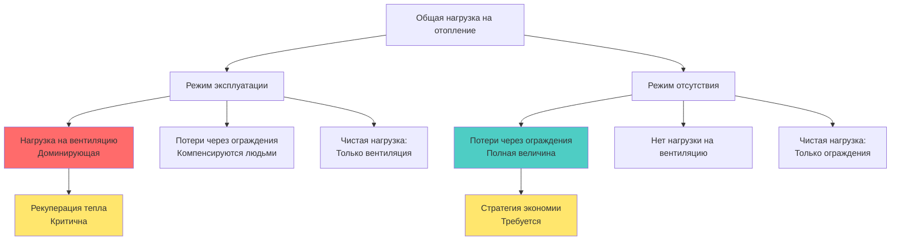

# Нагрузки на отопление в помещениях для собраний

Расчет нагрузок на отопление для помещений для собраний представляет собой уникальные задачи, существенно отличающиеся от типичных коммерческих приложений. Основная сложность обусловлена высокой плотностью occupancy, которая генерирует значительные внутренние тепловые приросты. Эти приросты могут компенсировать или полностью устранять потребность в отоплении помещений в период эксплуатации, одновременно создавая серьезные требования к отоплению приточного воздуха.

## Фундаментальный тепловой баланс

Чистая нагрузка на отопление для помещения собраний определяется балансом энергии:

$$Q_{heat} = Q_{envelope} + Q_{ventilation} + Q_{infiltration} - Q_{internal} - Q_{solar}$$

Где:
- $Q_{heat}$ = Чистая нагрузка на отопление (Вт или кВт)
- $Q_{envelope}$ = Потери тепла через ограждающие конструкции здания (Вт или кВт)
- $Q_{ventilation}$ = Нагрузка на отопление от приточной вентиляции (Вт или кВт)
- $Q_{infiltration}$ = Потери тепла от инфильтрации воздуха (Вт или кВт)
- $Q_{internal}$ = Внутренние тепловые приросты от людей, освещения и оборудования (Вт или кВт)
- $Q_{solar}$ = Солнечный тепловой прирост (Вт или кВт)

## Явление компенсации тепла людьми

В помещениях для собраний с плотностью occupancy, превышающей 7 человек на 100 м², генерация тепла людьми часто превышает потери тепла через ограждающие конструкции в часы эксплуатации. Каждый человек генерирует явное тепло в зависимости от уровня активности.

### Генерация явного тепла в зависимости от активности

| Уровень активности | Явное тепло (Вт на человека) |
|------|------|
| Сидя, в покое (театр) | 72 |
| Сидя, легкая работа | 75 |
| Стоя, легкая активность | 92 |
| Легкая работа за верстаком | 92 |
| Умеренный танец | 119 |

Для театра на 1000 мест с сидящими зрителями:

$$Q_{occupants} = 1000 \times 72 = 72,000 \text{ Вт (71.8 кВт)}$$

Этот значительный внутренний прирост часто устраняет потребность в отоплении помещений во время представлений, создавая потребность в охлаждении даже зимой.

## Доминирование нагрузки на отопление вентиляции

Хотя тепло от людей может компенсировать потери через ограждающие конструкции, нагрузка на отопление вентиляции становится определяющим фактором при проектировании помещений для собраний. Стандарт ASHRAE 62.1 устанавливает минимальные требования к наружному воздуху в зависимости от плотности occupancy и площади пола.

### Расчет расхода вентиляции

$$V_{oz} = R_p \times P_z + R_a \times A_z$$

Где:
- $V_{oz}$ = Требуемый расход наружного воздуха (м³/с)
- $R_p$ = Расход наружного воздуха на человека (м³/с на человека)
- $P_z$ = Население зоны
- $R_a$ = Расход наружного воздуха на площадь (м³/с на м²)
- $A_z$ = Площадь пола зоны (м²)

Для помещений собраний (театры, аудитории): $R_p$ = 2.4 л/с на человека, $R_a$ = 0.3 л/с на м²

### Формула нагрузки на отопление вентиляции

Явная нагрузка на отопление для приточного воздуха:

$$Q_{vent} = 1.2 \times V_{oz} \times (T_{indoor} - T_{outdoor})$$

Для театра на 1000 мест (площадь 929 м² при 0.93 м² на место):

$$V_{oz} = (2.4 \times 1000) + (0.3 \times 929) = 2,679 \text{ л/с (2.68 м³/с)}$$

При расчетных условиях (21°C внутри, -18°C снаружи):

$$Q_{vent} = 1.2 \times 2.68 \times 39 = 125.4 \text{ кВт}$$

Эта нагрузка на вентиляцию обычно значительно превышает чистую потребность в отоплении помещения.

## Компоненты потерь тепла через ограждающие конструкции

Несмотря на внутренние приросты, потери тепла через ограждающие конструкции должны рассчитываться для периодов отсутствия людей и режимов экономии.

$$Q_{envelope} = \sum (U \times A \times \Delta T)$$

Где:
- $U$ = Общий коэффициент теплопередачи (Вт/м²·K)
- $A$ = Площадь поверхности (м²)
- $\Delta T$ = Разница температур (K)

### Типовые характеристики ограждающих конструкций помещений собраний

| Компонент | Коэффициент U (Вт/м²·K) | Примечания |
|------|------|------|
| Стены (утепленные) | 0.28 - 0.45 | Минимум по нормам |
| Крыша (утепленная) | 0.17 - 0.27 | Над подвесным потолком |
| Плита по грунту | F = 0.73 | Коэффициент F на погонный метр |
| Двери/входы | 1.99 - 2.84 | Зоны с высокой проходимостью |
| Стекло (ограниченное) | 1.70 - 2.27 | В помещениях собраний обычно минимизируют остекление |

## Конструктивные особенности и взаимодействие компонентов нагрузки

## Методология расчёта тепловой нагрузки

## Критические проектные решения

**Управление нагрузкой вентиляции**: Для помещений с массовым пребыванием людей необходимы рекуператоры (ERV) или рекуператоры тепла (HRV). Правильно подобранная система рекуперации тепла может снизить нагрузку на отопление от вентиляции на 60–80%, обеспечивая рекуперацию:

$$Q_{recovered} = \epsilon \times Q_{vent}$$

Где $\epsilon$ = эффективность теплообменника (типичные значения 0,60 – 0,80)

**Различение режимов эксплуатации**: Подбор оборудования должен учитывать два различных режима работы:
1. **Режим эксплуатации (занято)**: Доминирует нагрузка от вентиляции, возможно требование охлаждения помещения.
2. **Режим простоя (незанято)**: Только нагрузка через ограждающие конструкции, требуется полная мощность отопления.

**Требования к предварительному нагреву**: При переходе помещения из режима пониженной температуры (setback) в режим эксплуатации необходимо одновременно компенсировать теплопотери через тепловую массу ограждающих конструкций и нагрузку от вентиляции. Это создаёт временную пиковую нагрузку, превышающую расчётные значения для стационарного режима.

## Ссылочные стандарты

Процедуры проектирования и методология расчёта нагрузок соответствуют главе 18 «Расчёт нагрузок на охлаждение и отопление нежилых зданий» (Nonresidential Cooling and Heating Load Calculations) и стандарту ASHRAE 62.1 «Вентиляция для обеспечения приемлемого качества воздуха в помещении» (Ventilation for Acceptable Indoor Air Quality) справочника ASHRAE Fundamentals. Коэффициенты разновременности нагрузок и графики занятости получены из главы 19 «Методы оценки энергопотребления и моделирования» (Energy Estimating and Modeling Methods) справочника ASHRAE Fundamentals.

Ключевое отличие для помещений с массовым пребыванием людей заключается в том, что нагрузки на отопление от вентиляции доминируют в тепловом анализе, делая обработку наружного воздуха основным фактором энергопотребления, а не кондиционирование самого помещения.
