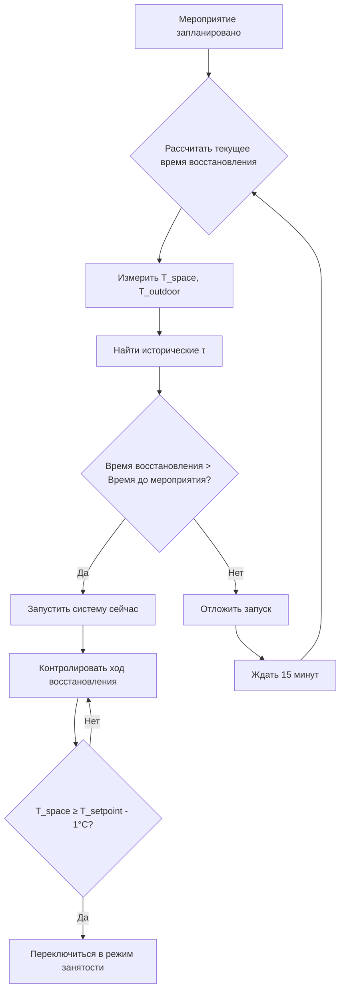

## Обзор

Прерывистая работа характеризует системы HVAC, обслуживающие помещения собраний с нерегулярными или предсказуемыми прерывистыми режимами занятости. Эти объекты — включая молитвенные центры, аудитории, конференц-залы и спортивные арены — испытывают продолжительные периоды отсутствия людей, чередующиеся с запланированными мероприятиями высокой плотности занятости. Надлежащая инженерная разработка последовательности снижения и восстановления обеспечивает существенное энергосбережение при гарантировании комфорта в начале мероприятия.

## Фундаментальные принципы теплового отклика

Тепловое поведение помещений с прерывистой работой критически зависит от характеристик конструкции здания и условий окружающей среды. Во время неoccupied периодов температура в помещении дрейфует к условиям окружающей среды со скоростью, зависящей от механизмов потери тепла.

### Потеря тепла при снижении

Мгновенная потеря тепла при снижении операции следует:

$$Q_{loss} = UA(T_{space} - T_{ambient}) + \dot{m}_{inf}c_p(T_{space} - T_{ambient})$$

Где:
- $UA$ = общая проводимость здания (кДж/ч·°C)
- $T_{space}$ = текущая температура в помещении (°C)
- $T_{ambient}$ = наружная температура (°C)
- $\dot{m}_{inf}$ = массовый расход инфильтрации (кг/ч)
- $c_p$ = удельная теплоемкость воздуха (1.006 кДж/кг·°C)

### Влияние тепловой массы

Тепловая масса здания замедляет скорость колебаний температуры. Эффективная тепловая емкость определяет характеристики охлаждения:

$$C_{eff} = \sum_{i} m_i c_{p,i}$$

Где $m_i$ и $c_{p,i}$ представляют массу и удельную теплоемкость каждого компонента здания (конструкция, мебель, объем воздуха).

## Расчет восстановления после снижения

Время восстановления — период, необходимый для восстановления температуры в помещении от снижения до установленного значения занятости — определяет время запуска системы перед запланированными мероприятиями.

### Оценка времени восстановления

Приблизительное время восстановления для помещения с тепловой массой:

$$t_{recovery} = \frac{C_{eff}(T_{occupied} - T_{setback})}{Q_{available} - Q_{loss,avg}}$$

Где:
- $t_{recovery}$ = время прогрева (часы)
- $T_{occupied}$ = установленная температура при занятости (обычно 20-22°C)
- $T_{setback}$ = установленная температура при отсутствии занятости (°C)
- $Q_{available}$ = доступная мощность отопления (кДж/ч)
- $Q_{loss,avg}$ = средняя потеря тепла во время восстановления (кДж/ч)

### Постоянная времени здания

Тепловая постоянная времени дает упрощенную оценку восстановления:

$$\tau = \frac{C_{eff}}{UA + \dot{m}_{inf}c_p}$$

Восстановление в пределах 5% от установленного значения требует приблизительно $3\tau$ часов.

## Стратегии режимов работы

```mermaid
gantt
    title Еженедельный режим работы - Молитвенный центр
    dateFormat HH:mm
    axisFormat %H:%M

    section Воскресенье
    Снижение 13°C    :done, 00:00, 07:00
    Прогрев          :active, 07:00, 09:00
    Занято 21°C      :crit, 09:00, 13:00
    Снижение 13°C    :done, 13:00, 24:00

    section Среда
    Снижение 13°C    :done, 00:00, 17:00
    Прогрев          :active, 17:00, 18:30
    Занято 21°C      :crit, 18:30, 21:00
    Снижение 13°C    :done, 21:00, 24:00

    section Прочие дни
    Непрерывное снижение 13°C :done, 00:00, 24:00
```

### Выбор температуры снижения

Температуры снижения балансируют энергосбережение с временем восстановления и защитой от замерзания:

| Климатическая зона | Снижение отопления | Повышение охлаждения | Соображения |
|-------------------|-------------------|----------------------|------------|
| Холодная (6-8) | 13-14°C | 29-32°C | Защита от замерзания, расположение труб |
| Умеренная (3-5) | 10-13°C | 29-32°C | Риск конденсации при восстановлении |
| Теплая (1-2) | 15-18°C | 28-29°C | Управление влажностью при снижении |

## Анализ влияния на энергию

Прерывистая работа снижает потребление энергии на отопление за счет уменьшения потери тепла в неoccupied периодов, частично компенсируется потерями при циклировании во время восстановления.

### Расчет энергосбережения

Чистое еженедельное энергосбережение в сравнении с непрерывной работой:

$$E_{saved} = \int_{t_{unoccupied}} Q_{loss}(T_{occupied}) \, dt - \int_{t_{recovery}} Q_{additional} \, dt$$

Где $Q_{additional}$ представляет избыточный ввод энергии при ускоренном прогреве.

### Коэффициент потерь при циклировании

Неэффективность восстановления вводит коэффициент штрафа:

$$\eta_{cycling} = 1 - \frac{E_{recovery,excess}}{E_{saved,setback}}$$

Типичная эффективность циклирования варьируется от 0,85-0,95 в зависимости от скорости восстановления и тепловой массы.

## Сравнительная энергетическая эффективность

| График работы | Годовая энергия отопления | Относительное сбережение | Запусков восстановления/год |
|---------------|---------------------------|--------------------------|------------------------------|
| Непрерывно 21°C | 100% (базовая линия) | — | 0 |
| Ночное снижение 16°C | 72-78% | 22-28% | 365 |
| Выходное снижение 13°C | 68-75% | 25-32% | 156 |
| Только мероприятия (2×/неделю) | 45-55% | 45-55% | 104 |

*На основе помещения площадью 4645 м², климатическая зона 5, средняя тепловая масса*

## Соображения проектирования системы

### Подбор мощности отопления

Системы, обслуживающие помещения с прерывистой работой, требуют дополнительной мощности сверх установившихся нагрузок для достижения приемлемого времени восстановления:

$$Q_{design} = Q_{steadystate} \times F_{pickup}$$

Коэффициенты подбора обычно варьируются от 1,2-1,5 для помещений собраний в зависимости от желаемого времени восстановления.

### Последовательности управления

Алгоритмы оптимального запуска корректируют время запуска системы на основе:
- Измерение текущей температуры в помещении
- Наружная температура
- Исторические характеристики восстановления
- Характеристики теплового отклика здания

ASHRAE Guideline 36 предоставляет последовательности для управления оптимальным запуском/остановом в объектах с прерывистой работой.

## Выбор оборудования

### Системы с переменной мощностью

Модулирующее отопительное оборудование обеспечивает преимущества для прерывистой работы:
- Высокая мощность во время восстановления
- Эффективная работа на частичной нагрузке в периоды занятости с высокими внутренними выделениями
- Сниженные потери при циклировании

### Накопление тепловой энергии

Накопление явной или скрытой тепловой энергии может оптимизировать прерывистую работу:
- Предварительная зарядка накопителя в периоды низкого спроса
- Выпуск накопленной энергии во время восстановления
- Снижение пиковых платежей за спрос
- Обеспечение сдвига возобновляемой энергии во времени

## Соображения для специальных мероприятий

Помещения собраний, принимающие специальные мероприятия, требуют гибкого планирования:

**Способность быстрого отклика**: Системы должны восстанавливаться из глубокого снижения в течение 2-3 часов при добавлении непредвиденных мероприятий.

**Управление влажностью**: Продолжительное снижение в климате с высокой влажностью требует осушения во время восстановления, чтобы предотвратить конденсацию и обеспечить комфорт.

**Предварительная очистка вентиляции**: Введение наружного воздуха за 30-60 минут до начала занятости для установления базового уровня качества воздуха согласно ASHRAE 62.1.

## Ссылки на коды и стандарты

- **ASHRAE 90.1**: Требует автоматического управления снижением для помещений без занятости >12 часов/день
- **ASHRAE 62.1**: Скорости вентиляции могут быть снижены в периоды отсутствия занятости
- **IMC Раздел 403.2.3**: Требования к термостатическому управлению и снижению
- **ASHRAE Guideline 36**: Последовательности управления оптимальным запуском/остановом

## Проверка и наладка

Проверьте производительность прерывистой работы через:
- Измерение времени восстановления при различных наружных условиях
- Достижение глубины снижения в периоды отсутствия занятости
- Точность графика и его соблюдение
- Сравнение потребления энергии с прогнозными значениями базовой линии

Надлежащая наладка стратегий прерывистой работы гарантирует материализацию прогнозируемого энергосбережения в фактической работе при сохранении ожиданий комфорта для занятых.
