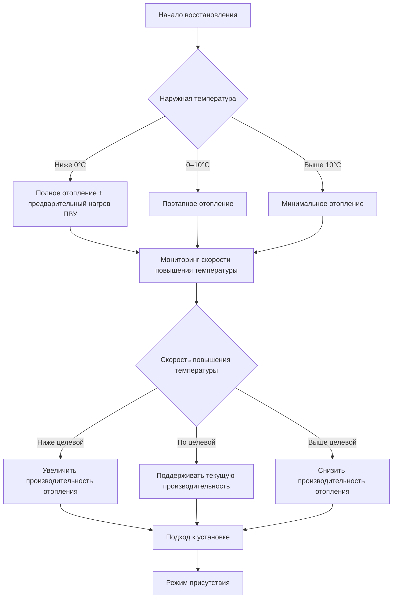
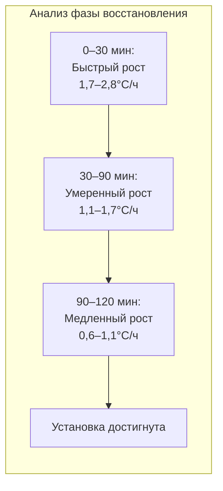

## Обзор

Восстановление температуры в общественных помещениях представляет уникальные проблемы из-за высокой тепловой массы, большого соотношения объема к количеству людей и перемежающихся режимов использования. Правильное проектирование стратегии восстановления обеспечивает комфорт присутствующих в момент начала мероприятия при минимизации энергопотребления в периоды отсутствия людей.

## Расчет времени восстановления

Фундаментальное уравнение времени восстановления учитывает тепловую емкость здания и доступную производительность отопления:

$$t_{recovery} = \frac{C_{building} \cdot (T_{setpoint} - T_{setback})}{Q_{available} - Q_{losses}}$$

Где:
- $t_{recovery}$ = время восстановления (часы)
- $C_{building}$ = эффективная тепловая емкость здания (кДж/°C)
- $T_{setpoint}$ = температура установки в присутствии людей (°C)
- $T_{setback}$ = температура после понижения (°C)
- $Q_{available}$ = доступная производительность отопления (кВт)
- $Q_{losses}$ = потери тепла через ограждение во время восстановления (кВт)

### Эффективная тепловая емкость

Для общественных помещений рассчитайте эффективную тепловую емкость, включая конструктивную массу:

$$C_{building} = \sum (m_i \cdot c_{p,i} \cdot f_i)$$

Где:
- $m_i$ = масса компонента i (кг)
- $c_{p,i}$ = удельная теплоемкость материала i (кДж/кг·°C)
- $f_i$ = коэффициент вовлечения (0,3–0,8 для типичных периодов восстановления)

**Коэффициенты вовлечения материалов:**

| Материал | Восстановление 2 часа | Восстановление 4 часа | Восстановление 8 часов |
|----------|----------------------|----------------------|----------------------|
| Бетонная плита | 0,35 | 0,50 | 0,70 |
| Бетонный блок | 0,40 | 0,55 | 0,75 |
| Гипсокартон | 0,80 | 0,90 | 0,95 |
| Стальная конструкция | 0,60 | 0,75 | 0,85 |

## Характеристики кривой восстановления

## Профиль повышения температуры

## Целевые показатели времени восстановления

ASHRAE 90.1 не предписывает конкретные времена восстановления, но требует управления оптимальным запуском для зданий >930 м². Типичные целевые показатели для общественных помещений:

| Тип помещения | Понижение ΔT | Целевое восстановление | Коэффициент размера оборудования |
|---|---|---|---|
| Театр/аудитория | 5,6–8,3°C | 2–3 часа | 1,5–2,0× расчетная нагрузка |
| Арена/стадион | 4,4–6,7°C | 3–4 часа | 1,3–1,5× расчетная нагрузка |
| Конгресс-центр | 5,6–6,7°C | 2–3 часа | 1,4–1,7× расчетная нагрузка |
| Религиозное здание | 6,7–10°C | 2–4 часа | 1,6–2,2× расчетная нагрузка |

## Стратегия управления оптимальным запуском

Алгоритмы оптимального запуска регулируют время включения оборудования в зависимости от текущих условий и изученного ответа здания.

### Базовый алгоритм оптимального запуска

$$t_{start} = t_{occupancy} - \left(K_1 \cdot \Delta T + K_2 \cdot (T_{outdoor} - T_{ref}) + K_3\right)$$

Где:
- $t_{start}$ = время запуска оборудования
- $t_{occupancy}$ = запланированное время присутствия
- $\Delta T$ = $(T_{setpoint} - T_{current})$
- $K_1$ = коэффициент перепада температуры (обычно 15–28 мин/°C)
- $K_2$ = коэффициент наружной температуры (обычно 1,8–5,4 мин/°C)
- $K_3$ = базовое смещение времени (обычно 27–54 мин)
- $T_{ref}$ = эталонная наружная температура (обычно 4–10°C)

### Адаптивное обучение

Современные системы управления используют адаптивные алгоритмы, которые уточняют коэффициенты на основе фактического поведения:

$$K_{1,new} = K_{1,old} + \alpha \cdot \frac{(t_{actual} - t_{predicted})}{\Delta T}$$

Где $\alpha$ — скорость обучения (обычно 0,1–0,3).

## Эффекты тепловой массы

Высокая тепловая масса в общественных помещениях существенно влияет на характеристики восстановления.

**Преимущества тепловой массы:**
- Уменьшает колебания температуры в периоды отсутствия людей
- Обеспечивает накопление тепловой энергии во время восстановления
- Снижает влияние колебаний наружной температуры

**Проблемы тепловой массы:**
- Увеличивает требования к времени восстановления
- Повышает коэффициент размера оборудования
- Усложняет настройку алгоритма управления

### Влияние соотношения массы к объему

$$R_{mv} = \frac{\sum (m_i \cdot c_{p,i})}{V \cdot \rho_{air} \cdot c_{p,air}}$$

Где:
- $R_{mv}$ = соотношение массы к объему (безразмерное)
- $V$ = объем кондиционируемого помещения (м³)
- $\rho_{air}$ = плотность воздуха (1,2 кг/м³)
- $c_{p,air}$ = удельная теплоемкость воздуха (1,005 кДж/кг·°C)

**Типичные значения для общественных помещений:**

| Тип конструкции | $R_{mv}$ | Множитель восстановления |
|---|---|---|
| Легкая каркасная конструкция | 1–3 | 1,0–1,2 |
| Тяжелая каркасная конструкция | 3–6 | 1,2–1,5 |
| Бетон/кладка | 6–12 | 1,5–2,0 |
| Подземное размещение | 10–20 | 2,0–2,5 |

## Стратегии улучшения восстановления

### Сброс наружного воздуха во время восстановления

Минимизируйте поступление наружного воздуха до минимума по проектанию (требования ASHRAE 62.1 по вентиляции применяются только при наличии людей):

$$Q_{OA,recovery} = \max(0,15 \text{ CFM/м²}, 8,5 \text{ CFM (м³/ч)})$$

Это обеспечивает легкое избыточное давление в помещении при минимизации нагрузки на отопление.

### Блокировка свободного охлаждения

Отключайте функцию свободного охлаждения во время восстановления для максимизации производительности нагревательного регистра. Включайте только при:

$$T_{space} \geq (T_{setpoint} - 1,1°C) \text{ AND } t \geq (t_{occupancy} - 30 \text{ мин})$$

### Поэтапное включение оборудования

Последовательно включайте оборудование отопления для оптимизации эффективности:

1. **Фаза 1 (0–30% восстановления):** Активируйте все ступени отопления, 100% рециркулируемый воздух
2. **Фаза 2 (30–70% восстановления):** Модулируйте для поддержания целевой скорости повышения
3. **Фаза 3 (70–100% восстановления):** Снижайте до режима присутствия, вводите вентиляционный воздух

## Размер оборудования для восстановления

Полная производительность отопления должна обеспечивать как потери через ограждение, так и восстановление тепловой массы:

$$Q_{total} = Q_{design} + Q_{recovery}$$

Где:

$$Q_{recovery} = \frac{C_{building} \cdot \Delta T_{setback}}{t_{recovery,target}}$$

Для общественных помещений с целевым временем восстановления 2–3 часа это обычно дает 1,4–2,0× расчетную производительность отопления.

### Вклад свободного охлаждения

При благоприятных наружных условиях работа свободного охлаждения может снизить механическое охлаждение в переходные сезоны, но не дает преимущества при отоплении. Не учитывайте производительность свободного охлаждения при определении требований к производительности отопления восстановления.

## Оптимизация последовательности управления

**Рекомендуемая последовательность восстановления:**

1. **Предварительный запуск (t − 5 мин):** Включите вентиляторы, проверьте работу
2. **Начальное восстановление (t + 0 мин):** Полное отопление, минимум наружного воздуха, свободное охлаждение заблокировано
3. **Среднее восстановление (50% завершено):** Начните модулировать производительность отопления
4. **Позднее восстановление (80% завершено):** Увеличьте наружный воздух до расчетного минимума
5. **Переход к присутствию (90% завершено):** Включите свободное охлаждение, полный режим присутствия
6. **Режим присутствия (100%):** Активны нормальные последовательности управления

## Рекомендации по проектированию

**Согласно ASHRAE 90.1-2019 раздел 6.4.3.3.3:** Здания >930 м² должны использовать автоматическое управление по часам с возможностями оптимального запуска. Специально для общественных помещений:

- Реализуйте адаптивный оптимальный запуск с минимальным периодом обучения 30 дней
- Размер оборудования отопления для восстановления за 2–3 часа при понижении на 5,6–8,3°C
- Мониторьте и записывайте производительность восстановления ежемесячно
- Регулируйте глубину понижения в зависимости от длительности отсутствия и наружной температуры
- Рассмотрите отдельные стратегии понижения для кондиционируемых и некондиционируемых периодов

**Проверка при пусконаладке:** Проведите комиссионные испытания оптимального запуска при различных наружных температурах и условиях понижения температуры, чтобы убедиться, что целевые показатели по присутствию достигаются в пределах ±1,1°C в запланированное время.

## Показатели производительности

Отслеживайте эти ключевые показатели эффективности для оптимизации стратегии восстановления:

- Процент периодов присутствия, соответствующих целевой температуре (целевой показатель: >95%)
- Среднее энергопотребление восстановления на градус-час (кДж/°C·ч)
- Точность оптимального запуска (целевой показатель: ±15 минут)
- Время работы оборудования во время восстановления в сравнении с периодами присутствия
- Сезонные тренды времени восстановления

---

*Ссылка: ASHRAE Handbook—HVAC Applications, глава 4 (Places of Assembly); ASHRAE Standard 90.1-2019; ASHRAE Guideline 36-2021*
