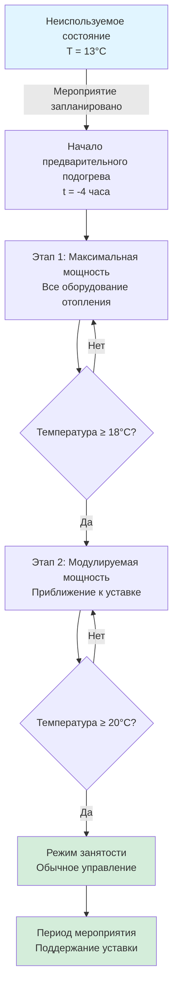
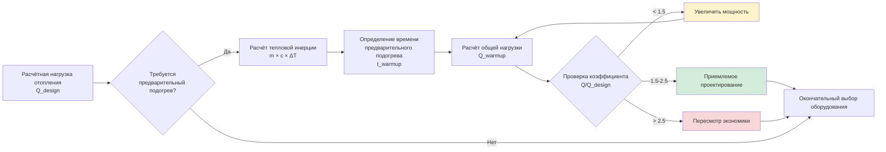

## Обзор

Требования к предварительному подогреву в помещениях с высокой плотностью занятости принципиально отличаются от традиционных приложений благодаря продолжительным периодам отсутствия людей, массивной тепловой инерции и необходимости быстрого восстановления температуры перед мероприятиями. Отопительная система должна повысить внутреннюю температуру от сниженных до уровня занятости в течение установленного периода времени, компенсируя при этом потери тепла через ограждение и эффекты тепловой инерции.

## Расчет нагрузки на предварительный подогрев

Общая мощность отопления для предварительного подогрева объединяет три отдельных компонента: чувствительное нагревание воздуха, накопление тепла в конструкции здания и текущие потери через ограждение во время периода предварительного подогрева.

### Общая мощность предварительного подогрева

$$Q_{warm-up} = Q_{sensible} + Q_{thermal\ mass} + Q_{envelope}$$

Где:
- $Q_{warm-up}$ = общая мощность отопления для предварительного подогрева (кДж/ч)
- $Q_{sensible}$ = чувствительная тепловая нагрузка воздуха
- $Q_{thermal\ mass}$ = тепловая нагрузка накопления энергии
- $Q_{envelope}$ = потери тепла через ограждение во время предварительного подогрева

### Чувствительная тепловая нагрузка воздуха

$$Q_{sensible} = \frac{1.08 \times V \times \rho \times (T_{occ} - T_{setback})}{t_{warm-up}}$$

Где:
- $V$ = объем кондиционируемого помещения (м³)
- $\rho$ = коэффициент коррекции плотности воздуха (принимать 1,0 на уровне моря)
- $T_{occ}$ = температура помещения при занятости (°C)
- $T_{setback}$ = сниженная температура (°C)
- $t_{warm-up}$ = допустимое время предварительного подогрева (часы)
- 1.08 = постоянная для воздуха (кДж/(ч·м³·°C))

### Вклад тепловой инерции

Тепловая инерция здания поглощает значительное количество энергии во время предварительного подогрева. Нагрузка на тепловое накопление зависит от массы, удельной теплоёмкости и повышения температуры.

$$Q_{thermal\ mass} = \frac{\sum(m_i \times c_i \times \Delta T \times f_i)}{t_{warm-up}}$$

Где:
- $m_i$ = масса компонента *i* (кг)
- $c_i$ = удельная теплоёмкость материала *i* (кДж/(кг·°C))
- $\Delta T$ = повышение температуры (°C)
- $f_i$ = доля массы, активно нагреваемой во время периода предварительного подогрева
- $t_{warm-up}$ = время предварительного подогрева (часы)

**Типичные значения удельной теплоёмкости:**

| Материал | Удельная теплоёмкость (кДж/(кг·°C)) | Доля активизации (2-часовой предварительный подогрев) |
|----------|----------------------------------------|---------------------------------------------------------------| 
| Бетон | 0,92 | 0,15-0,25 |
| Сталь | 0,50 | 0,30-0,40 |
| Гипсокартон | 1,09 | 0,40-0,60 |
| Сиденье (пластик) | 1,47 | 0,50-0,70 |

Доля активизации представляет часть конструкционной массы здания, которая достигает равновесия в течение периода предварительного подогрева. Более глубокие конструкционные элементы вносят минимальный вклад во время коротких циклов предварительного подогрева.

### Потери тепла через ограждение во время предварительного подогрева

Потери через ограждение продолжаются в течение всего периода предварительного подогрева и должны быть включены в расчеты мощности.

$$Q_{envelope} = UA \times (T_{avg} - T_{outdoor})$$

Где:
- $U$ = общий коэффициент теплопередачи (кДж/(ч·м²·°C))
- $A$ = площадь ограждения (м²)
- $T_{avg}$ = средняя температура помещения во время предварительного подогрева = $(T_{occ} + T_{setback})/2$
- $T_{outdoor}$ = наружная расчётная температура (°C)

## Методология выбора мощности

Рекомендации по применению ASHRAE предусматривают превышение мощности отопления для помещений собрания для достижения приемлемого рабочего поведения при предварительном подогреве. Метод коэффициента мощности сравнивает установленную мощность отопления со стационарной расчётной нагрузкой.

### Рекомендуемые коэффициенты мощности

$$\text{Коэффициент мощности} = \frac{Q_{warm-up}}{Q_{design\ steady-state}}$$

**Типичные коэффициенты мощности по приложениям:**

| Тип приложения | Время предварительного подогрева | Коэффициент мощности | Примечания |
|----------------|-----------------------------------|----------------------|----------|
| Крытая арена | 2-3 часа | 1,8-2,2 | Учитывать тепловую инерцию |
| Стадион (крытый) | 3-4 часа | 1,5-1,8 | Более низкая плотность занятости |
| Конференц-центр | 2-4 часа | 1,6-2,0 | Варьируется в зависимости от расписания |
| Театр исполнительского искусства | 2-3 часа | 1,7-2,1 | Акустические соображения |

Коэффициенты мощности ниже 1,5 обычно приводят к неадекватному рабочему поведению при предварительном подогреве, тогда как коэффициенты, превышающие 2,5, дают убывающую отдачу и увеличивают первоначальные затраты без пропорционального преимущества.

## Последовательность предварительного подогрева и стратегия управления

## График кондиционирования до занятости

Последовательность предварительного подогрева должна учитывать ступенчатое включение оборудования, задержку распределения и характеристики отклика тепловой инерции.

**Типичный график предварительного подогрева на 4 часа:**

| Время до мероприятия | Действие | Температура помещения | Статус оборудования |
|----------------------|----------|----------------------|---------------------|
| -4:00 часа | Начало предварительного подогрева | 13°C (снижено) | Все оборудование включено |
| -3:30 часа | Начальный отклик | 14-16°C | Максимальная мощность |
| -3:00 часа | Повышение температуры | 17-18°C | Максимальная мощность |
| -2:30 часа | Приближение к целевому значению | 18-19°C | Начало модуляции |
| -2:00 часа | Близко к уставке | 19-20°C | Модулируемое управление |
| -1:00 часа | Окончательная стабилизация | 20-21°C | Стационарное состояние |
| 0:00 часов | Начало мероприятия | 20°C (занятость) | Обычная эксплуатация |

## Проектные соображения

**Выбор оборудования:**
- Использовать несколько этапов отопления для пропорционального управления предварительным подогревом
- Выбирать оборудование с быстрым откликом (предпочитать принудительный воздух перед излучением для быстрого восстановления)
- Учитывать деградацию производительности теплового насоса при низких наружных температурах во время утреннего запуска

**Система распределения:**
- Выбирать воздуховоды и трубопроводы на пиковые расходы предварительного подогрева, а не на стационарные условия
- Минимизировать тепловую инерцию в системах распределения (предпочитать воздух гидравлике для приложений предварительного подогрева)
- Обеспечить надлежащее смешивание для предотвращения слоистости в помещениях с высокими потолками

**Оптимизация управления:**
- Программировать время начала предварительного подогрева на основе наружной температуры и продолжительности снижения
- Применять адаптивные алгоритмы, которые изучают тепловой отклик здания
- Контролировать рабочее поведение при предварительном подогреве и соответственно корректировать время опережения

**Управление тепловой инертией:**
- Рассмотреть размещение внутренней массы — центрально расположенная масса реагирует быстрее, чем периферийная
- Оценить временные ограничения снижения для сокращения экстремальных нагрузок предварительного подогрева
- Для часто используемых помещений ограничивать глубину снижения до 5-7°C ниже уставки занятости

## Ссылки на нормы и стандарты

**Стандарты ASHRAE:**
- ASHRAE 90.1: Энергетический стандарт для зданий — требования к снижению и предварительному подогреву
- Справочник ASHRAE — приложения HVAC, глава 5 (Места для собрания): рекомендации по мощности предварительного подогрева
- ASHRAE Guideline 36: Высокопроизводительные последовательности управления системами HVAC — алгоритмы оптимального запуска

**Ключевые критерии проектирования:**
- Максимально допустимое время предварительного подогрева: 4 часа (типовой нормативный максимум для восстановления при снижении)
- Минимальный коэффициент мощности отопления: 1,5× стационарная нагрузка
- Колебание температуры во время предварительного подогрева: не превышать 1,1°C/час в финальной фазе приближения

## Практический пример применения

Для крытой арены объёмом 14 150 м³ с расчётной нагрузкой отопления 586 кВт, целью которой является предварительный подогрев за 2,5 часа от 13°C до уставки 20°C:

**Чувствительная нагрузка воздуха:** 1,08 × 14 150 × 1,0 × (20-13) / 2,5 = 824 кВт

**Тепловая инерция** (оценочно 20% чувствительной): 164,8 кВт

**Потеря через ограждение** (при средней внутренней температуре 16,5°C): 439 кВт

**Общая мощность предварительного подогрева:** 1 427,8 кВт

**Коэффициент мощности:** 1 427,8 / 586 = 2,44

Этот коэффициент попадает в приемлемый диапазон (1,5-2,5) и обеспечивает адекватное рабочее поведение при предварительном подогреве, избегая при этом чрезмерного превышения мощности.

---

**Файл:** `/Users/evgenygantman/Documents/github/gantmane/hvac/content/specialty-applications-testing/specialty-hvac-applications/high-occupancy-density-hvac/heating-loads-assembly/warm-up-requirements/_index.md`
