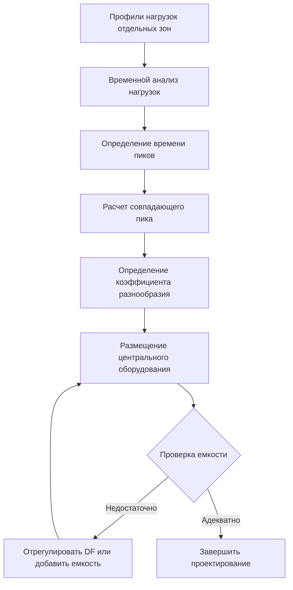

## Фундаментальные концепции

Разнообразие нагрузок представляет собой статистическую реальность того, что не все нагрузки HVAC достигают своих максимальных значений одновременно в многозонных или высокоплотных системах. Этот принцип позволяет достичь значительной оптимизации размера оборудования при сохранении адекватной емкости для фактических условий эксплуатации.

Коэффициент разнообразия количественно определяет соотношение между суммой отдельных пиковых нагрузок и фактической совпадающей пиковой нагрузкой системы:

$$\text{Коэффициент разнообразия} = \frac{\sum_{i=1}^{n} \text{Отдельные пиковые нагрузки}}{\text{Совпадающая пиковая нагрузка системы}}$$

Коэффициент разнообразия больше 1,0 указывает на то, что пики отдельных зон не совпадают во времени, что позволяет снизить емкость центрального оборудования по сравнению с простым арифметическим суммированием.

## Физическая основа разнообразия нагрузок

### Временные вариации нагрузок

Различные зоны здания испытывают пиковые нагрузки в разное время из-за:

- **Вариации солнечного теплопритока**: Зоны, обращенные на восток, имеют пик утром, обращенные на запад — днем
- **Схемы численности**: Зоны собраний могут заполняться последовательно, а не мгновенно
- **Графики оборудования**: Нагрузки кухни, освещение и аудиовизуальные системы работают по отличным графикам
- **Эффекты тепловой массы**: Зоны с различной конструкцией реагируют с разной скоростью на условия окружающей среды

### Статистическое распределение нагрузок

В больших помещениях для собраний с несколькими зонами вероятность того, что все зоны одновременно работают при пиковой нагрузке проектирования, приближается к нулю по мере увеличения количества зон. ASHRAE Fundamentals Chapter 18 содержит руководство по применению разнообразия для различных типов зданий.

## Применение коэффициента разнообразия

### Типовые значения разнообразия

| Тип здания | Количество зон | Коэффициент разнообразия | Примечания по применению |
|--------------|----------------|------------------|-------------------|
| Залы собраний | 5-10 зон | 1,15-1,25 | Рассмотрите график событий |
| Конгресс-центры | 10-20 зон | 1,25-1,40 | Независимость переговорных |
| Спортивные арены | 15-30 зон | 1,20-1,35 | Нагрузки трибун vs. коридоров |
| Учебные помещения собраний | 8-15 зон | 1,30-1,50 | Вариации расписания классов |
| Многофункциональные площадки | 12-25 зон | 1,35-1,55 | Разнообразие функций |

### Методология расчета

Емкость системы с учетом разнообразия рассчитывается как:

$$Q_{\text{система}} = \frac{\sum_{i=1}^{n} Q_{\text{пик,i}}}{DF}$$

Где:
- $Q_{\text{система}}$ = Требуемая емкость центрального оборудования (кВт)
- $Q_{\text{пик,i}}$ = Пиковая нагрузка отдельной зоны (кВт)
- $DF$ = Коэффициент разнообразия (безразмерный)
- $n$ = Количество зон

## Анализ профилей нагрузок

### Суммирование почасовой нагрузки

Для точного анализа рассчитайте нагрузку системы для каждого часа дня проектирования:

$$Q_{\text{система}}(t) = \sum_{i=1}^{n} Q_{i}(t)$$

Истинный совпадающий пик:

$$Q_{\text{совпад}} = \max_{t \in [0,24]} \left[ Q_{\text{система}}(t) \right]$$

Такой подход учитывает фактические эффекты одновременности, а не полагается на табулированные коэффициенты разнообразия.

## Рассмотрение несовпадающих нагрузок

### Разнообразие численности

Площадки для собраний демонстрируют значительное разнообразие численности на основе типов событий и графиков:

- **Последовательные события**: Посетители перемещаются между помещениями, создавая миграцию нагрузки
- **Частичная численность**: Не все зоны собраний работают при пиковой емкости одновременно
- **Продолжительность события**: Кратковременные пики позволяют тепловой массе буферировать нагрузки

Эффективный коэффициент разнообразия численности:

$$DF_{\text{числ}} = \frac{\sum \text{Расчетная численность на зону}}{\text{Пиковая одновременная численность}}$$

### Разнообразие нагрузок вентиляции

Требования к наружному воздуху масштабируются в соответствии с фактической численностью, создавая дополнительное разнообразие:

$$\dot{Q}_{\text{вент,разнообр}} = \dot{m}_{\text{НА}} \cdot c_p \cdot \Delta T \cdot \frac{1}{DF_{\text{числ}}}$$

Где $\dot{m}_{\text{НА}}$ представляет сумму расходов наружного воздуха отдельных зон.

## Оптимизация размещения оборудования

### Разнообразие холодильной установки

Несколько холодильных машин, обслуживающих различные нагрузки, работают более эффективно, чем один агрегат:

$$\text{Разнообразие установки} = \frac{\sum \text{Емкости холодильных машин}}{\text{Расчетная нагрузка установки с разнообразием}}$$

Типовое разнообразие холодильной установки варьируется от 1,10 до 1,30 для крупных объектов собраний, учитывая:
- Поэтапную работу оборудования
- Требования резервирования
- Допуск на рост нагрузки
- Одновременное техническое обслуживание

### Последствия для систем распределения

Критическое различие: **Системы распределения зон должны обрабатывать пиковые нагрузки отдельных зон** независимо от разнообразия центрального оборудования. Разнообразие применяется в основном к центральному оборудованию генерирования тепла/охлаждения, а не к зональным воздухообработчикам или концевым устройствам.

Размер воздуховодов и трубопроводов должен соответствовать:

$$\dot{Q}_{\text{распр зона}} = Q_{\text{пик зона}} \times \text{Коэффициент безопасности}$$

Где коэффициенты безопасности 1,05–1,15 учитывают неопределенность нагрузки, а не разнообразие.

## Проверка и контроль

### Этапы проверки проектирования

1. **Документируйте допущения по нагрузкам**: Запишите графики событий, схемы численности и режимы эксплуатации
2. **Рассчитайте почасовые профили**: Разработайте 24-часовые профили нагрузок для дневных условий проектирования
3. **Определите совпадающий пик**: Определите фактический одновременный максимум из суммирования час за часом
4. **Применить консервативные коэффициенты**: Используйте более низкие значения разнообразия для критических приложений
5. **Планируйте измерение**: Установите приборы для проверки предполагаемого разнообразия после ввода в эксплуатацию

### Проверка после ввода в эксплуатацию

Контролируйте фактические нагрузки для подтверждения допущений проектирования:

$$DF_{\text{факт}} = \frac{\sum Q_{\text{пик зона, измер}}}{\max[Q_{\text{система, измер}}(t)]}$$

Если фактическое разнообразие превышает расчетные значения более чем на 10 %, рассмотрите возможность корректировки стратегий управления или поэтапной работы оборудования для использования доступного запаса емкости.

## Критические ограничения проектирования

**Никогда не применяйте разнообразие к**:
- Размещению оборудования отдельных зон
- Требованиям вентиляции при пожаре/спасении жизни
- Количествам наружного воздуха минимума по нормам
- Нагрузкам аварийного охлаждения

**Применяйте разнообразие консервативно для**:
- Объектов критического назначения, требующих резервирования
- Зданий с непредсказуемым расписанием
- Систем с ограниченными эксплуатационными данными
- Первых примеров типов площадок для собраний

Коэффициенты разнообразия представляют снижение емкости, управляемое риском. Инженерное суждение, руководства ASHRAE и эксплуатационный опыт должны информировать каждое применение для обеспечения адекватной емкости при фактических совпадающих условиях.
