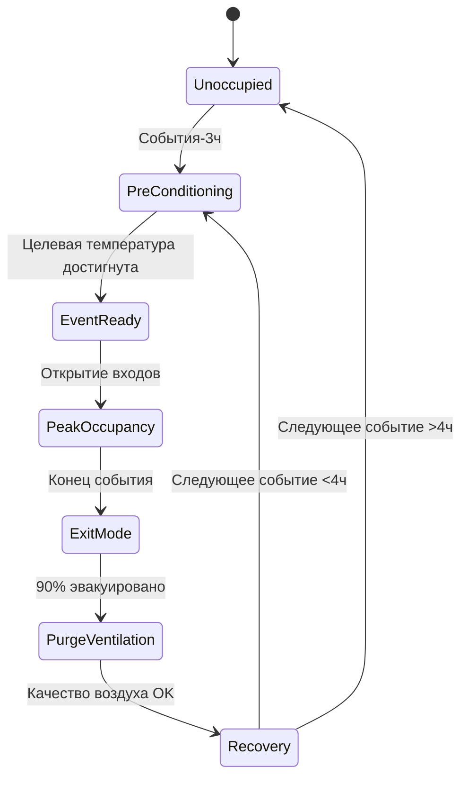

## Планирование HVAC на основе событий

Графики событий в местах высокой посещаемости создают периодические тепловые нагрузки, требующие стратегической предварительной подготовки, управления пиковой емкостью и протоколов восстановления после события. Временная природа занятости при событиях позволяет применять стратегии разнообразия нагрузок, которые снижают установленную мощность и эксплуатационные расходы при сохранении комфорта занимающих помещение.

## Расчеты нагрузки предварительной подготовки

Предварительная подготовка помещения устанавливает исходные тепловые условия до прибытия людей. Требуемое время предварительной подготовки зависит от тепловой инерции здания, наружных условий и целевых уставок.

### Уравнение времени предварительной подготовки

Время, необходимое для подготовки помещения от начальной температуры $T_i$ к целевой температуре $T_t$:

$$t_{precool} = \frac{C_p \cdot m_{air} \cdot (T_i - T_t)}{Q_{sys} - Q_{infiltration}}$$

где $C_p$ — удельная теплоемкость (1,006 кДж/кг·К), $m_{air}$ — масса воздуха в кондиционируемом помещении, $Q_{sys}$ — холодопроизводительность системы, а $Q_{infiltration}$ учитывает тепловые поступления через ограждающие конструкции во время предварительной подготовки.

### Учет тепловой инерции

Для помещений со значительной тепловой инерцией (бетон, кирпичная кладка) эффективное время подготовки увеличивается:

$$t_{effective} = t_{precool} \cdot \left(1 + \frac{C_{mass} \cdot m_{mass}}{C_{air} \cdot m_{air}}\right)$$

где $C_{mass}$ и $m_{mass}$ представляют характеристики тепловой инерции.

## Профили нагрузки при событиях

Занятость при событиях генерирует предсказуемые схемы тепловой нагрузки, позволяющие оптимизировать расписание HVAC.

```mermaid
gantt
    title Профиль тепловой нагрузки HVAC в день события
    dateFormat HH:mm
    axisFormat %H:%M

    section Перед событием
    Запуск системы           :a1, 06:00, 1h
    Предварительная подготовка         :a2, 07:00, 2h
    Финальная регулировка         :a3, 09:00, 1h

    section Период события
    Открытие входов             :b1, 10:00, 30m
    Пиковая занятость           :crit, b2, 10:30, 3h
    Период выхода              :b3, 13:30, 1h

    section После события
    Вентиляция очистки        :c1, 14:30, 1h
    Восстановление температуры     :c2, 15:30, 2h
    Остановка системы          :c3, 17:30, 30m
```

## Разнообразие нагрузок на основе занятости

Коэффициент разнообразия для нескольких событий учитывает неодновременные пиковые нагрузки в разных местах проведения или периодах времени.

### Расчет коэффициента разнообразия

$$DF_{event} = \frac{\sum_{i=1}^{n} Q_{peak,i}}{\max(Q_{simultaneous})}$$

где $Q_{peak,i}$ представляет пиковые нагрузки отдельных событий, а $Q_{simultaneous}$ — максимальную одновременную нагрузку.

| Количество помещений событий | Типичный коэффициент разнообразия | Множитель проектной нагрузки |
|-------------------------|-------------------------|------------------------|
| 1 место проведения | 1,00 | 1,00 |
| 2 места проведения | 0,85–0,90 | 0,90 |
| 3–4 места проведения | 0,75–0,85 | 0,80 |
| 5+ мест проведения | 0,65–0,80 | 0,75 |

## Схемы расписания событий

### Суточный график одного события

### Координация нескольких событий

Для объектов с перекрывающимися событиями расписание HVAC согласует емкость системы между зонами.

$$Q_{total,t} = \sum_{i=1}^{n} \left[Q_{sensible,i}(t) + Q_{latent,i}(t)\right] \cdot OF_i(t)$$

где $OF_i(t)$ — доля занятости (от 0 до 1) для события $i$ в момент времени $t$.

## Стратегии управления пиковой нагрузкой

### Вентиляция с управлением по спросу

Минимальный наружный воздух во время предварительной подготовки снижает нагрузку:

$$Q_{precool,reduced} = Q_{sensible,envelope} + (OA_{min} \cdot \rho \cdot C_p \cdot \Delta T)$$

Во время занятости вентиляция увеличивается в соответствии с требованиями ASHRAE 62.1:

$$OA_{event} = \max\left(\frac{R_p \cdot P_z + R_a \cdot A_z}{E_z}, V_{min}\right)$$

где $R_p$ = 2,4 м³/ч на человека для помещений собраний (таблица ASHRAE 62.1 6.2.2.1).

## Восстановление после события

Периоды после события требуют вентиляции очистки и восстановления температуры.

### Продолжительность вентиляции очистки

$$t_{purge} = \frac{V_{space} \cdot N_{ACH,required}}{Q_{OA,max}}$$

ASHRAE 62.1 рекомендует 3–5 воздухообменов для очистки после занятости в помещениях собраний.

### Оптимизация восстановления температуры

Восстановление уставки после события балансирует энергетические затраты и готовность к следующему событию:

$$E_{recovery} = \int_{t_{end}}^{t_{next}} Q_{sys}(t) \cdot dt$$

Оптимальное время восстановления минимизирует этот интеграл при соответствии требованиям предварительной подготовки к следующему событию.

## Сезонные колебания событий

Схемы расписания событий варьируются сезонно, влияя на проектирование и эксплуатацию HVAC.

| Сезон | Время предварительной подготовки | Коэффициент пиковой нагрузки | Продолжительность после события |
|--------|----------------------|------------------|---------------------|
| Лето (наружная температура >29°C) | 3–4 часа | 1,15–1,25 | 2–3 часа |
| Переходный период (18–29°C) | 2–3 часа | 1,00 | 1,5–2 часа |
| Зима (наружная температура <18°C) | 2–2,5 часа | 0,85–0,95 | 1–1,5 часа |

## Интеграция последовательности управления

Системы автоматизации зданий интегрируют расписание событий с последовательностями управления HVAC.

## Проектные соображения

1. **Емкость системы**: Размер оборудования для пиковых нагрузок событий с соответствующими коэффициентами разнообразия, а не непрерывной работы
2. **Тепловая инерция**: Используйте тепловую инерцию здания для смещения нагрузок во время периодов предварительной подготовки
3. **Зонирование**: Раздельные помещения событий позволяют независимое расписание и снижение одновременных пиковых нагрузок
4. **Рекуперация энергии**: Системы ERV/HRV снижают нагрузки предварительной подготовки в переходные периоды
5. **Мониторинг**: Датчики занятости в реальном времени переопределяют запланированные события при отклонении фактической посещаемости от прогнозов

## Применение стандартов ASHRAE

- **ASHRAE 62.1**: Скорости вентиляции для помещений собраний (минимум 2,4 м³/ч на человека)
- **ASHRAE 55**: Тепловой комфорт при занятости событием (операционная температура 20–24°C)
- **ASHRAE 90.1**: Требования к автоматическому снижению уставок и управлению вентиляцией по спросу
- **Справочник ASHRAE — приложения HVAC**: Глава 5 (места собраний) содержит специальные рекомендации по проектированию HVAC для мест проведения событий

## Лучшие практики эксплуатации

Эффективное расписание HVAC для событий требует координации между операциями объекта, управлением HVAC и организацией события. Контрольные списки перед событием проверяют готовность системы, а обзоры после события оптимизируют параметры расписания для будущих событий на основе данных фактической производительности.
