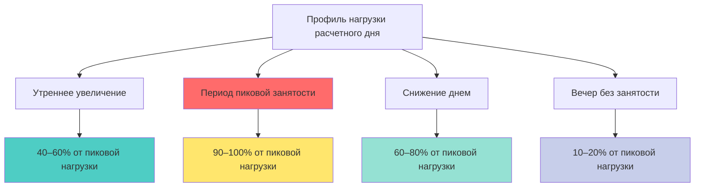
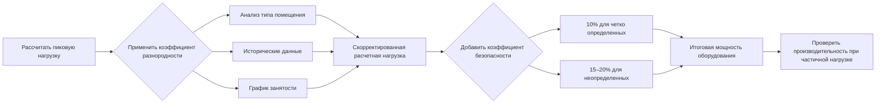

## Обзор

Анализ пиковых и средних нагрузок критичен для помещений с высокой плотностью занятости, где одновременное полное заполнение помещения происходит редко. Надлежащее применение коэффициентов разнородности предотвращает переоснащение оборудования при сохранении адекватной мощности для фактических условий работы. ASHRAE Fundamentals предоставляет данные о разнородности нагрузок для различных типов занятости, позволяя инженерам оптимизировать выбор оборудования на основе реалистичных профилей нагрузок, а не теоретических максимумов.

## Определение пиковой нагрузки

Пиковая расчетная нагрузка представляет максимальный одновременный спрос охлаждения или отопления при работе всех источников тепла на полную мощность. На практике это состояние редко возникает.

### Компоненты пиковой нагрузки

Общая пиковая нагрузка объединяет все способствующие факторы:

$$Q_{\text{peak}} = Q_{\text{sensible}} + Q_{\text{latent}} = (Q_{\text{envelope}} + Q_{\text{occupants,sens}} + Q_{\text{lighting}} + Q_{\text{equipment}}) + (Q_{\text{occupants,lat}} + Q_{\text{ventilation,lat}})$$

Где:
- $Q_{\text{envelope}}$ = прирост тепла через строительный конверт (кДж/ч)
- $Q_{\text{occupants,sens}}$ = явное тепло от людей при расчетной плотности (кДж/ч)
- $Q_{\text{lighting}}$ = прирост тепла от освещения (кДж/ч)
- $Q_{\text{equipment}}$ = прирост тепла от оборудования и приборов (кДж/ч)
- $Q_{\text{occupants,lat}}$ = скрытое тепло от людей (кДж/ч)
- $Q_{\text{ventilation,lat}}$ = скрытая нагрузка от наружного воздуха (кДж/ч)

Для помещений с высокой занятостью нагрузка от людей доминирует:

$$Q_{\text{occupants}} = N_{\text{design}} \times (q_{\text{sens}} + q_{\text{lat}})$$

Где:
- $N_{\text{design}}$ = расчетная занятость (человек)
- $q_{\text{sens}}$ = явное тепло на человека (245–480 кДж/ч в зависимости от активности)
- $q_{\text{lat}}$ = скрытое тепло на человека (210–585 кДж/ч в зависимости от активности)

## Профили средних нагрузок

Средние нагрузки отражают фактические условия эксплуатации с типичными схемами занятости, использованием оборудования и нагрузками конверта, варьирующимися в течение дня.

### Расчет средней нагрузки за время

$$Q_{\text{avg}} = \frac{1}{T} \int_0^T Q(t) \, dt$$

Для дискретных почасовых данных:

$$Q_{\text{avg}} = \frac{\sum_{i=1}^{24} Q_i}{24}$$

Типичные соотношения средней к пиковой нагрузке для помещений с высокой занятостью варьируются от 0,50 до 0,70, что означает, что средние нагрузки составляют 50–70% пиковых расчетных нагрузок.

## Применение коэффициента разнородности

Коэффициент разнородности учитывает несинхронное действие нагрузок:

$$F_{\text{diversity}} = \frac{Q_{\text{coincident}}}{Q_{\text{peak,individual}}}$$

Где:
- $F_{\text{diversity}}$ = коэффициент разнородности (безразмерный, < 1,0)
- $Q_{\text{coincident}}$ = фактическая одновременная нагрузка (кДж/ч)
- $Q_{\text{peak,individual}}$ = сумма отдельных пиковых нагрузок (кДж/ч)

### Коэффициенты разнородности по типам помещений

| Тип помещения | Разнородность занятости | Разнородность оборудования | Общая разнородность | Типичное соотношение сред./пик. |
|-----------|-------------------|-------------------|------------------|----------------------|
| **Аудитория** | 0,95–1,00 | 0,80–0,90 | 0,85–0,95 | 0,50–0,60 |
| **Конференц-центр** | 0,70–0,85 | 0,60–0,75 | 0,65–0,80 | 0,55–0,65 |
| **Арена/стадион** | 0,90–0,98 | 0,85–0,95 | 0,85–0,95 | 0,45–0,55 |
| **Кинотеатр** | 0,85–0,95 | 0,90–1,00 | 0,85–0,95 | 0,50–0,60 |
| **Учебное здание** | 0,60–0,75 | 0,50–0,70 | 0,55–0,70 | 0,60–0,70 |
| **Выставочный зал** | 0,75–0,90 | 0,70–0,85 | 0,70–0,85 | 0,55–0,65 |

Ссылка: ASHRAE Fundamentals, глава 18 — Расчеты охлаждения и отопления для нежилых помещений.

## Выбор расчетной нагрузки

Расчетная нагрузка для выбора оборудования объединяет коэффициенты разнородности при сохранении адекватной мощности:

$$Q_{\text{design}} = Q_{\text{peak}} \times F_{\text{diversity}} \times F_{\text{safety}}$$

Где $F_{\text{safety}}$ обычно варьируется от 1,10 до 1,20 для критичных приложений.

### Соображения при выборе стратегии выбора

**Для центральных систем:**
- Использовать коэффициенты разнородности на уровне системы
- Выбирать для совпадающего пика всех зон
- Применять коэффициент безопасности 10–15% для экстремальных условий

**Для оборудования на уровне зон:**
- Минимальный коэффициент разнородности (0,90–1,00)
- Выбирать ближе к рассчитанному пику
- Отдельные пики зон редко совпадают с пиком системы

## Штраф за переоснащение

Чрезмерное переоснащение на основе нереалистичных пиковых нагрузок приводит к:

### Энергетические штрафы

$$\text{COP}_{\text{part-load}} = \text{COP}_{\text{rated}} \times \left(\frac{Q_{\text{actual}}}{Q_{\text{capacity}}}\right)^{0,3}$$

Работа при 50% мощности снижает COP примерно на 15–20%.

### Проблемы производительности

- Сниженное осушение при низких нагрузках (короткий цикл)
- Плохое управление температурой из-за избыточной мощности
- Увеличенная первоначальная стоимость с минимальной пользой безопасности
- Повышенные затраты на обслуживание более крупного оборудования

### Экономическое воздействие

Для оборудования, работающего при средних нагрузках на уровне 60% от расчетных:

$$\text{Штраф энергетических затрат} \approx 1,15 \times \text{Затраты базовой линии}$$

Этот штраф 15% на энергию накапливается за 15–20 лет жизни оборудования, часто превышая начальные экономические выгоды от "консервативного" переоснащения.

## Рекомендуемый подход

1. **Рассчитать истинную пиковую нагрузку** используя процедуры ASHRAE с расчетной занятостью
2. **Определить реалистичный коэффициент разнородности** из таблиц ASHRAE или исторических данных
3. **Применить коэффициент безопасности 10–15%** для неопределенности, а не произвольные запасы 20–30%
4. **Проверить производительность при частичной нагрузке** выбранного оборудования при ожидаемых средних нагрузках
5. **Рассмотреть несколько более мелких устройств** вместо одного переоснащенного устройства для лучшего диапазона регулирования

Оптимальный проект находит баланс между адекватной мощностью для фактических пиковых условий и эффективной работой в течение 90–95% часов эксплуатации при средних нагрузках.

## Документирование профиля нагрузки

```mermaid
gantt
    title Типичный суточный профиль нагрузки – конференц-центр
    dateFormat HH:mm
    axisFormat %H:%M

    section Процент нагрузки
    Без занятости (15%) :done, 00:00, 07:00
    Утренняя подготовка (45%) :active, 07:00, 08:30
    Пиковое утро (85%) :crit, 08:30, 12:00
    Обеденный перерыв разнородности (60%) :active, 12:00, 13:00
    Пиковый полдень (90%) :crit, 13:00, 16:00
    Вечернее снижение (50%) :active, 16:00, 18:00
    Ночной сброс (20%) :done, 18:00, 24:00
```

Этот профиль демонстрирует, почему выбор оборудования для непрерывной 100% пиковой нагрузки приводит к значительному переоснащению относительно фактического теплового спроса в течение рабочих часов.
