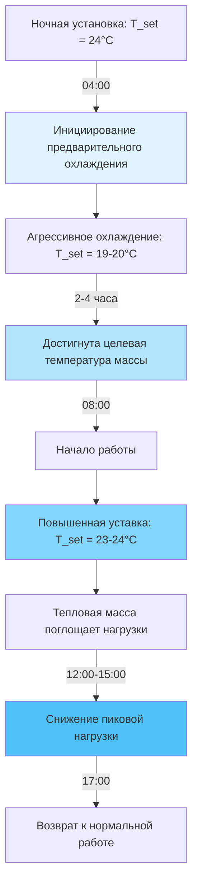
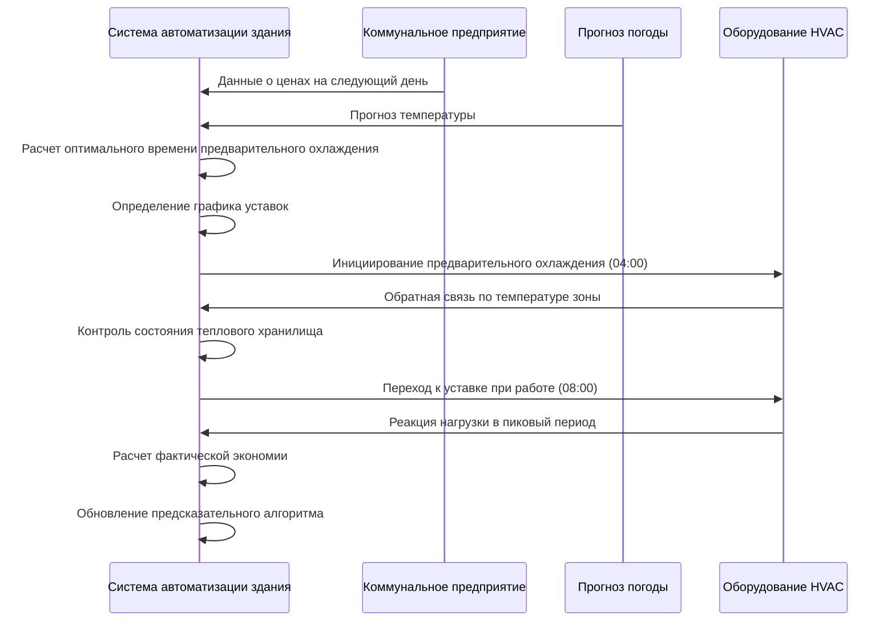

## Основы стратегии предварительного охлаждения

Предварительное охлаждение использует тепловую массу здания как пассивное энергохранилище для снижения пиковых охлаждающих нагрузок в периоды высокой занятости. Эта стратегия работает путем охлаждения конструкции здания за 2-4 часа до начала работы, позволяя охлажденной массе поглощать выделения явного тепла в пиковые периоды при одновременном снижении требований к мгновенному охлаждению.

Эффективность предварительного охлаждения зависит от трех основных факторов:

- **Величина тепловой массы**: теплоемкость бетона, кирпичной кладки и гипсокартона
- **Эффективность связи**: площадь поверхности и коэффициенты конвективной теплопередачи
- **Характеристики профиля нагрузки**: время и величина внутренних выделений тепла

## Энергохранилище тепловой массы

Емкость аккумулирования энергии тепловой массой здания следует фундаментальным принципам теплопередачи. Полная явная теплота, поглощаемая строительной массой во время предварительного охлаждения:

$$Q_{storage} = \sum_{i=1}^{n} m_i c_{p,i} \Delta T_i$$

Где:
- $Q_{storage}$ = полная накопленная тепловая энергия (кДж)
- $m_i$ = масса компонента i (кг)
- $c_{p,i}$ = удельная теплоемкость материала i (кДж/кг·К)
- $\Delta T_i$ = снижение температуры компонента i (К)

Для типичных бетонных конструкций эффективная тепловая масса на единицу площади пола может быть оценена:

$$M_{eff} = \rho_{concrete} \cdot t_{slab} \cdot A_{floor} \cdot f_{coupling}$$

Где $f_{coupling}$ представляет коэффициент эффективности связи (обычно 0,6-0,8 для открытых плит, 0,3-0,5 для покрытых или закрытых поверхностей). Удельная теплоемкость бетона составляет примерно 0,88 кДж/кг·К при плотности 2300 кг/м³.

Скорость поглощения тепла из помещения в тепловую массу в часы работы:

$$\dot{Q}_{mass} = hA(T_{air} - T_{mass,avg})$$

Где h является комбинированным коэффициентом конвективной теплопередачи (обычно 5-10 Вт/м²·К для горизонтальных поверхностей, 8-15 Вт/м²·К для вертикальных поверхностей).

## Последовательность и сроки предварительного охлаждения

Оптимальная последовательность предварительного охлаждения балансирует емкость аккумулирования энергии против энергопотребления компрессора и требований комфорта занятых.

### График предварительного охлаждения

| Период времени | Уставка | Режим охлаждения | Цель |
|-------------|----------|--------------|-----------|
| 00:00-04:00 | 24°C | Ночной сброс | Минимизация ночной энергии |
| 04:00-08:00 | 19-20°C | Агрессивное предварительное охлаждение | Максимизация теплового хранения |
| 08:00-12:00 | 23-24°C | Умеренное охлаждение при работе | Использование сохраненного охлаждения |
| 12:00-15:00 | 23-24°C | Пиковый период | Снижение пикового спроса |
| 15:00-17:00 | 22-23°C | Стандартное охлаждение | Возврат к норме |
| 17:00-24:00 | 24°C | Ночной сброс | Энергосбережение |

## Расчеты снижения пикового спроса

Снижение мгновенной охлаждающей нагрузки в пиковые периоды может быть количественно определено путем сравнения скоростей поглощения тепла:

$$\dot{Q}_{reduction} = \dot{Q}_{mass} - \dot{Q}_{system,precool}$$

Для типичного помещения с высокой занятостью площадью 930 м² с бетонной плитой толщиной 150 мм:

**Без предварительного охлаждения:**
- Пиковая охлаждающая нагрузка: 35-40 Вт/м² = 32,5-37,2 кВт
- Пиковый электрический спрос: 11-13 кВт (COP = 3,0)

**С предварительным охлаждением:**
- Пиковая охлаждающая нагрузка: 25-30 Вт/м² = 23,3-27,9 кВт
- Пиковый электрический спрос: 7,8-9,3 кВт
- Снижение спроса: 25-30%

Тепловая масса обеспечивает временное охлаждение с эффективной скоростью:

$$\dot{Q}_{mass,effective} = \frac{m_{eff} c_p \Delta T_{available}}{t_{peak}}$$

Для 4-часового пикового периода с доступным повышением температуры на 3°C это обеспечивает устойчивое смещение нагрузки.

## Оптимизация энергии и затрат

Эффективность стратегии предварительного охлаждения критически зависит от структуры коммунальных тарифов. Тарифы, зависящие от времени суток (TOU), создают экономический стимул для сдвига нагрузки.

### Анализ затрат на энергию

**Типичная структура тарифа TOU:**

| Период | Часы | Тариф ($/кВт·ч) | Стратегия |
|--------|-------|--------------|----------|
| Внепиковый | 22:00-08:00 | 0,08-0,12 | Предварительное охлаждение в этот период |
| Среднепиковый | 08:00-12:00, 18:00-22:00 | 0,15-0,20 | Умеренное охлаждение, использование хранилища |
| Пиковый | 12:00-18:00 | 0,25-0,45 | Минимизация охлаждения, максимизация использования хранилища |

Расчет экономического преимущества:

$$Savings = (kW_{reduction} \times Demand_{charge}) + \sum_{period} (kWh_{shifted} \times \Delta Rate_{period})$$

Типичная экономия платежей за спрос составляет $15-25/кВт-месяц. Для примера снижения пиковой нагрузки на 3-4 кВт, ежемесячная экономия только на платежах за спрос составляет $45-100.

## Соображения по внедрению в соответствии со стандартами ASHRAE

Стандарт ASHRAE 90.1 раздел 6.4.3.3 рассматривает предварительное охлаждение и оптимальные элементы управления запуском/остановкой. Ключевые требования:

- **Ограничения температуры**: уставки предварительного охлаждения не должны нарушать требования здоровья и безопасности (обычно не ниже 18°C)
- **Управление влажностью**: предварительное охлаждение может требовать повышенной емкости осушения
- **Полосы нечувствительности управления**: минимум 1,1°C полоса нечувствительности между отоплением и охлаждением согласно стандарту 90.1
- **Алгоритмы оптимального запуска**: руководство ASHRAE 36 содержит последовательности управления для предварительного охлаждения тепловой массы здания

Исследовательский проект ASHRAE RP-1404 продемонстрировал, что стратегии предварительного охлаждения достигают:
- 15-30% снижения пикового спроса в зданиях с открытой тепловой массой
- 8-15% снижения суточного энергопотребления охлаждения при соответствующих коммунальных тарифах
- Оптимальную продолжительность предварительного охлаждения 2-4 часа в зависимости от открытия массы и величины нагрузки при работе

## Интеграция стратегии управления

Эффективное предварительное охлаждение требует сложной автоматизации здания:

Система управления должна интегрировать несколько потоков данных для оптимизации производительности при сохранении комфорта занятых в пределах границ теплового комфорта стандарта ASHRAE 55.

## Практическое применение

Предварительное охлаждение доказано наиболее эффективным в:
- Зданиях со значительной открытой тепловой массой (бетон, каменная кладка)
- Высокозанятых объектах с предсказуемыми графиками нагрузок
- Регионах с существенными различиями в тарифах TOU
- Климатических зонах со значительными суточными колебаниями температуры

Граничная эффективность возникает в:
- Легких каркасных конструкциях с минимальной тепловой массой
- Объектах с 24-часовой работой
- Регионах с плоскими структурами коммунальных тарифов
- Помещениях с преобладающими скрытыми охлаждающими нагрузками
