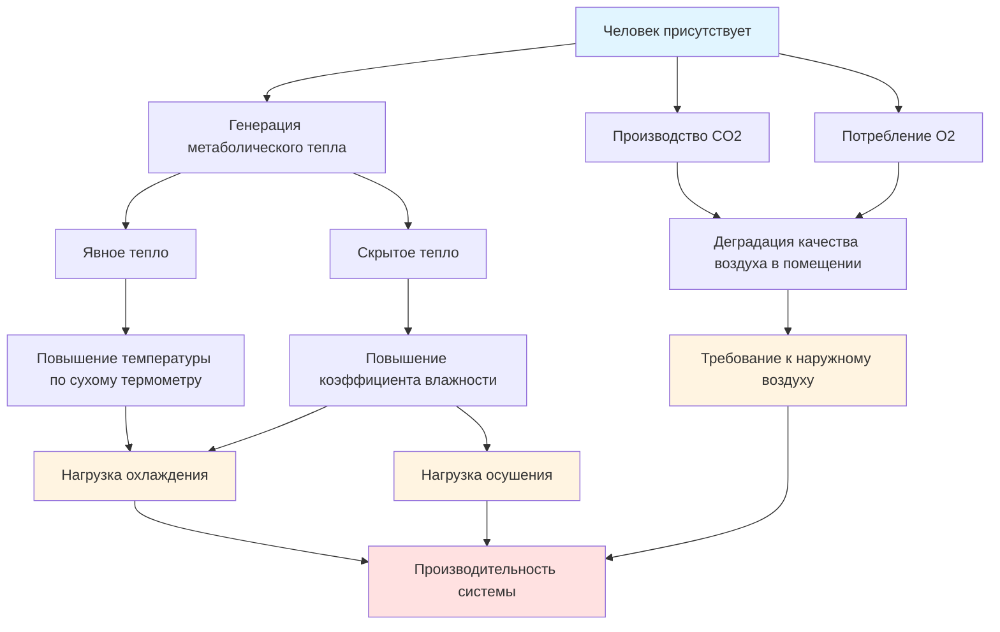

Нагрузки от присутствующих людей представляют наиболее значительный компонент требований охлаждения в помещениях с высокой плотностью занятости. Каждый человек вносит как явное, так и скрытое тепловыделение в кондиционируемое помещение, при этом баланс между этими компонентами сдвигается в зависимости от уровня активности и температуры в помещении. Точное определение нагрузок от людей является основополагающим для надлежащего выбора размера HVAC системы и подачи наружного воздуха.

## Генерация метаболического тепла

Человеческий метаболизм постоянно производит тепло посредством биохимических процессов. Общее тепловыделение (ОТВ) подразделяется на явный и скрытый компоненты в зависимости от уровня активности и условий окружающей среды.

### Общее тепловыделение на одного человека

$$q_{total} = q_{sensible} + q_{latent}$$

Где:
- $q_{total}$ = общее метаболическое тепловыделение (Вт или кДж/ч)
- $q_{sensible}$ = конвективная и радиационная передача тепла воздуху (Вт или кДж/ч)
- $q_{latent}$ = тепло, связанное с добавлением влаги (Вт или кДж/ч)

### Коэффициент явного тепла

Коэффициент явного тепла (КЯТ) определяет долю общего тепла, влияющего на температуру по сухому термометру:

$$SHR = \frac{q_{sensible}}{q_{total}}$$

Для малоподвижных взрослых при типичных условиях в помещении КЯТ находится в диапазоне 0,55–0,65. По мере увеличения активности или повышения температуры в помещении доля скрытого тепла увеличивается, снижая КЯТ.

## Значения тепловыделения от людей согласно ASHRAE

ASHRAE Fundamentals предоставляет данные о тепловыделении от людей в зависимости от уровня активности и температуры в помещении. Следующая таблица представляет типичные значения для умеренно активных взрослых:

| Уровень активности | Общее тепло (кДж/ч) | Явное (кДж/ч) | Скрытое (кДж/ч) | КЯТ |
|----------------|---------------------|-------------------|-----------------|-----|
| Сидя, спокойно | 422 | 259 | 164 | 0.61 |
| Сидя, легкая работа | 475 | 269 | 206 | 0.57 |
| Стоя, легкая работа | 581 | 280 | 301 | 0.48 |
| Ходьба, 3,2 км/ч | 738 | 322 | 417 | 0.44 |
| Танец, умеренный | 950 | 380 | 570 | 0.40 |

Эти значения предполагают температуру в помещении 24°C с относительной влажностью 50%. При более высоких температурах скрытое тепло увеличивается, а явное тепло уменьшается.

## Проблемы высокой плотности занятости

Помещения с плотностью занятости более 10 человек на 10 м² представляют особые проблемы проектирования, которые отличают их от обычных приложений.

### Доминирование скрытой нагрузки

В помещениях с высокой плотностью люди часто превышают скрытые нагрузки от явные нагрузки, создавая профиль нагрузки охлаждающего змеевика, противоположный типичным коммерческим помещениям. Это смещает акцент проектирования:

- Стандартные офисы: КЯТ = 0,70–0,80 (явное преобладание)
- Театры/аудитории: КЯТ = 0,55–0,65
- Гимназии/танцевальные студии: КЯТ = 0,40–0,50 (скрытое преобладание)

Системы, спроектированные без учета доминирования скрытой нагрузки, будут поддерживать температуру по сухому термометру, но не смогут контролировать влажность, что приведет к дискомфорту у присутствующих и потенциальному появлению плесени.

### Пример расчета нагрузки

Для лекционного зала со 100 присутствующими (сидя, легкая работа):

$$q_{sensible,total} = 200 \times 269 = 53,800 \text{ кДж/ч} = 14,95 \text{ кВт}$$

$$q_{latent,total} = 200 \times 206 = 41,200 \text{ кДж/ч} = 11,44 \text{ кВт}$$

$$q_{total} = 95,000 \text{ кДж/ч} = 26,39 \text{ кВт}$$

Система должна удалить 26,39 кВт охлаждения, при этом 42% приходится на скрытую составляющую. Стандартные VAV системы, рассчитанные только на явную нагрузку, будут недоразмерены на 72%.

## Производство CO2 и вентиляция

Люди производят углекислый газ посредством дыхания, при этом скорость выработки прямо пропорциональна метаболической интенсивности.

### Скорость производства CO2

$$\dot{V}_{CO_2} = R_{met} \times N_{occ}$$

Где:
- $\dot{V}_{CO_2}$ = скорость выработки CO2 (м³/ч или л/с)
- $R_{met}$ = метаболическое производство CO2 на одного человека (обычно 0,008–0,012 м³/ч на человека)
- $N_{occ}$ = количество людей

### Требуемый наружный воздух

Используя процедуру расчета вентиляционной нормы ASHRAE Standard 62.1:

$$V_{oz} = R_p \times P + R_a \times A$$

Где:
- $V_{oz}$ = требование к наружному воздуху (м³/ч)
- $R_p$ = норма наружного воздуха на одного человека (м³/ч на человека)
- $P$ = количество людей
- $R_a$ = норма наружного воздуха на единицу площади (м³/ч на м²)
- $A$ = площадь пола (м²)

Для собрания, $R_p$ = 8,5 м³/ч на человека минимум. Приложения с высокой плотностью часто требуют 25–34 м³/ч на человека для поддержания CO2 ниже 1000 ppm во время пиковой занятости.

## Взаимодействие компонентов нагрузки

## Рекомендации по проектированию

Точное определение нагрузок от людей требует рассмотрения нескольких факторов:

1. **Проектная занятость**: Используйте максимальную прогнозируемую занятость, а не среднюю. Строительные нормы предоставляют минимальные плотности занятости по типу помещения.

2. **Коэффициент разнообразия**: Применяется только при наличии статистических доказательств того, что одновременная занятость ниже максимальной. Консервативные проекты избегают коэффициентов разнообразия для приложений с высокой плотностью.

3. **График**: Нагрузки от людей варьируются во времени. Пиковые нагрузки охлаждения могут не совпадать с пиковой занятостью, если солнечные или нагрузки от оборудования преобладают в другое время.

4. **Уровень активности**: Проверьте предполагаемые уровни активности с фактическим использованием пространства. Гимназии, танцевальные студии и спортивные сооружения генерируют значительно более высокие нагрузки, чем малоподвижные помещения.

## Требования к реагированию системы

HVAC системы, обслуживающие помещения с высокой занятостью, должны реагировать на быстрые изменения нагрузки:

$$\tau = \frac{m \times c_p}{\dot{m}_{air} \times c_p} = \frac{V \times \rho}{ACH \times \rho} = \frac{V}{ACH}$$

Где:
- $\tau$ = постоянная времени помещения (часы)
- $V$ = объем помещения (м³)
- $ACH$ = воздухообмены в час

Помещения с высокой плотностью требуют 6–12 ACH для поддержания приемлемых постоянных времени менее 10 минут. Более низкие скорости воздухообмена приводят к колебаниям температуры при переходах занятости.

## Заключение

Нагрузки от людей в приложениях с высокой плотностью определяют проектирование HVAC системы посредством трех основных механизмов: явного тепла, влияющего на температуру, скрытого тепла, влияющего на влажность, и выработки CO2, требующего вентиляции наружным воздухом. Системы должны быть рассчитаны на профили нагрузок с преобладанием скрытого тепла, обеспечивать адекватную производительность осушения и подавать достаточно наружного воздуха для поддержания качества воздуха в помещении. Невозможность надлежащего определения количества и адреса этих взаимосвязанных компонентов нагрузки приводит к неадекватной производительности системы и дискомфорту присутствующих, независимо от установленной полной производительности охлаждения.
