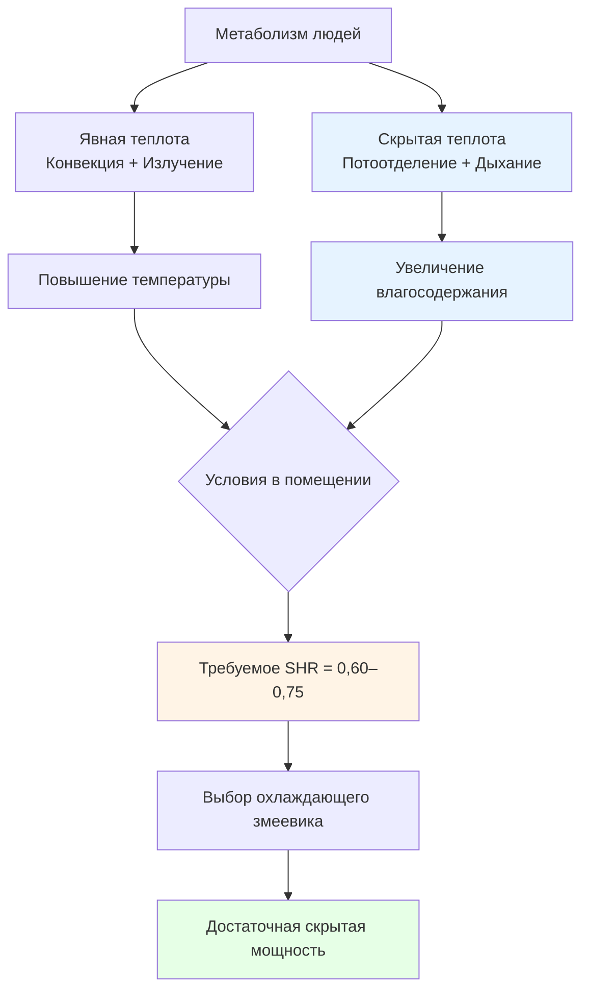
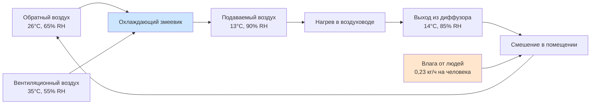

## Генерация скрытой теплоты людьми

Люди выделяют скрытую теплоту двумя основными физиологическими механизмами: потоотделением (испарение с кожи) и дыханием (влажность выдыхаемого воздуха). Компонент скрытой теплоты составляет 20–50% от общего метаболического тепловыделения в зависимости от уровня активности и условий окружающей среды.

Общее тепловыделение скрытой теплоты от людей рассчитывается по формуле:

$$Q_{lat} = N \cdot q_{lat} \cdot CLF$$

Где:
- $Q_{lat}$ = общее тепловыделение скрытой теплоты (кДж/ч или Вт)
- $N$ = количество людей
- $q_{lat}$ = тепловыделение скрытой теплоты на одного человека (кДж/ч)
- $CLF$ = коэффициент нагрузки на охлаждение (обычно 1,0 для скрытых нагрузок)

### Механизм генерации влаги

Скорость генерации влаги людьми выражается как:

$$\dot{m}_{moisture} = N \cdot \frac{q_{lat}}{h_{fg}}$$

Где:
- $\dot{m}_{moisture}$ = скорость генерации влаги (кг/ч)
- $h_{fg}$ = скрытая теплота парообразования (2440 кДж/кг при стандартных условиях)

Добавление этой влаги увеличивает влагосодержание помещения:

$$\Delta W = \frac{\dot{m}_{moisture}}{\dot{m}_{air}} = \frac{N \cdot q_{lat}}{h_{fg} \cdot \rho_{air} \cdot \dot{V}}$$

Где:
- $\Delta W$ = увеличение влагосодержания (кг влаги/кг сухого воздуха)
- $\dot{V}$ = расход воздуха вентиляции (м³/с)
- $\rho_{air}$ = плотность воздуха (1,2 кг/м³)

## Скрытая нагрузка по уровню активности

В справочнике ASHRAE Fundamentals приведены стандартизированные значения генерации скрытой теплоты в зависимости от интенсивности активности:

| Уровень активности | Явная теплота (кДж/ч) | Скрытая теплота (кДж/ч) | Общая теплота (кДж/ч) | SHR |
|------|----------------------|------------------|----------|----|
| Сидя, покой | 258 | 111 | 369 | 0,70 |
| Сидя, легкий труд | 268 | 153 | 421 | 0,64 |
| Стоя, легкий труд | 262 | 210 | 472 | 0,56 |
| Ходьба 3,2 км/ч | 262 | 262 | 524 | 0,50 |
| Легкая работа за верстаком | 289 | 289 | 578 | 0,50 |
| Умеренный танец | 321 | 574 | 895 | 0,36 |
| Тяжелый труд/спорт | 363 | 743 | 1106 | 0,33 |

**Примечание:** Значения рассчитаны для температуры помещения 24°C. Доля скрытой теплоты увеличивается с ростом температуры помещения.

## Влияшение отношения явной теплоты

Отношение явной теплоты (SHR) для занятых помещений рассчитывается как:

$$SHR = \frac{Q_{sensible}}{Q_{sensible} + Q_{latent}}$$

Высокая плотность occupancy снижает SHR до 0,60–0,75, что значительно ниже типичного SHR для охлаждающих змеевиков 0,75–0,80. Это несоответствие создает проблемы с контролем влажности, требующие выбора специализированного оборудования.

## Требования к осушению

### Требования к производительности змеевика

Для обработки высоких скрытых нагрузок охлаждающий змеевик должен обеспечивать достаточное удаление влаги:

$$\dot{m}_{removed} = \rho_{air} \cdot \dot{V} \cdot (W_{entering} - W_{leaving})$$

Где:
- $W_{entering}$ = влагосодержание входящего воздуха
- $W_{leaving}$ = влагосодержание выходящего воздуха

Точка росы аппарата (ADP) должна быть выбрана для обеспечения достаточной скрытой мощности:

$$ADP_{required} = T_{space} - \frac{Q_{total}}{1,08 \cdot \dot{V} \cdot BF}$$

Где $BF$ — коэффициент обхода змеевика (обычно 0,05–0,15 для применений по осушению).

## Распределение влажностной нагрузки

В помещениях с высокой занятостью наблюдаются изменяющиеся во времени скрытые нагрузки:

| Период времени | Коэффициент занятости | Коэффициент скрытой нагрузки | Эффективный SHR |
|------|-----------------|----------|-----------|
| До начала работы | 0% | 0% | 0,95 |
| Частичная занятость | 50% | 50% | 0,82 |
| Полная занятость | 100% | 100% | 0,68 |
| После окончания работы | 10% | 5% | 0,90 |

**Разнообразие скрытой нагрузки** учитывает одновременные паттерны занятости. Факторы проектного разнообразия варьируются от 0,75 до 0,95 в зависимости от функции помещения.

## Проектирование

**Критические параметры для применений с высокой скрытой нагрузкой:**

1. **Температура подаваемого воздуха**: Более низкие температуры подаваемого воздуха (11,1–12,8 °C) улучшают осушение, но требуют тщательного контроля конденсации.
2. **Ряды теплообменника**: Теплообменники с 6–8 рядами при скоростях воздуха на лицевой поверхности ниже 500 фут/мин (2,54 м/с) максимизируют удаление влаги.
3. **Стратегии повторного нагрева**: Подходы с предварительным переохлаждением и повторным нагревом поддерживают контроль влажности при частичной нагрузке.
4. **Системы отдельной подачи наружного воздуха (DOAS)**: Отдельная подготовка вентиляционного воздуха для снижения скрытой нагрузки в помещении.
5. **Десикантное осушение**: Дополнительное механическое охлаждение в экстремальных условиях высокой скрытой нагрузки (SHR < 0,65).

**Сложности контроля относительной влажности:**

- Диапазон комфорта для occupants: 30–60% RH согласно стандарту ASHRAE 55.
- Предотвращение плесени: поддержание ниже 60% RH согласно стандарту ASHRAE 62.1.
- Избегание конденсации: температура поверхностей должна превышать точку росы.
- Работа при частичной нагрузке: снижение явной нагрузки увеличивает относительную влажность в помещении, если скрытой мощности недостаточно.

## Критерии выбора системы

Выбирайте оборудование HVAC на основе требований SHR помещения:

$$\frac{Q_{lat,space}}{Q_{sen,space}} \leq \frac{Q_{lat,coil}}{Q_{sen,coil}}$$

Когда доля скрытой нагрузки помещения превышает долю скрытой мощности теплообменника, требуется дополнительное осушение. Это часто происходит в театрах, аудиториях, спортзалах и сборных помещениях, где плотность occupancy превышает 1,4 м²/человек, а уровень активности от умеренного до высокого.

**Ссылка:** Справочник ASHRAE — Основы, Глава 18: Расчеты нагрузок на охлаждение и отопление нежилых зданий (скорости метаболического тепловыделения и профили нагрузок от occupancy).
