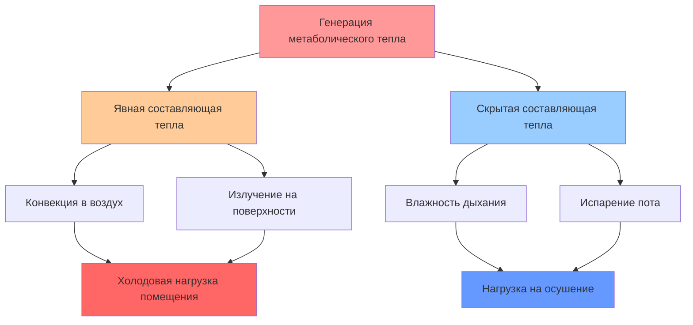
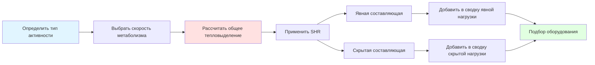

## Обзор

Метаболическое тепловыделение представляет собой тепловую энергию, выделяемую людьми в ходе биологических процессов. В помещениях с высокой плотностью людей, таких как театры, аудитории, спортзалы и залы для собраний, метаболическое тепло составляет значительную часть общей холодовой нагрузки. Точное количественное определение этого источника тепла необходимо для правильного подбора оборудования и поддержания приемлемых условий внутреннего микроклимата.

Человеческий метаболизм генерирует тепло в результате окисления питательных веществ; скорость этого процесса зависит от уровня активности, размера тела и условий окружающей среды. Это тепло проявляется в виде явной (влияющей на температуру по сухому термометру) и скрытой (влияющей на влажность) составляющих, причем соотношение между ними варьируется в зависимости от интенсивности активности и условий окружающей среды.

## Основные соотношения

Общее метаболическое тепловыделение на одного человека выражается формулой:

$$Q_{total} = Q_{sensible} + Q_{latent}$$

Где отношение явного тепла (SHR) определяет распределение:

$$SHR = \frac{Q_{sensible}}{Q_{total}}$$

Для помещения с несколькими occupants:

$$Q_{occupants} = N \times q_{person} \times CLF$$

Где:
- $N$ = количество людей
- $q_{person}$ = тепловыделение на человека (кДж/ч)
- $CLF$ = коэффициент холодовой нагрузки (обычно 1,0 для помещений с непрерывным пребыванием людей)

## Скорость метаболизма по уровню активности

В справочнике ASHRAE Fundamentals приведены стандартизированные показатели скорости метаболизма для различных видов деятельности. В следующей таблице представлены значения для типичных общественных и институциональных помещений:

| Уровень активности | Общее тепловыделение (кДж/ч) | Явное (кДж/ч) | Скрытое (кДж/ч) | SHR |
|------|------------------:|------:|------:|----:|
| Сидя, в покое | 263,5 | 221,5 | 42,2 | 0,84 |
| Сидя, легкая работа | 316,5 | 242,5 | 74,0 | 0,77 |
| Стоя, легкая активность | 369,5 | 258,5 | 98,0 | 0,70 |
| Медленная ходьба (3,2 км/ч) | 422,5 | 263,5 | 157,5 | 0,63 |
| Легкая работа за верстаком | 422,5 | 279,5 | 142,5 | 0,66 |
| Танцы (умеренные) | 579,5 | 295,5 | 284,0 | 0,51 |
| Тяжелая работа/упражнения | 789,5 | 332,0 | 458,5 | 0,42 |
| Спорт, спортзал | 896,5 | 363,5 | 532,0 | 0,41 |

*Значения основаны на ASHRAE Fundamentals, глава 18, скорректированы для типичных условий кондиционирования воздуха (23,9°C, 50% относительной влажности)*

## Явные и скрытые составляющие тепла

Распределение между явным и скрытым теплом зависит от интенсивности активности и температуры в помещении. По мере увеличения уровня активности большая доля метаболического тепла отводится в виде скрытого тепла через потоотделение и дыхание.

Сдвиг соотношения явного и скрытого тепла имеет критические последствия для проектирования систем. Помещения с высокой активностью требуют большей мощности осушения относительно явного охлаждения, что влияет на выбор оборудования, конструкцию теплообменников и психрометрические характеристики.

## Специфические соображения проектирования по видам активности

**Сидячие собрания (Театры, Аудитории, Лекционные залы)**

Для сидячих, тихих мероприятий:
- Использовать 263,5–316,5 кДж/ч на человека
- SHR обычно 0,77–0,84
- Доминирует явная нагрузка
- Достаточно стандартных охлаждающих змеевиков

**Стоячие собрания (Ритейл, Музеи, Выставки)**

Для стоячего положения с легким перемещением:
- Использовать 369,5–422,5 кДж/ч на человека
- SHR обычно 0,63–0,70
- Сбалансированные явные и скрытые нагрузки
- Рассмотреть мощность осушения

**Активные собрания (Танцевальные залы, Спортзалы, Фитнес-центры)**

Для умеренной и тяжелой активности:
- Использовать 579,5–896,5 кДж/ч на человека
- SHR обычно 0,41–0,51
- Доминирует скрытая нагрузка
- Часто требуется отдельная система осушения

## Методология расчета нагрузки

**Пример расчета:**

Для аудитории на 500 человек с сидячими посетителями:

$$Q_{sensible} = 500 \times 230 = 115,000 \text{ БТЕ/ч} = 121,225 \text{ кДж/ч} = 33.7 \text{ кВт}$$

$$Q_{latent} = 500 \times 70 = 35,000 \text{ БТЕ/ч} = 36,925 \text{ кДж/ч} = 10.2 \text{ кВт}$$

$$Q_{total} = 150,000 \text{ БТЕ/ч} = 158,250 \text{ кДж/ч} = 43.9 \text{ кВт}$$

## Факторы проектирования и корректировки

**Зависимость от температуры**

Выделение метаболического тепла увеличивается при более высоких температурах окружающей среды, так как организм работает интенсивнее для поддержания теплового равновесия. Коэффициент корректировки:

$$q_{adjusted} = q_{24°C} \times \left(1 + 0.01(T_{space} - 24)\right)$$

**Коэффициенты одновременности**

Фактическая заполняемость редко достигает проектной мощности одновременно. Применяйте коэффициенты одновременности в зависимости от типа помещения:
- Театры/аудитории: 0.90–1.00
- Торговые помещения: 0.50–0.70
- Спортивные залы: 0.60–0.80
- Рестораны: 0.70–0.90

**Переходные эффекты**

В помещениях с прерывистым пребыванием людей нагрузка от людей является переходной. Эффект теплоаккумулирования мебели и конструкций снижает мгновенную потребность в охлаждении, что обосновывает применение коэффициентов нагрузки на охлаждение менее 1.0 в некоторых случаях.

## Последствия для проектирования системы

Масштаб и характеристики метаболических нагрузок влияют на множество параметров проектирования системы:

1. **Требования к вентиляции**: Стандарт ASHRAE 62.1 предписывает минимальные нормы подачи наружного воздуха в зависимости от заполняемости, обычно 5–7.5 CFM (м³/ч) на человека для помещений собраний.

2. **Мощность осушения**: В приложениях с высокой активностью требуется точка росы подаваемого воздуха 10–13°C, что требует улучшенной производительности змеевиков или выделенной системы осушения.

3. **Распределение воздуха**: Высокая плотность людей требует увеличения кратности воздухообмена (типично 6–15 ACH) для поддержания равномерности температуры и разбавления биологических выделений.

4. **Выбор оборудования**: Нагрузки с преобладанием скрытой теплоты благоприятствуют выбору оборудования с низким отношением явной теплоты (0.65–0.75) в блочных агрегатах для предотвращения проблем с влажностью.

Правильный учет метаболического тепловыделения, с точными допущениями об уровне активности и разделением на явную и скрытую теплоту, обеспечивает комфорт occupants и предотвращает избыточное sizing оборудования и потери энергии в приложениях с высокой плотностью.
