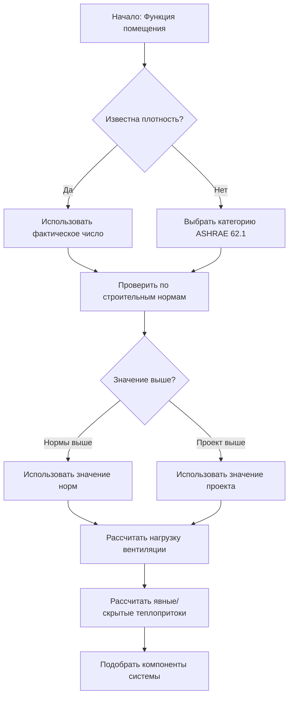

Плотность размещения людей представляет собой количество occupants на единицу площади пола и служит фундаментальным параметром для подбора систем вентиляции, расчета теплопритоков на охлаждение и определения требований к приточному воздуху. Точные значения плотности напрямую влияют на энергопотребление, качество воздуха в помещении и мощность системы.

## Фундаментальные расчеты плотности

Зависимость между плотностью размещения людей, площадью пола и общим количеством occupants описывается формулой:

$$N = \frac{A}{D}$$

Где:
- $N$ = Количество occupants (человек)
- $A$ = Площадь пола (м²)
- $D$ = Плотность размещения (м²/человек)

Альтернативный расчет фактора плотности:

$$D = \frac{A_f}{N_{design}}$$

Где $A_f$ — площадь пола в занимаемой зоне, а $N_{design}$ — расчетное количество occupants.

## Категории размещения по ASHRAE 62.1

Стандарт ASHRAE 62.1 устанавливает значения плотности размещения по умолчанию для проектирования систем вентиляции, когда фактическая нагрузка от occupants неизвестна. Эти значения представляют собой типичные сценарии наихудшего случая:

| Тип помещения | Плотность (м²/человек) | Нагрузка (человек/1000 м²) |
|------|---|-------------------------|
| Офис — открытая планировка | 9,29 | 107,6 |
| Офис — кабинет | 18,58 | 53,8 |
| Конференц-зал | 1,86 | 538 |
| Торговля — торговый зал | 2,79 | 357,6 |
| Торговля — склад | 27,87 | 35,8 |
| Ресторан — обеденный зал | 1,39 | 719,4 |
| Кухня — коммерческая | 18,58 | 53,8 |
| Классная комната — общая | 2,32 | 431,6 |
| Коридор | 9,29 | 107,6 |
| Лобби | 1,86 | 538 |

## Помещения с высокой плотностью размещения

Помещения для собраний представляют собой наиболее сложные условия для проектирования HVAC из-за экстремальной плотности и переменных нагрузок:

### Помещения для стоячих мероприятий и концертов

**Плотность для стоячих мест**: 0,19–0,46 м²/человек
- Концертные площадки (стоячие): 0,28–0,46 м²/человек
- Фестивальные места: 0,37–0,67 м²/человек
- Танцполы: 0,46–0,91 м²/человек

**Плотность для сидячих мест**: 0,46–1,86 м²/человек
- Театральные места (фиксированные): 0,91–1,39 м²/человек
- Передвижные стулья: 0,67–0,91 м²/человек
- Церковные скамьи: 1,12–1,68 м²/человек

### Спортивные и развлекательные объекты

**Плотность размещения в аренах**: 0,91–2,79 м²/человек
- Баскетбольная арена: 1,39–1,86 м²/человек (включая зоны прохода)
- Ледовая арена (хоккей): 1,86–2,32 м²/человек
- Стадионные места: 0,91–1,39 м²/человек (только зона сидений)

## Определение расчетной плотности размещения

Процесс проектирования требует сравнения нескольких источников:

1. **Требования строительных норм** (IBC, местные поправки)
2. **Значения по умолчанию ASHRAE 62.1**
3. **Фактические эксплуатационные данные** (при наличии)
4. **Требования заказчика** или спецификации программы

Для подбора системы следует использовать наиболее консервативное (наибольшее значение плотности) значение.

## Методы расчета нагрузки от occupants

### Метод 1: Метод площади пола

$$N = \frac{A_{net}}{D_{code}}$$

Где $A_{net}$ исключает нежилые помещения (машинные залы, складские помещения, зоны прохода в некоторых нормах).

### Метод 2: Метод фиксированных мест

Для помещений с фиксированными местами:

$$N = N_{seats} + \frac{A_{standing}}{D_{standing}}$$

Этот метод объединяет фактическое количество мест с расчетами площади для стоячих мест.

### Метод 3: Метод смешанного использования

Для помещений с несколькими функциями:

$$N_{total} = \sum_{i=1}^{n} \frac{A_i}{D_i}$$

Рассчитать каждую зону независимо и суммировать результаты.

## Требования строительных норм

Коэффициенты нагрузки от occupants в Международном строительном кодексе (IBC) часто отличаются от значений ASHRAE 62.1:

| Классификация IBC | Коэффициент нагрузки (м²/человек) | Назначение |
|--|------------------|---|
| Сборные помещения — концентрированные (A-1) | 0,65 нетто / 1,39 брутто | Расчет эвакуации |
| Сборные помещения — стоячие (A-3) | 0,46 нетто / 1,39 брутто | Расчет эвакуации |
| Сборные помещения — неконцентрированные (A-3) | 1,39 нетто | Расчет эвакуации |
| Деловые помещения (B) | 13,94 брутто | Расчет эвакуации |
| Образовательные (E) | 1,86 нетто / 4,65 брутто | Расчет эвакуации |
| Торговые (M) | 2,79 брутто (торговля) | Расчет эвакуации |

**Критическое различие**: Значения IBC определяют размеры систем эвакуации (выходы, лестницы), тогда как значения ASHRAE 62.1 определяют размеры систем ОВКВ. Проектирование ОВКВ может требовать большей расчетной численности людей, чем минимальные требования норм.

## Влияние нагрузки вентиляции

Требуемый приток наружного воздуха по ASHRAE 62.1:

$$V_{oz} = R_p \times P_z + R_a \times A_z$$

Где:
- $V_{oz}$ = Расход наружного воздуха (л/с)
- $R_p$ = Норматив притока наружного воздуха на человека (л/с/чел)
- $P_z$ = Численность людей в зоне (из расчета плотности)
- $R_a$ = Норматив притока наружного воздуха на площадь (л/с/м²)
- $A_z$ = Площадь пола зоны (м²)

Более высокая плотность численности людей напрямую увеличивает компоненту, связанную с людьми, которая часто доминирует в расчетах притока наружного воздуха в помещениях с высокой плотностью.

## Конструктивные особенности

**Коэффициенты одновременности**: Фактическая одновременная численность людей редко достигает проектного максимума. Применяйте коэффициенты одновременности 0,7–0,9 для энергетического моделирования, но никогда не применяйте их при расчете пиковой мощности оборудования.

**Временная вариативность**: Помещения для собраний испытывают экстремальные колебания от нулевой численности до пиковой вместимости в течение нескольких минут. Системы должны реагировать на:
- Быстрое накопление CO₂ во время входа людей
- Пиковые скрытые нагрузки (100–400 БТЕ/ч на человека)
- Переходный рост температуры

**Верификация**: Вентиляция с управлением по спросу (DCV) с датчиками CO₂ обеспечивает проверку фактической численности людей в реальном времени по сравнению с проектными допущениями.

**Соответствие нормам**: Когда проектная численность людей превышает минимальные требования норм для целей ОВКВ, документально обоснуйте пересмотр требований к эвакуации. Более высокая численность людей для ОВКВ не требует дополнительных выходов, если она не превышает факторы нагрузки эвакуации.

## Практическое применение

Для конференц-зала площадью 464,5 м²:

**По умолчанию ASHRAE 62.1**: 0,46 м²/чел → 1000 человек
**Сборное помещение по IBC**: 0,46 м²/чел → 1000 человек
**Требование заказчика**: 750 человек (столы для 10, 75 столов)

Проектирование рассчитано на 1000 человек для обеспечения наихудшего сценария стоячей приемки, даже если типичное использование предполагает меньшее количество людей за столами.
