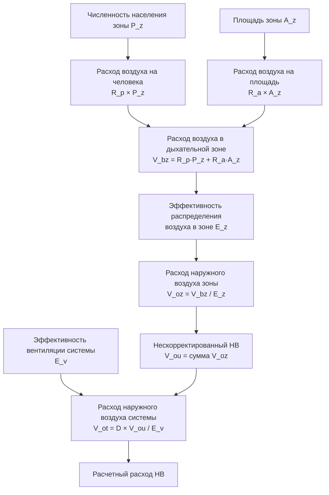

## Процедура расчета вентиляции ASHRAE 62.1

Помещения с высокой плотностью размещения требуют тщательного анализа требований к наружному воздуху из-за совместного воздействия генерации биоэффлювентов человеком и загрязняющих веществ от источников в зоне помещения. ASHRAE 62.1 устанавливает Процедуру расчета вентиляции (VRP) в качестве предписывающего метода определения минимальных требований к наружному воздуху.

Общий расход наружного воздуха в дыхательной зоне $V_{bz}$ сочетает компоненты на одного человека и на единицу площади:

$$V_{bz} = R_p \cdot P_z + R_a \cdot A_z$$

где:
- $V_{bz}$ = расход наружного воздуха в дыхательной зоне, CFM
- $R_p$ = требуемый расход наружного воздуха на одного человека, CFM/человек
- $P_z$ = численность населения зоны, человек
- $R_a$ = требуемый расход наружного воздуха на единицу площади, CFM/(м²)
- $A_z$ = площадь пола зоны, м²

### Физическое обоснование двухкомпонентного подхода

Двухкомпонентный подход отражает два различных механизма генерации загрязняющих веществ. Компонент на одного человека $R_p \cdot P_z$ учитывает биоэффлюветы, образующиеся в результате метаболизма человека — главным образом углекислый газ, водяной пар и запахи от тела. Эти вещества масштабируются линейно с плотностью размещения и преобладают в помещениях с высокой плотностью.

Компонент на единицу площади $R_a \cdot A_z$ учитывает загрязняющие вещества, образующиеся от строительных материалов, отделки и чистящих средств. Эти источники испускают вещества непрерывно, независимо от плотности размещения, но становятся пропорционально менее значимыми при увеличении плотности размещения людей.

## Категории помещений и расчетные значения

ASHRAE 62.1 Таблица 6.2.2.1 устанавливает нормы вентиляции для различных типов помещений. Помещения с высокой плотностью размещения включают:

| Тип помещения | $R_p$ (CFM/человек) | $R_a$ (CFM/м²) | Плотность размещения по умолчанию (м²/человек) |
|------------|-------------------|-----------------|-------------------------------|
| Места в зале слушания | 2.4 | 0.65 | 0.46 |
| Места отправления культа | 2.4 | 0.65 | 0.65 |
| Лекционная аудитория | 3.5 | 0.65 | 2.3 |
| Конференц-зал/совещание | 2.4 | 0.65 | 1.9 |
| Коридоры | - | 0.65 | - |
| Вестибюли | 3.5 | 0.65 | 0.93 |
| Спортивный зал/трибуны | 3.5 | 0.65 | 0.46 |

Низкие плотности размещения по умолчанию (0,46–0,93 м²/человек) для залов собраний указывают на ожидаемые показатели проектирования 100–200+ человек на 93 м², что делает компонент на одного человека доминирующим.

## Расчеты в дыхательной зоне

Дыхательная зона определяется как область в пределах занятого помещения, расположенная на высоте 75–180 см от пола и более чем на 0,6 м от стен или фиксированного вентиляционного оборудования. Расход наружного воздуха в дыхательной зоне должен учитывать системные эффекты, включая эффективность вентиляции.

Расход наружного воздуха зоны $V_{oz}$ корректирует несовершенное перемешивание, используя показатель эффективности распределения воздуха в зоне $E_z$:

$$V_{oz} = \frac{V_{bz}}{E_z}$$

Для систем верхней раздачи воздуха (типичные для залов собраний), $E_z = 1,0$ при перепаде температур ΔT < 8°C. Для систем вытеснения воздуха, применяемых в высоких помещениях, $E_z$ может достигать 1,2, снижая требуемый расход наружного воздуха на 17%.

## Требования к наружному воздуху на уровне системы

Многозонные системы требуют дополнительной коррекции с учетом неравномерности между зонами. Нескорректированное поступление наружного воздуха $V_{ou}$ представляет собой сумму всех зонных требований:

$$V_{ou} = \sum_{все\ зоны} V_{oz}$$

Поступление наружного воздуха в систему $V_{ot}$ учитывает эффективность вентиляции системы $E_v$ и коэффициент неравномерности размещения $D$:

$$V_{ot} = \frac{D \cdot V_{ou}}{E_v}$$

### Коэффициент неравномерности

Коэффициент неравномерности $D$ признает, что не все зоны одновременно достигают пиковой плотности размещения. ASHRAE 62.1 требует $D = 1,0$ (без учета неравномерности), если конкретные графики работы не демонстрируют предсказуемые модели неравномерности.

Для помещений с документированными моделями размещения анализ неравномерности может дать значительное снижение:

$$D = \frac{\sum_{пик} P_z}{\sum_{проект} P_z}$$

Пример: конгресс-центр с основным залом на 5000 человек и выставочным залом на 2000 человек может иметь $D = 0,71$, если исторические данные показывают максимальное одновременное присутствие 5000 человек (никогда не 7000).

### Эффективность вентиляции системы

Эффективность вентиляции системы $E_v$ зависит от соотношения подачи к наружному воздуху и варьируется в зависимости от типа системы:

Для однозонных систем:
$$E_v = 1,0$$

Для систем со 100% наружным воздухом:
$$E_v = 1,0$$

Для многозонных систем рециркуляции $E_v$ рассчитывается из критической зоны (зоны, требующей наибольшей доли наружного воздуха):

$$E_v = \frac{1 + X_s - Z_{pz}}{1 + X_s}$$

где $X_s = V_{ou}/V_{ps}$ (нескорректированная доля наружного воздуха) и $Z_{pz}$ — доля наружного воздуха в критической зоне.

## Рекомендации по проектированию помещений с высокой плотностью размещения

### Пример расчета: аудитория на 1000 человек

Исходные данные:
- Аудитория: 930 м² с 1000 мест (0,93 м²/человек)
- $R_p = 2,4$ CFM/человек, $R_a = 0,65$ CFM/м²
- Верхняя раздача воздуха, $E_z = 1,0$
- Система со 100% наружным воздухом, $E_v = 1,0$

Расход воздуха в дыхательной зоне:
$$V_{bz} = (2,4)(1000) + (0,65)(930) = 2400 + 604 = 3004\ \text{CFM}$$

Расход наружного воздуха зоны:
$$V_{oz} = \frac{3004}{1,0} = 3004\ \text{CFM}$$

Расход наружного воздуха системы (однозонная):
$$V_{ot} = \frac{1,0 \times 3004}{1,0} = 3004\ \text{CFM}$$

При плотности 0,93 м²/человек компонент на одного человека составляет 80% от общего требования к вентиляции. При меньшей плотности (например, 4,6 м²/человек) компонент площади становится более значимым, но абсолютный расход воздуха снижается.

## Стратегии проектирования дыхательной зоны

Помещения с высокой плотностью размещения получают преимущества от нескольких подходов к проектированию для повышения эффективности вентиляции:

**Подпольная система раздачи воздуха**: Подает наружный воздух непосредственно в дыхательную зону с $E_z = 1,2$, снижая требуемый расход воздуха на 17%.

**Вентиляция вытеснением**: Низкоскоростная подача воздуха у пола создает восходящие конвективные потоки вокруг людей, достигая $E_z = 1,2$ для приложений охлаждения.

**Системы выделенного наружного воздуха (DOAS)**: Разделяют вентиляцию и чувствительное охлаждение, обеспечивая выполнение требований к наружному воздуху независимо от тепловых нагрузок. Особенно эффективны при значительных колебаниях плотности размещения.

**Особенности VAV-систем**: Системы переменной расхода воздуха, обслуживающие помещения с высокой плотностью, должны поддерживать минимальный расход наружного воздуха во всех режимах работы. Снижение основного расхода воздуха ниже минимума, требуемого для вентиляции, нарушает ASHRAE 62.1.

## Коррекция при переменной плотности размещения

Помещения с быстрыми изменениями плотности размещения (например, кинотеатры между сеансами, лекционные аудитории между занятиями) испытывают переходное накопление CO₂. Постоянная времени выравнивания качества воздуха:

$$\tau = \frac{V_{room}}{V_{oz}}$$

Для аудитории объемом 280 м³ с расходом наружного воздуха 3004 CFM (1,4 м³/с), $\tau = 3,3$ минут. Через 3$\tau$ (10 минут) CO₂ достигает 95% стационарной концентрации.

Стратегии предварительной вентиляции перед размещением людей ускоряют возврат к исходным условиям. Работа при 150% расчетного расхода наружного воздуха в течение 2$\tau$ перед размещением обеспечивает приемлемые начальные условия.

## Соответствие нормативным требованиям и документирование

Международный механический кодекс (IMC) Раздел 403 принимает ASHRAE 62.1 путем ссылки, делая VRP юридически обязательным. Проектная документация должна включать:

1. Расчеты численности населения и площади для каждой зоны
2. Расход наружного воздуха в дыхательной зоне для каждой зоны
3. Обоснование эффективности распределения воздуха в зоне
4. Расчет расхода наружного воздуха системы
5. Обоснование коэффициента неравномерности (если применяется скидка)
6. Последовательности управления, обеспечивающие минимальный расход наружного воздуха

Проверка при наладке требует измерения расхода наружного воздуха при расчетных условиях и подтверждения того, что последовательности управления поддерживают минимальный расход во всех режимах работы.

## Резюме

Требования к вентиляции помещений с высокой плотностью размещения определяются компонентом на одного человека, который учитывает генерацию человеком биоэффлювентов. ASHRAE 62.1 предоставляет основанную на физике методологию, объединяющую источники от людей и площади, корректирующую эффективность вентиляции и учитывающую конфигурацию системы. Надлежащее применение обеспечивает приемлемое качество воздуха в помещении при оптимизации энергопотребления в помещениях, где вентиляция представляет компонент механического охлаждения с наибольшей энергоемкостью.
