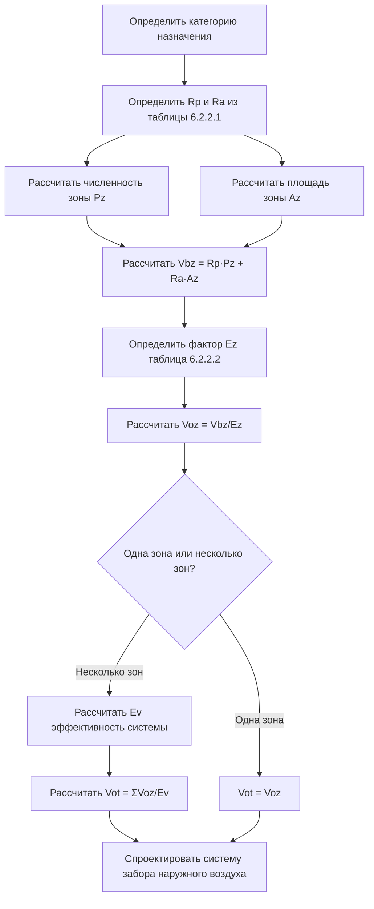

## Требования к вентиляции в зданиях культурно-зрелищного назначения

Стандарт ASHRAE 62.1 классифицирует помещения культурно-зрелищного назначения как среды с высокой плотностью людей, требующие определенных расходов наружного воздуха (OA) для поддержания приемлемого качества воздуха в помещении. Эти помещения создают уникальные проблемы из-за переменных нагрузок людей, временных режимов использования и повышенных показателей образования CO₂ от человеческого метаболизма.

### Категории зданий культурно-зрелищного назначения по ASHRAE 62.1

Стандарт определяет категории культурно-зрелищного назначения в таблице 6.2.2.1 с предписанными минимальными расходами вентиляции на основе плотности людей и площади пола.

| Категория здания | Компонент на человека (Rp) | Компонент на площадь (Ra) | Плотность людей по умолчанию | Класс воздуха |
|-------------------|----------------------|-------------------|------------------------|-----------|
| Зал аудитории | 2,36 л/с на чел. | 1,02 л/(с·м²) | 13,9 м²/чел. | 1 |
| Культовое сооружение | 2,36 л/с на чел. | 1,02 л/(с·м²) | 11,1 м²/чел. | 1 |
| Судебные залы | 2,36 л/с на чел. | 1,02 л/(с·м²) | 5,6 м²/чел. | 1 |
| Залы законодательных органов | 2,36 л/с на чел. | 1,02 л/(с·м²) | 4,6 м²/чел. | 1 |
| Библиотеки | 2,36 л/с на чел. | 2,03 л/(с·м²) | 9,3 м²/чел. | 1 |
| Вестибюли/холлы | 2,36 л/с на чел. | 1,02 л/(с·м²) | 13,9 м²/чел. | 1 |
| Театры - сценическое пространство | 2,36 л/с на чел. | 1,02 л/(с·м²) | 13,9 м²/чел. | 1 |
| Сцены | 4,72 л/с на чел. | 1,02 л/(с·м²) | 6,5 м²/чел. | 2 |
| Арены спортивные - места для зрителей | 3,54 л/с на чел. | 1,02 л/(с·м²) | 13,9 м²/чел. | 1 |
| Стадионы - зоны зрителей | 3,54 л/с на чел. | 1,02 л/(с·м²) | 13,9 м²/чел. | 1 |
| Зоны для зрителей стоя | 3,54 л/с на чел. | 1,02 л/(с·м²) | 0,46 м²/чел. | 1 |

### Процедура расчета расхода вентиляции (VRP)

Требование к расходу наружного воздуха в зоне дыхания для помещений культурно-зрелищного назначения следует двухкомпонентной методологии, установленной в разделе 6.2.2.1.

$$V_{bz} = R_p \cdot P_z + R_a \cdot A_z$$

Где:
- $V_{bz}$ = расход наружного воздуха в зоне дыхания (л/с)
- $R_p$ = наружный воздух, требуемый на одного человека (л/с на чел.)
- $P_z$ = численность зоны (количество людей)
- $R_a$ = наружный воздух, требуемый на единицу площади (л/(с·м²))
- $A_z$ = площадь пола зоны (м²)

Для театрального зала со 300 местами и площадью пола 4180 м²:

$$V_{bz} = (2,36 \text{ л/с на чел.} \times 300 \text{ чел.}) + (1,02 \text{ л/(с·м}^2) \times 4180 \text{ м}^2)$$

$$V_{bz} = 708 + 4264 = 4972 \text{ л/с}$$

### Коэффициент эффективности распределения воздуха в зоне (Ez)

Коэффициент эффективности распределения воздуха в зоне учитывает неполное смешивание в занятой зоне. Таблица 6.2.2.2 ASHRAE 62.1 предоставляет значения Ez на основе конфигурации распределения воздуха.

Для потолочного подачи с напольным возвратом (типичная конфигурация помещения культурно-зрелищного назначения):

$$E_z = 1,0$$

Для вентиляции вытеснением с низкоскоростной подачей:

$$E_z = 1,2$$

Требование к расходу наружного воздуха в зоне включает Ez:

$$V_{oz} = \frac{V_{bz}}{E_z}$$

Для примера театра с верхней подачей:

$$V_{oz} = \frac{4972}{1,0} = 4972 \text{ л/с}$$

### Эффективность вентиляции системы (Ev)

Многозонные системы требуют расчетов эффективности на уровне системы согласно разделу 6.2.7. Метод критической зоны определяет минимальный расход наружного воздуха в системе.

$$V_{ot} = \frac{\sum_{все\ зоны} V_{oz}}{E_v}$$

Где $E_v$ представляет эффективность вентиляции системы:

$$E_v = \frac{1 + X_s - Z_d}{1 + X_s - E_z \cdot Z_d}$$

Параметры системы:
- $X_s$ = некорректированная доля наружного воздуха
- $Z_d$ = доля наружного воздуха зоны для критической зоны
- $E_z$ = коэффициент эффективности распределения воздуха в зоне

### Особенности проектирования помещений культурно-зрелищного назначения с высокой плотностью людей

Помещения культурно-зрелищного назначения с плотностью людей более 100 человек на 93 м² требуют дополнительного анализа:

**Управление пиковой нагрузкой**
- Переменные графики занятости требуют адаптивного управления вентиляцией
- Управление вентиляцией по спросу на основе CO₂ (DCV) оптимизирует подачу наружного воздуха при частичной загрузке
- Снижение расходов вентиляции в периоды отсутствия людей снижает энергопотребление на кондиционирование

**Требования к производительности системы**
- Общий расход воздуха системы должен обеспечивать как вентиляцию, так и охлаждение чувствительного и скрытого тепла
- Типичная нагрузка охлаждения в помещениях культурно-зрелищного назначения: 0,08-0,12 л/(с·кВт)
- Минимальный расход наружного воздуха часто составляет 30-50% от общего расхода воздуха системы при проектной загрузке

**Проверка кратности воздухообмена**
Помещения культурно-зрелищного назначения, как правило, достигают 4-8 кратностей воздухообмена в час (ACH) при полной загрузке:

$$\text{ACH} = \frac{V_{ot} \times 3600}{V_{пространство}}$$

Для театра на 300 мест с объемом 15280 м³ при высоте потолка 3,7 м:

$$\text{ACH} = \frac{4972 \times 3600}{15280} = 1170 \text{ ACH}$$

### Workflow расчета VRP

### Факторы эффективности системы для приложений культурно-зрелищного назначения

Многозонные объекты культурно-зрелищного назначения (конференц-центры, центры исполнительских искусств) требуют тщательного анализа Ev. Метод первичной доли воздуха применяется, когда зоны совместно используют общее распределение подачи воздуха.

**Идентификация критической зоны**
Зона, требующая наибольшей доли наружного воздуха, определяет производительность системы:

$$Z_{кз} = \frac{V_{oz}}{V_{дз}}$$

Где $V_{дз}$ - расход подаваемого воздуха в зону.

Для эффективной работы системы:
- Минимизировать коэффициент разнородности между зонами
- Балансировать распределение подачи воздуха в соответствии с требованиями наружного воздуха
- Рассмотреть использование систем с полностью выделенным наружным воздухом (DOAS) для зон культурно-зрелищного назначения с высокой плотностью людей

### Требования при реализации

Раздел 6.2.9 ASHRAE 62.1 требует документирования параметров проектирования вентиляции:
- Основа расчета проектной плотности людей
- Расходы вентиляции наружным воздухом для каждой зоны
- Расчеты эффективности вентиляции системы для многозонных систем
- Предположения об эффективности распределения воздуха
- Интеграция системы управления для переменной загрузки

Системы вентиляции помещений культурно-зрелищного назначения должны поддерживать минимальный расход наружного воздуха при всех условиях работы, избегая штрафов за чрезмерную вентиляцию при пониженной загрузке людей благодаря надлежащо реализованным стратегиям управления вентиляцией по спросу.
