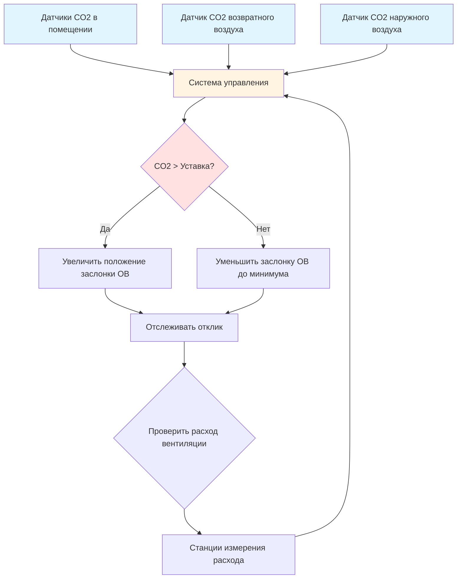

## CO2 как индикатор занятости

Концентрация диоксида углерода служит надежным суррогатным показателем занятости в помещениях с высокой плотностью людей. Метаболическая активность человека генерирует CO2 с предсказуемой скоростью, что делает его эффективным индикатором для стратегий вентиляции с управлением по спросу (DCV). ASHRAE 62.1 признает DCV на основе CO2 приемлемым методом для регулирования подачи наружного воздуха в помещениях с переменной и непредсказуемой занятостью.

Фундаментальное соотношение между занятостью и генерацией CO2 основано на дыхании человека. Взрослый человек в состоянии покоя производит примерно 0,17 м³/ч CO2, при этом умеренная активность увеличивает это значение до 0,28-0,34 м³/ч на человека. Эта скорость метаболической генерации образует основу для расчета требуемых расходов вентиляции.

## Скорость генерации CO2

Объемная скорость генерации CO2 на человека зависит от уровня метаболической активности:

$$\dot{V}_{CO_2} = \frac{M \cdot RQ}{k}$$

Где:
- $\dot{V}_{CO_2}$ = скорость генерации CO2 (м³/ч)
- $M$ = метаболическая интенсивность (met)
- $RQ$ = дыхательный коэффициент (обычно 0,83)
- $k$ = коэффициент преобразования (21,600 для стандартных условий)

Для малоподвижной офисной работы (1,2 met):

$$\dot{V}_{CO_2} = \frac{1,2 \times 0,83}{21,600} \times 1,000 = 0,0046\text{ м³/ч} = 0,28\text{ м³/ч}$$

Стационарная концентрация CO2 в помещении рассчитывается с помощью массового баланса:

$$C_i = C_o + \frac{N \cdot \dot{V}_{CO_2}}{\dot{Q}_{oa}}$$

Где:
- $C_i$ = концентрация CO2 в помещении (ppm)
- $C_o$ = концентрация CO2 наружного воздуха (обычно 400-450 ppm)
- $N$ = количество людей
- $\dot{Q}_{oa}$ = расход приточного воздуха (м³/ч)

## Архитектура системы мониторинга CO2

## Стратегии расположения датчиков CO2

Правильное расположение датчиков критично для точного обнаружения занятости и эффективного управления вентиляцией.

**Датчики на уровне помещения:**
- Устанавливайте на уровне дыхания (0,9-1,8 м от пола)
- Располагайте в репрезентативных зонах высокой занятости
- Избегайте установки рядом с дверями, открываемыми окнами или диффузорами приточного воздуха
- Позиционируйте на расстоянии от прямого воздействия выдоха людей (минимум 0,9 м)
- Используйте несколько датчиков в больших помещениях (>930 м²)

**Датчики возвратного воздуха:**
- Устанавливайте в воздуховоде возвратного воздуха или в плиуме
- Располагайте перед любыми заслонками рециркуляции
- Обеспечьте хорошо перемешанную точку отбора пробы с адекватной скоростью воздуха (>2,5 м/с)
- Рассмотрите усреднение датчиков при наличии нескольких путей возвратного воздуха

**Датчики наружного воздуха:**
- Позиционируйте в потоке подачи наружного воздуха перед смешиванием
- Защитите от прямого воздействия погоды, обеспечивая репрезентативный отбор пробы
- Устанавливайте на расстоянии минимум 3 м от точек выброса вытяжного воздуха

## Уставки CO2 и пороги управления

| Тип помещения | Уставка CO2 (ppm) | Базовая концентрация ОВ (ppm) | Полоса гистерезиса (ppm) |
|------------------|-------------------|---------------------------|------------------------|
| Офисные помещения | 1000-1100 | 400-450 | ±50 |
| Переговорные | 1000-1200 | 400-450 | ±75 |
| Классные комнаты | 1000-1100 | 400-450 | ±50 |
| Лекционные залы | 1000-1200 | 400-450 | ±75 |
| Спортивные залы | 900-1000 | 400-450 | ±50 |
| Залы для собраний | 1000-1200 | 400-450 | ±75 |

ASHRAE 62.1 не требует конкретные уставки CO2, но требует, чтобы системы DCV поддерживали установленные расходы вентиляции. Общепринятый диапазон 1000-1200 ppm обеспечивает достаточный запас выше уровней наружного воздуха (обычно 400-450 ppm) для эффективного управления при сохранении приемлемого качества воздуха в помещении.

## Стратегии управления

**Пропорциональное управление:**
Положение заслонки наружного воздуха модулируется пропорционально дифференциалу CO2:

$$D = D_{min} + \frac{(D_{max} - D_{min}) \cdot (C_{measured} - C_{setpoint})}{C_{max} - C_{setpoint}}$$

Где:
- $D$ = положение заслонки (%)
- $D_{min}$ = минимальное положение заслонки наружного воздуха для соответствия нормам
- $D_{max}$ = максимальное положение заслонки (обычно 100%)
- $C_{measured}$ = текущая концентрация CO2 в помещении
- $C_{setpoint}$ = целевая концентрация CO2
- $C_{max}$ = максимально допустимая концентрация CO2 (обычно уставка + 200 ppm)

**Усреднение множественных датчиков:**
При развертывании нескольких датчиков в помещении:

$$C_{avg} = \frac{\sum_{i=1}^{n} C_i}{n}$$

Альтернативно используйте стратегию максимального показания, при которой вентиляция реагирует на наибольшее показание датчика, чтобы обеспечить адекватную вентиляцию во всех зонах.

## Внедрение вентиляции с управлением по спросу

**Последовательность управления:**

1. **Инициализация:** Установить базовую концентрацию CO2 в наружном воздухе в период неиспользования помещения
2. **Мониторинг:** Непрерывно измерять концентрации CO2 в помещении и возвратном воздухе
3. **Расчет:** Определить дифференциал CO2 между помещением и наружным воздухом
4. **Модуляция:** Отрегулировать положение заслонки наружного воздуха в соответствии с алгоритмом управления
5. **Проверка:** Подтвердить фактическую подачу наружного воздуха через измерение расхода
6. **Переопределение:** Поддерживать минимальную вентиляцию по нормам независимо от показания CO2

## Технология датчиков и техническое обслуживание

**Датчики NDIR:**
Датчики недисперсионного инфракрасного спектра (NDIR) являются стандартом для мониторинга CO2 в системах HVAC. Ключевые характеристики включают:

- Диапазон измерения: 0-2000 ppm (минимум)
- Точность: ±50 ppm или ±5% от показания
- Время отклика: <2 минут для скачка на 90%
- Возможность автоматической калибровки для долгосрочной стабильности
- Диапазон рабочей температуры совместим с условиями HVAC

**Требования к калибровке:**
- Заводская калибровка действительна 5-7 лет при включенной автокалибровке
- Годовая полевая проверка с использованием эталонного газа (обычно 1000 ppm)
- Автоматическая фоновая калибровка (ABC) предполагает периодическое воздействие наружного воздуха
- Ручная калибровка требуется, если ABC отключена или датчик перемещен

## Проверка расхода вентиляции

Управление на основе CO2 должно проверить, что сохраняются минимальные требования наружного воздуха согласно ASHRAE 62.1:

$$\dot{V}_{ot} = R_p \cdot P_z + R_a \cdot A_z$$

Где:
- $\dot{V}_{ot}$ = требуемый расход наружного воздуха (м³/ч)
- $R_p$ = расход наружного воздуха на человека (м³/(ч·чел))
- $P_z$ = численность людей в зоне
- $R_a$ = расход наружного воздуха на единицу площади (м³/(ч·м²))
- $A_z$ = площадь пола зоны (м²)

Системы DCV динамически снижают компонент $R_p$, но никогда ниже нормативных минимумов. Станции измерения расхода должны подтвердить фактическую подачу наружного воздуха соответствует расчетным требованиям.

## Пуско-наладка системы

Успешное внедрение мониторинга CO2 требует комплексной пуско-наладки:

- Проверить точность датчика при нескольких уровнях концентрации (наружный воздух, 1000 ppm, 1500 ppm)
- Подтвердить правильное расположение датчика и условия отбора пробы
- Протестировать последовательности управления по всему диапазону занятости
- Подтвердить минимальную подачу наружного воздуха при низкой занятости
- Задокументировать базовую концентрацию CO2 в наружном воздухе для местных условий
- Обучить операторов объекта по эксплуатации системы и техническому обслуживанию датчиков

Правильно спроектированные и введенные в эксплуатацию системы мониторинга CO2 обеспечивают значительную экономию энергии в помещениях с высокой занятостью при сохранении соответствия нормам вентиляции и превосходного качества воздуха в помещении.
