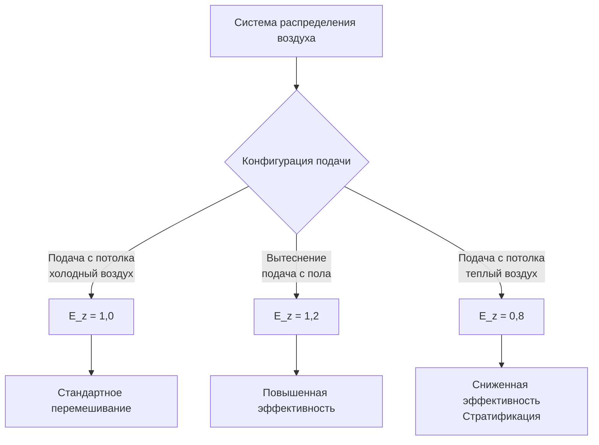
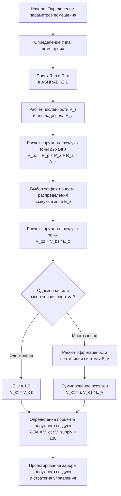

## Обзор

Минимальные показатели вентиляции определяют базовые требования к подаче наружного воздуха (ОВ) для обеспечения приемлемого качества воздуха в помещениях в условиях их эксплуатации. Стандарт ASHRAE 62.1 определяет эти требования, используя процедуру расчета вентиляции, которая объединяет показатели на одного человека и показатели по площади для определения расхода наружного воздуха в зоне дыхания.

Методология расчета учитывает плотность размещения людей, назначение помещения, скорость образования загрязняющих веществ и эффективность распределения воздуха, чтобы обеспечить адекватное разбавление загрязняющих веществ внутреннего воздуха.

## Процедура расчета вентиляции

Расход наружного воздуха в зоне дыхания представляет минимальный расход ОВ, требуемый на уровне дыхания человека, без учета потерь в системе и неэффективности распределения.

### Расчет зоны дыхания

$$V_{bz} = R_p \cdot P_z + R_a \cdot A_z$$

Где:
- $V_{bz}$ = расход наружного воздуха в зоне дыхания (м³/ч)
- $R_p$ = требуемый расход наружного воздуха на одного человека (м³/ч на человека)
- $P_z$ = численность населения зоны (количество людей)
- $R_a$ = требуемый расход наружного воздуха на единицу площади (м³/ч на м²)
- $A_z$ = площадь пола зоны (м²)

### Расход наружного воздуха зоны

Расход наружного воздуха зоны корректирует требование к дыханию в зоне с учетом эффективности распределения воздуха:

$$V_{oz} = \frac{V_{bz}}{E_z}$$

Где:
- $V_{oz}$ = расход наружного воздуха зоны (м³/ч)
- $E_z$ = эффективность распределения воздуха в зоне (обычно 0,8–1,2)

## Минимальные показатели вентиляции по типам помещений

Таблица 6.2.2.1 ASHRAE 62.1 определяет минимальные показатели вентиляции для различных категорий помещений. Помещения с высокой вместимостью требуют особого внимания в связи с повышенным образованием CO₂ в результате метаболизма.

| Категория помещения | $R_p$ (м³/ч на человека) | $R_a$ (м³/ч на м²) | Плотность размещения по умолчанию (чел./м²) |
|-------------------|-------------------|----------------|----------------------------------|
| Концертные залы | 4,7 | 0,32 | 1,6 |
| Места религиозного поклонения | 4,7 | 0,32 | 1,3 |
| Театры | 4,7 | 0,32 | 1,6 |
| Арены (игровое поле) | 7,1 | 0,32 | 0,8 |
| Спортивные залы (игровая площадка) | 7,1 | 0,32 | 0,3 |
| Трибуны для зрителей | 7,1 | 0,32 | 1,6 |
| Стадионы (игровое поле) | 7,1 | 0,32 | 0,8 |
| Конференц-залы | 4,7 | 0,32 | 0,5 |
| Лекционные залы | 7,1 | 0,32 | 0,7 |
| Классные комнаты | 9,4 | 0,64 | 0,4 |

### Повышенные показатели для помещений с активной деятельностью

Помещения с повышенной интенсивностью метаболизма требуют увеличенных показателей вентиляции для управления более высокой производительностью CO₂ и тепловыми нагрузками. Арены, стадионы и спортивные залы используют 7,1 м³/ч на человека по сравнению с 4,7 м³/ч на человека для малоподвижных помещений общего пользования.

## Эффективность вентиляции системы

Многозонные системы требуют коррекции из-за неравномерного распределения наружного воздуха и различных нагрузок в зонах. Эффективность вентиляции системы учитывает эти факторы:

$$V_{ot} = \frac{\sum_{all\ zones} V_{oz}}{E_v}$$

Где:
- $V_{ot}$ = расход воздуха, поступающего в систему (м³/ч)
- $E_v$ = эффективность вентиляции системы (безразмерная величина, ≤ 1,0)

### Определение эффективности системы

Для однозонных систем: $E_v = 1,0$

Для систем со 100% подачей наружного воздуха: $E_v = 1,0$

Для многозонных систем циркуляции воздуха:

$$E_v = \frac{1 + X_s - Z_d}{1 + X_s - Z_{d,max}}$$

Где:
- $X_s$ = некорректированная доля наружного воздуха в системе
- $Z_d$ = доля наружного воздуха в зоне для проектирования
- $Z_{d,max}$ = максимальная доля наружного воздуха в зоне

## Расчет процентного содержания наружного воздуха

Процентное содержание наружного воздуха определяет долю подаваемого воздуха, который должен быть наружным воздухом:

$$\%OA = \frac{V_{ot}}{V_{supply}} \times 100$$

Для конкретной зоны:

$$\%OA_{zone} = \frac{V_{oz}}{V_{supply,zone}} \times 100$$

### Минимальная доля наружного воздуха

При расчетных условиях охлаждения минимальная доля наружного воздуха предотвращает избыточный забор наружного воздуха:

$$X_{min} = \frac{V_{ot}}{V_{supply,total}}$$

Это значение определяет точку переключения экономайзера и минимальное положение заслонки.

## Коэффициент эффективности вентиляции

Эффективность распределения воздуха в зоне ($E_z$) количественно определяет, насколько эффективно подаваемый наружный воздух достигает зоны дыхания. Значения зависят от конфигурации распределения воздуха и температурной стратификации.

### Стандартные значения эффективности

| Тип распределения воздуха | Значение $E_z$ | Применение |
|----------------------|------------|-------------|
| Подача с потолка, холодный воздух | 1,0 | Стандартная вентиляция перемешиванием |
| Вытеснение воздуха | 1,2 | Подача с уровня пола, температурная стратификация |
| Подача с потолка, теплый воздух | 0,8 | Режим отопления, плавучесть снижает эффективность |
| Подача из подпольного пространства | 1,0 | Правильно спроектированные системы |

## Рабочий процесс расчета

## Пример проектирования

Расчет минимальной вентиляции для театра площадью 929 м² с 1500 зрителями:

**Дано:**
- Театр, помещение: $R_p$ = 4,7 м³/ч на человека, $R_a$ = 0,32 м³/ч на м²
- $P_z$ = 1500 человек
- $A_z$ = 929 м²
- $E_z$ = 1,0 (подача с потолка, режим охлаждения)
- Однозонная система: $E_v$ = 1,0

**Расчет:**

Расход наружного воздуха в зоне дыхания:
$$V_{bz} = (4,7 \times 1500) + (0,32 \times 929) = 7050 + 297 = 7347\ \text{м³/ч}$$

Расход наружного воздуха зоны:
$$V_{oz} = \frac{7347}{1,0} = 7347\ \text{м³/ч}$$

Расход воздуха, поступающего в систему:
$$V_{ot} = \frac{7347}{1,0} = 7347\ \text{м³/ч}$$

Если расход приточного воздуха составляет 18920 м³/ч:
$$\%OA = \frac{7347}{18920} \times 100 = 38,8\%$$

## Критические аспекты

**Вентиляция с управлением по спросу (DCV):**
Помещения с переменной численностью людей могут снижать подачу наружного воздуха в периоды низкой вместимости на основе датчиков CO₂ или счетчиков присутствия. Компонента площади ($R_a \cdot A_z$) остается постоянной независимо от численности людей.

**Интеграция экономайзера:**
Требуемый минимум подачи наружного воздуха определяет нижний предел работы экономайзера. Ниже этого порога подача наружного воздуха не может быть снижена даже при отсутствии необходимости в механическом охлаждении.

**Коррекция на высоту над уровнем моря:**
Объемные расходы воздуха остаются неизменными при изменении высоты. Пониженная плотность воздуха приводит к пропорционально сниженным массовому расходу и доставке кислорода, но показатели ASHRAE 62.1 не корректируются для различных высот.

**Динамический сброс:**
Продвинутые системы управления могут сбрасывать показатели вентиляции на основе фактической численности людей, но никогда не должны падать ниже минимума на основе площади ($R_a \cdot A_z$).

## Проверка соответствия

Проверяйте соответствие требованиям минимальной вентиляции следующим образом:

1. **Расчеты при проектировании**, документирующие $V_{bz}$, $V_{oz}$ и $V_{ot}$ для каждой зоны
2. **Измерения расходов воздуха** на входе наружного воздуха при условиях минимальной подачи ОВ
3. **Тестирование последовательности управления**, подтверждающее, что минимальные положения заслонок поддерживают требуемые расходы
4. **Мониторинг CO₂**, подтверждающий, что концентрации в помещении остаются ниже 1100 ppm (700 ppm выше наружной концентрации)

Минимальный забор наружного воздуха должен поддерживаться во все время, когда помещения заняты, независимо от условий тепловой нагрузки или статуса экономайзера.
