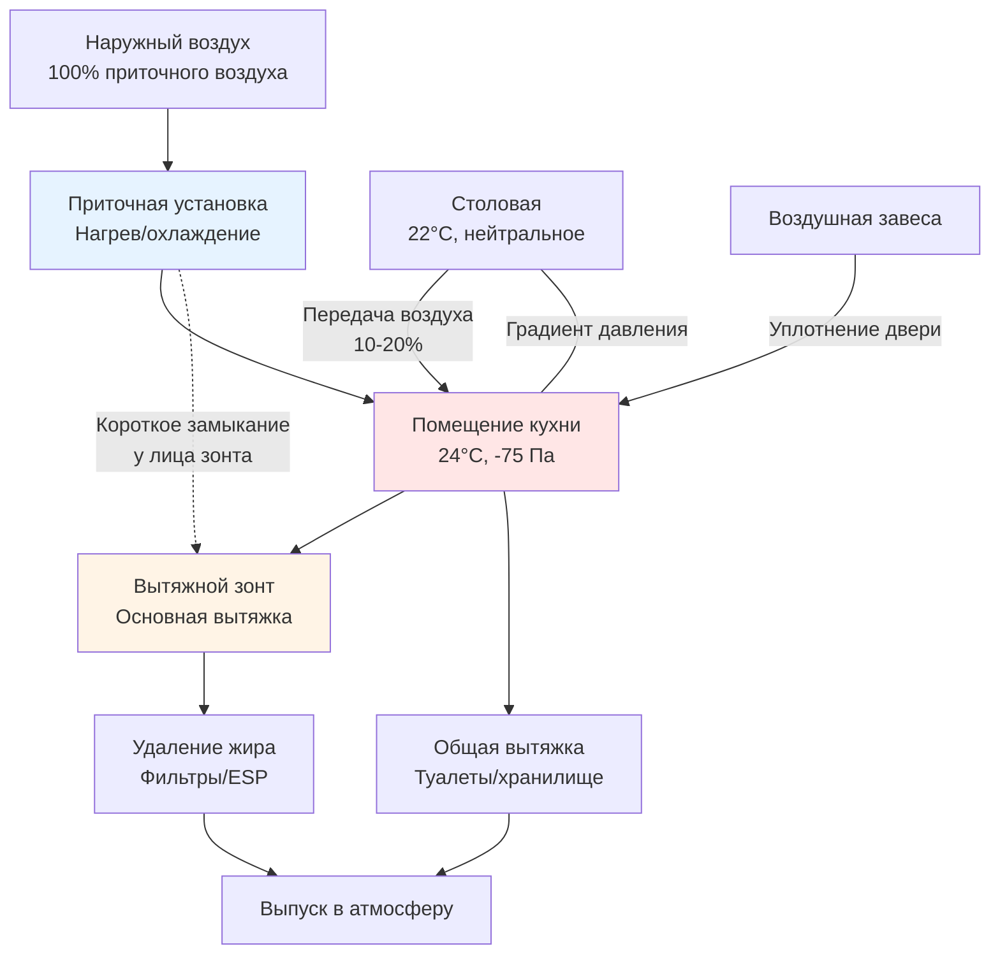

Системы приточного воздуха обеспечивают критически важную замену воздуха для коммерческих кухонь отелей, компенсируя вытяжные объемы при сохранении надлежащего давления в здании, комфорта для людей и энергоэффективности. Правильное проектирование приточного воздуха предотвращает проблемы с отрицательным давлением, снижает инфильтрацию и обеспечивает производительность вытяжного зонта.

## Требования к объему приточного воздуха

Основной принцип проектирования системы приточного воздуха — это баланс масс. Объем вытяжного воздуха должен быть заменен для поддержания контроля давления.

### Базовый расчет приточного воздуха

Для коммерческой кухни требуемый объем приточного воздуха составляет:

$$Q_{MA} = Q_{hood} + Q_{misc} - Q_{transfer}$$

Где:
- $Q_{MA}$ = Требуемый объем приточного воздуха (м³/ч)
- $Q_{hood}$ = Общий расход воздуха вытяжного зонта (м³/ч)
- $Q_{misc}$ = Прочие вытяжки (туалеты, помещения для мусора) (м³/ч)
- $Q_{transfer}$ = Передача воздуха из соседних помещений (м³/ч)

### Прямая стратегия поставки и передача воздуха

**Прямой приточный воздух** подается непосредственно в помещение кухни через специальные приточные установки. Процент вытяжки, который должен быть заменен прямым приточным воздухом:

$$\%_{direct} = \frac{Q_{hood} - Q_{transfer}}{Q_{hood}} \times 100$$

**Передача воздуха** — это кондиционированный воздух, подаваемый в столовую, который переходит на кухню через щели под дверями, решетки или тамбуры. Передача воздуха не должна превышать 10% объема вытяжки для контроля давления, хотя на практике обычно 20-30%:

$$Q_{transfer,max} = 0.10 \times Q_{hood}$$

### Соотношение давлений

Отрицательное давление на кухне относительно столовой должно поддерживаться на уровне -5-12 Па для локализации запахов при избежании чрезмерного отрицательного давления:

$$\Delta P = \frac{(Q_{exhaust} - Q_{supply})^2 \times \rho}{2 \times C_d^2 \times A^2}$$

Где:
- $\Delta P$ = Дифференциал давления (Па)
- $\rho$ = Плотность воздуха (кг/м³)
- $C_d$ = Коэффициент разряда (обычно 0,6-0,7)
- $A$ = Эффективная площадь утечки (м²)

## Интеграция дизайна зонта с коротким замыканием

Зонты с коротким замыканием подают кондиционированный приточный воздух непосредственно у лица зонта, улучшая эффективность захвата и снижая объем воздуха, который необходимо кондиционировать.

### Производительность зонта с коротким замыканием

Зонты с коротким замыканием могут снизить требования к общему приточному воздуху на 20-40% по сравнению с общей подачей в помещение. Эффективное снижение вытяжки:

$$Q_{hood,effective} = Q_{hood} - (0.20 \text{ to } 0.40) \times Q_{hood}$$

**Преимущества:**
- Снижение нагрузки кондиционирования приточного воздуха
- Улучшенная эффективность захвата и локализации
- Более низкие скорости подачи воздуха в рабочем пространстве кухни
- Лучший контроль температурного градиента

**Соображения при проектировании:**
- Скорость воздуха подачи у лица зонта: 0,25-0,51 м/с
- Температура подаваемого воздуха: максимум на 10-22°C ниже температуры помещения
- Расположение выпуска на расстоянии 15-30 см от лица зонта
- Избегайте перекрестных потоков, нарушающих захват зонтом

### Эффекты места выпуска

| Местоположение | Эффективность захвата | Нагрузка кондиционирования | Влияние на комфорт |
|----------|-------------------|-------------------|----------------|
| Внутри навеса зонта | 90-95% | Минимальная | Минимальное |
| Периметр зонта (короткое замыкание) | 85-90% | Низкая | Низкое |
| Общее помещение низкая боковая стенка | 75-80% | Умеренная | Умеренное |
| Общее помещение высокая боковая стенка | 70-75% | Высокая | Высокое |

## Отопление и охлаждение приточного воздуха

Приточный воздух должен быть кондиционирован для поддержания комфорта на кухне и предотвращения теплового удара оборудованию и персоналу.

### Требования к отоплению

В отопительный сезон приточный воздух должен быть нагрет для предотвращения дискомфорта и конденсации оборудования. Минимальная температура подачи:

$$T_{supply,min} = T_{space} - 11°C$$

Для кухни при 24°C минимальная температура подачи составляет 13°C.

Требуемая тепловая мощность:

$$Q_{heat} = 0.34 \times Q_{MA} \times (T_{supply} - T_{ambient})$$

Где:
- $Q_{heat}$ = Тепловая мощность (кДж/ч)
- 0,34 = Константа для воздуха (м³/ч × °C на кДж/ч)
- $T_{ambient}$ = Температура наружного воздуха (°C)

### Требования к охлаждению

Охлаждение приточного воздуха снижает теплопоступления на кухню в жаркую погоду. Нагрузка охлаждения:

$$Q_{cool} = 0.34 \times Q_{MA} \times (T_{ambient} - T_{supply}) + 0.21 \times Q_{MA} \times (W_{ambient} - W_{supply})$$

Второй член учитывает латентное охлаждение, где:
- 0,21 = Постоянная скрытого тепла
- $W$ = Влажностное отношение (г влаги/кг сухого воздуха)

### Интеграция рекуперации энергии

Системы рекуперации энергии захватывают тепло из кухонной вытяжки для предварительного кондиционирования приточного воздуха, снижая операционные затраты:

- **Циркуляционные контуры с теплообменниками:** эффективность 45-55%
- **Теплотрубные теплообменники:** эффективность 50-65%
- **Косвенное испарительное охлаждение:** эффективность 60-75% для охлаждения

Экономия энергии от рекуперации:

$$\text{Экономия} = \eta \times Q_{MA} \times 0.34 \times (T_{exhaust} - T_{ambient}) \times \text{Часы}$$

Где $\eta$ — эффективность рекуперации тепла.

## Применение воздушных завес

Воздушные завесы у дверей кухни минимизируют передачу воздуха и поддерживают разделение давления между кухней и столовой, позволяя движение людей.

### Определение размера воздушной завесы

Требуемая скорость воздушной завесы:

$$V_{curtain} = 1.5 \times \sqrt{\frac{2 \times \Delta P}{\rho}}$$

Для типичного кухонного давления -75 Па:

$$V_{curtain} = 1.5 \times \sqrt{\frac{2 \times 75}{1.2}} = 1.5 \times 11.2 = 16.8 \text{ м/с}$$

Преобразовано в м/мин: примерно 1000 м/мин у центра двери.

**Факторы производительности воздушной завесы:**
- Скорость выпуска: 2,5-5,1 м/с у сопла
- Объем воздуха: 0,25-0,43 м³/(ч·см) ширины двери
- Эффективность: снижение передачи воздуха на 60-80%
- Нагреваемые воздушные завесы требуются в холодном климате

## Стратегия баланса воздуха на кухне

## Сравнение стратегий подачи приточного воздуха

| Стратегия | Нагрузка кондиционирования | Стоимость установки | Операционная стоимость | Комфорт на кухне | Эффективность захвата |
|----------|------------------|-------------------|----------------|-----------------|-------------------|
| 100% короткое замыкание у зонта | Низкая | Высокая | Низкая | Отличный | 90-95% |
| 80% короткое замыкание, 20% общее | Низко-умеренная | Умеренно-высокая | Низко-умеренная | Очень хороший | 85-90% |
| 50% периметр, 50% общее | Умеренная | Умеренная | Умеренная | Хороший | 80-85% |
| 100% общее низкая боковая стенка | Высокая | Низкая | Высокая | Удовлетворительный | 75-80% |
| 100% общее высокая боковая стенка | Очень высокая | Низкая | Очень высокая | Плохой | 70-75% |

## Стратегии повышения энергоэффективности

### Управление вентиляцией на основе спроса для кухни (DCKV)

Модулируйте вытяжку и приточный воздух на основе активности готовки, используя:
- **Оптические датчики** обнаружения дыма/пара
- **Датчики температуры** у лица зонта
- **Блокировки оборудования** связанные с работой оборудования

Потенциал экономии энергии: 30-50% по сравнению с постоянной работой.

Соотношение переменного режима:

$$Q_{variable} = Q_{design} \times (0.30 \text{ to } 1.0)$$

Минимальная вентиляция поддерживает 30% расчетной вытяжки во время неактивных периодов.

### Тепловая дестратификация

Потолочные вентиляторы или устройства дестратификации рециркулируют горячий воздух, накопленный у потолка (часто 32-43°C), обратно в занятую зону, снижая нагрузку отопления приточного воздуха:

$$Q_{saved} = 0.34 \times Q_{destrat} \times (T_{ceiling} - T_{occupied})$$

Экономия 10-20% на энергию отопления достижима в кухнях с высокими потолками.

### Ночное снижение и продувка

**Ночное снижение:** Снижайте температуру приточного воздуха до 10-13°C в течение неопытных часов.

**Утренняя продувка:** Работайте вытяжкой на 50-70% для удаления ночного накопления до полного производства, затем переходите к полному потоку.

### Приводы с переменной частотой (VFDs)

VFDs на приточных и вытяжных вентиляторах обеспечивают:
- Энергию вентилятора пропорциональную кубу скорости: $P \propto \omega^3$
- Снижение расхода на 30% дает снижение энергии на 66%
- Плавный запуск снижает требования к электроэнергии

## Контроль давления и балансировка

Поддерживайте надлежащее давление на кухне через:

1. **Вытяжка на 10-15% больше, чем подача** для поддержания отрицательного давления
2. **Станции мониторинга расхода** на приточном воздухе и вытяжке
3. **Датчики давления** измеряющие дифференциал кухня-столовая
4. **Управление автоматизацией зданий** модулирующее задвижки приточного воздуха

**Проверка при наладке:**
- Измеряйте давление в нескольких местах на кухне
- Проверяйте расход воздуха во всех точках подачи и вытяжки
- Проводите тест дыма у дверей во время пиковой работы
- Проверяйте последовательности управления при различных нагрузках

Правильное проектирование системы приточного воздуха балансирует энергоэффективность, комфорт людей, соответствие кодам и операционную производительность. Подача с коротким замыканием, управление на основе спроса и рекуперация энергии представляют передовые практики для современных систем HVAC кухонь отелей.
